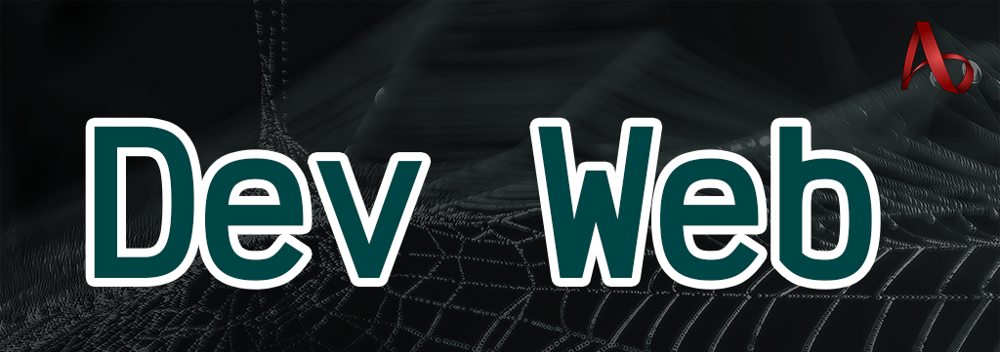

# Programação de Computadores com tecnologias Web

**Materiais de Aula - Programação de Computadores II - [Etec Adolpho Berezin](http://eteab.com.br/)**

Este curso pode ser utilizado como continuação do curso [Dev C#](https://github.com/ermogenes/aulas-programacao-csharp).

## 🎞 Este curso no YouTube

- [Canal: Prof. Ermogenes Palacio](https://www.youtube.com/channel/UCeRLqYFNV2wPBclJLzbJ2Fw)
- [Canal: Prof. Diego Neri](https://www.youtube.com/channel/UCDOt7T8TvMmYLKkqXGUIMHg)
- [Playlist com todos os vídeos](https://www.youtube.com/playlist?list=PLk6PnAig6xXLdVZuurmTnn_YYNX3jJ1iw)

## 🛠 Ferramentas

Para criar seu ambiente de trabalho, baixe as ferramentas e instale em seu computador.

- IDE: [Visual Studio Code 📥](https://code.visualstudio.com/download)
- Controle de versão: [Git 📥](https://git-scm.com/downloads)

No decorrer do curso utilizaremos também:

- Kit de desenvolvimento: [.NET SDK 📥](https://dotnet.microsoft.com/download)
- Banco de dados: [MySQL Community 📥](https://dev.mysql.com/downloads/mysql/)

- [📺](https://youtu.be/QIK8Tt5m1v0) [📖 Passo-a-passo para a criação do ambiente (Dev C#)](https://github.com/ermogenes/aulas-programacao-csharp/blob/master/content/ambiente.md)
- [📖 Criação de ambiente MySQL](content/ambiente-mysql.md)

Obs.: Os materiais citam a versão 3 do .NET Core SDK, mas você deve utilizar a mais recente disponível.

## Conteúdo

**Legenda:** 📷 Slides | 📺 Vídeo-aula no YouTube | 📖 Material em texto e imagens

<!-- **Para alunos presenciais:** ✔ já estudado | 👁‍🗨 semana atual | 🔥 adicionado recentemente | 🎁 extra  | 🤝 colab -->

### 👔 Introdução

- [x] [📷 Programação para web](https://docs.google.com/presentation/d/1W1dcLeHVS2Ln7MG7S5A7SaTsHD0iQBA5OxIyJTGeKLc/edit?usp=sharing)
- [x] [📺](https://youtu.be/_o0C4-YX4qI) Apresentação

### 🐢 Primeiros passos

- [x] [📺](https://youtu.be/l3ft7U7iZ1s) [📖 Hello World com GitHub Pages](content/hello-world-gh-pages.md)
- [x] [📺](https://youtu.be/5-2U1Tk2rHI) [📖 Marcação HTML](content/marcacao-html.md)
- [x] [📺](https://youtu.be/WgxdN0navic) [📖 Estilos CSS](content/estilos-css.md)

### 🕷 Marcação e estilização

- [x] [📺](https://youtu.be/UViHi9HHAOU) [📖 Tipografia](content/tipografia.md)
- [x] [📺](https://youtu.be/IEJhZot5HwY) [📖 Cores e fundos](content/cores-fundos.md)
- [x] [📺](https://youtu.be/1sQzXRL8M4I) [📖 _Box-model_](content/box-model.md)
- [x] [📺](https://youtu.be/5I9SbWkQF28) [📖 Tamanho e posicionamento](content/posicionamento.md)
- [📺](https://youtu.be/ciLNSZdOVas) [📖 Transições e animações](content/transicoes-animacoes.md)
- [ ] [📺](https://youtu.be/z92A3u5I09w) [📖 Leiaute](content/leiaute.md)
- [📺](https://youtu.be/ltndQE-fqSg) [📖 Responsividade](content/responsividade.md)
- [📺](https://youtu.be/K39Pnhg99Nk) [📖 _Mobile-first holy grail_](content/holy-grail.md)
- [ ] [📺](https://youtu.be/ApdHdo3p_JE) [📖 Formulários](content/forms.md)
- [📺](https://youtu.be/PkpVgtvo-U0) [📖 Bibliotecas CSS e CDN](content/bibliotecas.md)

### 🔋 JavaScript no _Frontend_

- [ ] [📺](https://youtu.be/ejWjuYLnKkA) [📖 Hello World com JavaScript](content/hello-world-js.md)
- [ ] [📺](https://youtu.be/z7gvyMe0VQI) [📖 Sintaxe e estruturas básicas](content/sintaxe.md)
- [ ] [📺](https://youtu.be/FKPb2I9cVVo) [📖 Objetos](content/objetos.md)
- [ ] [📺](https://youtu.be/MOIbBRNVfPA) [📖 Funções](content/funcoes.md)
- [ ] [📺](https://youtu.be/7mLX9WKf1Ow) [📖 DOM - Document Object Model](content/dom.md)
- [ ] [📺](https://youtu.be/WEKmp75qonw) [📖 Assincronia e Fetch API](content/async-fetch.md)
<!-- - [📖 Web Storage](content/storage.md) 🎁 🤝 _em breve..._ -->
- [📺](https://youtu.be/tOHJaW3Ts3w)  [_Live_] Jogos 2D com Phaser

### 🛢 Banco de dados com Entity Framework e MySQL

- [📖 Criação de ambiente MySQL](content/ambiente-mysql.md)
- [ ] [📺](https://youtu.be/63ocBcx8NXQ) [📖 ORM com Entity Framework e MySQL](content/orm-ef-mysql.md)
- [📺](https://youtu.be/kC-BWUBh6A4) [📖 Relacionamentos](content/relacionamentos.md)

### 🔌 _Backend_ API com C#

* [ ] [📺](https://youtu.be/nXhpFgBOdd8) [📖 Hello World com ASP.NET Core Web API](content/hw-web-api.md)
  * [📺](https://youtu.be/EC8hlh_hTuI)  [_Live_] Como funciona uma WebApi?
* [📺](https://youtu.be/HVDa-nUrbZI) [📖 CI/CD na nuvem com Azure e GitHub Actions](content/deploy-azure.md)
* [📺](https://youtu.be/ZE0Hzk0Ek6A) [📖 Bancos de dados na nuvem](content/bd-nuvem.md)
* [ ] [📖 HTTP e REST](content/http-rest.md)
  * [📺 Parte 1 - Introdução](https://youtu.be/TOxRXH7ACiE)
  * [📺 Parte 2 - Estrutura da aplicação](https://youtu.be/woUBgzJnt48)
  * [📺 Parte 3 - GET (listagem e filtro)](https://youtu.be/lXisL_k4KC4)
  * [📺 Parte 4 - GET (item único)](https://youtu.be/Jv5_CmRHHCA)
  * [📺 Parte 5 - DELETE](https://youtu.be/TFNS8nQA3Ww)
  * [📺 Parte 6 - POST](https://youtu.be/y0K7rNNExWE)
  * [📺 Parte 7 - PUT](https://youtu.be/VJIu6kv8hNg)
  * [📺 Parte 8 - PATCH](https://youtu.be/sxWqJir3hjU)

### ☁ Acesso rápido: Tutoriais de Azure

* [📖 Criando conta de estudante](content/azure-conta-estudante.md)
* [📖 Publicando um _site_ estático](content/azure-aplicativo-web-estatico.md)
* [📖 Publicando uma aplicação .NET Core Web API](content/azure-servico-de-aplicativo.md)

## 🥋 Exercícios

<!-- **Para alunos presenciais:** ✔ finalizada | 👁‍🗨 atual | 🔥 adicionados recentemente | 🎁 extra -->

- [x] [🏳 Marcação HTML](exercises/marcacao-html.md)
- [x] [🎨 Tipografia](exercises/tipografia.md)
- [x] [🎨 Cores e fundos](exercises/cores-fundos.md)
- [x] [🎨 _Box-model_, tamanho e posicionamento](exercises/box-model-tamanho-posicionamento.md)
- [ ] [🏳🎨 Leiaute e responsividade](exercises/leiaute-responsividade.md)
- [ ] [🏳🎨 Formulários](exercises/forms.md)
- [ ] [🚀 Projeto prático: HTML e CSS](exercises/projeto-a-2020-2.md)
- [ ] [🔋 Primeiros passos com JavaScript](exercises/js.md)
- [ ] [🔋 Objetos, funções e DOM](exercises/objetos-funcoes-dom.md)
- [ ] [🔋 Fetch API](exercises/fetch.md)
- [ ] [🛢 Entity Framework em console](exercises/ef-console.md)
- [ ] [🔌 ASP.NET Web API](exercises/nuvem.md)

### Soluções comentadas
- Prof. Ermogenes
  - [📺 Exercício: PesoIdeal em JavaScript](https://youtu.be/jmM9c1QI5eM) | [🕸 solução](https://github.com/ermogenes/PesoIdealJS)
  - [📺 Exercício: Pokedex](https://youtu.be/Nt0cxxzLtk4) | [🕸 solução](https://github.com/ermogenes/Pokedex-2020-2)
- Prof. Neri
  - [📺 Exercício comentado: galeria-primario](https://youtu.be/ioaZdOlco-g) | [🕸 solução](https://exercicios-aulas-programacao-web.github.io/galeria-primario/)

Códigos disponíveis no [repositório oficial](https://github.com/exercicios-aulas-programacao-web).

## 🗓 Alunos da Etec Adolpho Berezin

Turma 2I3, segundo semestre de 2021:

Data | Conteúdo previsto | Material de apoio | Exercícios
--- | --- | --- | ---
22/07/2021 | ✔ [Apresentação e introdução](#-introdução) | [📷](https://docs.google.com/presentation/d/1W1dcLeHVS2Ln7MG7S5A7SaTsHD0iQBA5OxIyJTGeKLc/edit?usp=sharing) [📺](https://youtu.be/_o0C4-YX4qI) | _a definir_
29/07/2021 | ✔ [Marcação HTML](#-primeiros-passos) | [📺](https://youtu.be/l3ft7U7iZ1s) [📖](content/hello-world-gh-pages.md) [📺](https://youtu.be/5-2U1Tk2rHI) [📖](content/marcacao-html.md) | [🏳 Marcação HTML](exercises/marcacao-html.md)
05/08/2021 | ✔ [Marcação HTML](#-primeiros-passos) | [📺](https://youtu.be/l3ft7U7iZ1s) [📖](content/hello-world-gh-pages.md) [📺](https://youtu.be/5-2U1Tk2rHI) [📖](content/marcacao-html.md) | [🏳 Marcação HTML](exercises/marcacao-html.md)
12/08/2021 | ✔ [Estilização CSS](#-marcação-e-estilização) | [📺](https://youtu.be/UViHi9HHAOU) [📖](content/tipografia.md) [📺](https://youtu.be/IEJhZot5HwY) [📖](content/cores-fundos.md) [📺](https://youtu.be/1sQzXRL8M4I) [📖](content/box-model.md) [📺](https://youtu.be/5I9SbWkQF28) [📖](content/posicionamento.md) | [🎨 Tipografia](exercises/tipografia.md)
19/08/2021 | ✔ [Estilização CSS](#-marcação-e-estilização) | [📺](https://youtu.be/UViHi9HHAOU) [📖](content/tipografia.md) [📺](https://youtu.be/IEJhZot5HwY) [📖](content/cores-fundos.md) [📺](https://youtu.be/1sQzXRL8M4I) [📖](content/box-model.md) [📺](https://youtu.be/5I9SbWkQF28) [📖](content/posicionamento.md) | [🎨 Cores e fundos](exercises/cores-fundos.md)
26/08/2021 | ✔ [Leiaute](#-marcação-e-estilização) | [📺](https://youtu.be/1sQzXRL8M4I) [📖](content/box-model.md) [📺](https://youtu.be/5I9SbWkQF28) [📖](content/posicionamento.md) [📺](https://youtu.be/z92A3u5I09w) [📖](content/leiaute.md) | [🎨 _Box-model_, tamanho e posicionamento](exercises/box-model-tamanho-posicionamento.md)
02/09/2021 | [Leiaute](#-marcação-e-estilização) | [📺](https://youtu.be/1sQzXRL8M4I) [📖](content/box-model.md) [📺](https://youtu.be/5I9SbWkQF28) [📖](content/posicionamento.md) [📺](https://youtu.be/z92A3u5I09w) [📖](content/leiaute.md) | [🏳🎨 Leiaute](exercises/leiaute-responsividade.md)
09/09/2021 | [Formulários](#-marcação-e-estilização) | [📺](https://youtu.be/ApdHdo3p_JE) [📖](content/forms.md) | [🏳🎨 Formulários](exercises/forms.md)
16/09/2021 | [Formulários](#-marcação-e-estilização) | [📺](https://youtu.be/ApdHdo3p_JE) [📖](content/forms.md) | [🚀 Projeto prático: HTML e CSS](exercises/projeto-a-2020-2.md)
23/09/2021 | [Primeiros passos com JavaScript](#-javascript-no-frontend) | [📺](https://youtu.be/ejWjuYLnKkA) [📖](content/hello-world-js.md) [📺](https://youtu.be/z7gvyMe0VQI) [📖](content/sintaxe.md) | [🔋 Primeiros passos com JavaScript](exercises/js.md)
30/09/2021 | [Primeiros passos com JavaScript](#-javascript-no-frontend) | [📺](https://youtu.be/ejWjuYLnKkA) [📖](content/hello-world-js.md) [📺](https://youtu.be/z7gvyMe0VQI) [📖](content/sintaxe.md) | [🔋 Primeiros passos com JavaScript](exercises/js.md)
07/10/2021 | [Objetos, funções e DOM](#-javascript-no-frontend) | [📺](https://youtu.be/FKPb2I9cVVo) [📖](content/objetos.md) [📺](https://youtu.be/MOIbBRNVfPA) [📖](content/funcoes.md) [📺](https://youtu.be/7mLX9WKf1Ow) [📖](content/dom.md) | [🔋 Objetos, funções e DOM](exercises/objetos-funcoes-dom.md)
14/10/2021 | _Suspensão de atividades_
21/10/2021 | [Objetos, funções e DOM](#-javascript-no-frontend) | [📺](https://youtu.be/FKPb2I9cVVo) [📖](content/objetos.md) [📺](https://youtu.be/MOIbBRNVfPA) [📖](content/funcoes.md) [📺](https://youtu.be/7mLX9WKf1Ow) [📖](content/dom.md) | [🔋 Objetos, funções e DOM](exercises/objetos-funcoes-dom.md)
28/10/2021 | [Fetch API](#-javascript-no-frontend) | [📺](https://youtu.be/WEKmp75qonw) [📖](content/async-fetch.md) | [🔋 Fetch API](exercises/fetch.md)
04/11/2021 | [Fetch API](#-javascript-no-frontend) | [📺](https://youtu.be/WEKmp75qonw) [📖](content/async-fetch.md) | [🔋 Fetch API](exercises/fetch.md)
11/11/2021 | [Banco de dados em C# com Entity Framework e MySQL](#-banco-de-dados-com-entity-framework-e-mysql) | [📖](content/ambiente-mysql.md) [📺](https://youtu.be/63ocBcx8NXQ) [📖](content/orm-ef-mysql.md) [📺](https://youtu.be/kC-BWUBh6A4) [📖](content/relacionamentos.md) | [🛢 Entity Framework em console](exercises/ef-console.md)
18/11/2021 | [Banco de dados em C# com Entity Framework e MySQL](#-banco-de-dados-com-entity-framework-e-mysql) | [📖](content/ambiente-mysql.md) [📺](https://youtu.be/63ocBcx8NXQ) [📖](content/orm-ef-mysql.md) [📺](https://youtu.be/kC-BWUBh6A4) [📖](content/relacionamentos.md) | [🛢 Entity Framework em console](exercises/ef-console.md)
25/11/2021 | [Backend com ASP.NET Core Web API](#-backend-api-com-c) | [📺](https://youtu.be/nXhpFgBOdd8) [📖](content/hw-web-api.md) [📺](https://youtu.be/EC8hlh_hTuI) [📖](content/http-rest.md) [📺](https://youtu.be/TOxRXH7ACiE) [📺](https://youtu.be/woUBgzJnt48) [📺](https://youtu.be/lXisL_k4KC4) [📺](https://youtu.be/Jv5_CmRHHCA) [📺](https://youtu.be/TFNS8nQA3Ww) [📺](https://youtu.be/y0K7rNNExWE) [📺](https://youtu.be/VJIu6kv8hNg) [📺](https://youtu.be/sxWqJir3hjU) | [🔌 ASP.NET Web API](exercises/nuvem.md)
02/12/2021 | [Backend com ASP.NET Core Web API](#-backend-api-com-c) | [📺](https://youtu.be/nXhpFgBOdd8) [📖](content/hw-web-api.md) [📺](https://youtu.be/EC8hlh_hTuI) [📖](content/http-rest.md) [📺](https://youtu.be/TOxRXH7ACiE) [📺](https://youtu.be/woUBgzJnt48) [📺](https://youtu.be/lXisL_k4KC4) [📺](https://youtu.be/Jv5_CmRHHCA) [📺](https://youtu.be/TFNS8nQA3Ww) [📺](https://youtu.be/y0K7rNNExWE) [📺](https://youtu.be/VJIu6kv8hNg) [📺](https://youtu.be/sxWqJir3hjU) | [🔌 ASP.NET Web API](exercises/nuvem.md)
09/12/2021 | [Backend com ASP.NET Core Web API](#-backend-api-com-c) | [📺](https://youtu.be/nXhpFgBOdd8) [📖](content/hw-web-api.md) [📺](https://youtu.be/EC8hlh_hTuI) [📖](content/http-rest.md) [📺](https://youtu.be/TOxRXH7ACiE) [📺](https://youtu.be/woUBgzJnt48) [📺](https://youtu.be/lXisL_k4KC4) [📺](https://youtu.be/Jv5_CmRHHCA) [📺](https://youtu.be/TFNS8nQA3Ww) [📺](https://youtu.be/y0K7rNNExWE) [📺](https://youtu.be/VJIu6kv8hNg) [📺](https://youtu.be/sxWqJir3hjU) | [🔌 ASP.NET Web API](exercises/nuvem.md)
16/12/2021 | Conclusão | N/A | _a definir_

[Plano de curso](http://eteab.com.br/cms/wp-content/uploads/2020/02/Inform%C3%A1tica-353_CS-1.pdf)

[Calendário Escolar 2021](http://eteab.com.br/cms/wp-content/uploads/2021/02/CALENDARIO-ESCOLAR-2021-ATUAL.pdf)
- Fechamento intermediário: 01 a 07/10/2021
  - Conselho intermediário: 09/10/2021
- Fechamento final: 14 a 20/12/2021
  - Conselho final: 21/12/2021

**Teams**
- [Equipe, canal Geral](https://teams.microsoft.com/l/channel/19%3abq0ZLktjv22DHH500HYUHI898HkxIUWgR3J_VyEnv5c1%40thread.tacv2/Geral?groupId=d182e3cd-fc50-4142-bddd-b9409a74db4e&tenantId=ed38466c-b641-437d-9ae9-d801b829fa94)
- [Aulas síncronas](https://teams.microsoft.com/l/channel/19%3a80c20ad1a4184843b80af4485e6bab1e%40thread.tacv2/Aulas%2520s%25C3%25ADncronas%2520%25F0%259F%258E%25A6?groupId=d182e3cd-fc50-4142-bddd-b9409a74db4e&tenantId=ed38466c-b641-437d-9ae9-d801b829fa94)
- [📺 Playlist com os tutoriais do Teams oficiais do Centro Paula Souza](https://www.youtube.com/playlist?list=PLk6PnAig6xXJqV_M_BEDuEWLIYaiznysz)

## Outros

### 🕷 Especificações e tutoriais

- 🏳 HTML

  - [🧬 Especificação](https://html.spec.whatwg.org/)
  - [📖 MDN](https://developer.mozilla.org/pt-BR/docs/Web/HTML)
  - [👶🏻 W3Schools](https://www.w3schools.com/html/)

- 🎨 CSS

  - [🧬 Especificação](https://www.w3.org/TR/css-2018/)
  - [📖 MDN](https://developer.mozilla.org/en-US/docs/Web/CSS)
  - [👶🏻 W3Schools](https://www.w3schools.com/css/)
  - [👶🏻 CSS desde o início (Traduzido pelo Maujor)](https://www.maujor.com/tutorial/joe/cssjoe1.php)
  - [👶🏻 CSS FlexBox: Um Guia Visual - Alura](https://www.alura.com.br/artigos/css-guia-do-flexbox)
  - [🐸 Flexbox Froggy](https://flexboxfroggy.com/#pt-br)
  - [🏅 State of CSS](https://stateofcss.com/)
  - [🚧 Every Layout: Relearn CSS layout](https://every-layout.dev/)
  - [Ⓜ The Elements of Typographic Style Applied to the Web](http://webtypography.net/)
  - [🌍 Padrões de Web design responsivo](https://developers.google.com/web/fundamentals/design-and-ux/responsive/patterns)
  - [🌍 CSS Layout - Popular Layouts & patterns made with CSS](https://csslayout.io/)

- 🔌 JavaScript

  - [🧬 Especificação ECMA](https://www.ecma-international.org/ecma-262/10.0/index.html)
  - [📖 MDN](https://developer.mozilla.org/pt-BR/docs/Web/JavaScript)
  - [👶🏻 W3Schools](https://www.w3schools.com/js/)
  - [👶🏻 JavaScript.info](https://javascript.info/)
  - [📖 Como o Javascript funciona: uma visão geral da engine, runtime e da call stack](https://medium.com/reactbrasil/como-o-javascript-funciona-uma-vis%C3%A3o-geral-da-engine-runtime-e-da-call-stack-471dd5e1aa30)
  - [🏅 State of JS](https://stateofjs.com/)
  - [🐱‍👤 30 seconds of code - Short code snippets for all your development needs](https://www.30secondsofcode.org/)
  - [🐱‍👤 Estrutura de Dados e Algoritmos em JavaScript](https://github.com/trekhleb/javascript-algorithms/blob/master/README.pt-BR.md)

- ⛵ Navegadores

  - [📖 Como os navegadores funcionam: bastidores dos navegadores modernos](https://www.html5rocks.com/pt/tutorials/internals/howbrowserswork/)
  - [💡 Browsers List](https://browsersl.ist/)
  - [💡 Can I Use](https://caniuse.com/)

- 🎛 Ferramentas do desenvolvedor

  - [📖 Chrome DevTools](https://developers.google.com/web/tools/chrome-devtools)
  - [📖 Ferramentas do Firefox para desenvolvedores](https://developer.mozilla.org/pt-BR/docs/Tools)

- 🧮 DOM

  - [🧬 Especificação](https://dom.spec.whatwg.org/)
  - [📖 MDN](https://developer.mozilla.org/pt-BR/docs/DOM/Referencia_do_DOM/Introdu%C3%A7%C3%A3o)
  - [👶🏻 W3Schools](https://www.w3schools.com/js/js_htmldom.asp)

- 🦽 WAI-ARIA

  - [🧬 Especificação](https://www.w3.org/TR/wai-aria/)
  - [📖 MDN](https://developer.mozilla.org/pt-BR/docs/Web/Accessibility/ARIA)
  - [👶🏻 Google Developers](https://developers.google.com/web/fundamentals/accessibility/semantics-aria?hl=pt-br)

- 🛫 SEO - _Search Engine Optimization_
  - [O que é SEO: o guia completo para você conquistar o topo do Google](https://rockcontent.com/br/blog/o-que-e-seo/#:~:text=SEO%20significa%20Search%20Engine%20Optimization,para%20um%20site%20ou%20blog.)

- 🛢 Entity Framework
  - [📖 Documentação oficial](https://docs.microsoft.com/pt-br/ef/core/)
  - [👶🏻 Learn Entity Framework Core](https://www.learnentityframeworkcore.com/)

### 🏎 _Roadmaps_ para devs

- [🌍 Roadmap to becoming a web developer in 2021](https://github.com/kamranahmedse/developer-roadmap)
- [🌍 Web Skills](https://andreasbm.github.io/web-skills/)

### 🌎 Links úteis

- [🌍 Emmet](https://docs.emmet.io/)
- [😀 Emojipedia](https://emojipedia.org/)
- Bancos de dados de imagens:
  - [🖼 Pexels](https://www.pexels.com/pt-br/)
  - [🖼 Unsplash](https://unsplash.com/)
  - [🖼 SimpleIcons](https://simpleicons.org/)
  - [🖼 PNGPlay](http://www.pngplay.com/)
  - _Lorem Ipsum_ de imagens:
    - [🖼 Placeholder.com](https://placeholder.com/)
    - [🖼 Lorem Picsum](https://picsum.photos/)
    - [🖼 Dummy Image](https://dummyimage.com/)
    - [🖼 PlaceImg](https://placeimg.com/)
- [Photopea](https://www.photopea.com/)
- [Palette Generator](https://palettegenerator.com/)
- [Piskel](https://www.piskelapp.com/)
- [The Front-End Checklist](https://frontendchecklist.io/)
- [How to Favicon in 2021](https://evilmartians.com/chronicles/how-to-favicon-in-2021-six-files-that-fit-most-needs)
- [Favicon.io](https://favicon.io/)
- [Design Vault - UI patterns & design inspiration from real products](https://designvault.io/)
- [Boxicons - High Quality Web Icons](https://boxicons.com/)

### 🗿 História

- [🦉 Web Design History Timeline](https://www.webdesignmuseum.org/web-design-history)
- [🦉 Web Layout History](http://grid-layout.com/history.html)
- [🦉 A brief history of web design for designers](https://blog.froont.com/brief-history-of-web-design-for-designers/)

### 🏆 Top linguagens

- [🌍 IEEE Spectrum](https://spectrum.ieee.org/top-programming-languages/)
- [🌍 TIOBE Index](https://www.tiobe.com/tiobe-index/)
- [🌍 GitHub Octoverse](https://octoverse.github.com/#top-languages)
- [🌍 Stack Overflow Developer Survey](https://insights.stackoverflow.com/survey)
- [🌍 PYPL PopularitY of Programming Language](http://pypl.github.io/PYPL.html)

## 💪 Contributors

[👨🏻‍🏫 @diegoneri](https://github.com/diegoneri)

---

Prof. Ermogenes Palacio, 2020-.

