# Passo-a-passo para a instalação do MySQL

Acesse [mysql.com](https://mysql.com/).

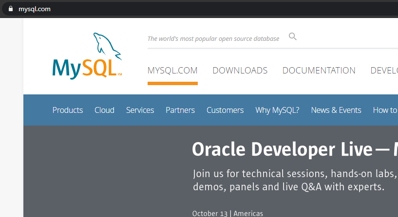

Acesse o link _Downloads_. Procure por _MySQL Community (GPL) Downloads_.

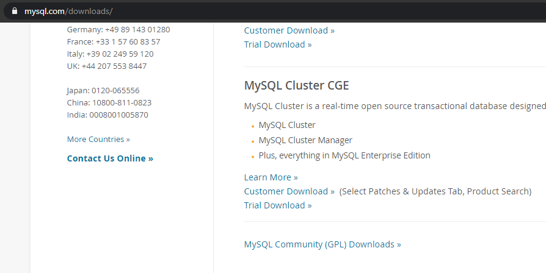

Escolha _MySQL Community Server_.

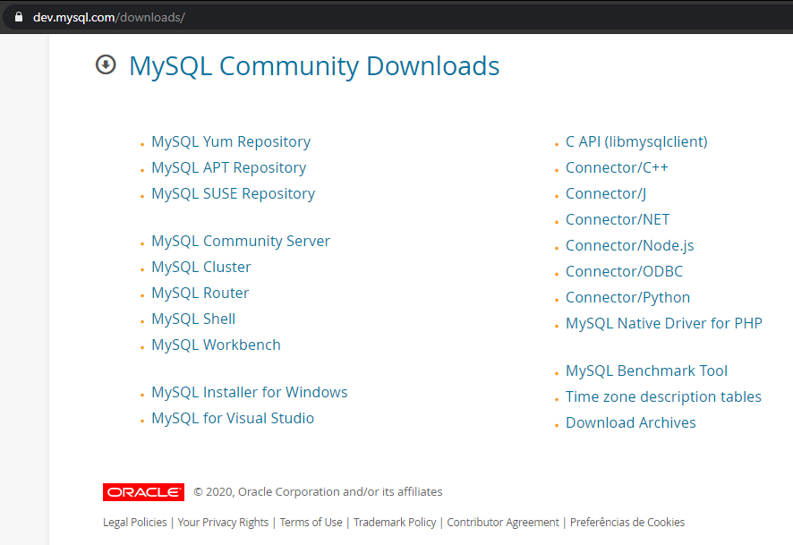

Selecione _MySQL Installer for Windows (mysql-installer-web-community-8.0.21.0.msi)_.

Clique em _No thanks, just start my download_.

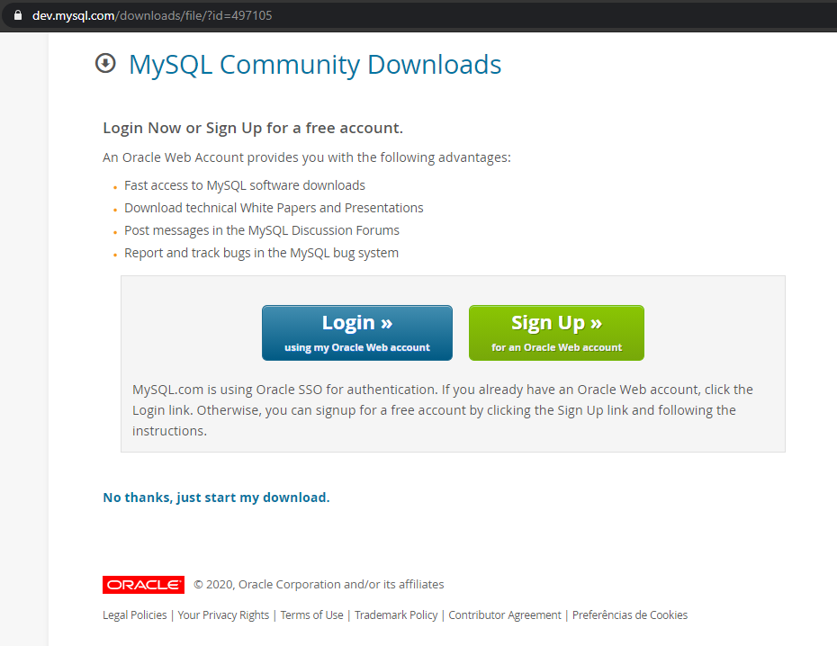

Após, baixar, execute o _setup_ e selecione a opção _Custom_.

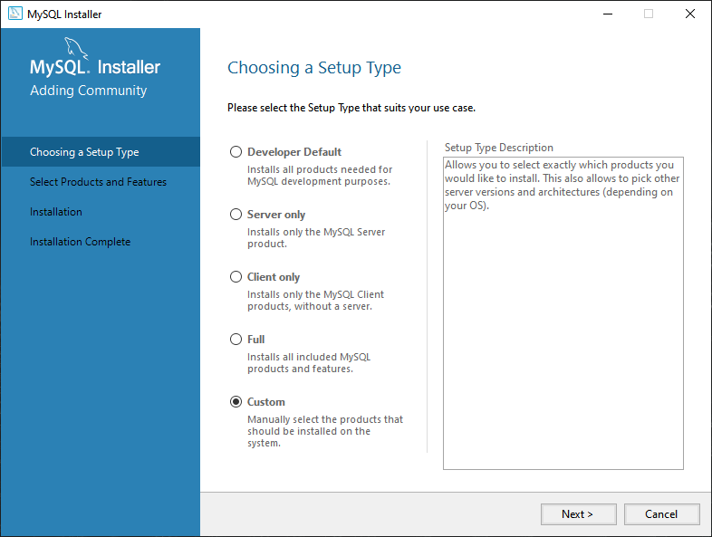

Escolha o _MySQL Server_, o _MySQL Workbench_ e o _Connector/NET_, todos nas versões mais recentes. Clique em _Next_.

Clique em _Execute_.

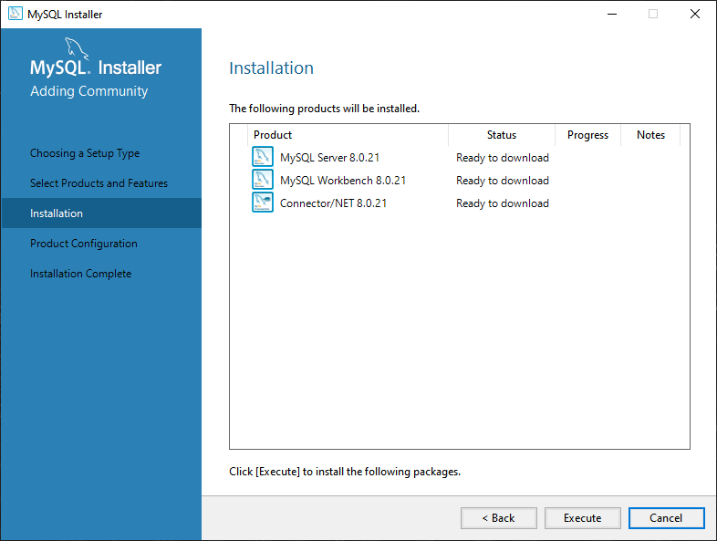

A instalação foi concluída. Clique em _Next_.

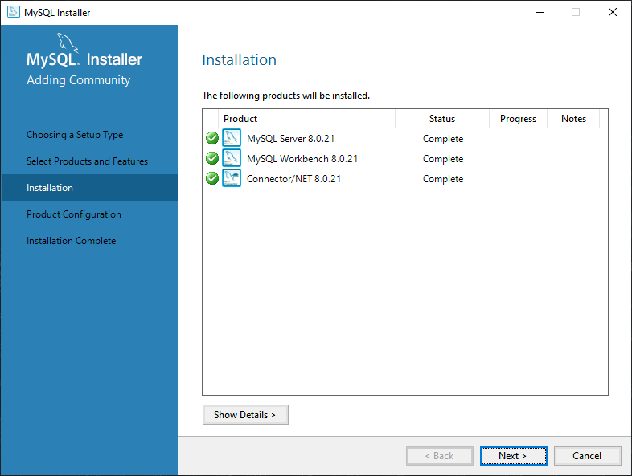

Clique em _Next_.

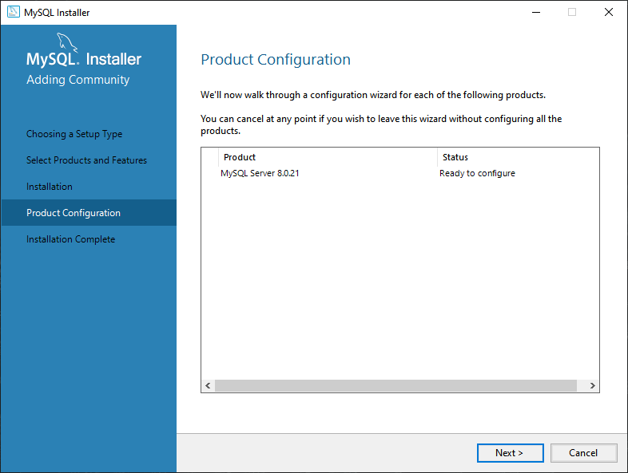

Escolha servidor _standalone_. Clique em _Next_.

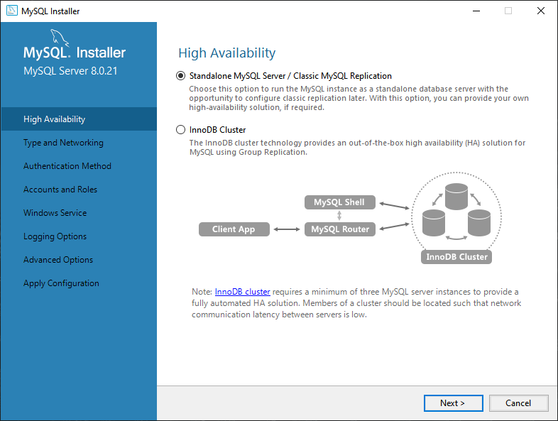

Escolha _Development Computer_ e anote a porta (no exemplo, 3306). Não desative a opção de abrir as portas do _firewall_ automaticamente. Clique em _Next_.

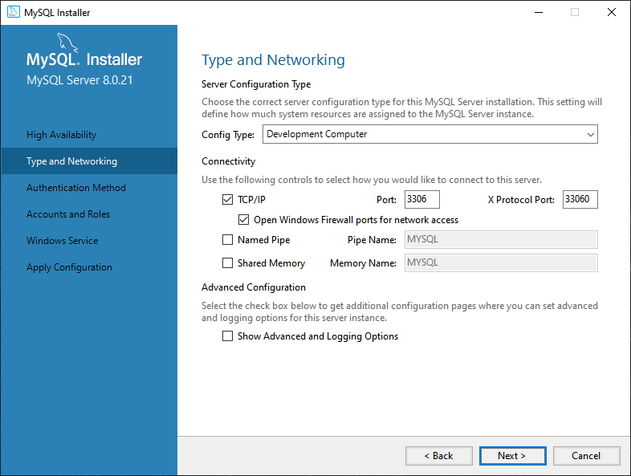

Mantenha as configurações de segurança no recomendado.

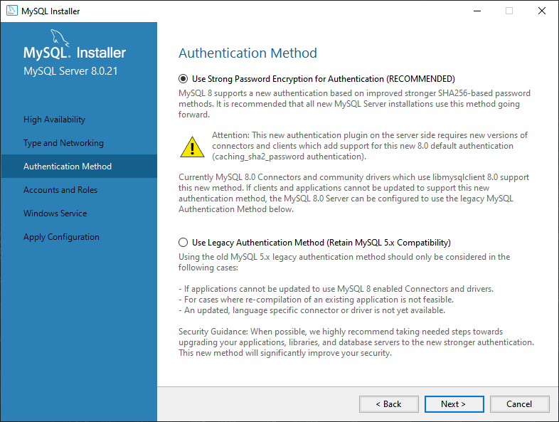

Defina a senha de _root_. Não use uma senha reaproveitada de outro serviço. Se não tiver nenhum dado sensível, e não for usado para produção, use uma senha curta e simples (ex. `root` ou `123`).

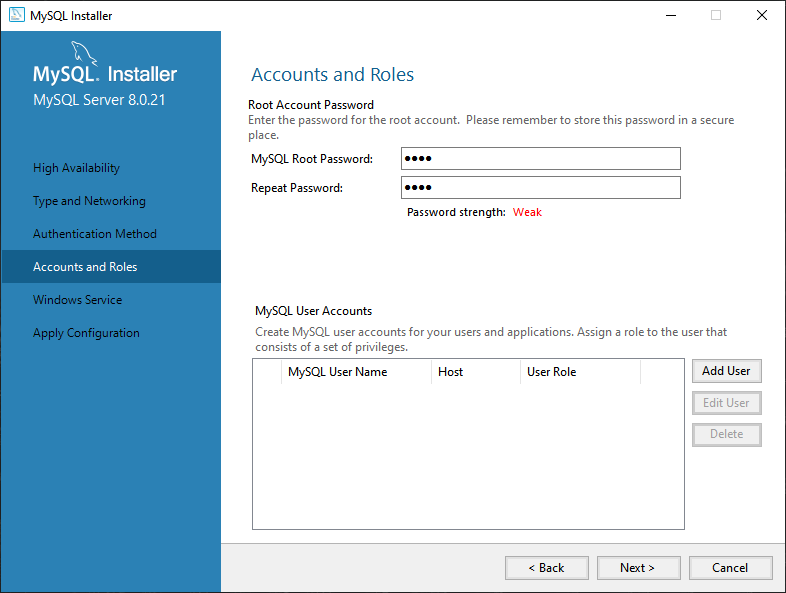

Mantenha as configurações de serviço como na imagem.

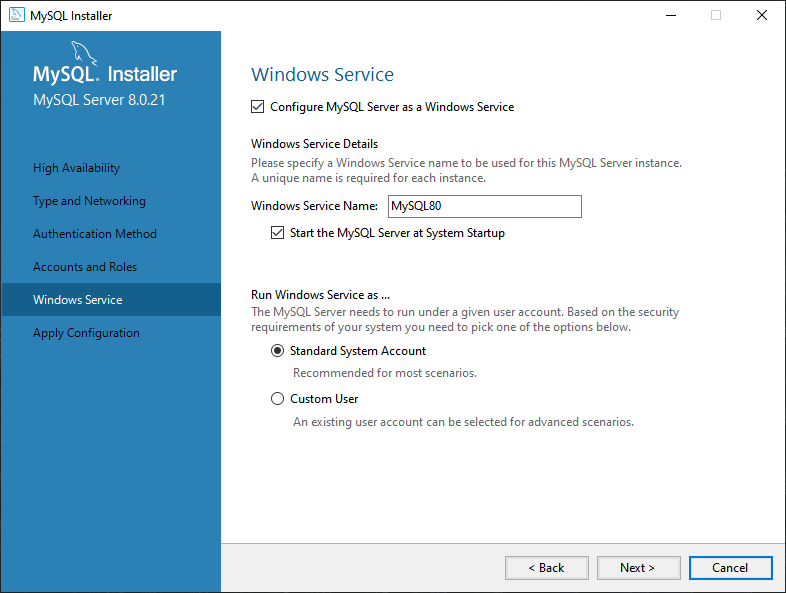

Clique em _Execute_.

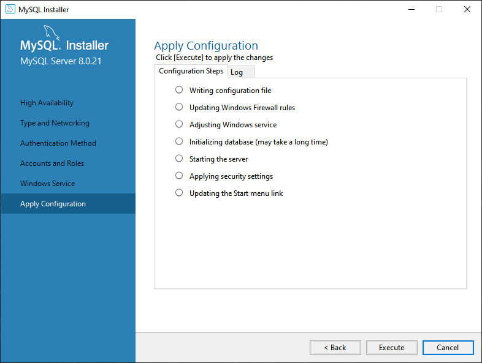

Configurações finalizadas. Clique em _Finish_.

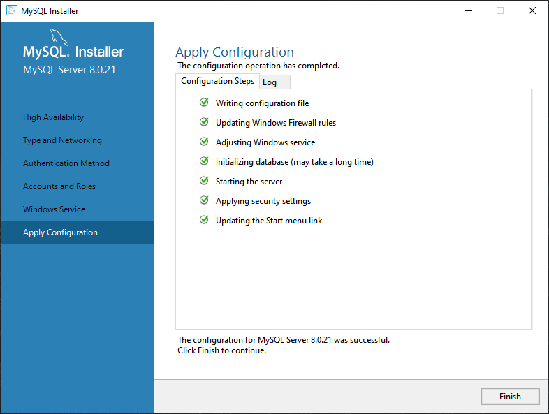

Clique em _Next_.

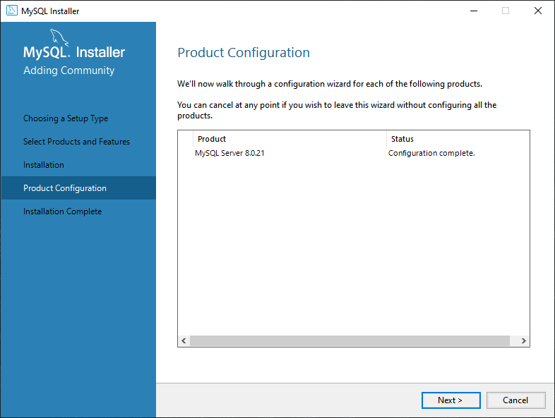

Clique em _Finish_.

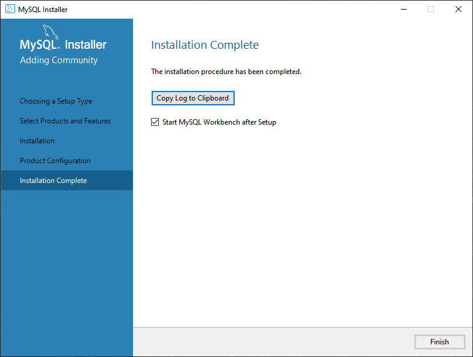

Ele deverá abrir o _MySQL Workbench_, com a conexão já configurada.

