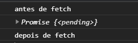
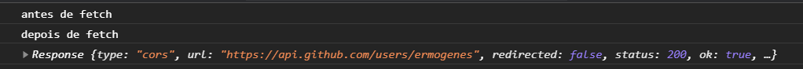
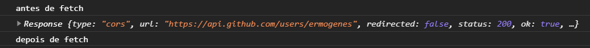
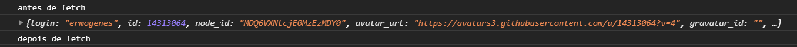

# Promises e async/await

Devido à sua natureza conectada, nem todas as funções de JavaScript são executadas imediatamente ao serem chamadas. Funções que demoram um tempo grande ou indeterminado para executarem frequentemente são retiradas do fluxo (_thread_) normal, e colocadas para execução em paralelo. Chamamos essas funções de funções assíncronas.

Para tratar a assincronia usando recursos do JavaScript, existem várias técnicas. Vamos estudar o método baseado em `Promises`. Estudemos como exemplo de função assíncrona a Fetch API.

<!-- Para estudá-las, primeiro vamos exemplificar o problema usando funções que demoram propositalmente para ser executas.

## Funções de _timer_

Temos duas funções disponível em JavaScript para atrasar a execução de um código por um tempo específico. Ambas recebem uma função a ser executada, e o tempo a ser aguardado. A diferença está no seu comportamento: `setTimeout` executa uma vez e finaliza, `setInterval` executa e reinicia a contagem infinitamente.

Exemplo de `setInterval`:

```js
const iniciar = () => {
  setInterval(() => console.log('Aguardei 1s!'), 1000);
};

document.addEventListener('DOMContentLoaded', iniciar);
```

Exemplo de `setTimeout`:

```js
const iniciar = () => {
  setTimeout(() => console.log('Aguardei 4s!'), 4000);
};

document.addEventListener('DOMContentLoaded', iniciar);
```

Agora podemos fazer com que um comando demore forçadamente um tempo grande para executar. Veja o seguinte exemplo:

```js
const iniciar = () => {
  console.log('Antes dos timers');
  setTimeout(() => console.log('Aguardei 4s!'), 4000);
  setTimeout(() => console.log('Aguardei 2s!'), 2000);
  console.log('Depois dos timers');
};

document.addEventListener('DOMContentLoaded', iniciar);
```

Saída:

```
Antes dos timers
Depois dos timers
Aguardei 2s!
Aguardei 4s!
```

Mas, o que aconteceu? Parece sem lógica, mas ele fez exatamente o que foi mandado: exibiu a primeira mensagem, iniciou a contagem de 4s para exibir a segunda, iniciou a contagem de 2s para exibir a terceira, exibiu a quarta, ao final de 2s exibiu a terceira e, ao final de 4s, exibiu a segunda.

Da mesma maneira, quando solicitarmos comandos assíncronos, eles serão concluídos somente quando terminados, porém _o fluxo normal continua_.

## Promises

Digamos que gostaríamos adaptar o código acima para executar cada comando somente após finalizar o comando anterior. Será necessário tratar a assincronia usando recursos do JavaScript. Existem várias maneiras para fazer isso; vamos estudar o método baseado em `Promises`.
 -->

## Fetch API

Permite a obtenção de recursos externos usando HTTP. É frequentemente utilizada para acessar recursos de _backend_, como APIs de aplicações e integração de sistemas.

Um exemplo é a [API do GitHub](https://docs.github.com/pt), qe permite interagir com o serviço. Por exmeplo, a URL `https://api.github.com/users/ermogenes` é pública (não precisa de autenticação) e permite obter os dados do usuário indicado (`@ermogenes`) em formato JSON usando HTTP.

Você pode visualizar a URL diretamente no navegador. Seu resultado:

```json
{
  "login": "ermogenes",
  "id": 14313064,
  "node_id": "MDQ6VXNlcjE0MzEzMDY0",
  "avatar_url": "https://avatars3.githubusercontent.com/u/14313064?v=4",
  "gravatar_id": "",
  "url": "https://api.github.com/users/ermogenes",
  "html_url": "https://github.com/ermogenes",
  "followers_url": "https://api.github.com/users/ermogenes/followers",
  "following_url": "https://api.github.com/users/ermogenes/following{/other_user}",
  "gists_url": "https://api.github.com/users/ermogenes/gists{/gist_id}",
  "starred_url": "https://api.github.com/users/ermogenes/starred{/owner}{/repo}",
  "subscriptions_url": "https://api.github.com/users/ermogenes/subscriptions",
  "organizations_url": "https://api.github.com/users/ermogenes/orgs",
  "repos_url": "https://api.github.com/users/ermogenes/repos",
  "events_url": "https://api.github.com/users/ermogenes/events{/privacy}",
  "received_events_url": "https://api.github.com/users/ermogenes/received_events",
  "type": "User",
  "site_admin": false,
  "name": "Ermogenes Palacio",
  "company": "Prodam",
  "blog": "http://ermogenes.github.io/",
  "location": "Santos, Brasil",
  "email": null,
  "hireable": null,
  "bio": "Dev @ Prodam. Teacher @ CPS/EtecAB. Azure AI Engineer Associate.",
  "twitter_username": "ermogenes",
  "public_repos": 80,
  "public_gists": 10,
  "followers": 39,
  "following": 33,
  "created_at": "2015-09-16T13:01:39Z",
  "updated_at": "2020-10-09T21:47:15Z"
}
```

Esse resultado é um objeto JSON (JavaScript Object Notation). Ele não é 100% igual a um objeto do JavaScript, mas sua sintaxe é baseada nele, portanto é facilmente convertível.

Podemos fazer essa mesma chamada HTTP usando `fetch`. Veja o exemplo:

```js
const iniciar = () => {
  console.log('antes de fetch');

  const response = fetch('https://api.github.com/users/ermogenes');
  console.log(response);

  console.log('depois de fetch');
};

document.addEventListener('DOMContentLoaded', iniciar);
```



O resultado não parece muito com o esperado, mas na verdade há mais trabalho a fazer. Perceba que o resultado de `fetch` é uma `Promise`. _Promises_ são estruturas de programação assíncrona que indicam que o resultado não estará disponível imediatamente, mas que permitem que se indiquem funções a serem executadas quando o resultado estiver disponível. Pense nela como uma promessa de executar algo quando a função for concluída.

Toda _promise_ um método `then`, que indica a função a ser executada quando a _promise_ for concluída. O método `fetch` retorna uma _promise_ de que fará a conexão com o URL indicado e retornará a resposta.

```js
const iniciar = () => {
  console.log('antes de fetch');

  fetch('https://api.github.com/users/ermogenes')
    .then((response) => console.log(response));

  console.log('depois de fetch');
};

document.addEventListener('DOMContentLoaded', iniciar);
```



Perceba que agora `response` só foi lida após a finalização da conexão. Porém, _depois de fetch_ foi exibido normalmente, sem aguardar a função assíncrona.

Podemos fazê-la aguardar encadeando outro `then`, mesmo que o anterior não retorne explicitamente uma _promise_.

```js
const iniciar = () => {
  console.log('antes de fetch');

  fetch('https://api.github.com/users/ermogenes')
    .then((response) => console.log(response))
    .then(() => console.log('depois de fetch'));
};

document.addEventListener('DOMContentLoaded', iniciar);
```




Perceba que o retorno obtido `response` ainda não contém o JSON que desejamos, e sim as informações de status sobre a obtenção deles. Obter o resultado exige outra _promise_.

```js
const iniciar = () => {
  console.log('antes de fetch');

  fetch('https://api.github.com/users/ermogenes')
    .then((response) => response.json())
    .then((result) => console.log(result))
    .then(() => console.log('depois de fetch'));
};

document.addEventListener('DOMContentLoaded', iniciar);
```



É claro, podemos criar uma função que trata os resultados adequadamente. Como já foram convertidos de JSON para objetos do JavaScript, [tudo que você já aprendeu](objetos.md) é válido.

```js
const exibeUsuario = (usuario) => {
  console.log(`O usuário ${usuario.login} possui ${usuario.public_repos} seguidores!`);
};

const iniciar = () => {
  fetch('https://api.github.com/users/ermogenes')
    .then((response) => response.json())
    .then((result) => exibeUsuario(result));
};

document.addEventListener('DOMContentLoaded', iniciar);
```


## Async/Await

Uma sintaxe alternativa para fazer a mesma coisa é a chamada `async`/`await`. A palavra-chave `await` faz o papel do `then`, e `async` faz uma função automaticamente retornar uma _promise_.

Veja o mesmo exemplo, usando essa sintaxe:

```js
const exibeUsuario = (usuario) => {
  console.log(`O usuário ${usuario.login} possui ${usuario.public_repos} seguidores!`);
};

const iniciar = () => {
  const response = await fetch('https://api.github.com/users/ermogenes');
  const result = await response.json();
  exibeUsuario(result);
};
```

Note que o exemplo gera um erro:


Sempre que utilizarmos `await`, a função atual deve ser marcada como assíncrona, para que retorne uma _promise_. Fazemos isso usando a palavra `async`.

```js
const exibeUsuario = (usuario) => {
  console.log(`O usuário ${usuario.login} possui ${usuario.public_repos} seguidores!`);
};

const iniciar = async () => {
  const response = await fetch('https://api.github.com/users/ermogenes');
  const result = await response.json();
  exibeUsuario(result);
};
```

Agora tudo funciona como esperado.

Pense em `await` como uma maneira de _esperar_ que uma função assíncrona termine antes de continuar o programa. Ela torna facilmente um comando assíncrono em síncrono.

## Tratamento de erros

Além de `then`, toda _promise_ também possui um `catch`, que indica a função a ser executada em caso de erro. Ele será executado se _qualquer promise_ anterior a ele lançar uma exceção. Assim, precisamos alterar nossas funções para que elas retornem a próxima _promise_ ou lancem uma exceção.

Veja o exemplo:

```js
const exibeUsuario = (usuario) => {
  console.log(`O usuário ${usuario.login} possui ${usuario.public_repos} seguidores!`);
};

const iniciar = () => {
  console.log('buscando dados do usuário...');
  fetch('https://api.github.com/users/ermogenes')
    .then((response) => {
      if (response.ok) {
        return response.json()
      } else {
        throw new Error(`Erro ao acessar o URL: ${response.statusText}`);
      }
    })
    .then((result) => exibeUsuario(result))
    .catch((error) => console.log(`Um erro foi encontrado: ${error.message}`))
    .then(() => console.log('operação concluída.'));
};
```


Usando essa sintaxe não podemos utilizar `try...catch`. Se quisermos fazê-lo, devemos usar `async/await`. Veja um exemplo similar ao anterior.

```js
const exibeUsuario = (usuario) => {
  console.log(`O usuário ${usuario.login} possui ${usuario.public_repos} seguidores!`);
};

const iniciar = async () => {
  console.log('buscando dados do usuário...');
  try {
    const response = await fetch('https://api.github.com/users/ermogenes');
    if (response.ok) {
      const result = await response.json();
      exibeUsuario(result);
    } else {
      throw new Error(`Erro ao acessar o URL: ${response.statusText}`);
    }
  } catch(error) {
    console.log(`Um erro foi encontrado: ${error.message}`)
  }
  console.log('operação concluída.');
};
```

## Objeto `request`

Representa a sua requisição ao recurso. Você pode alterar a suas opções passando um segundo parâmetro para o `fetch`.

- `method` indica o verbo HTTP usado;
- `headers` permite colocar cabeçalhos personalizados;
- `body` permite enviar informações no corpo da requisição.

## Objeto `response`

Representa a resposta dada pelo recurso acessado.

- `ok` indica que o resultado é um sucesso (código entre 200 e 299);
- `status` indica o código retornado (o código mais comum de sucesso é 200);
- `statusText` indica um texto legível do código retornado;
- `headers` indica o cabeçalho da resposta;
- `body` indica o corpo da resposta.

Veja uma lista completa dos status HTTP [aqui](https://developer.mozilla.org/pt-BR/docs/Web/HTTP/Status).

## Objeto `body` (ou `result`)

Possui o conteúdo recebido. Podemos lê-lo de diversas maneiras:

- `.json()` converte um conteúdo JSON em objeto do JavaScript;
- `.text()` lê o texto sem processá-lo;
- `.blob()` permite receber um arquivo binário (como uma imagem, por exemplo).