# Microsoft Azure - Aplicativo Web Estático

Permite hospedar _sites_ estáticos (HTML, CSS e JavaScript) no Azure, a partir de um repositório no GitHub.

## O que será criado?

Vamos publicar o conteúdo do projeto `Visões do Futuro`, uma solução de [exercício]() do [Dev Web]().

- [Enunciado do exercício](https://github.com/ermogenes/aulas-programacao-web/blob/master/exercises/leiaute-responsividade.md#exerc%C3%ADcio-aplicacao-leiaute)
- [Repositório no GitHub](https://github.com/ermogenes/visoes-do-futuro)
- [Publicação com GitHub Pages](https://ermogenes.github.io/visoes-do-futuro/)

Após este tutorial, teremos uma publicação adicional na nuvem do Azure.

## Simulando os custos

No momento da criação deste material, o recurso _Aplicativos Web Estáticos_ ainda está na versão prévia.

Versões prévias não tem custo e aparecem na calculadora, porém **podem ter custos quando saírem da prévia**, portanto, **fique atento**.

## Criando o recurso

Estando logado no [Portal do Azure](https://portal.azure.com/), crie um recurso do tipo _Aplicativo Web Estático_.

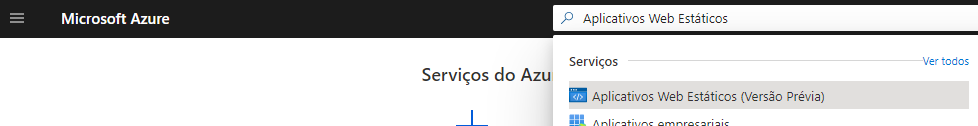

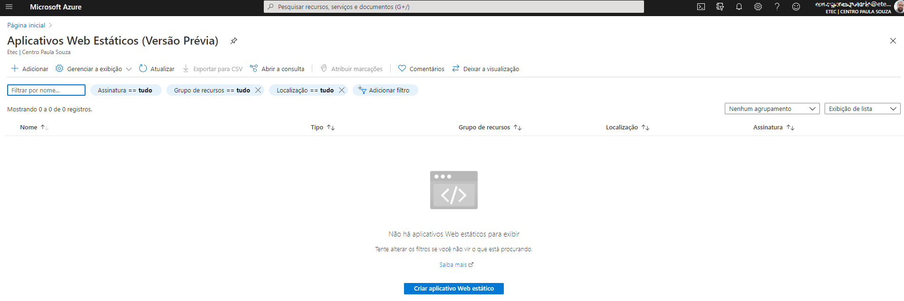

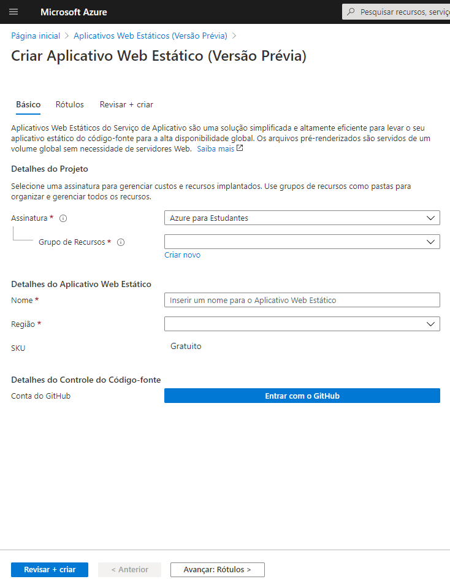

Crie um grupo de recursos para cada conjunto que compartilhe o mesmo ciclo de vida, pois ao excluir o grupo, tudo é excluído junto. Isso facilita a gestão de recursos que você não vai mais usar no futuro.

Para este exemplo, vou chamá-lo de `GrupoRecursoExemploStWebApp01`.

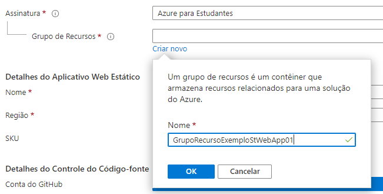

Escolha um nome para o seu projeto, e uma região com o custo desejado (gratuito).

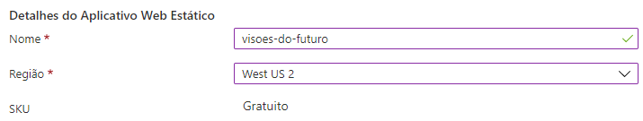

Clique em _Entrar com o GitHub_.

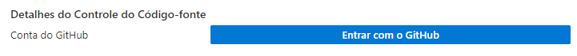

Autorize o Azure a ler seus dados da sua conta do GitHub clicando em _Authorize ..._.

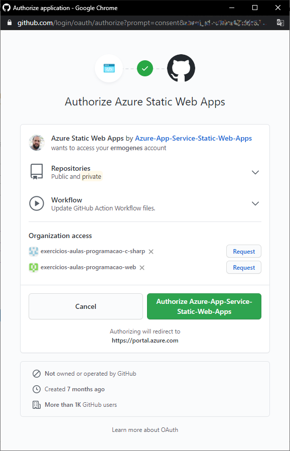

Selecione:

- Organização: `<seu nome de usuário>`
- Repositório: `<nome do repositório desejado>`
- Filial (_branch_): `master`

- Build:
  - Predefinição: _Custom_
  - Local do aplicativo: `/`
  - Local da API : vazio
  - Local do artefato: vazio

Clique em _Revisar + criar_.

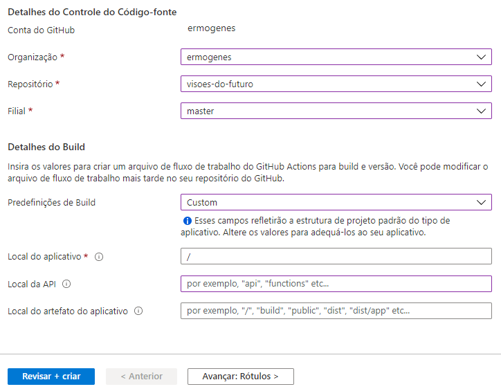

Revise, e clique em _Criar_.

Seu _site_ seguirá o fluxo de implantação.

Vá para _Todos os recursos_.

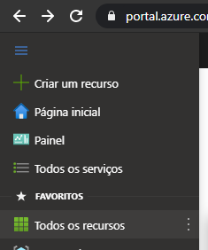

Acesse o recurso clicando no seu nome.

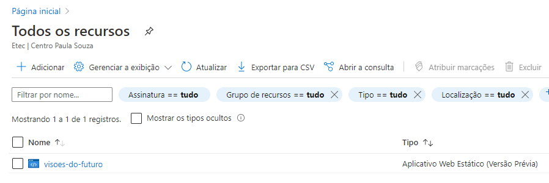

O URL de acesso pode ser visto à direita. Nesse caso, [https://zealous-plant-01c57eb1e.azurestaticapps.net](https://zealous-plant-01c57eb1e.azurestaticapps.net).

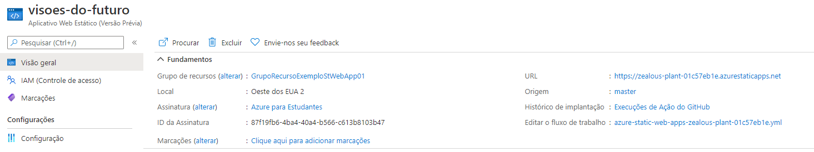

Acessando o [link](https://zealous-plant-01c57eb1e.azurestaticapps.net) podemos visualizar o _site_ publicado.

Caso o seu ainda não esteja funcional, pode ser que o fluxo de implantação não tenha concluído. Aguarde alguns instantes.

Você pode visualizar o fluxo de integração contínua no GitHub, aba Actions. A cada novo _push_, uma nova publicação será disparada automaticamente. Ao terminar, o site estará atualizado no Azure.

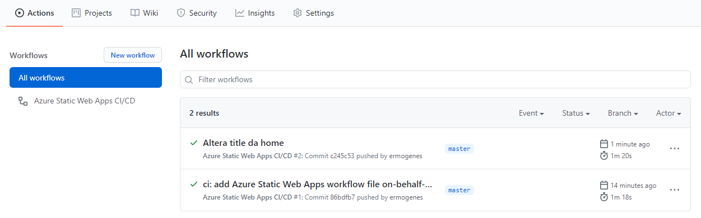

## Excluindo o recurso

Para parar a cobrança e excluir o recurso, selecione _Excluir_ na página do recurso.
