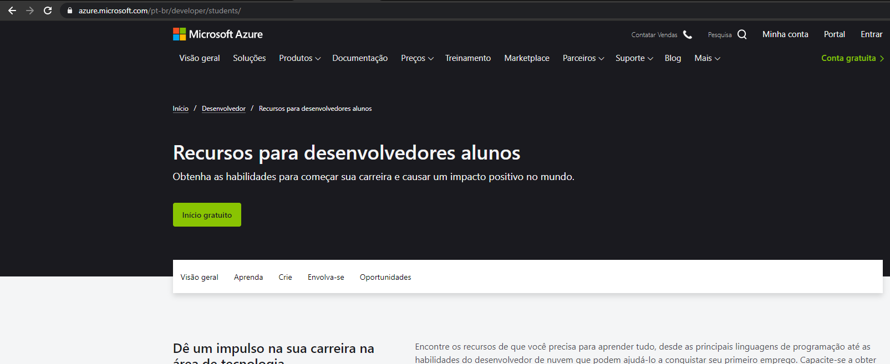
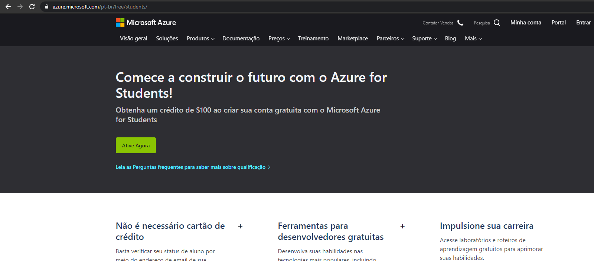
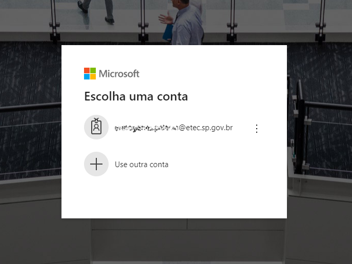
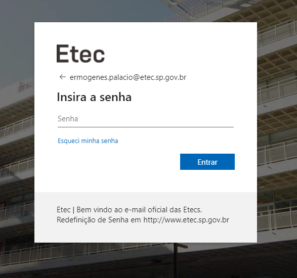
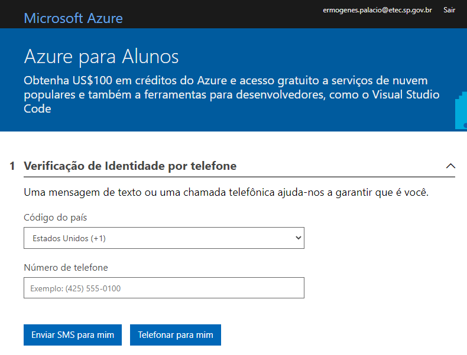
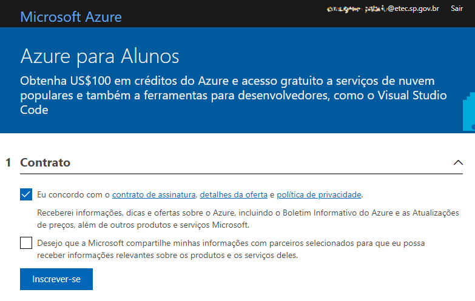
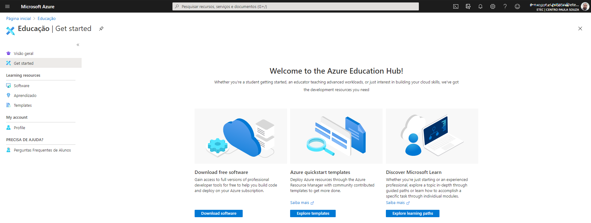
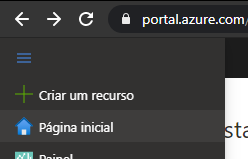
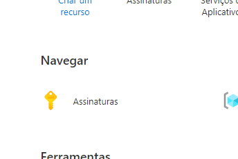
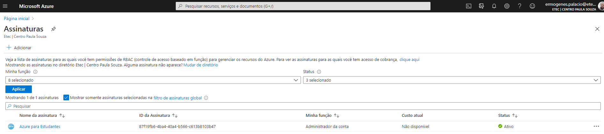

# Microsoft Azure - Conta de Estudante

Este tutorial ensinará a criar uma conta de estudante no provedor de nuvem Microsoft Azure. Caso você seja aluno do Centro Paula Souza, você pode usar as vantagens do plano de estudante, com 100 dólares de crédito (renováveis ao acabar) enquanto você estiver matriculado.

💡 _Se você não é aluno matriculado_ de nenhuma instituição de ensino parceira da Microsoft, ainda assim pode usar a subscrição de teste por período e crédito limitados, porém terá que informar um número de cartão de crédito durante o cadastro. Ignore esse tutorial e faça sua inscrição [aqui](https://azure.microsoft.com/pt-br/free/).

## Criando a conta de estudante

Acesse [https://azure.microsoft.com/pt-br/developer/students/](https://azure.microsoft.com/pt-br/developer/students/).

Clique em _Início Gratuito_.

Clique em _Ative Agora_.

Será solicitado o seu login. Escolha a sua conta de estudante. No caso do Centro Paula Souza, ela possui o final `@etec.sp.gov.br` ou `@fatec.sp.gov.br`.

Será feita uma verificação via SMS ou ligação telefônica. Siga as instruções do _site_.

Ao final da verificação, na tela de contrato, concorde com os termos de uso e clique em _Inscrever-se_.

Você será redirecionado para o portal do Azure, já logado.

Para conferir se tudo está certo, navegue até a página inicial do portal.

Acesse a opção _Assinaturas_. Sua assinatura deve aparecer na lista como ativa.

Estando logado, você pode visualizar seus créditos disponíveis (_check balance_) e detalhes de uso (_usage details_) em [_Azure Sponsorships_](https://www.microsoftazuresponsorships.com/).

