# Microsoft Azure - Serviço de Aplicativo

Permite hospedar _sites dinâmicos_ no Azure, com processamento em _backend_.

## O que será criado?

Vamos publicar o conteúdo de um projeto de teste `TestePublicacaoAzure`, que contém um projeto Web API ~~vazio~~ quase vazio.

Trata-se do template _Hello World_ do tipo `webapi`, com duas alterações: habilitar CORS para todas as origens, e desligar o suporte a HTTPS. Sem essas mudanças, o exemplo não serviria para nossos propósitos.

- [Repositório no GitHub](https://github.com/ermogenes/TestePublicacaoAzure)

## Simulando os custos

Acesse a [Calculadora de preços](https://azure.microsoft.com/pt-br/pricing/calculator/) do Azure.

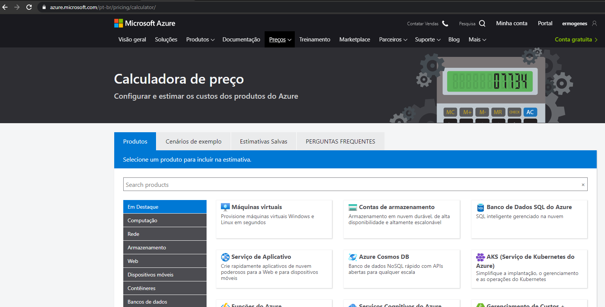

Selecione _Serviço de Aplicativo_, e role a tela até encontrar o simulador.

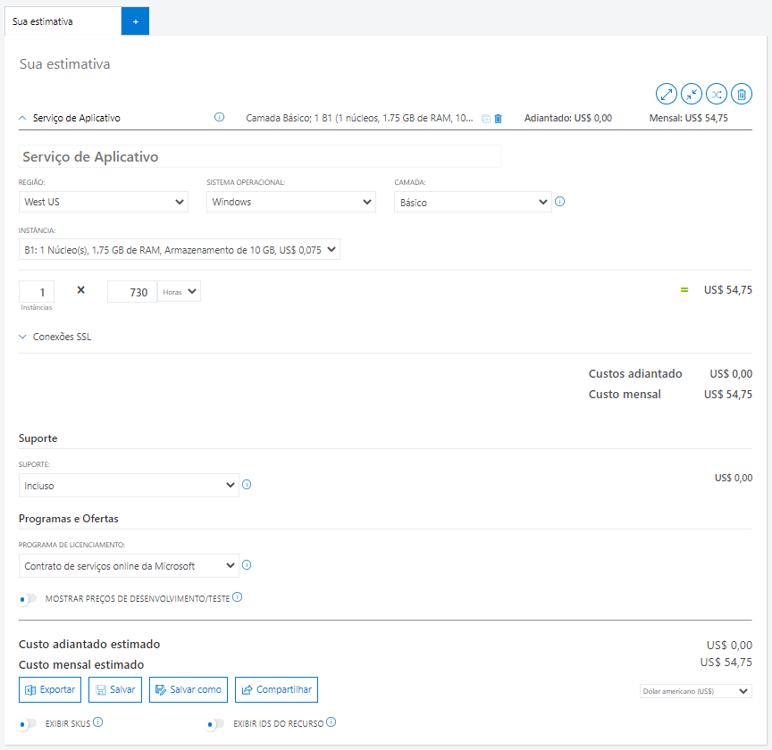

Vamos alterar as configurações de forma a conseguir um servidor gratuito.

Como os preços podem variar, no meu caso a configuração escolhida foi:

- Região: `West US`
- Sistema operacional: `Windows`
- Camada: `Gratuito`
- Instância: `F1`

Escolha o que melhor te atender, sempre se atentando aos custos. Para esse curso, use sempre os planos gratuitos.

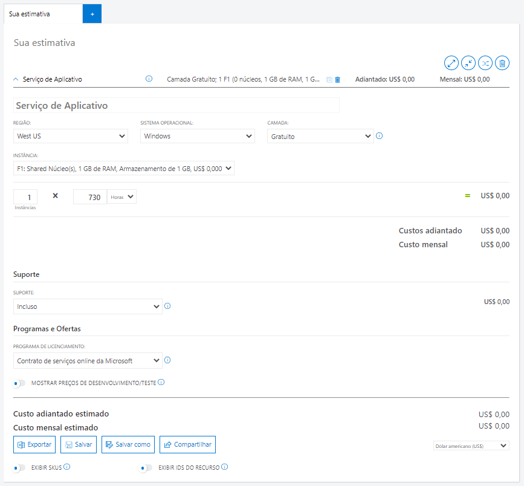

Com as configurações e custos já simulados, anote as configurações e vamos criar a infraestrutura em nuvem equivalente.

## Criando o recurso

Estando logado no [Portal do Azure](https://portal.azure.com/), crie um recurso do tipo _Serviços de Aplicativos_.

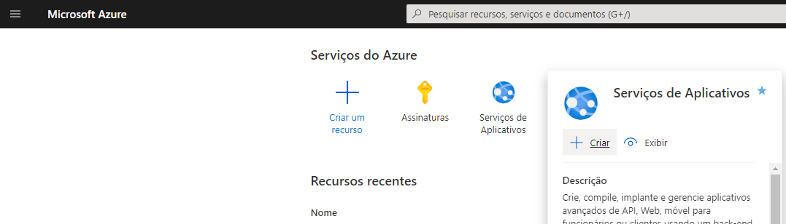

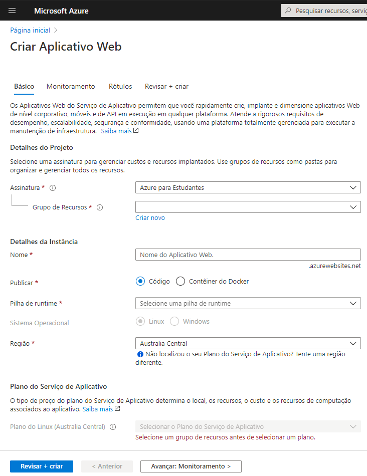

Crie um grupo de recursos para cada conjunto que compartilhe o mesmo ciclo de vida, pois ao excluir o grupo, tudo é excluído junto. Isso facilita a gestão de recursos que você não vai mais usar no futuro.

Para este exemplo, vou chamá-lo de `GrupoRecursoExemploAzure01`.

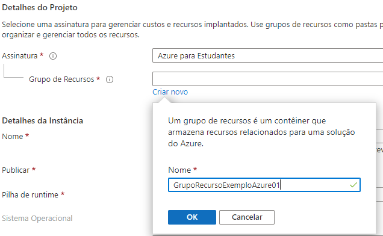

Crie sua instância com o runtime `.NET Core 3.1 (LTS)`, com a configuração simulada na calculadora.

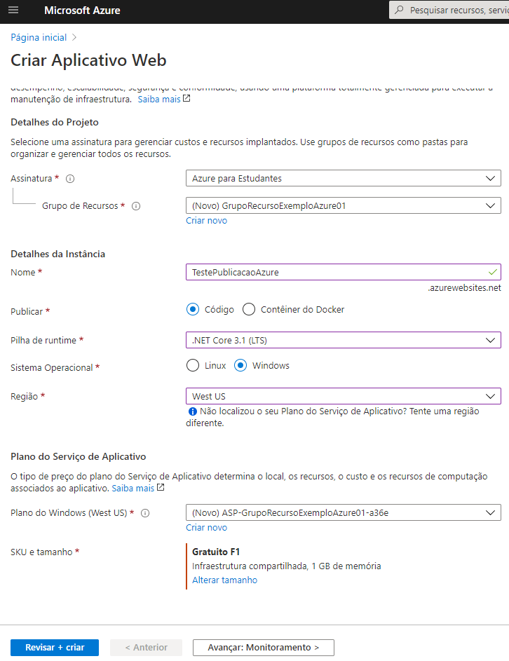

Clique em _Revisar + criar_. Revise e clique em _Criar_.

Aguarde a finalização e clique em _Ir para o recurso_.

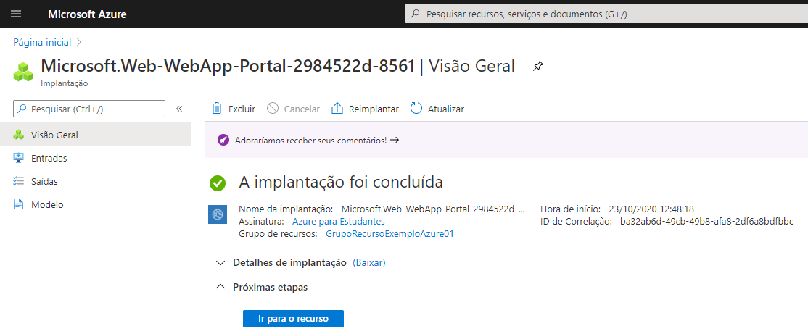

Você já terá acesso ao seu URL, mas ainda não fez a publicação da sua aplicação. Neste exemplo, a URL é [https://testepublicacaoazure.azurewebsites.net](https://testepublicacaoazure.azurewebsites.net).

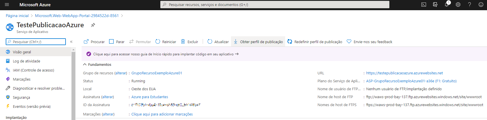

Clique em _Centro de implantação_, e depois em _GitHub_.

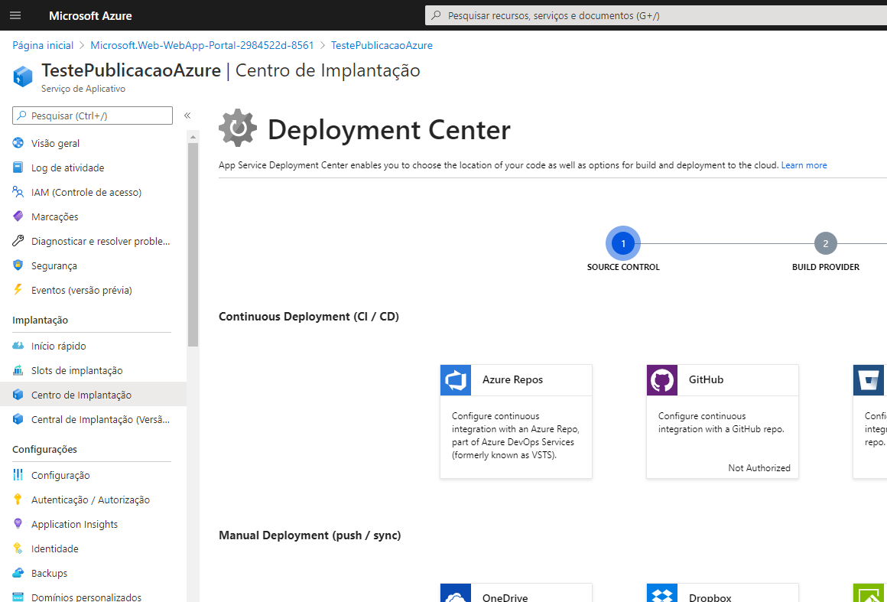

Em seguida, clique em _Authorize_, e na janela que se abrirá, em _Authorize ..._.

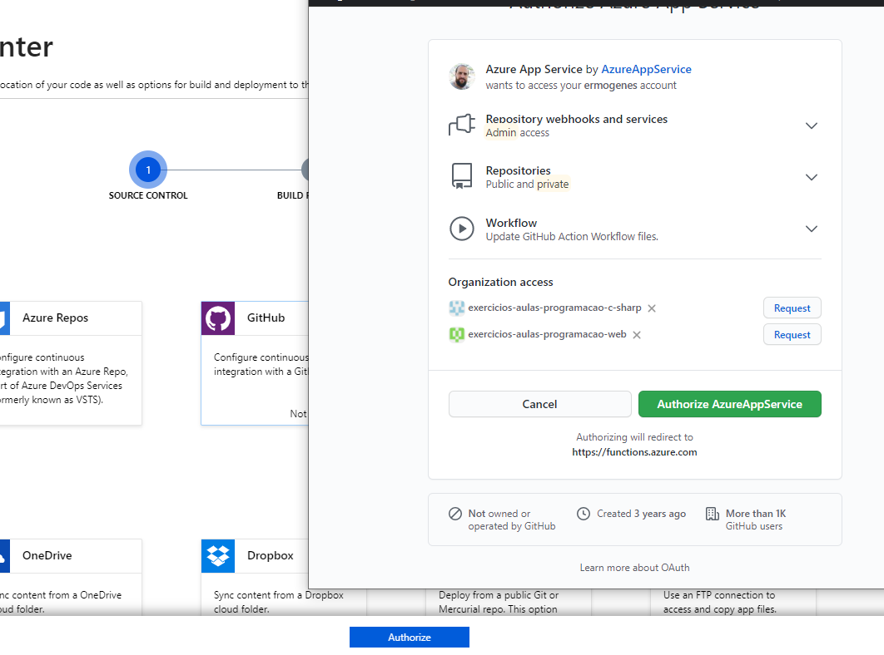

Clique em _Continue_. Selecione _GitHub Actions_ e depois _Continue_.

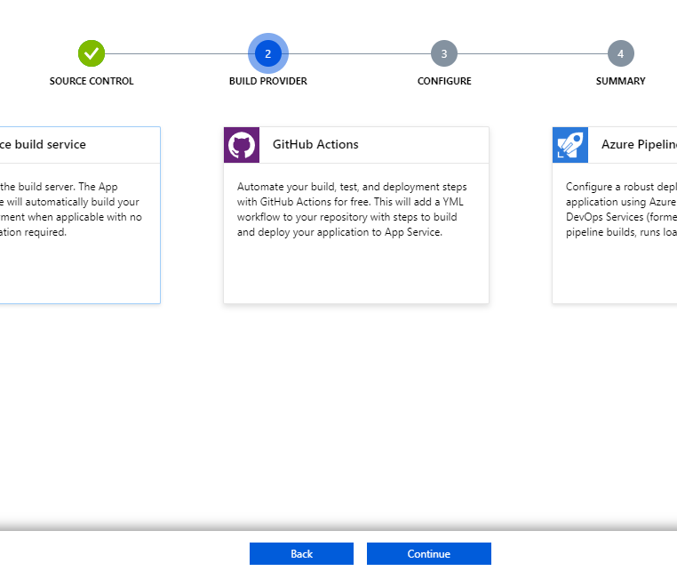

Escolha seu repositório e indique a configuração de execução .NET Core. Clique em _Continue_.

Você verá seu _script_ de implantação. Ele será executado automaticamente a cada novo _push_ no repositório do GitHub. Clique em _Finish_.

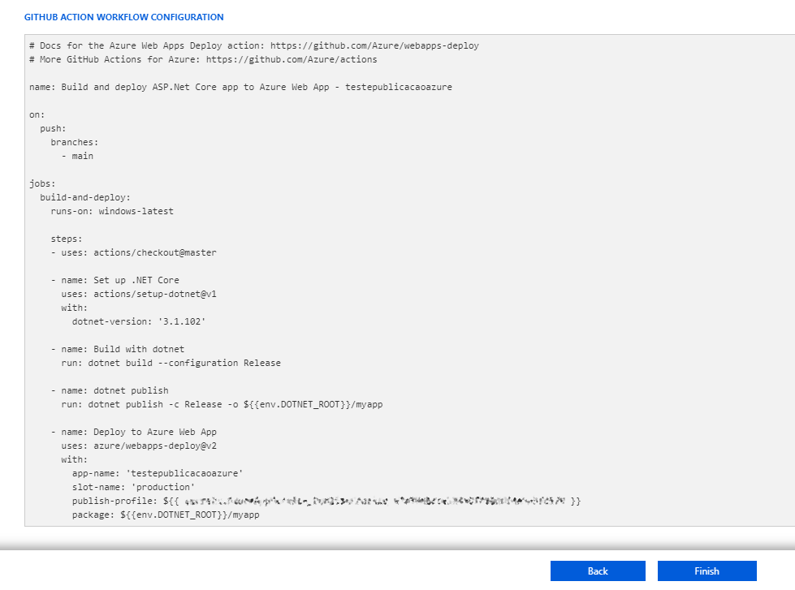

Sua aplicação estará funcionando assim que o fluxo de implantação for finalizado.

Para testar este exemplo, use o _endpoint_ `/WeatherForecast`, em [https://testepublicacaoazure.azurewebsites.net/WeatherForecast](https://testepublicacaoazure.azurewebsites.net/WeatherForecast).

## Excluindo o recurso

Para parar a cobrança e excluir o recurso, selecione _Excluir_ na página do recurso.
