# Bancos de dados na nuvem

[📽 Veja esta vídeo-aula no Youtube](#) _Em breve..._

Precisamos agora de uma instância de produção do nosso banco de dados, acessível através de nossa aplicação.

Vamos então criar um banco local para servir o ambiente de desenvolvimento, desenvolver a aplicação de forma a manter a _string de conexão_ segura, provisionar o servidor e fazer a implantação do banco na nuvem, provisionar e implantar a aplicação, e, por fim, configurar a aplicação para utilizar o banco de dados de produção na nuvem.

Nesse material usaremos o banco de dados de exemplo `boardgames`.

- Banco: [ermogenes/boardgames-mysql](https://github.com/ermogenes/boardgames-mysql)
- Código-fonte: [ermogenes/boardgames-web](https://github.com/ermogenes/boardgames-web)
- Aplicação publicada: [https://boardgames-web.azurewebsites.net/](https://boardgames-web.azurewebsites.net/)

## Criando o banco de desenvolvimento

Crie o banco de dados indicado acima em seu servidor local. Se ele estiver funcional, você deve ter as configurações semelhantes a essas (mas não necessariamente iguais):

- Servidor (local): `localhost`
- Porta: `3306`
- Usuário: `root` _(isso é somente um exemplo!)_
- Senha: `root` _(isso é somente um exemplo!)_
- Banco: `boardgames`

Isso implicará a seguinte _string de conexão_ de desenvolvimento:

```
server=localhost;port=3306;user=root;password=root;database=boardgames
```

Caso alguma configuração local sua seja diferente, ajuste a _string de conexão_. Anote em um local de fácil acesso.

## Criando o repositório para o código-fonte

Crie um repositório no GitHub com arquivo `README.md` e, _importante_, com `.gitignore` do tipo `VisualStudio`.

Clone esse repositório localmente e o acesse no VsCode. Ele conterá a sua aplicação.

## Ajustando o `.gitignore`

Antes de criarmos a aplicação usando `dotnet new`, vamos alterar o `.gitignore` para garantir que nenhuma informação sigilosa acabe subindo para o GitHub por engano.

Como vamos colocar a _string de conexão_ em um arquivo de configuração, vamos adicionar o nome dele na lista de arquivos a não serem versionados. Abra o `.gitignore` e adicione no final as seguintes linhas:

```
# ignorar arquivos de configuração
**/appsettings.development.json
**/appsettings.staging.json
**/appsettings.production.json
```

Se assim desejar, faça um _commit_ com essa versão.

## Criando a aplicação

Use `dotnet new webapi` para criar a aplicação com o _template_ padrão. Exclua os arquivos desnecessários `WeatherForecast.cs` e `Controllers\WeatherForecastController.cs`.

Confira quais arquivos estão sujeitos a versionamento usando `git status`. Certifique-se de que `appsettings.development.json` foi ignorado.

Se assim desejar, faça um _commit_ com essa versão.

## Desativando o redirecionamento HTTPS

Abra `Startup.cs` e comente (ou exclua) a linha abaixo:

```cs
app.UseHttpsRedirection();
```

Se assim desejar, faça um _commit_ com essa versão.

## Fazendo _scaffolding_ do banco local

Instale os pacotes necessários.

```
dotnet add package Microsoft.EntityFrameworkCore
dotnet add package Microsoft.EntityFrameworkCore.Design
dotnet add package MySql.Data.EntityFrameworkCore
```

Faça o _scaffolding_ usando a _string de conexão_ anotada anteriormente.

```
dotnet ef dbcontext scaffold "__" MySql.Data.EntityFrameworkCore -o __ -f
```

No meu exemplo ficará `dotnet ef dbcontext scaffold "server=localhost;port=3306;user=root;password=root;database=boardgames" MySql.Data.EntityFrameworkCore -o db -f`.

NÃO FAÇA AINDA _commit_ com essa versão. Ela contém usuário e senha do seu banco!

## Removendo a _string de conexão_ do contexto

A _string de conexão_ fica escrita literalmente no arquivo do contexto (No exemplo, fica em `db\boardgamesContext.cs`). Com os procedimentos abaixo vamos removê-la e guardá-la em um local seguro.

Abra o seu arquivo com a classe de contexo gerada pelo _scaffolding_. Localize o método `OnConfiguring`. Perceba que ele contém dados sigilosos. Remova as linhas existentes, deixando algo assim:

```cs
protected override void OnConfiguring(DbContextOptionsBuilder optionsBuilder)
{
    // remova os comandos existentes aqui
}
```

Ok, senhas seguras. O problema agora é que a aplicação não sabe mais como acessar o banco de dados.

A estratégia será criar no arquivo de configuração `appsettings.json` uma _string de conexão_ _fake_ que poderá ser versionada e publicada no GitHub, e em  `appsettings.development.json`, que não será versionado, guardaremos a _string de conexão_ verdadeira para o ambiente de desenvolvimento. Em produção, podemos criar uma configuração no Azure para substituir esse arquivo, apontando para o banco de produção.

Abra `appsettings.json` e adicione o seguinte objeto:

```cs
"ConnectionStrings" : {
    "boardgamesConnection": "<sua connection string vai aqui>"
}
```

Onde:

- `boardgamesConnection` é o identificador da nossa _string de conexão_.
- `<sua connection string vai aqui>` é um texto explicativo. **Não escreva sua _string de conexão_ real aqui**, use qualquer texto informativo.

Abra `appsettings.development.json` e adicione o seguinte objeto:

```cs
"ConnectionStrings" : {
    "boardgamesConnection": "<string de conexão real de desenvolvimento>"
}
```

- `<string de conexão real de desenvolvimento>`: aqui sim use a _string de conexão_ real, já que esse arquivo não será versionado.

Quem fizer o clone do repositório e quiser rodar localmente terá que copiar `appsettings.json` com o nome `appsettings.development.json` e ajustar a _string de conexão_ para o seu caso específico.

Na implantação orientaremos o Azure disponibilizar a _string de conexão_ de outra maneira.

Agora vamos orientar a aplicação a buscar e usar a _string de conexão_, mas não no contexto e sim em um serviço que ficará disponível em todas as _controllers_, facilitando o seu uso.

Vá em `Startup.cs` e procure o método `ConfigureServices`. Ele deve ter somente um comando que indica que vamos usar _controllers_ em nossa aplicação. Adicione antes desse comando o seguinte:

```cs
services.AddDbContext<db.boardgamesContext>(options => 
    options.UseMySQL(Configuration.GetConnectionString("boardgamesConnection"))
);
```

Onde `db.boardgamesContext` é a classe de contexto (que será diferente em cada projeto).

Será necessário adicionar a seguinte referência:

```cs
using Microsoft.EntityFrameworkCore;
```

## Criando _controllers_ com acesso ao contexto

Precisamos agora mudar a maneira que acessamos o nosso contexto de banco de dados. Em todas as _controllers_ que necessitarem do contexto, vamos obtê-lo diretamente em seu construtor, e salvá-lo em uma propriedade privada. Como o objeto é construído e destruído a cada execução, isso economizará recursos e facilitará a integração em aplicações mais complexas.

Nesse exemplo, vamos criar uma _controller_ chamada `BoardgamesController`. Criaremos nela uma propriedade privada chamada `_db` do tipo `db.boardgameContext` onde gravaremos o contexto recebido no construtor. Para isso, adicione código semelhante a esse na sua classe:

```cs
private boardgamesContext _db { get; set; }
public BoardgamesController(boardgamesContext contexto)
{
    _db = contexto;
}
```

Agora não será mais necessário usar a construção `using(...contexto...) { ... }` para acessar seu banco. Ele sempre estará acessível nessa classe através de `_db`.

Crie um método que atenda à rota `/Boardgames` retorne uma lista com todos os board games cadastrados em ordem de decrescente de nota.

```cs
[HttpGet]
public List<Boardgame> Get()
{
    var todosOsBoardGames = _db.Boardgame
        .OrderByDescending(bg => bg.Nota)
        .ThenBy(bg => bg.Ano)
        .ThenBy(bg => bg.Nome)
        .ToList<Boardgame>();
    return todosOsBoardGames;
}
```

🍌 O código acima existe as referências a `System.Collections.Generic` e `System.Linq`.

Teste sua API e se estiver funcionando corretamente, nosso backend está concluído e podemos prosseguir para o frontend.

Se assim desejar, faça um _commit_ com essa versão.

## Adicionando o suporte a arquivos estáticos

Em `Startup.cs` no método `Configure`, antes de `app.UseRouting()`, adicione as seguintes linhas:

```cs
app.UseDefaultFiles();
app.UseStaticFiles();
```

Isso garante que os arquivos em `wwwroot` serão entregues quando solicitados, e que caso uma pasta seja indicada em vez de um arquivo, será entregue o arquivo padrão (geralmente `index.html`).

Crie `wwwroot\index.html` com um conteúdo inicial bem simples, e teste. Caso esteja tudo certo, prossiga.

Se assim desejar, faça um _commit_ com essa versão.

## Criando o _frontend_

Faça uma página que consuma o _endpoint_ criado e exiba os board games retornados de uma maneira agradável ao usuário.

Teste e, se tudo estiver ok, a nossa aplicação estará pronta.

Faça um _commit_ com essa versão e faça o _push_ para o GitHub.

## Escolhendo a infraestrutura

Precisaremos do **Serviço de Aplicativos** para hospedar a aplicação, e de um servidor **Banco de Dados do Azure para MySQL** para hospedar o banco de dados.

Vamos simular os custos em [https://azure.microsoft.com/pt-br/pricing/calculator/](https://azure.microsoft.com/pt-br/pricing/calculator/).

Minha escolha foi:

- **Serviço de Aplicativos**: 
  - Região: `Oeste do EUA` (_West US_)
  - SO: `Windows`
  - Camada: `Gratuito`
  - Instância: `F1`
  - Custo: **Gratuito**
- **Banco de Dados do Azure para MySQL**
  - Região: `Oeste do EUA 2` (_West US 2_)
  - Camada: `Básico`
  - Computação: `Gen 5, 1 vCore`
  - Armazenamento: `5 GB`
  - Armazenamento adicional de backup: `0 GB`
  - Custo: **US$ 25,32/mês** (cobrados por hora de uso).

Perceba que não há opção de servidores MySQL gratuitos. Para esses exemplos, use a menor configuração que conseguir encontrar, pois não há nenhum requisito de desempenho envolvido. Certamente seus custos serão diferentes.

_💡 Use seus créditos com parcimônia, mas não fique com dó de usá-los para aprender. Quando não precisar mais da aplicação, exclua seu grupo de recursos para parar as cobranças._

Anote suas configurações escolhidas.

## Implantando a aplicação

Acesse o [Portal](https://portal.azure.com/) e crie o Serviço de Aplicativos integrado ao repositório do GitHub com os fontes da aplicação, utilizando as configurações escolhidas na simulação.

_Para esse procedimento criei um grupo de recursos chamado `gr-boardgames-web` que será reutilizado nos passos seguintes, facilitando a sua exclusão futura. Faça sua organização da maneira que preferir._

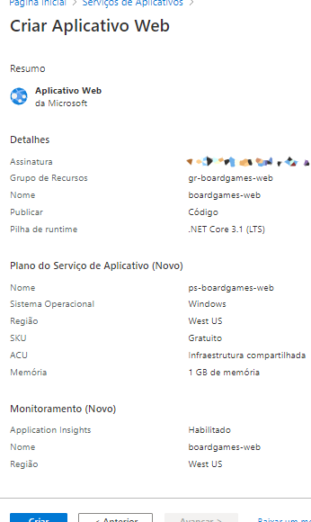

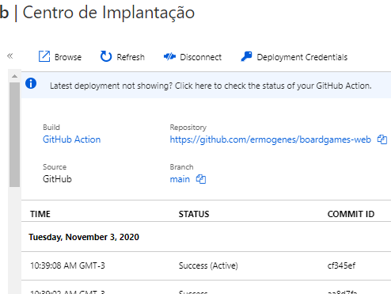


 Você deve ser capaz de acessar e visualizar as páginas do _frontend_, porém os _fetchs_ estarão recebendo um erro `500`, já que ainda não temos um banco de dados e a aplicação não conhece a _string de conexão_ a utilizar.

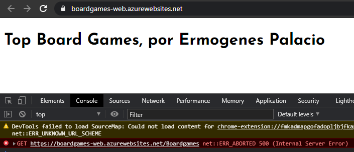

## Provisionando o servidor de banco de dados

Vamos agora implantar o banco de dados. Provisione um servidor usando a opção _Servidores de Banco de Dados do Azure para MySQL_.

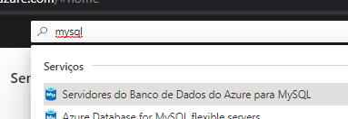

Clique em _Adicionar_. Escolha _Servidor individual_.

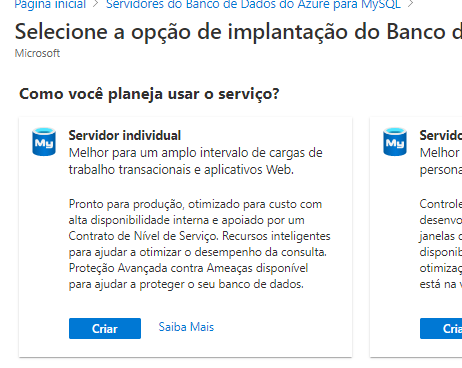

Faça as configurações do seu servidor. Para personalizar os núcleos e o armazenamento, clique em _Configurar servidor_.

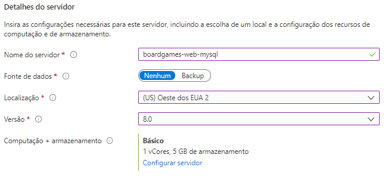

Escolha as configurações desejadas. Para esse exemplo, deixe tudo no mínimo.

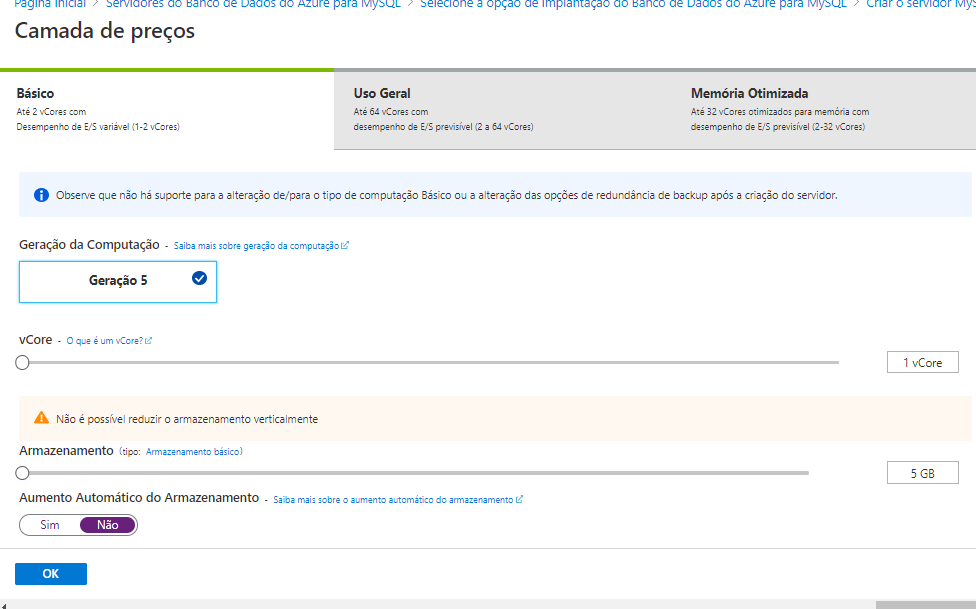

Voltando à tela anterior, defina um usuário e uma senha para o seu banco de produção. _Atenção, pois essas credenciais devem ser mantidas seguras!_

Revise e crie seu recurso.

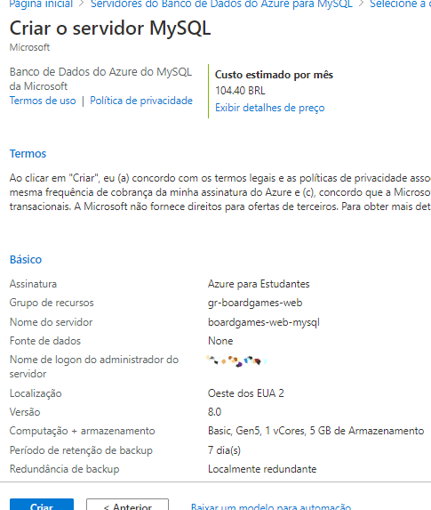

Acesse o recurso para obter o nome do servidor e o nome de logon. Juntamente com a senha, eles serão necessários para se conectar e executar os _scripts_ DDL para criar a estrutura.

Suas credenciais de acesso deverão ter um formato parecido com esses:

- Nome do servidor: `<nome do seu banco de dados>.mysql.database.azure.com`
- Nome de logon: `<nome do seu usuário>@<nome do seu banco de dados>`
- Senha: `<sua senha definida no passo anterior>`

Mantenha esses dados à mão, e seguros.

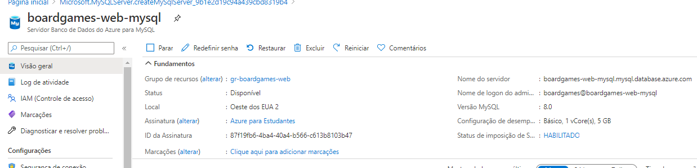

## Criando a estrutura do banco

Não adianta tentar conectar ao seu banco de dados nesse momento, já que não há nenhum acesso liberado no seu _firewall_, por padrão. Vamos liberar temporariamente o acesso à seu computador.

Na página do recurso, clique em _Segurança de conexão_.

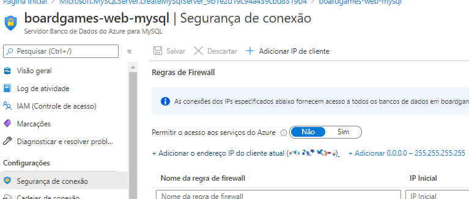

Essa tela indica quais IPs podem enviar tráfego de rede para o servidor. Clique na opção _Adicionar o endereço IP do cliente atual_ e clique em _Salvar_. Seu computador estará autorizado a acessar o servidor. Vamos criar a estrutura e depois retirar a autorização, portanto mantenha essa tela aberta.

Abra o MySQL Workbench e crie uma conexão usando as credenciais criadas acima:

- Hostname: use o _Nome do servidor_
- Username: use o _Nome de logon_
- Password: use a sua senha

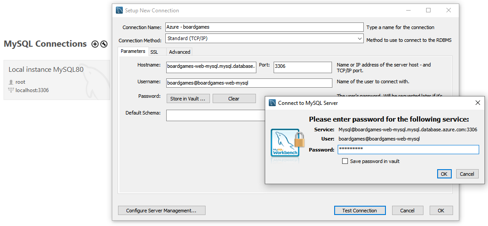

Abra e execute o _script_ de [criação do banco](https://github.com/ermogenes/boardgames-mysql). Verifique se o banco foi criado normalmente, e se os dados da carga inicial estão acessíveis.

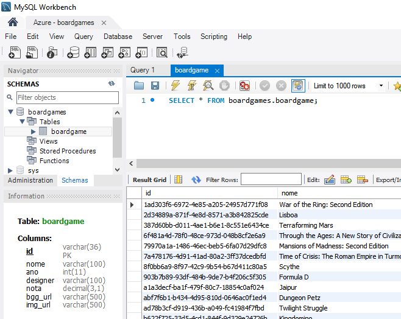

Estando tudo correto, revogue o acesso à sua máquina no _firewall_ do servidor clicando no ícone de lixeira e depois em _Salvar_.

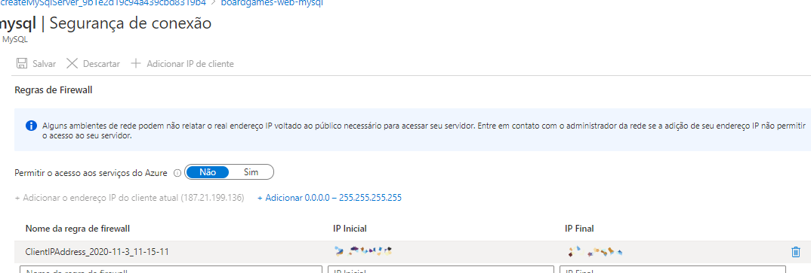

🐱‍👤 _Sempre revogue acessos desnecessários. Isso torna sua aplicação mais segura. Quando for necessário, recrie a permissão._

## Liberando o acesso à aplicação

Ainda na tela de _Segurança de conexão_, vamos autorizar os IPs da nossa aplicação a acessar o servidor de banco de dados. Faça isso clicando em _Permitir acesso aos serviços do Azure_ e depois em _Salvar_.

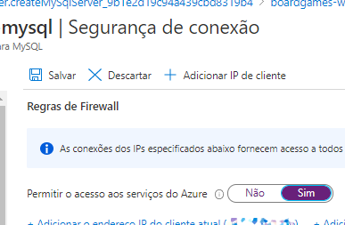

## Adicionado a _string de conexão_ na aplicação

Vamos adicionar a referência ao banco no nosso servidor de aplicação. Essa configuração fará no Azure, em produção, o mesmo papel que o arquivo `appsettings.development.json` tem em seu ambiente local.

Volte ao recurso do _Serviço de Aplicativo_ e selecione a opção _Configuração_.

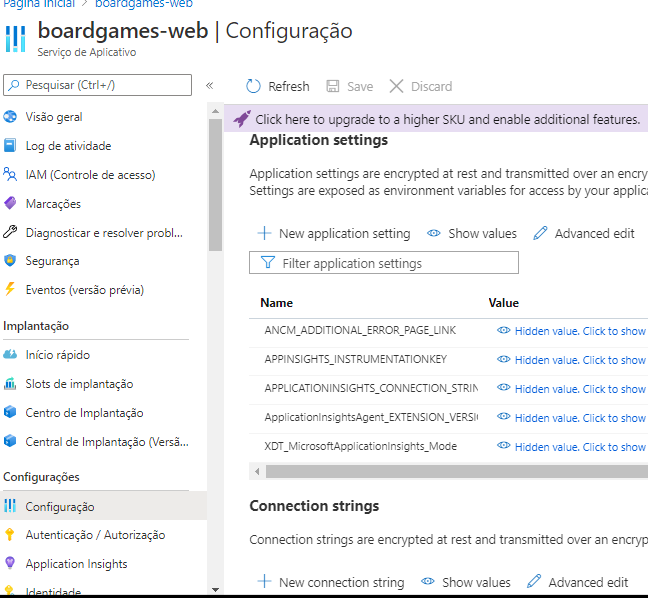

Clique em _New Connection String_ e faça as seguinte configurações:

- Name: `<nome da string de conexão>`, sendo o mesmo nome contido em `appsettings.json`, na sessão `ConnectionStrings`. Nesse exemplo, `boardgamesConnection`.
- Value: `<string de conexão>`, a ser criada de acordo com os dados de produção, no mesmo formato da local. _(a)_
- Type: `MySQL`

_(a)_ Use os mesmos dados usados para conectar no MySQL Workbench, no padrão da conexão local. Você deve ter algo do tipo:

- Formato esperado: `server=<Nome do servidor no Azure>;port=3306;user=<Nome de logon>;password=<Sua senha>;database=<nome do seu banco de dados>`
- _String de conexão_ para esse exemplo: `server=boardgames-web-mysql.mysql.database.azure.com;port=3306;user=boardgames@boardgames-web-mysql;password=<senha real de produção>;database=boardgames`

Clique em _Ok_ e depois em _Save_ e _Continue_.

Sua aplicação deve estar funcional agora!

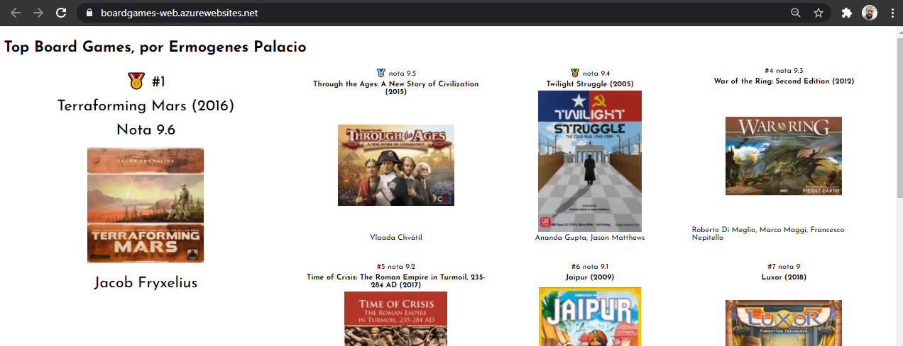

## Ativando o _log_ para investigar erros

Caso não esteja tudo certo, precisaremos verificar os _logs_ de erro, exatamente como vemos no terminal integrado do VsCode. Isso não fica habilitado por padrão, e deve ser desabilitado quando não estiver mais em uso, já que consome espaço do seu armazenamento.

No recurso do _Serviço de Aplicativo_, acesse a opção _Logs do Serviço de Aplicativo_. Ative o _Log de servidor Web_ usando o sistema de arquivos, com cota mínima (25 MB) e o menor tempo de retenção possível (1 dia -- _deixar em branco significa manter indefinidamente!_). Ative também as mensagens de erro detalhadas e o rastreio de falhas de solicitação. Clique em _Salvar_.

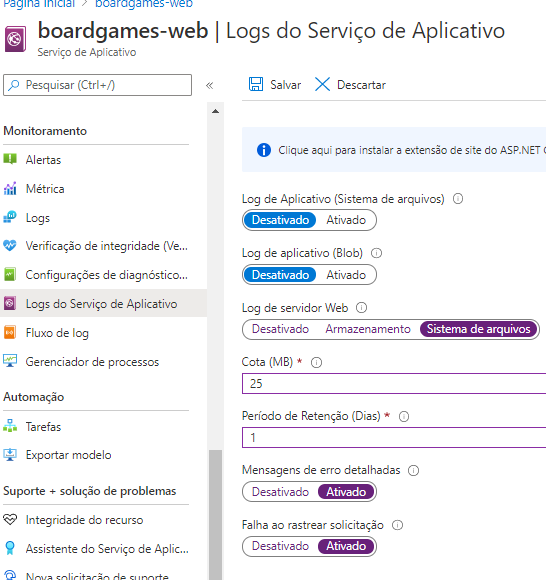

Para visualizar vá em _Fluxo de log_ e selecione a opção _Web Server logs_. A cada acesso a uma URL da aplicação uma entrada de log será gerada. Analise os _logs_ para encontrar os seus problemas, assim como você faria no terminal.

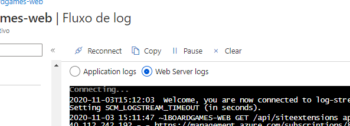

Não esqueça de desligar os _logs_ após o uso.