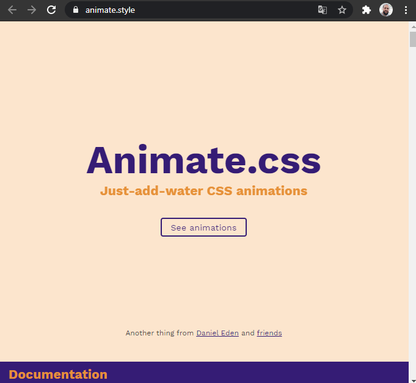
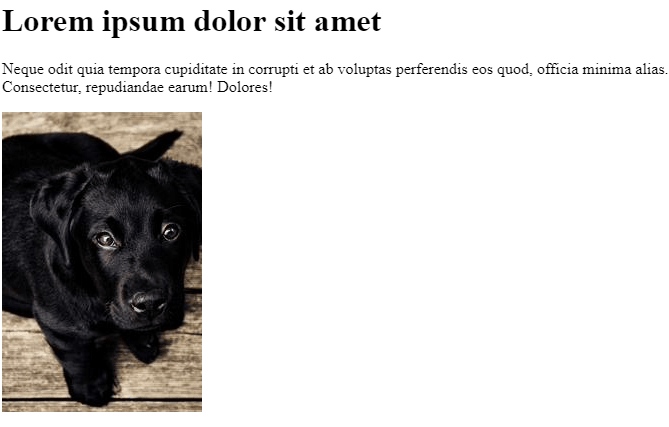
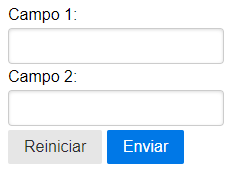

# Bibliotecas CSS e CDN

[📽 Veja esta vídeo-aula no Youtube](#) _Em breve..._

São coleções de funcionalidades pré-configuradas de terceiros disponíveis para uso em seus projetos.

Cada biblioteca tem a sua estratégia para incorporação no projeto, sendo geralmente possível fazer _download_ dos arquivos necessários mas normalmente o mais adequado é fazer referência a um arquivo hospedado externamente.

## CDN (Content Delivery Network)

São serviços de entrega de arquivos que usam estratégias adequadas para reduzir o tráfego na rede de arquivos que serão baixados pelo usuário em diferentes sites, permitindo o seu reaproveitamento.

Neste curso vamos utilizar majoritariamente o [cdnjs](https://cdnjs.com/), da Cloudflare.

Você pode procurar por uma biblioteca específica, e copiar a tag `link` adequada para adicionar em seu `head`.


Vamos conhecer abaixo algumas bibliotecas CSS notáveis.

---

## Font Awesome 

Coleção de ícones gratuitos.

- Site: [https://fontawesome.com/](https://fontawesome.com/)
- CDNs: [cdnjs](https://cdnjs.com/libraries/font-awesome), [oficial (necessita de registro)](https://fontawesome.com/start)

**Exemplo de referência usando CDN**

```html
<link rel="stylesheet" href="https://cdnjs.cloudflare.com/ajax/libs/font-awesome/5.14.0/css/all.min.css" integrity="sha512-1PKOgIY59xJ8Co8+NE6FZ+LOAZKjy+KY8iq0G4B3CyeY6wYHN3yt9PW0XpSriVlkMXe40PTKnXrLnZ9+fkDaog==" crossorigin="anonymous" />
```

**Uso**

Procure por um [ícone gratuito](https://fontawesome.com/icons?d=gallery&m=free), por exemplo, o ícone `thumbs-up` regular, disponível [aqui](https://fontawesome.com/icons/thumbs-up?style=regular).

Clique em "Copy HTML" e cole em sua página, no local desejado.

Os ícones são sempre elementos em linha, pois estão contidos em _tags_ `i`.


**Dicas**

* Os ícones respeitam o tamanho da fonte atual. Adicione uma das classes `fa-2x` a `fa-10x` para aumentar o tamanho relativo.
* Use `fa-rotate-90`,  `fa-rotate-180` e  `fa-rotate-270` para rotacionar os ícones, ou `fa-flip-horizontal` e `fa-flip-vertical` para espelhar.
* `fa-spin` faz o ícone girar, e funcionam especialmente bem para os ícones [desta categoria](https://fontawesome.com/icons?d=gallery&c=spinners&m=free).

**Exemplos**

```html
<i class="far fa-thumbs-up"></i>
<i class="fas fa-camera fa-5x"></i>
<i class="fas fa-snowboarding fa-rotate-270"></i>
<i class="fas fa-spinner fa-pulse"></i>
```


---

## Animate.css

Coleção de animações complexas.

- Site: [https://animate.style/](https://animate.style/)
- CDNs: [cdnjs](https://cdnjs.com/libraries/animate.css)

**Exemplo de referência usando CDN**

```html
<link rel="stylesheet" href="https://cdnjs.cloudflare.com/ajax/libs/animate.css/4.1.1/animate.min.css" integrity="sha512-c42qTSw/wPZ3/5LBzD+Bw5f7bSF2oxou6wEb+I/lqeaKV5FDIfMvvRp772y4jcJLKuGUOpbJMdg/BTl50fJYAw==" crossorigin="anonymous" />
```

**Uso**

Escolha uma elemento em nível de bloco e atribua a classe `animate__animated`, além de uma das classes de animação engtre as disponíveis no _site oficial_ (https://animate.style/).



**Exemplos**

```html
<h1 class="animate__animated animate__shakeX">Lorem ipsum dolor sit amet</h1>
<p class="animate__animated animate__zoomIn">Neque odit quia tempora cupiditate in corrupti et ab voluptas perferendis eos quod, officia minima alias. Consectetur, repudiandae earum! Dolores!</p>

```



---

## Normalize.css  

Realiza um CSS _reset_ enquanto aplica alguns estilos para corrigir _bugs_ e normalizar a aperência entre navegadores.

- Site: [http://necolas.github.io/normalize.css/](http://necolas.github.io/normalize.css/)
- CDNs: [cdnjs](https://cdnjs.com/libraries/normalize)

**Exemplo de referência usando CDN**

```html
<link rel="stylesheet" href="https://cdnjs.cloudflare.com/ajax/libs/normalize/8.0.1/normalize.min.css" integrity="sha512-NhSC1YmyruXifcj/KFRWoC561YpHpc5Jtzgvbuzx5VozKpWvQ+4nXhPdFgmx8xqexRcpAglTj9sIBWINXa8x5w==" crossorigin="anonymous" />
```

**Uso**

Nada a fazer além de adicionar a referência.

---

## Pure.css

Um conjunto de estilizações prontas para os mais diversos tipos de componentes, que utiliza como base o _Normalize.css_.

- Site: [https://purecss.io/](https://purecss.io/)
- CDNs: [cdnjs](https://cdnjs.com/libraries/pure)

**Exemplo de referência usando CDN**

```html
<link rel="stylesheet" href="https://cdnjs.cloudflare.com/ajax/libs/pure/2.0.3/pure-min.css" integrity="sha512-FEioxlObRXIskNAQ1/L0byx0SEkfAY+5fO024p9kGEfUQnACGRfCG5Af4bp/7sPNSzKbMtvmcJOWZC7fPX1/FA==" crossorigin="anonymous" />
```

**Uso**

Escolha os componentes desejados na _documentação_ e siga os exemplos dados. 


**Exemplos**

Form com conponentes empilhados, e botão enviar com estilização de destaque.

```html
<form class="pure-form pure-form-stacked">
    <label for="">Campo 1:</label>
    <input type="text" name="" id="">
    <label for="">Campo 2:</label>
    <input type="text" name="" id="">
    <button type="reset" class="pure-button">Reiniciar</button>
    <button type="submit" class="pure-button pure-button-primary">Enviar</button>
</form>
```



---

## Picnic CSS

Estilização padrão para os elementos nativos, e diversos componentes pré-estilizados, que utiliza como base o _Normalize.css_.

- Site: [https://picnicss.com/](https://picnicss.com/)
- CDNs: [cdnjs](https://cdnjs.com/libraries/picnic), [jsDelivr (oficial)](https://www.jsdelivr.com/package/npm/picnic)

**Exemplo de referência usando CDN**

```html
<link rel="stylesheet" href="https://cdnjs.cloudflare.com/ajax/libs/picnic/6.5.3/picnic.min.css" integrity="sha512-FI4iY4Mx7yHWIjRLTYrvg3arft+resTNTgteKZjJQkV2wWJN3uxPw41P9gdB8+FXZiq31eK4+hMOZ1GOislhKA==" crossorigin="anonymous" />
```

**Uso**

Escolha os componentes desejados na _documentação_ e siga os exemplos dados. 


**Exemplos**

```html
<div class="tabs two">
  <input id="tabWeb" type="radio" name="tabsDev" checked>
  <input id="tabCs" type="radio" name="tabsDev">
  <div class="row">
    <div></div>
    <div></div>
  </div>
  <label for="tabWeb"></label>
  <label for="tabCs"></label>
</div>
```


