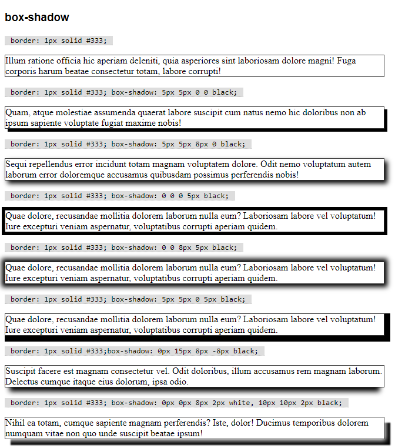
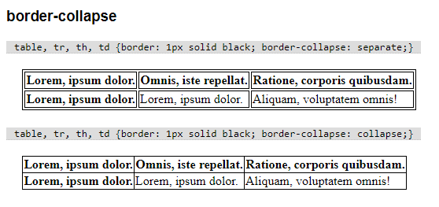

# _Box-model_

Chamamos de _box model_ a forma que o CSS define a caixa retangular que envolve os elementos da página.

Um elemento possui uma medida implícita, que será calculada de acordo com o funcionamento da sua _tag_ e com seu conteúdo. Por exemplo, um parágrafo será exibido em bloco (usando toda a largura disponível) enquanto um link será exibido em linha (usando a largura necessária para o conteúdo e eventualmente quebrando o conteúdo em várias linhas).

Independente disso, cada elemento possui seu conteúdo, bordas, margens (espaçamento externo) e _padding_ (espaçamento interno, ou enchimento).

Por padrão o CSS utiliza um modo chamado `content-box`. Se um elemento possui 100px de largura e eu adiciono 5px de borda de cada lado, as bordas serão desenhadas "para fora", fazendo o elemento utilizar mais 10px de espaço na página. Bordas, _padding_ e margens não alteram o espaço disponível para conteúdo, e sim o tamanho total ocupado pelo elemento.

Quando usamos o modo `border-box` o CSS considera como tamanho do elemento a soma do seu conteúdo, _padding_ e bordas. Nesse sentido, podemos pensar que as bordas e o _padding_ são desenhados "para dentro" (as margens continuam "para fora"). Por exemplo, um elemento de 100px com 5px de borda em cada lado e 2px de _padding_ em cada lado terá 100px de largura mas somente 86px disponíveis para conteúdo.

Podemos mudar o modo do _box model_ usando a propriedade `box-sizing`:
- `box-sizing: border-box`
- `box-sizing: content-box`

---

## Margens e _paddings_

Adicionamos esses espaçamentos indicando as suas medidas. A propriedade `margin` indica a margem (externa à borda) e `padding` indica o enchimento (interno, entre a borda e o conteúdo).

Veja alguns exemplos:

- `margin: 10px 20px 30px 40px` - 10px no topo, depois 20px na direita e assim sucessivamente, em sentido horário.
- `margin: 5px 10px;` - 5px na vertical, 10px na horizontal.
- `margin: 15px;` - 15px em todas as direções.

Podemos também utilizar `margin-top`, `margin-right`, `margin-bottom` e `margin-left` para alterar as medidas individualmente.

Substitua `margin` por `padding` nos exemplos acima.

---

## Bordas

Controla as bordas do elemento.

- `border-width` - largura da borda.
  - `border-width: 1px;` - largura da borda definida em 1px.
- `border-style` - estilo do traço da borda. Algumas opções possíveis são `none`, `dotted`, `dashed`, `solid`, `double`, `groove`, `ridge`, `inset` e `outset`.
  - `border-style: none;` - sem borda.
  - `border-style: solid;` - borda sólida.
  - `border-style: dotted;` - borda pontilhada.
  - `border-style: dashed;` - borda tracejada.
- `border-color` - cor da borda.
- `border-radius` - raio de arredondamento dos cantos da borda.
  - `border-radius: 0;` - sem arredondamento.
  - `border-radius: 5px;` - raio de arredondamento de 5px.
  - `border-radius: 50%;` - raio de arredondamento máximo (vira um círculo ou elipse).

💡 _Use uma imagem quadrada com borda arredondada em 50% para exibí-la em um círculo._

---

## Sombras

Usamos `box-shadow` para adicionar sombras em elementos.

São 5 configurações, na sequência:
- deslocamento horizontal
- deslocamento vertical
- medida do desfoque
- medida de expansão
- cor

Podemos usar diversas configurações separadas por vírgula.

Exemplos:
- `box-shadow: 5px 5px 0 0 black;` - sombra deslocada para baixo e para a direita.
- `box-shadow: 5px 5px 8px 0 black;` - idem, mas com desfoque.
- `box-shadow: 0 0 0 5px black;` - somente expansão, sem deslocamento.
- `box-shadow: 0 0 8px 5px black;` - desfoque e expansão.
- `box-shadow: 5px 5px 0 5px black;` - deslocamento e expansão (na mesma proporção).
- `box-shadow: 0px 15px 8px -8px black;` - deslocamento vertical, desfoque e expansão negativa (redução).
- `box-shadow: 0px 0px 8px 2px white, 10px 10px 2px black;` - duas sombras.

---

## Bordas internas de tabelas

Podemos definir que as bordas de cada um dos elementos de uma tabela, caso coincidam, sejam colapsadas (tornadas uma só). Na prática, células vizinhas não compartilham bordas no modelo `separate`, e compartilham no modelo `collapse`

- `border-collapse: separate` - padrão, bordas individuais para cada célula.
- `border-collapse: collapse` - bordas compartilhadas.

---

Se necessário, consulte a lista completa no [MDN](https://developer.mozilla.org/en-US/docs/Web/CSS/Reference#Keyword_index).
