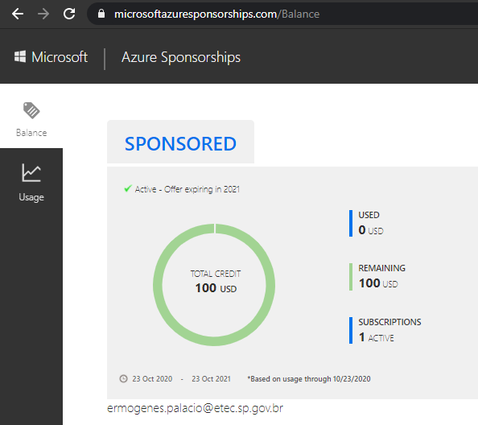

# CI/CD na nuvem com Azure e GitHub Actions

[📽 Veja esta vídeo-aula no Youtube](#) _Em breve..._

Nosso objetivo é publicar nossas aplicações na Internet de forma gratuita (por enquanto). Para o frontend não tínhamos problemas, pois o GitHub permite que isso seja feito facilmente usando o serviço GitHub Pages. Para o backend, porém, precisamos de outro provedor. Existem diversas estratégias, e a escolhida aqui será:

- Serviços em [nuvem](https://pt.wikipedia.org/wiki/Computa%C3%A7%C3%A3o_em_nuvem) pública: [Microsoft Azure](https://azure.microsoft.com/pt-br/)
- Modelo [PaaS](https://pt.wikipedia.org/wiki/Plataforma_como_servi%C3%A7o): [Azure App Services](https://azure.microsoft.com/pt-br/services/app-service/)
- Repositório de código-fonte aberto: [GitHub](https://github.com/)
- Deploy (publicação): CI/CD (integração/entrega contínua) com [GitHub Actions](https://github.com/features/actions)

## Microsoft Azure

Um dos provedores de nuvem mais importantes hoje em dia. Possui uma opção de conta gratuita, que pode ser criada por qualquer um, com US$ 100.00 de crédito válidos por um ano. Os alunos do Centro Paula Souza podem criar sua conta usando o e-mail institucional (@etec.sp.gov.br ou @fatec.sp.gov.br), que terão a vantagem de poder renovar enquanto forem alunos, e não precisarem indicar um cartão de crédito durante o cadastro.

* [📖 Criando conta de estudante no Azure](content/azure-conta-estudante.md)

Se você não tem ideia do que é computação em nuvem comece estudando [esses materiais introdutórios](https://docs.microsoft.com/pt-br/learn/modules/principles-cloud-computing/) no Microsoft Learn (aproximadamente 1h de duração, com textos/legendas em português).

Usaremos esta conta para criar nossa infraestrutura e hospedar nossa aplicação.

## Preparando a aplicação

Precisamos de uma aplicação. Seu código ficará publicado no GitHub, mas rodará no Azure. O GitHub Actions ficará responsável por, a cada _commit_ no _branch_ `main`, executar a publicação automaticamente no ambiente do Azure. Chamamos esse processo de Integração Contínua.

Crie uma aplicação do tipo `webapi`, hospedada no GitHub. Nessa aplicação, vamos fazer algumas configurações:

- **Desabilitar o redirecionamento HTTPS**, pois tanto o Azure quanto o GitHub entregam nossos arquivos nesse tipo de conexão. Para isso, comente a linha `app.UseHttpsRedirection()` em `Startup.cs`.

- **Configurar o CORS** conforme a necessidade. Temos 3 cenários:
  - Aplicação com frontend e backend no mesmo servidor: manter a configuração padrão, com CORS desabilitado.
  - Aplicação com frontend e backend em servidores diferentes: habilitar CORS para o servidor origem do frontend.
  - Aplicação backend com API pública: habilitar CORS para todas as origens.

### Configurações de CORS

As configurações de CORS são feitas em `Startup.cs`, no métodos `ConfigureServices` e `Configure`.

Para ativar o CORS, no método `Configure` adicione:

```cs
// ...
    app.UseRouting();       // exatamente após Routing
    app.UseCors();          // adicione essa linha
    app.UseAuthorization(); // exatamente antes de Authorization
// ...
```

Para configurar as origens permitidas, altere o método `ConfigureServices`:

```cs
// ...
    // adicione as próximas linhas
    services.AddCors(options =>
    {
        options.AddDefaultPolicy(
            builder =>
            {
                builder.WithOrigins(
                    "http://origem-autorizada-1.com",
                    "https://www.origem-autorizada-2.com"
                    // ... quantas forem necessárias
                );
            });
    });

    services.AddControllers(); // exatamente antes dessa linha
// ...
```

Ou então, permita todos os tipos de requisições externas:

```cs
// ...
    // adicione as próximas linhas
    services.AddCors(options =>
    {
        options.AddDefaultPolicy(
            builder =>
            {
                builder
                    .AllowAnyOrigin()
                    .AllowAnyMethod()
                    .AllowAnyHeader();
            });
    });

    services.AddControllers(); // exatamente antes dessa linha
// ...
```

## Criando o servidor em nuvem usando PaaS
 
Vamos utilizar o serviço PaaS chamado Serviços de Aplicativo (_App Services_) que nos entrega uma plataforma pronta para hospedagem de aplicações, sem que nos preocupemos com a instalação e licenciamento do sistema operacional, configuração de rede e afins.

### Simulação de custos

Vamos simular os custos utilizando a [Calculadora de preço](https://azure.microsoft.com/pt-br/pricing/calculator/) do Azure.


Selecione _Serviço de Aplicativo_, e role a tela até encontrar o simulador.


Vamos alterar as configurações de forma a conseguir um servidor gratuito.

Como os preços podem variar, no meu caso a configuração escolhida foi:

- Região: `West US`
- Sistema operacional: `Windows`
- Camada: `Gratuito`
- Instância: `F1`

Escolha o que melhor te atender, sempre se atentando aos custos. Para esse curso, use sempre os planos gratuitos.


Com as configurações e custos já simulados, anote as configurações e vamos criar a infraestrutura em nuvem equivalente.

### Criação dos recursos

Estando logado no [Portal do Azure](https://portal.azure.com/), crie um recurso do tipo _Serviços de Aplicativos_.


_💡 Crie um grupo de recursos para cada conjunto que compartilhe o mesmo ciclo de vida, pois ao excluir o grupo, tudo é excluído junto. Isso facilita a gestão de recursos que você não vai mais usar no futuro._

Para este exemplo, vou chamar o grupo de recursos de `GrupoRecursoExemploAzure01`.


Crie sua instância com o _runtime_ `.NET Core 3.1 (LTS)`, com a configuração simulada na calculadora. Isso indica ao Azure que você executará uma aplicação .NET Core.


Clique em _Revisar + criar_. Revise e clique em _Criar_. Aguarde a finalização e clique em _Ir para o recurso_.


Você já terá acesso ao URL final, que não possui nada pois ainda não foi feita a publicação da sua aplicação. Neste exemplo, a URL é [https://testepublicacaoazure.azurewebsites.net](https://testepublicacaoazure.azurewebsites.net).


### Configurando a publicação

Vamos indicar ao Azure a forma de implantação da nossa aplicação. Temos que indicar o repositório de código-fonte e solicitar que ele se integre ao GitHub e crie o código para publicação automática via GitHub Actions.

Clique em _Centro de Implantação_, e depois em _GitHub_.


Em seguida, clique em _Authorize_, e na janela que se abrirá, em _Authorize ..._.


Clique em _Continue_. Selecione _GitHub Actions_ e depois _Continue_.


Escolha seu repositório e indique a configuração de execução .NET Core. Clique em _Continue_.


Você verá seu _script_ de implantação do GitHub Actions. Ele será executado automaticamente a cada novo _push_ que altere o _branch_ _main_ no repositório do GitHub. Clique em _Finish_.


Sua aplicação estará funcionando sempre que o fluxo de implantação for finalizado.

## Disponibilidade

No plano gratuito sua aplicação ficará offline até que seja acionada, ligada para atender, e desligada após ficar inativa. Para mantê-la online todo o tempo, será necessário gastar seus créditos. Para esse curso, isso não será necessário.

## Excluindo a aplicação

Quando não for mais necessária, exclua os recursos clicando em _Excluir_ na página do recurso, ou no grupo de recursos como um todo. Recursos excluídos não consumirão mais créditos.

## Verificando seus créditos disponíveis

Estando logado, você pode visualizar seus créditos disponíveis (_check balance_) e detalhes de uso (_usage details_) em [_Azure Sponsorships_](https://www.microsoftazuresponsorships.com/).



