# DOM - _Document Object Model_

[📽 Veja esta vídeo-aula no Youtube](https://youtu.be/7mLX9WKf1Ow)

## Ambiente de execução JavaScript

Códigos JavaScript são executados em um ambiente como um navegador (Chrome, Firefox), um servidor (Node, Deno) ou qualquer outro tipo de plataforma.

Quando executado em um navegador, é criada uma estrutura de objetos chamada BOM (_Browser Object Model_) que pode ser manipulada livremente. O objeto `window` é a raiz dessa estrutura, e contém informações sobre a janela e métodos para sua manipulação. É também o _container_ para todos os objetos globais criados pela aplicação.

Contém, entre outras coisas, os objetos:

- `console`, que provê acesso ao console do navegador. Ex.:
  - `console.log(x)` exibe algo no console.
  - `console.dir(x)` permite navegar pelas propriedades de um objeto no console.
- `history`, que provê acesso ao histórico do navegador. Ex.:
  - `history.back()` volta para a entrada anterior no histórico ("_voltar_").
- `location`, que provê informações sobre a localização (URL) atual. Ex.:
  - `location.href` contém a URL atual, e pode ser alterado para navegar (ex.: `location.href = "https://github.com/ermogenes/aulas-programacao-web"`).
  - `location.reload()` recarrega a página atual.
- `navigator`, que provê acesso a recursos do agente de usuário. Ex.:
  - `navigator.onLine` indica o navegador está _online_ ou _offline_.
  - `navigator.language` indica a linguagem atual do navegador.
  - `navigator.platform` indica a plataforma atual onde a página está aberta.
  - `navigator.userAgent` indica o agente de usuário atual.
- `screen`, que provê informações sobre a tela do usuário. Ex.:
  - `screen.width` e `screen.height` indicam o tamanho do tela atual do usuário (total).
- `document`, que contém o documento atual, seguindo o modelo DOM.

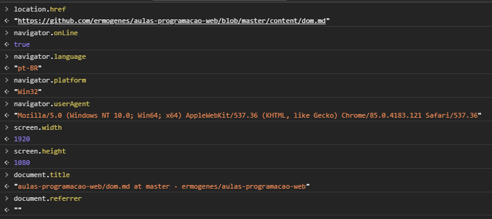

# DOM - _Document Object Model_

É o nome dado à estrutura de objetos [padronizada pelo WHATWG](https://dom.spec.whatwg.org/) como ponto de acesso a todo o conteúdo do documento. O seu objeto raiz é `document`.

- `document.title` contém o título da página atual (definido pela _tag_ `title`).
- `document.referrer` contém o URL da página que continha o _link_ para a página atual (ou `""` se a origem foi a digitação do endereço ou o uso de um Favorito).

Em `document` existe todo o conteúdo do documento HTML de origem, incluíndo textos dentro e fora de _tags_, comentários e _scripts_, todos eles chamados de **nós (_nodes_)**.

Você pode visualizar os nós de um documento nas ferramentas de desenvolvedor, aba _Elements_:

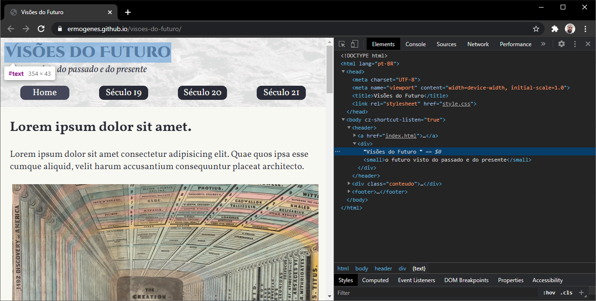

🍌 As ferramentas de desenvolvedor do navegador ocultam nós que só contenham espaços e/ou quebras de linha (por simplicidade), mas eles existem no DOM.

Para garantir a integridade do DOM algumas autocorreções são feitas:

- Nós `html` e `body` (e `tbody`) são criadas caso não existam;
- Espaços e quebras de linha antes de `head` são ignorados;
- Todo conteúdo após `body` é movido para dentro.

Tudo no DOM são nós. Cada nó possui um tipo, quase sempre baseado na _tag_ utilizada para declará-la. Eles seguem a seguinte hierarquia de classes:

* `Object`: classe base do JavaScript.
  * `EventTarget`: classe base abstrata, para suporte a eventos.
    * `Node`: classe base abstrata com os _getters_ de navegação.
      * `Text`: nós de texto.
      * `Comment`: nós de comentário.
      * `Element`: elementos do DOM, com implementações da navegação.
        * `SVGElement`: _tags_ SVG.
        * `XMLElement`: _tags_ XML.
        * `HTMLElement`: _tags_ HTML.
          * `HTMLBodyElement`: _tag_ `body`.
          * `HTMLInputElement`: _tag_ `input`.
          * `HTMLAnchorElement`: _tag_ `a`.
          * ...
      * ...

Os principais tipos de nós são:

- **Documento**: nó raiz (`nodeName: #document`);
- **Elemento**: nós contendo as _tags_ do documento, cada uma com sua funcionalidade específica (`nodeName` com o nome de cada elemento);
- **Texto**: nós de conteúdo textual (`nodeName: #text`);
- **Comentário**: nós contendo os comentários do documento (que podem ser processados)  (`nodeName: #comment`).

Em relação à sua posição na árvore, chamamos de:

- **filhos** (_children_), todos os nós diretamente dentro de um elemento, incluíndo textos e comentários;
- **descendentes** (_descendants_), todos os nós e os filhos de seus nós, até o final da árvore;
- **pai** (_parent_), o elemento diretamente acima na árvore;
- **ancestrais** (_ancestors_), os nós na mesma cadeia de pais;
- **irmãos** (_siblings_), os nós com o mesmo pai.

## Obtendo elementos do DOM

Alguns elementos possuem acesso direto. Por exemplo:

- `document.documentElement`: a _tag_ `html`.
- `document.head`: a _tag_ `head`.
- `document.body`: a _tag_ `body`, ou `null` se chamado dentro de `head` (_pois ainda não foi lido pelo navegador_).

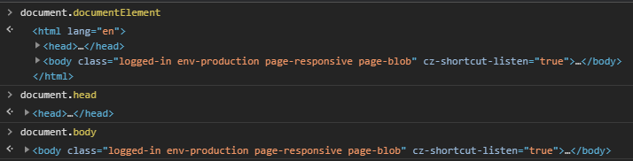

🍌 É criada automaticamente uma variável global para cada elemento com o atributo `id`, com o nome equivalente. **Seu uso não é recomendado** pois se outra variável for criada com o mesmo nome ela possui precedência.

Há alguns auxiliares específicos para tabelas:

- `<table>` possui `rows`, `caption`, `tHead`, `tFoot` e `tBodies`;
- `<thead>`, `tfoot` e `tbody` possuem `rows`;
- `tr` possui `cells` (`<td>`'s e `<th>`'s), `rowIndex` (em relação à tabela) e `sectionRowIndex` (em relação ao à seção);
- `<td>`'s e `<th>`'s possuem `cellIndex` (em relação ao `<tr>` pai).

De maneira geral, para acessar os um nó específico precisamos navegar pela árvore do DOM ou realizar uma busca.

## `NodeList` e `HTMLCollection`

No DOM há dois tipos principais de coleções de nós. Elas podem ser **estáticas** (não reflete o estado atual do momento do acesso, mas do momento da criação da lista) ou **vivas** (reflete o estado atual do momento do acesso, não do momento da criação da lista).

- `NodeList` é um arranjo, portanto possui `.forEach` e todos os demais métodos como qualquer arranjo. Pode ser estática ou viva. Ex.:
  - `childNodes`, viva
  - `querySelectorAll`, estática
- `HTMLCollection` é um _array-like_/_iterable_. Sempre é viva. Permite acessar os itens usando `[índice]` e iterar com `for..of`. Para converter para arranjo, use `Array.from()`. Ex.:
  - `children`
  - `getElementsByClassName`
  - `getElementsByTagName`

## Navegando pela estrutura do DOM

Todos os nós permitem navegação, usando as propriedades/métodos abaixo. _Atente-se ao fato de que todos eles são somente-para-leitura._

Todos os nós | Somente elementos | Descrição
--- | --- | ---
`childNodes` | `children` | coleção com todos os filhos (`childNodes` é um `NodeList` e `children` é um `HTMLCollection`)
`childNodes[n]` | `children[n]` |  _n_-ésimo filho
`firstChild` | `firstElementChild` | primeiro filho
`lastChild` | `lastElementChild` | último filho
`parentNode` | `parentElement` | o pai (`document.documentElement.parentNode === document` mas `document.documentElement.parentElement === null`)
`nextSibling` | `previousElementSibling` | o próximo irmão
`previousSibling` | `nextElementSibling` | o irmão anterior

Use:

- `hasChildNodes()` para saber se o nó possui filhos.
- `length` para obter o número de elementos em uma lista.

Ex.:

```html
<!DOCTYPE html>
<html lang="pt-BR">
  <head>
    <meta charset="UTF-8" />
    <meta name="viewport" content="width=device-width, initial-scale=1.0" />
    <title>DOM</title>
  </head>
  <body>
    <h1>Aprendendo DOM</h1>
    <ul>
      <li>BOM</li>
      <li>Elementos</li>
      <li>Eventos</li>
    </ul>
    <p>Muito obrigado!</p>
  </body>
</html>
```

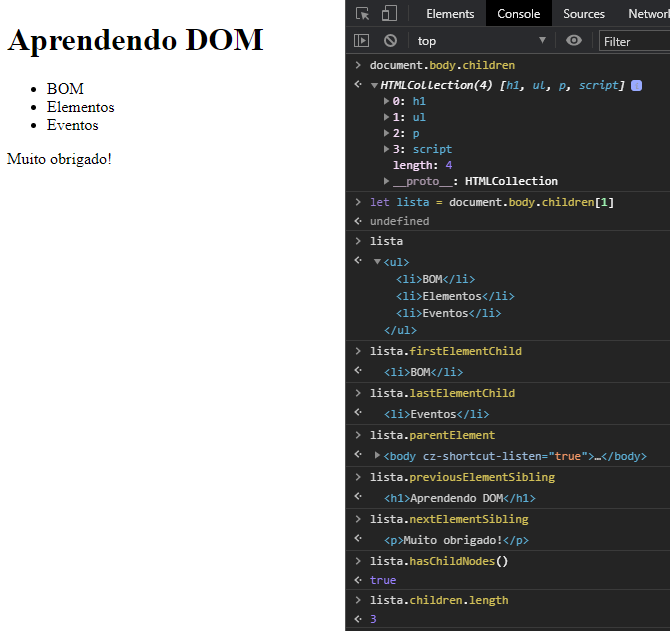

## Obtendo um elemento usando o atributo `id`

Use `document.getElementById('meuIdUnico')` para obter o elemento de `id` igual a `meuIdUnico`, não importa em que parte do documento.

```html
  <body>
    <h1 id="titulo">Aprendendo DOM</h1>
    <div>
      <p>Este parágrafo não está identificado.</p>
      <p id="meuParagrafo">Este parágrafo está identificado.</p>
    </div>
  </body>
```

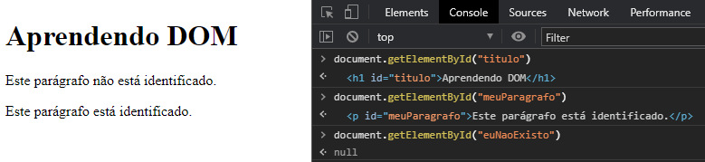

🍌 Se um `id` não é único, todas as técnicas de obtenção por `id` se tornam imprevisíveis.

## Obtendo elementos usando seletores CSS

Em CSS você pode referenciar qualquer elemento ou conjunto de elementos utilizando os seletores. Podemos aproveitar esse conhecimento para obter elementos a partir de um elemento pai:

- `elem.querySelectorAll(cssSelector)` obtém uma coleção **estática** (`NodeList`) dos elementos dentro de `elem` que atendem `cssSelector`;
- `elem.querySelector(cssSelector)` obtém o primeiro elemento dentro de `elem` que atende `cssSelector`;
- `elem.matches(cssSelector)` verifica se `elem` atende `cssSelector`;
- `elem.contains(outroElem)` verifica se `outroElem` é descendente de `elem`;
- `elem.closest(cssSelector)` obtém o ancestral mais próximo de `elem` que atende `cssSelector` (incluíndo possivelmente `elem`).

Qualquer seletor CSS pode ser utilizado com esses métodos.

```html
  <body>
    <h1 id="titulo">Aprendendo DOM</h1>
    <div>
      <p class="tipo1">Lorem ipsum dolor sit amet.</p>
      <p>Fugiat, natus. Culpa, modi porro.</p>
      <p id="diferente">Temporibus eligendi consequuntur id suscipit!</p>
      <p class="tipo2">Ut reiciendis ullam cumque ea.</p>
      <p class="tipo1 tipo2">Odit nobis doloremque quisquam ipsum.</p>
    </div>
  </body>
```

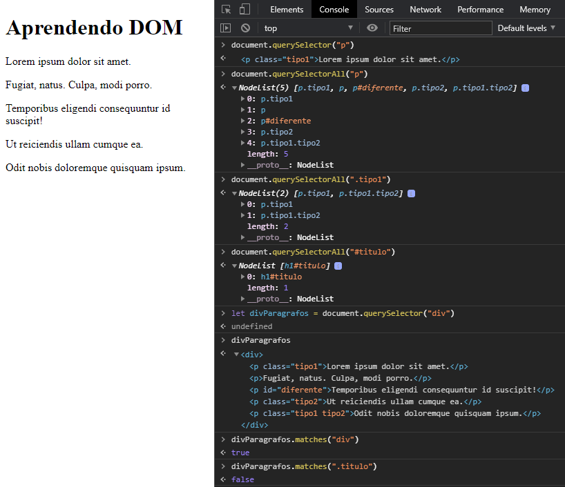

## Outros métodos para obtenção de elementos

Os métodos da família `getElement` também permitem encontrar elementos no documento, porém são mais complexos e portanto menos utilizados que os baseados em seletores. Geralmente são encontrados em _scripts_ mais antigos.

_Na prática, use `document.getElementById(id)` e evite os demais._

Métodos no singular (`getElement_`) retornam o primeiro elemento, e no plural (`getElements_`) uma com todos os elementos (geralmente `HTMLCollection`, mas alguns navegadores antigos podem retornar um `NodeList` vivo).

- `document.getElementById(id)` já estudado acima;
- `elem.getElementsByTagName(tag)` obtém elementos pela _tag_ (`"*"` para qualquer _tag_);
- `elem.getElementsByClassName(class)` obtém elementos que contenham a classe indicada;
- `document.getElementsByName(name)` obtém elementos (em todo o documento) pelo atributo `name`.

## Conteúdo de elementos

Podemos obter e alterar o conteúdo de um elemento usando `innerHTML` (conteúdo e de seus descendentes) e `outerHTML` (incluindo também a si próprio).

* Os valores retornados e gravados são strings.
* Em uma gravação, o antigo elemento é removido e o novo gravado (recarregando imagens, perdendo seleção em campos de texto, etc.).
* O navegador processa a autocorreção.
* Os `scripts` não são executados.

Para obter somente o texto, sem as _tags_, use `textContent`. Gravar usando essa propriedade garante que nenhuma _tag_ será injetada.

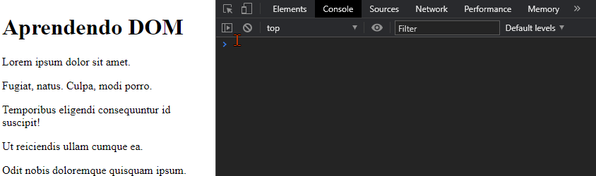

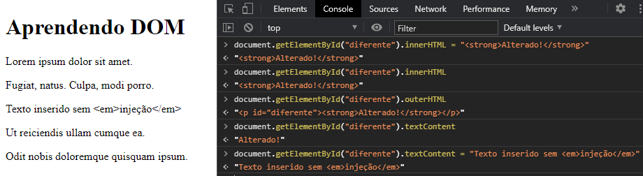

🍌 Nós de texto ou comentários não possuem HTML, portanto use `data`.

🍌🍌 Para obter o valor alterável pelo usuário em elementos de formulário, use `value`.

## Manipulando atributos

Nos elementos são criadas propriedades automaticamente para atributos existentes na especificação HTML. Também podemos usar os seguintes métodos:

- `elem.hasAttribute(attr)` indica se `attr` existe em `elem`.
- `elem.getAttribute(attr)` retorna o valor de `attr` em `elem`.
- `elem.setAttribute(attr, valor)` altera o valor de `attr` em `elem`.
- `elem.removeAttribute(attr)` remove `attr` de `elem`.

Podemos iterar os atributos de um elemento `elem` usando a coleção `elem.attributes`. Cada item da coleção possui `name` (com seu nome) e `value` (com seu valor).

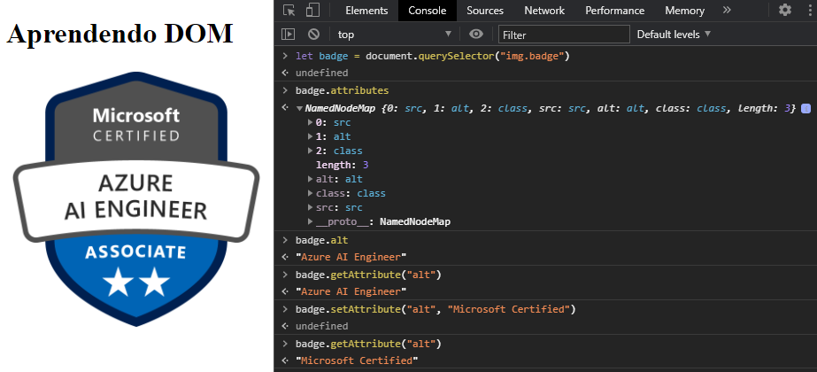

Os atributos padronizados (que fazem parte da especificação do HTML) possuem sempre um propriedade automática. Ao usar atributos não padronizados, prefira nomeá-los usando o prefixo `data-`, pois o seu HTML continuará válido. Os atributos `data-*` estarão disponíveis em `elem.dataset`.

```html
  <body>
    <h1 id="titulo">Aprendendo DOM</h1>
    <p>Linguagens aprendidas:</p>
    <ul id="linguagens">
      <li data-componente="PC1">C#</li>
      <li data-componente="PC2">HTML</li>
      <li data-componente="PC2">CSS</li>
      <li data-componente="PC2">JavaScript</li>
    </ul>
  </body>
```

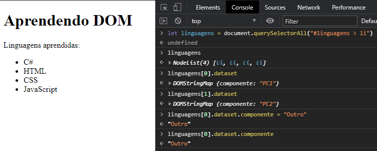

### Atributo `hidden`

O atributo `hidden` possui a mesma especificação de `style=display:none`. Quando `true`, o elemento não será visível.

Ex:

```html
<div id="elem">Elemento piscante</div>
<script>
  setInterval(() => elem.hidden = !elem.hidden, 1000);
</script>
```

## Manipulando estilos

Para controlar as características visuais dos elementos podemos utilizar os estilos CSS via JavaScript. Há duas maneiras:

- adicionando e removendo classes (preferível);
- usando propriedades do objeto equivalentes às propriedades CSS.

### Estilos com classes

Podemos acessar o conteúdo do atributo `class` usando `elem.className`. Ele contém todas as classes, como uma string, assim como no atributo HTML.

A propriedade `elem.classList` contém uma coleção (um _array-like_, iterável com `for...of` ou `.forEach`) cujos itens são strings das classes aplicadas ao elemento. Ela também possui métodos facilitadores:

- `add("classe")` adiciona `"classe"`;
- `remove("classe")` remove `"classe"`;
- `toggle("classe")` adiciona/remove `"classe"`, alternando conforme o caso;
- `contains("classe")` verifica se `"classe"` existe em `classList`.

```html
<!DOCTYPE html>
<html lang="pt-BR">
  <head>
    <meta charset="UTF-8" />
    <meta name="viewport" content="width=device-width, initial-scale=1.0" />
    <title>DOM</title>
    <style>
      .negrito {
        font-weight: bold;
      }
      .vermelho {
        color: red;
      }
      .verde {
        color: green;
      }
    </style>
  </head>
  <body>
    <h1 id="titulo">Aprendendo DOM</h1>
    <p class="vermelho">Lorem ipsum dolor sit amet.</p>
    <p class="negrito">Deleniti rem aperiam quisquam! Veniam?</p>
    <p id="semEstilizacao">Officiis cumque unde vel distinctio!</p>
    <p class="verde">Minus deserunt tenetur amet ratione.</p>
    <p class="vermelho negrito">Necessitatibus rerum ut recusandae. Impedit.</p>
  </body>
</html>
```

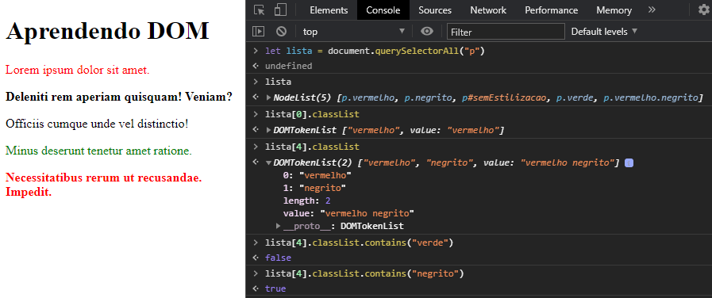

A técnica é definir um estilo padrão e criar estilos adicionais vinculados à classes. Adicione ou retire essas classes usando JavaScript.

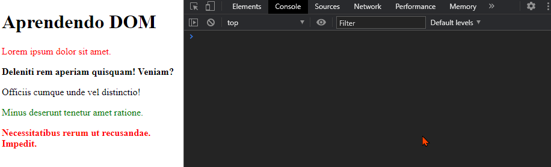

### Estilos com as propriedades `style`

Os elementos possuem uma propriedade `style` que por sua vez possui propriedades pré-definidas equivalentes à propriedades CSS.

Todas as propriedades são nomeadas usando _camelCase_. Onde houver um `-`, o próximo caracter é maiúsculo.

Exemplos:

- `elem.style.backgroundColor` equivale a propriedade CSS `background-color`.
- `elem.style.top` obtém/altera o conteúdo do estilo `top` (use as unidades na string, como em `'20px'`).
- `elem.style.cssText` obtém/altera **todo** o estilo do objeto, na sintaxe CSS (e aceita `!important`).
- `elem.style.display` esconde (gravando `"none"`) ou reexibe o elemento (gravando `""`).

💡 Gravar `""` faz o navegador resetar a propriedade do elemento.

Só deve ser utilizado quando envolver cálculos. Em outra situações, usar a técnica das classes.

### Estilos computados/resolvidos

O valor de `elem.style` reflete o estilo atribuído ao elemento.

Para obter o valor correto considerando toda a cascata de estilos, já resolvido na unidade padrão para os navegadores, use `getComputedStyle(elemento, pseudo)` (`pseudo` é opcional, e pode conter uma pseudoclasse CSS).

🍌 Não use propriedades de atalho, como `margin` ou `padding`, e sim `marginTop` ou `paddingLeft`. Não há padronização entre navegadores.

🍌🍌 O JavaScript não tem acesso à pseudoclasse `:visited`, por privacidade.

## Modificando o documento

Em documentos dinâmicos frequentemente precisaremos incluir/remover nós ou elementos no DOM.

### Criando elementos usando métodos de `document`

Podemos criar elementos usando métodos do objeto `document`.

- `document.createElement(tag)` cria um elemento do tipo adequado para a _tag_ informada;
- `document.createTextNode(texto)` cria um nó de texto.

O elemento pode ser salvo em uma variável e posteriomente inserido no DOM. Para inserir no DOM, escolha um nó base e chame o método adequado passando um ou mais nós a serem inseridos.

- `no.append(novoNo)`, adiciona `novoNo` como último nó dentro de `no`.
- `no.prepend(novoNo)`, adiciona `novoNo` como primeiro nó dentro de `no`.
- `no.before(novoNo)`, adiciona `novoNo` como o último nó antes de `no`.
- `no.after(novoNo)`, adiciona `novoNo` como primeiro nó após `no`.
- `no.replaceWith(novoNo)`, substitui `no` por `novoNo`, na mesma posição.

Podemos passar uma _string_ ao invés de criar o nó. Isso **não** fará o _engine_ processar o texto como HTML criando os elementos necessários, e sim criar um nó de texto.

Os métodos da família `insertAdjacent` possuem uma sintaxe mais simples para inserção de elementos (`insertAdjacentElement`), texto (`insertAdjacentText`) e strings contendo código HTML (`insertAdjacentHTML`).

- `no.insertAdjacentHTML("beforebegin", string)`: na mesma posição de `before`;
- `no.insertAdjacentHTML("afterbegin", string)`: na mesma posição de `prepend`;
- `no.insertAdjacentHTML("beforeend", string)`: na mesma posição de `append`;
- `no.insertAdjacentHTML("afterend", string)`: na mesma posição de `after`.

Ex.:

```html
  <body>
    <h1 id="titulo">Aprendendo DOM</h1>
    <p>Cidades:</p>
    <ul id="cidades"></ul>
  </body>
```

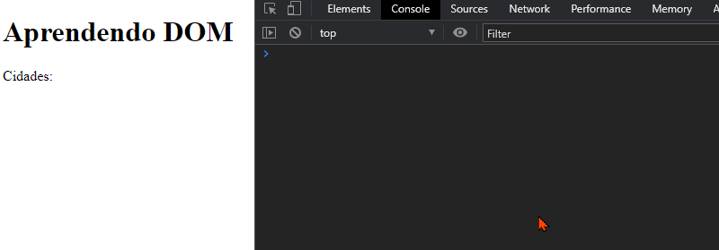

### Removendo um elemento

Use `elem.remove()`.

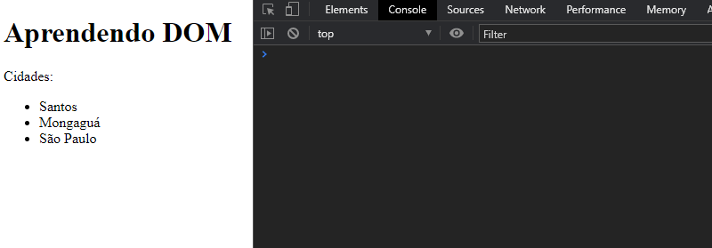

### Clonando elementos

Para criar cópias idênticas de um elemento:

- `elem.cloneNode(false)`: clonagem rasa.
- `elem.cloneNode(true)`: clonagem profunda.

## Eventos

Eventos são sinais de que algo aconteceu. Veja alguns exemplos:

- Mouse:
  - `click`: quando o usuário clica em algum elemento.
  - `mousemove`: quando o ponteiro do mouse é movido.
- Teclado:
  - `keydown`: quando o usuário pressiona uma tecla.
  - `keyup`: quando o usuário solta a tecla.
- Documento:
  - `DOMContentLoaded`: quando o documento foi carregado e o DOM foi construído.

Podemos executar código quando um evente ocorre. Para isso, precisamos de uma função (chamada _handler_ ou manipulador) que será executada a cada vez que o evento ocorrer. Depois, precisamos vincular o _handler_ no evento.

Exemplo: Exibir _Olá_ ao clicar em um botão.

```html
  <body>
    <h1 id="titulo">Aprendendo DOM</h1>
    <button id="botaoQueResponde">Clique aqui!</button>
    <script>
      const botao = document.getElementById('botaoQueResponde');
      botao.addEventListener('click', () => alert('Olá, usuário!'));
    </script>
  </body>
```

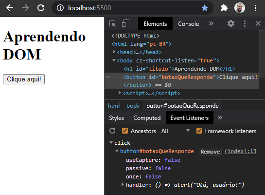

Existem várias formas de se adicionar um _handler_ em um evento, porém a mais versátil é `elem.addEventListener("evento", handler)`. Podemos adicionar um _handler_ em mais de um evento, e mais de um _handler_ no mesmo evento.

```html
  <body>
    <h1 id="titulo">Aprendendo DOM</h1>
    <button>Clique aqui</button>
    <button>ou aqui</button>
    <script>
      const dizerOla = () => alert("Olá, usuário!");
      const dizerTchau = () => alert("Tchau!");

      // Todas as tags button
      const botoes = document.querySelectorAll("button");

      // Adiciona dizerOla nos eventos de todos os botões
      botoes.forEach((b) => b.addEventListener("click", dizerOla));

      // Adiciona dizerTchau no evento do segundo botão (junto com dizerOla)
      botoes[1].addEventListener("click", dizerTchau);
    </script>
  </body>
```


Um evento pode disponibilizar outras informações para o _handler_. Elas são passadas através do parâmetro definido no _handler_. Por exemplo, para saber qual elemento foi o chamador do evento, podemos acessar `.currentTarget`.

```html
  <body>
    <h1 id="titulo">Aprendendo DOM</h1>
    <button>Clique aqui</button>
    <button>ou aqui</button>
    <script>
      const qualBotao = (evt) =>
        alert(`Você clicou em "${evt.currentTarget.textContent}"`);

      const botoes = document.querySelectorAll("button");

      botoes.forEach((b) => b.addEventListener("click", qualBotao));
    </script>
  </body>
```


Alguns elementos possuem comportamentos padrão em certos eventos. Uma _tag_ `a` inicia a navegação para `href` quando clicada, um botão do tipo `submit` envia o seu formulário quando clicado, etc.

Para prevenir o comportamento padrão de um elemento, use o método `.preventDefault()` do objeto de evento.

```html
  <body>
    <h1 id="titulo">Aprendendo DOM</h1>

    <a href="https://github.com/ermogenes/aulas-programacao-web/">
      Link para Dev Web
    </a>

    <script>
      document.querySelector("a").addEventListener("click", (evt) => {
        evt.preventDefault();
        evt.currentTarget.insertAdjacentHTML("afterend", "<span>😐</span>");
      });
    </script>
  </body>
```

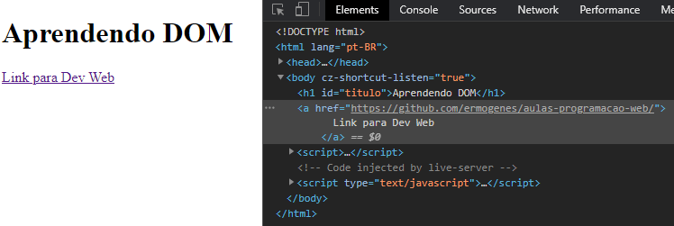

Você pode causar o disparo de um evento manualmente usando `.dispatchEvent`.

```html
  <body>
    <h1 id="titulo">Aprendendo DOM</h1>

    <button id="botaoDisparo">Disparar clique no link</button>
    <br />
    <a href="https://github.com/ermogenes/aulas-programacao-web/">
      Link para Dev Web
    </a>

    <script>
      document.querySelector("a").addEventListener("click", (evento) => {
        evento.preventDefault();
        evento.currentTarget.insertAdjacentHTML("afterend", "<span>😐</span>");
      });

      document.getElementById("botaoDisparo").addEventListener("click", (e) => {
        document.querySelector("a").dispatchEvent(new Event("click"));
      });
    </script>
  </body>
```

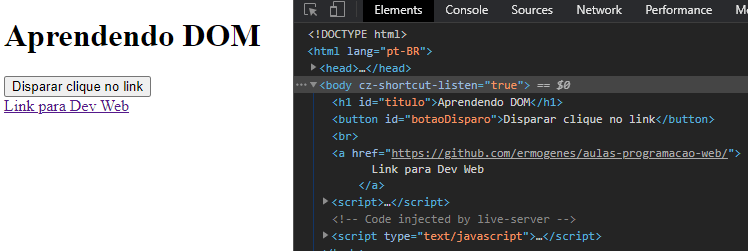

O evento `document.DOMContentLoaded` é disparado quando o navegador já baixou todo o HTML, o processou e terminou de gerar o DOM, portanto todos os elementos já estão disponíveis. Use-o para garantir que os elementos manipulados já foram carregados.

```html
  <body>
    <script>
      const m = document.getElementById("mensagens");
      console.log(m); // null, poi ainda não foi criado

      document.addEventListener("DOMContentLoaded", () => {
        const m = document.getElementById("mensagens");
        console.log(m); // elemento já está acessível

        m.insertAdjacentHTML(
          "beforeend",
          "<li>Disparado DOMContentLoaded</li>"
        );
      });
    </script>

    <h1 id="titulo">Aprendendo DOM</h1>
    <ul id="mensagens"></ul>
  </body>
```

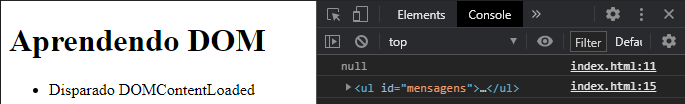

## Formulários

Há alguns recursos facilitadores para manipulação de formulários.

Para campos `input`, `select` e `textarea` temos a propriedade `value` com o valor digitado pelo usuário.

Para campos `input` do tipo `checkbox` ou `radio` podemos usar o _boolean_ `ckecked`.

Para os `select`, temos ainda:

- `options`, com uma coleção dos elementos `option`;
- `selectedIndex`, com o índice da opção selecionada.

Em `document.forms` temos uma coleção dos forms do documento.

Os campos possuem os seguintes eventos:

- `focus`, quando o foco entra no campo;
- `input`, quando uma entrada é detectada;
- `change`, quando a alteração do campo é finalizada;
- `blur`, quando o foco sai do campo.

O `form`, por sua vez possui o evento `submit`, para quando for enviado. Caso não quisermos personalizar o seu comportamento, podemos usar `preventDefault`. Retornar `false` também garante que os valores não serão enviados.

Exemplo de validação:

Em `index.html`:

```html
<!DOCTYPE html>
<html lang="pt-BR">
  <head>
    <meta charset="UTF-8" />
    <meta name="viewport" content="width=device-width, initial-scale=1.0" />
    <title>DOM</title>
    <style>
      form {
        display: flex;
        flex-flow: column;
        max-width: 280px;
      }
      form > * {
        padding: 5px;
      }
      .invalido {
        color: red;
      }
      input[type="checkbox"].invalido + label {
        color: red;
      }
    </style>
  </head>
  <body>
    <h1 id="titulo">Cadastro de usuário</h1>
    <form id="cadastro">
      <label for="usuario">Usuário:</label>
      <input type="text" id="usuario" name="usuario" />

      <label for="senha">Senha:</label>
      <input type="password" id="senha" name="senha" />

      <label for="repetesenha">Repetir senha:</label>
      <input type="password" id="repetesenha" name="repetesenha" />

      <label for="cidade">Cidade:</label>
      <select id="cidade" name="cidade">
        <option selected>-- selecione --</option>
        <option value="1">Mongaguá</option>
        <option value="2">Praia Grande</option>
        <option value="3">Itanhaém</option>
      </select>

      <div>
        <input type="checkbox" id="deacordo" name="deacordo" />
        <label for="deacordo">Concordo com os termos de uso</label>
      </div>

      <button type="submit">Cadastrar</button>
    </form>

    <script src="index.js"></script>
  </body>
</html>
```

Em `index.js`:

```js
const removeErro = (evt) => evt.currentTarget.classList.remove("invalido");

const processarForm = (evt) => {
  evt.preventDefault();

  const usuario = document.getElementById("usuario");
  const senha = document.getElementById("senha");
  const repetesenha = document.getElementById("repetesenha");
  const cidade = document.getElementById("cidade");
  const deacordo = document.getElementById("deacordo");

  if (usuario.value.trim().length === 0) {
    usuario.classList.add("invalido");
    usuario.focus();
    return;
  }

  if (senha.value.trim().length < 8) {
    senha.classList.add("invalido");
    senha.focus();
    return;
  }

  if (repetesenha.value !== senha.value) {
    repetesenha.classList.add("invalido");
    repetesenha.focus();
    return;
  }

  if (!["1", "2", "3"].includes(cidade.value)) {
    cidade.classList.add("invalido");
    cidade.focus();
    return;
  }

  if (!deacordo.checked) {
    deacordo.classList.add("invalido");
    deacordo.focus();
    return;
  }

  const novoUsuario = {
    usuario: usuario.value.trim(),
    senha: senha.value,
    cidade: cidade.value,
  };

  console.log(novoUsuario);
};

const iniciar = () => {
  document.forms[0].addEventListener("submit", processarForm);

  document
    .querySelectorAll("input,select")
    .forEach((campo) => campo.addEventListener("input", removeErro));
};

document.addEventListener("DOMContentLoaded", iniciar);
```

