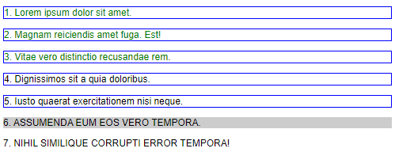

# Estilos CSS

## Introdução

A linguagem CSS permite a configuração de propriedades dos elementos de um documento HTML. Dispões diversas maneiras de selecionar elementos, e permite impor regras para alteração de suas propriedades.

O termo _**C**ascading **S**tyle **S**heets_ entrega aquela que é a sua principal característica: a aplicação das regras em cascata. O navegador (`user-agent`) tem, assim, uma forma organizada de lidar com as diferentes estilizações simultâneas possíveis:

- Estilos pré-definidos pelo navegador (`user-agent styles`);
- Estilos configurados pelo usuário no navegador (`user-defined styles`);
- Estilos do autor (`author-defined styles`).

Além disso, nem todo elemento precisa ser estilizado, devendo herdar a característica de seu elemento-pai (ex.: a fonte padrão da página é utilizada em todos os parágrafos que não possuam uma configuração mais específica).

Para resolver essas questões, e a possível sobreposição de regras, o CSS utiliza 3 conceitos:

- **Importância**: estilos do agente são sobrepostos por estilos do usuário, que por sua vez são sobrepostos pelos estilos do autor; porém, tanto o autor quanto o usuário podem marcar regras como sendo importantes, sendo que a maior prioridade passa a ser a do usuário.
- **Especificidade**: quanto mais específica é uma regra, maior a sua prioridade; por exemplo, se uma regra disser que todo parágrafo é alinhado a esquerda, mas se defina uma regra dizendo que um parágrafo específico é centralizado, essa segunda regra prevalece.
- **Ordem**: caso duas regras de mesma especificidade sejam definidas, vale a última.

O último conceito importante é o de **herança**. Algumas propriedades são herdadas, outras não. Geralmente o senso comum é suficiente para entendermos em qual situação cada uma delas se enquadra. Por exemplo, cores e fontes são herdadas dos seus elementos-pai, bordas e tamanho (largura e altura) não são.

## Escrevendo código CSS

Podemos escrever código CSS em 3 locais diferentes:

### CSS _inline_

É a forma mais específica de se definir um estilo para um elemento. Escrevemos diretamente no documento HTML, usando o atributo `style` do elemento desejado:

```html
<p style="color: red;">Parágrafo com texto em vermelho.</p>
```

Devemos evitar ao máximo essa forma de uso.

### CSS interno

Nossos estilos são escritos no cabeçalho de cada página, e valem para o documento todo.

```html
<!-- ... -->
<head>
    <!-- ... -->
    <style>
        p {
            color: blue;
        }
    </style>
    <!-- ... -->
</head>
<!-- ... -->
```

Nesse exemplo, todos os parágrafos contidos na página estarão com o texto em azul.

### CSS externo

A maneira mais usual é criar um (ou mais) arquivos com a extensão `.css` e referenciá-los no cabeçalho da página. Permite que os estilos sejam compartilhados entre diversas páginas.

```html
<!-- ... -->
<head>
    <!-- ... -->
    <link rel="stylesheet" type="text/css" href="meuEstilo.css">
    <!-- ... -->
</head>
<!-- ... -->
```

Nesse exemplo, todos os estilos definidos em `meuEstilo.css` valerão para este documento.

## Escrevendo regras

A declaração de uma regras tem o seguinte formato:

```css
    propriedade: valor;
```

As regras são aplicadas a elementos HTML. Escolhemos os elementos aos quais os estilos serão aplicados usando seletores (exceto quando _inline_, onde o elemento está explícito). Por exemplo, o seletor `p` indica que as regras serão aplicadas a _todos_ os parágrafos do documento.

Para aplicar um conjunto de regras aos elementos que atendem ao seletor:

```css
seletor {
    propriedade1: valor;
    propriedade2: valor;
    propriedade3: valor;
}
```

Podemos também aplicar um conjunto de regras em vários seletores usando `,`:

```css
seletor1,
seletor2 {
    propriedade1: valor;
    propriedade2: valor;
}
```

Por exemplo, a regra abaixo indica que os todos os títulos `h1` até `h6` ficarão centralizados e sublinhados:

```css
h1, h2, h3, h4, h5, h6 {
    text-align: center;
    text-decoration: underline;
}
```

Podemos comentar trechos em CSS usando a notação `/*` e `*/`.

## Seletores

Há diversos tipos, permitindo selecionar elementos das mais diversas maneiras. Vejamos os mais importantes.

### Seletores básicos

O **seletor universal `*`** seleciona todos os elementos. Deve ser evitado, pois se sobrepõe a qualquer herança e exige que o navegador aplique em TODOS os elementos.

Exemplo (todos os elementos terão suas margens removidas):

```css
* {
    margin: 0;
}
```

O **seletor de tipo de elemento** permite indicar uma _tag_ para que todos os elementos desse tipo sejam selecionados. 

Exemplo (todas as imagens receberão uma borda preta):

```css
img {
    border: 1px solid black;
}
```

Exemplo (o corpo da página terá um fundo cinza):

```css
body {
    background-color: silver;
}
```

O **seletor de id `#`** permite selecionar um único elemento, de acordo com o seu identificador único. Podemos identificar um elemento qualquer adicionando um atributo `id` com um valor único no documento.

Exemplo (somente o terceiro parágrafo terá texto vermelho):

```css
#paragrafo-especial {
    color: red;
}
```

```html
    <p>Lorem ipsum dolor sit amet.</p>
    <p>Quos, nobis corporis? Necessitatibus, consequuntur!</p>
    <p id="paragrafo-especial">Sint ex fugit doloremque? Voluptas!</p>
    <p>Magnam reiciendis amet fuga. Est!</p>
```

O **seletor de classe `.`** permite criar uma categoria que pode ser aplicada livremente em quantos elementos se desejar. Dizemos que um elemento é de uma categoria incluindo o nome dela no valor do atributo `class`. Podeos incluir quantas classes quisermos, separadas por ` ` (espaço).

Exemplo (a _tag_ abaixo possui as classes `aviso` e `destaque`):

```html
<p class="aviso destaque">...</p>
```

No exemplo acima, poderíamos incluir estilização para `aviso` e para `destaque` separadamente.

Exemplo (o primeiro e o quarto item da lista ficarão em vermelho negrito):

```css
.destacado {
    color: red;
    font-weight: bold;
}
```

```html
    <ul>
        <li class="destacado">Lorem ipsum dolor sit amet.</li>
        <li>Beatae ratione recusandae aperiam laboriosam.</li>
        <li>Amet autem optio quaerat quisquam?</li>
        <li class="destacado">Itaque libero autem magni amet!</li>
        <li>Sapiente fugiat expedita quis suscipit.</li>
    </ul>
```

Podemos encadear classes para selecionar somente **itens que possuam ambas as classes**, usando `.classe1.classe2`. A ordem não importa.

```css
.destaque.aviso {
    /* ... estilo desejado ... */ 
}
```

```html
<p class="aviso destaque">Eu serei selecionado!</p>
<p class="destaque">Eu não 😢</p>
```

**Os seletores podem ser agrupados** gerando seletores mais específicos. No exemplo abaixo, selecionamos somente os _parágrafos_ com a classe `destaque`, mas não os demais elementos (`h1` e `strong`).

```css
p.destaque {
    /* ... estilo desejado ... */ 
}
```

```html
    <h1 class="destaque">Lorem ipsum</h1>
    <p>Lorem ipsum dolor sit amet.</p>
    <p>Quos, nobis corporis? <strong class="destaque">Necessitatibus</strong>, consequuntur!</p>
    <p class="destaque">Sint ex fugit doloremque? Voluptas!</p>
    <p>Magnam reiciendis amet fuga. Est!</p>
```

Os **seletores de atributo** permitem selecionar elementos de acordo com os valores de seus atributos.

- `[atributo="valor"]` seleciona elementos que possuem o atributo com o valor especificado.
- `[atributo]` seleciona elementos que possuem o atributo, independente do valor.

Exemplo (deixa todos os links que abrem em uma nova janela com a fonte maior):

```css
a[target="_blank"] {
    font-size: 1.5em;
}
```

### Combinadores

Primeiro, algumas nomenclaturas importantes:

- pai/filho (_parent_/_child_): quando um elemento está contido em outro, o mais externo é o pai e o mais interno é o filho.
- descendente (_descendant_): quando há mais de um nível, filhos e filhos dos filhos são chamados de descendentes.
- irmão (_sibling_): elementos filhos do mesmo pai.

Combinadores permitem selecionar elementos de acordo com sua relação com outros elementos. Sendo `X` e `Y` selectores quaisquer:

- `X Y` seleciona itens de `Y` que são descendentes de `X`.
- `X > Y` seleciona itens de `Y` que são filhos de `X`.
- `X ~ Y` seleciona itens de `Y` que são irmãos de `X`.
- `X + Y` seleciona itens de `Y` que são irmãos de `X`, e estão posicionados logo após `X`.

Todos os combinadores acima podem ser vistos no exemplo abaixo.

```css
    div p {
        border: 1px solid blue;
    }
    div > p {
        color: green;
    }
    div ~ p {
        text-transform: uppercase;
    }
    div + p {
        background: #ccc;
    }
```

```html
    <div>
        <p>1. Lorem ipsum dolor sit amet.</p>
        <p>2. Magnam reiciendis amet fuga. Est!</p>
    </div>

    <div>
        <p>3. Vitae vero distinctio recusandae rem.</p>
        <section>
            <p>4. Dignissimos sit a quia doloribus.</p>
            <p>5. Iusto quaerat exercitationem nisi neque.</p>
        </section>
    </div>

    <p>6. Assumenda eum eos vero tempora.</p>
    <p>7. Nihil similique corrupti error tempora!</p>
```

O resultado:



### Pseudo-classes e pseudo-elementos

**Pseudo-classes** permitem estilizar estados diversos de um elemento. Um exemplo comum é alterar estilos quando o ponteiro do _mouse_ passa sobre o elemento usando a pseudo-classe `:hover`.

Exemplo (o elemento de _id_ `atencao` fica verde quando o ponteiro do _mouse_ passa sobre ele):

```css
#atencao:hover {
    color: green;
}
```

Algumas pseudo-classes:

- `:hover` seleciona elementos cujo ponteiro do _mouse_ está posicionado sobre.
- `:first-child` seleciona somente o primeiro elemento que atende ao seletor.
- `:last-child` seleciona somente o último elemento que atende ao seletor.
- `:nth-child` seleciona o n-ésimo elemento que atende ao seletor (ex. `:nth-child(5)` para o 5º).
- `:nth-last-child` faz o mesmo que `:nth-child`, mas do último ao primeiro.
- `:only-child` seleciona elementos que são filhos únicos.
- `:not(seletor)` seleciona elementos que **não** atendem ao seletor.

**Pseudo-elementos** são facilitadores que permitem selecionar elementos que não existem independentemente, como por exemplo a primeira letra de um parágrafo.

- `::first-letter` seleciona a primeira letra de um elemento de texto.
- `::first-line` seleciona a primeira linha de um elemento de texto.
- `::selection` seleciona o texto selecionado pelo usuário.
- `::after` cria um elemento depois do elemento selecionado que pode ser preenchido com conteúdo textual usando a propriedade `content`.
- `::before` cria um elemento antes do elemento selecionado que pode ser preenchido com conteúdo textual usando a propriedade `content`.

### Links

A _tag_ `a` (link) possui pseudo-classes específicas para estilização, que devem ser usadas na ordem indicada.

- `a:link` - link normal, não visitado.
- `a:visited` - link visitado.
- `a:hover` - link cujo ponteiro do _mouse_ está posicionado sobre.
- `a:active` - link ativo (no momento em que é clicado, ou quando selecionado com `Tab`).

### Forms

Estilizar formulários é uma das mais desafiadoras tarefas para o _designer_. O CSS dispões de algumas pseudo-classes e alguns pseudo-elementos que ajudam nessa tarefa.

- `:focus` seleciona somente campos que estão com o foco do usuário.
- `:checked` seleciona somente elementos marcados com ✔.
- `:disabled` e `:enabled` selecionam elementos desabilitados ou habilitados.
- `:read-only` e `:read-write` selecionam elementos somente-para-leitura ou não.
- `:required` e `:optional` selecionam elementos obrigatórios e opcionais. 
- `:invalid` e `:valid` selecionam elementos com valores inválidos e válidos.
- `::placeholder` seleciona o _placeholder_ de um elemento.

