# Formulários

[📽 Veja esta vídeo-aula no Youtube](#) _Em breve..._

Permitem a entrada de dados pelo usuário em uma interface gráfica semelhante a aplicações _desktop_, utilizando componentes comumente conhecidos pelos usuários como caixas de texto, _checkboxes_, _combos_ e botões.

## Marcação

### _Tag_ `form`

Elemento em nível de bloco que indica a presença de um formulário e deve envolver todos os componentes de entrada que serão enviados em conjunto na mesma requisição, bem como os botões de ação relacionados.

```html
<form>
    <!-- Marcação do seu formulário -->
</form>
```

Atributos:
* `action` - indica o URL do recurso que processará os dados enviados (o padrão é a URL atual).
* `method` - indica o método de envio dos dados.
  * `method="get"` - padrão, envia os dados codificados junto à URL `action`, usando o verbo HTTP GET.
  * `method="post"` - envia os dados no corpo da requisição, usando o verbo HTTP POST.

Veremos mais sobre `action` e `method` em breve.

---

### Componentes de entrada

Os prinicipais componentes de entrada usados em formulários serão estudados na sequência. O HTML possui especificação para muitos outros, alguns não implementados por alguns navegadores (como `color`, `date` e `range`) outros mais maduros mas com uso fora do escopo desse curso (como `file`e `image`).

De maneira geral, escrevemos nossos componentes dentro de um `form`, e o envio é controlado por botões de ação descendentes do mesmo `form`.

Podemos agrupar visualmente campos na tela usando `fieldset`, e criamos rótulos para campos usando `label`.

A maioria dos componentes de entrada são elementos em nível de linha, criados usando a _tag_ `input`. _Combos_ e listas são criados usando `select` e caixas de texto com múltiplas linhas usam `textarea`.

**Sempre** devemos criar um `id` para identificar cada elemento de entrada, bem como criar um `name` (se possível com o mesmo valor de `id`), usado para diferenciar os dados quando enviados para serem processados.

Os elementos que permitem digitação aceitam um valor no atributo `placeholder` para servir de ajuda ao usuário, ocupando o espaço de digitação quando não houver conteúdo.

---

### Rótulos

Identificam um campo no formulário.

* Sempre use `for` para indicar o `id` do componente identificado.

```html
<label for="nome_usuario">Digite o seu nome:</label>
```

---

### Caixa de texto

Permitem a digitação livre de _strings_.

* Defina um valor inicial através do atributo `value`.
 
Exemplo 1:
```html
<label for="usuario">Usuário</label>
<input type="text" name="usuario" id="usuario">    
```

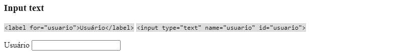

Exemplo 2:
```html
<label for="usuario">Usuário</label>
<input type="text" name="usuario" id="usuario" value="Tatiana">
```

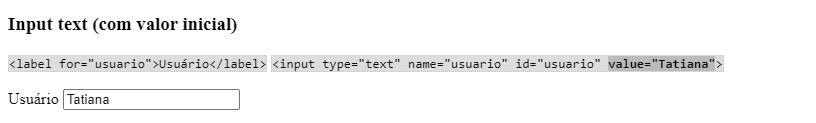

_Usar `type="text"` é opcional, pois é o valor padrão._

---

### Caixa de texto numérica

Aceita somente números.

Exemplo 1:

```html
<label for="numero_filhos">Filho(s)</label>
<input type="number" name="numero_filhos" id="numero_filhos">
```

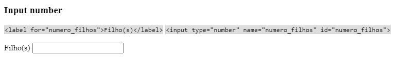

Exemplo 2:

```html
<label for="numero_filhos">Filho(s)</label>
<input type="number" name="numero_filhos" id="numero_filhos" value="0">
```

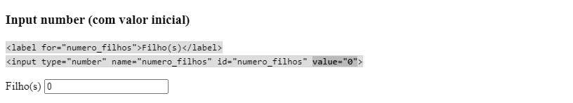

---

### Caixa de senha

Esconde os valores digitados. Usado para entrada de senhas.

Exemplo 1:

```html
<label for="senha">Senha</label>
<input type="password" name="senha" id="senha">
```

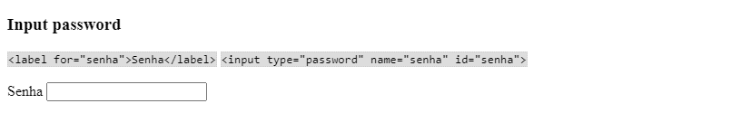

Exemplo 2:

```html
<label for="senha">Senha</label>
<input type="password" name="senha" id="senha" value="minha senha">
```

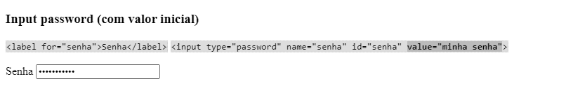

---

### _Checkbox_

Entrada de valores _boolean_.

* Adicione o atributo `checked` para torná-lo pré-marcado.

Exemplo 1:

```html
<input type="checkbox" name="concordo" id="concordo">
<label for="concordo">Li e concordo</label>
```

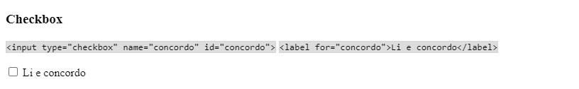

Exemplo 2:

```html
<input type="checkbox" name="concordo" id="concordo" checked>
<label for="concordo">Li e concordo</label>
```

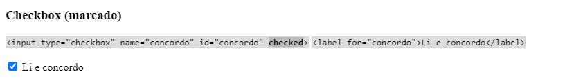

---

### Caixa de texto com múltiplas linhas

Entrada de textos longos, possivelmente com quebra de linha.

* Use `rows` e `cols` para definir a quantidade padrão de caracteres em linhas e colunas.
* O conteúdo interno da _tag_ `textarea` define seu valor inicial.

Exemplo 1:

```html
<label for="comentario">Comentário</label>
<textarea name="comentario" id="comentario" cols="30" rows="5"></textarea>
```


Exemplo 2:

```html
<label for="comentario">Comentário</label>
<textarea name="comentario" id="comentario" cols="30" rows="5">Achei muito bom!</textarea>
```

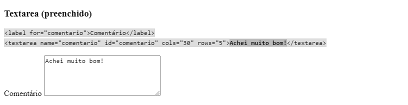

---

### _Combo box_ ou caixa de seleção

Permite que seja seleciona uma opção (`option`) disponível em uma lista (`select`).

* Use `value` para definir o valor de cada `option`.
* Use o atributo `selected` para marcar a opção pré-selecionada.
* Use `size` para criar uma lista "aberta" com o número de linhas indicado.

Exemplo 1:

```html
<label for="cidade">Cidade</label>
<select name="cidade" id="cidade">
    <option value="">-- selecione --</option>
    <option value="ita">Itanhaém</option>
    <option value="mga">Mongaguá</option>
    <option value="pbe">Peruíbe</option>
</select>
```

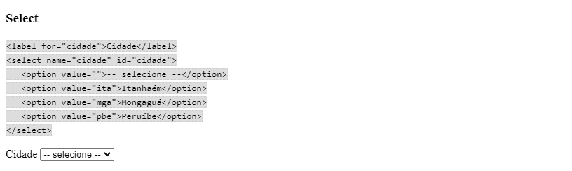

Exemplo 2:

```html
<label for="cidade">Cidade</label>
<select name="cidade" id="cidade">
    <option>-- selecione --</option>
    <option value="ita">Itanhaém</option>
    <option selected value="mga">Mongaguá</option>
    <option value="pbe">Peruíbe</option>
</select>
```

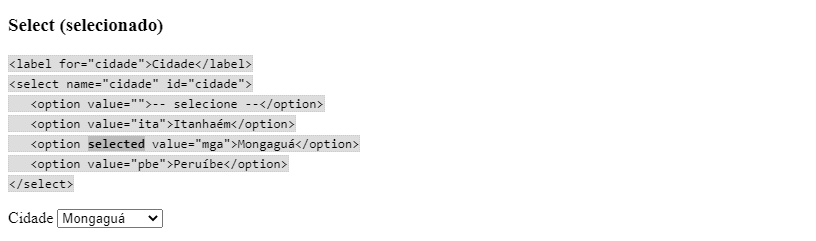

Exemplo 3:

```html
<label for="cidade">Cidade</label>
<select name="cidade" id="cidade" size="5">
    <option value="ita">Itanhaém</option>
    <option value="mga" selected>Mongaguá</option>
    <option value="pbe">Peruíbe</option>
</select>
```

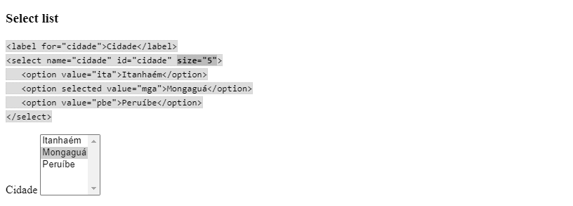

---

### _Radio_ e `fieldset`

_Radios_ são componentes de grupo, onde somente um elemento de cada grupo pode ser selecionado por vez.

* Defina o mesmo `name` para _radios_ do mesmo grupo.
  * Não use o mesmo `id`, já que ele deve ser único no documento.
* Use `value` para definir o valor de cada _radio_.
* Adicione o atributo `checked` para tornar um _radio_ pré-marcado.

Você pode utilizar o agrupador visual `fieldset` com o rótulo `legend` para separar grupos de _radios_ em seu formulário. Seu uso não é obrigatório, e também não é vinculado aos _radios_, podendo ser usado em qualquer situação.

* Use o elemento `fieldset` entre todos os elementos do grupo.
* Adicione um elemento `legend` no `fieldset` para indicar uma legenda.

Exemplo 1:

```html
<fieldset>
    <legend>Possui habilitação?</legend>
    <input type="radio" name="habilitacao" id="habilitacao_s" value="s">
    <label for="habilitacao_s">Sim</label>
    <input type="radio" name="habilitacao" id="habilitacao_n" value="n">
    <label for="habilitacao_n">Não</label>
    <input type="radio" name="habilitacao" id="habilitacao_nr" value="nr">
    <label for="habilitacao_nr">Prefiro não responder</label>
</fieldset>
```

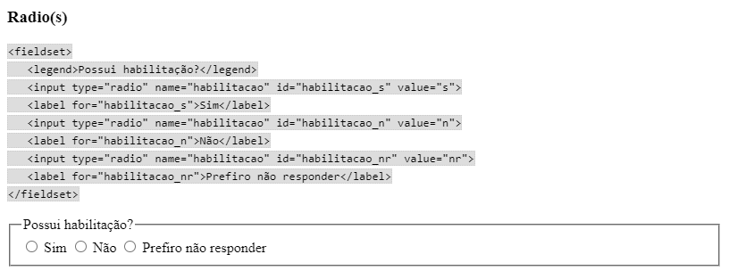

Exemplo 2:

```html
<fieldset>
    <legend>Possui habilitação?</legend>
    <input type="radio" name="habilitacao" id="habilitacao_s" value="s">
    <label for="habilitacao_s">Sim</label>
    <input type="radio" checked name="habilitacao" id="habilitacao_n" value="n">
    <label for="habilitacao_n">Não</label>
    <input type="radio" name="habilitacao" id="habilitacao_nr" value="nr">
    <label for="habilitacao_nr">Prefiro não responder</label>
</fieldset>
```

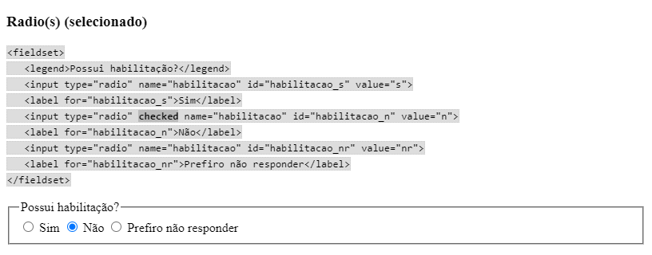

---

### Botões de ação

Permitem o acionamento do formulário.

* `submit` cria um botão de envio.
* `reset` cria um botão que volta os campos para seu valor inicial.
* Você pode utilizar qualquer tipo de conteúdo junto ao texto do botão.

Exemplos:

```html
<button type="submit">Enviar</button>
<button type="reset">Reiniciar</button>
```

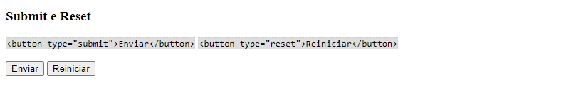

_Não use `input type="submit"` ou `"reset"`, pois são muito mais difíceis de estilizar._