# Funções

[📽 Veja esta vídeo-aula no Youtube](https://youtu.be/MOIbBRNVfPA)

Por se tratar de uma linguagem dinâmica interpretada o JavaScript permite muita flexibilidade ao trabalhar com funções.

Elas são tratadas como "cidadãos de primeira classe", o que significa que uma função não é diferente de outro tipo de dado qualquer, podendo ser armazenada em variáveis e passada como parâmetro para outras funções. Essencialmente, uma função armazena um bloco de código JavaScript que pode ser executado a qualquer momento.

## Criando funções

Declaramos uma função usando a palavra chave `function`:

```js
function nomeDaFuncao() {
    // código da função (comandos JavaScript quaisquer)
}
```

E a executamos usando `()`:

```js
nomeDaFuncao();
```

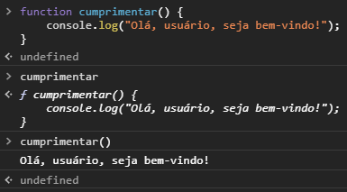

Percebam que referenciar o nome da função sem `()` retorna o valor da função (seu bloco de código). 

Outra maneira de se criar uma função é através da uma expressão. Criamos uma função anônima e atribuímos a uma variável. Posteriomente, podemos manipulá-la como qualquer outra variável, e executá-la normalmente.

```js
let minhaFuncao = function() {
    console.log("Dev Web");
};
```

🍌 _Atente ao `;` no final da expressão. Esse comando é uma atribuição normal, não há porque não usar o finalizador de comando._

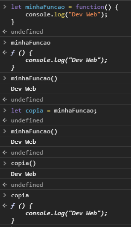

**Expressões são preferíveis à declarações.**

## Escopo e visibilidade

Variáveis declaradas dentro de uma função só são visíveis dentro da função. São chamadas de _variáveis locais_.

```js
let exibirMensagem = function() {
    let mensagem = "Olá!";
    console.log(mensagem); // Essa linha não gera um erro, a variável está visível
};

exibirMensagem();

console.log(mensagem); // Essa linha gerará um erro, a variável não está visível
```

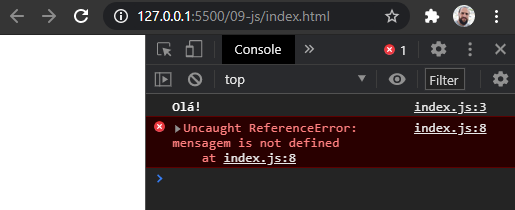

Variáveis externas à função são visíveis internamente.

```js
let mensagem = "Olá!";

let exibirMensagem = function() {
    console.log(mensagem); // Essa linha não gera um erro, a variável está visível
};

exibirMensagem();

console.log(mensagem); // Essa linha não gera um erro, a variável está visível
```

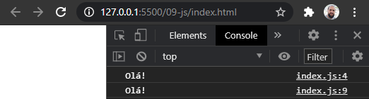

O acesso é completo, podendo inclusive alterá-las livremente.

```js
let mensagem = "Olá!";

let exibirMensagem = function() {
    mensagem = "Hello!"; // O valor será alterado!
    console.log(mensagem);
};

exibirMensagem();

console.log(mensagem);
```

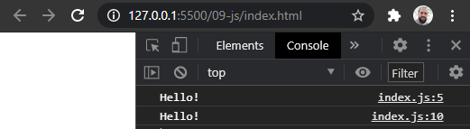

Caso seja criada outra com o mesmo nome internamente, ela sobrepõe a externa, que não estará mais visível. Dizemos que a variável foi _sombreada_.

```js
let mensagem = "Olá!";

let exibirMensagem = function() {
    let mensagem; // Esta variável sombreará a externa!

    mensagem = "Hello!"; // O valor da interna será alterado
    console.log(mensagem); // Hello!
};

exibirMensagem();

console.log(mensagem); // Olá!
```

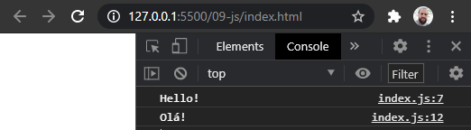

Resumindo, variáveis declaradas fora de funções são chamadas de _variáveis globais_ e estão disponíveis em todas as funções, **exceto** quando sombreadas dentro da função.

## Parâmetros e argumentos

Podemos definir parâmetros de entrada, nos quais os argumentos serão **copiados**.

```js
let exibirMensagem = function(mensagem) {
    console.log(mensagem); // Exibirá o valor recebido como argumento
};

exibirMensagem("Olá!");
exibirMensagem("Hello!");
```


**Todos os parâmetros são opcionais**. Podemos definir valores padrão para os parâmetros.

```js
let exibirMensagem = function(mensagem, gritar = false) {
    if (gritar){
        mensagem = mensagem.toUpperCase();
    }
    console.log(mensagem);
};

exibirMensagem("Olá!");
exibirMensagem("Olá!", false);
exibirMensagem("Olá!", true);
```

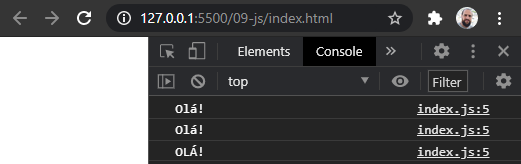

## Retornos

Não há distinção rígida entre procedimentos e funções em JavaScript. Funções sempre retornam valores, de forma implícita ou explícita. Caso não definamos, será sempre retornado implicitamente o valor `undefined`.

```js
let exibirMensagem = function() {
    console.log("Olá!");
};

let retorno = exibirMensagem();

console.log(retorno); // undefined, implícito
```

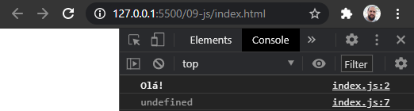


Criamos retorno explícitos usando o comando `return`. Ele imediatamente finaliza a função, retornando o valor indicado. Se nenhum valor for indicado, será retornado `undefined`.

```js
let exibirMensagem = function() {
    console.log("Olá!");
    return; // Será retornado undefined
    console.log("Este comando nunca será executado!");
};

let retorno = exibirMensagem();

console.log(retorno); // undefined
```

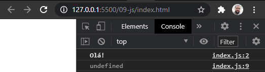

Podemos ter vários pontos de retorno em nossa função.

```js
let verificaParidade = function(numero) {
    if (numero % 2 !== 1) {
        return "par";
    } else {
        return "ímpar";
    }
};

console.log(verificaParidade(3)); // ímpar
console.log(verificaParidade(0)); // par
console.log(verificaParidade(-2)); // par
console.log(verificaParidade(6)); // par
```

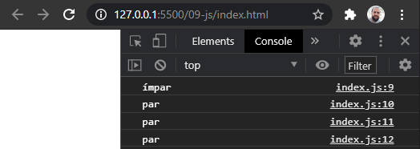

## _Arrow functions_

Há também uma notação diferenciada para a definição de funções chamada _arrow function_, devido ao seus operador `=>` se assemelhar a uma seta (_arrow_). Essa notação simplifica a definição de funções com retorno definido. Veja o exemplo:

```js
let soma = function(a, b) {
    return a + b;
};

console.log(soma(1, 3)); // 4
console.log(soma(32.4, -2)); // 30.4
```

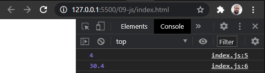

Nessa situação, usar uma _arrow function_ é bem mais enxuta:

```js
let soma = (a, b) => a + b;

console.log(soma(1, 3)); // 4
console.log(soma(32.4, -2)); // 30.4
```

Pode-se ler: _"dados `a` e `b`, retorne `a + b`"_.

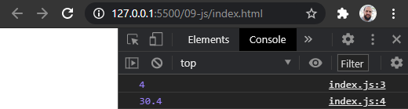

O resultado a expressão à direita será o conteúdo da função. Ao ser executada, caso a expressão retorne um valor, ele será o valor de retorno da função.

- Caso haja somente um parâmetro, não há necessidade dos parênteses.
- Caso não haja nenhum parâmetro, usa-se `()`.
- Caso deseje uma função vazia (sem nenhum processamento), use `{}`.
- Caso necessite de mais de um comando, define-se a expressão entre `{` e `}`, e usa-se um `return` explícito.

```js
let quadrado = x => x ** 2; // só um parâmetro

let dado6Lados = () => Math.floor(Math.random() * 6) + 1; // nenhum parâmetro

let caraOuCoroa = () => { // expressão com múltiplas linhas
    if (Math.random() > 0.5) {
        return "cara";
    }
    return "coroa";
}

console.log(quadrado(2));
console.log(quadrado(3));

console.log(dado6Lados());
console.log(dado6Lados());
console.log(dado6Lados());

console.log(caraOuCoroa());
console.log(caraOuCoroa());
console.log(caraOuCoroa());
```

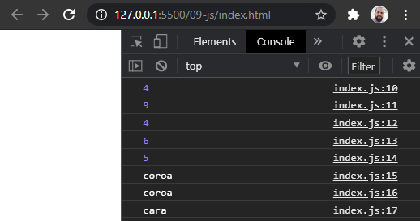

**Sempre que possível, use _arrow functions_.**

## Processando arranjos com funções

As técnicas abaixo trazem um sabor de programação funcional para o JavaScript. Cada função opera sobre um arranjo, executando a sua tarefa enquanto percorre todos os seus elementos.

### Executando uma função para cada um dos elementos

Dados um arranjo e uma função, podemos executar a função uma vez para cada elemento do arranjo usando `forEach`. Ele recebe uma função e a executa passando 3 argumentos, na sequência: o valor do elemento, o índice do elemento e a referência ao arranjo como um todo. Use-os conforme a sua necessidade.

```js
let metade = x => x / 2;
let numeros = [2, 5, -17.9, 143, 1963.5];

numeros.forEach(alert); // Exibe todos, um a um
numeros.forEach(n => console.log(`A metade de ${n} é ${metade(n)}.`)); // metades
numeros.forEach((x, i) => {
    console.log(`\nÍndice #${i}:`);
    console.log(`Número = ${x}, Dobro = ${x*2}, Metade = ${metade(x)}.`)
}); // dobros
```

- `numeros.forEach(alert);` chama a função `alert` para cada um dos elementos em sequência.
- ``numeros.forEach(n => console.log(`A metade de ${n} é ${metade(n)}.`));`` recebe no parâmetro `n` o valor a ser processado, e processa `console.log` repassando o elemento dentro de uma string.
- `numeros.forEach((x, i) => {...});` chama a função passando como argumentos o elemento em `x` e seu índice em `i`, que serão processados em uma função de múltiplas linhas.

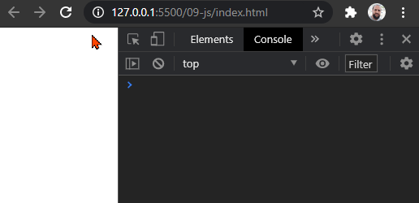

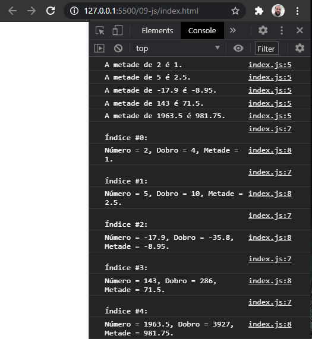

**Usar `forEach` é sempre preferível a iterar arranjos.**

### Buscando e filtrando

As funções `find`, `findIndex` e `filter` funcionam de forma parecida com `forEach`, mas com alguns detalhes que permitem executar buscas e filtros.

- `find(funcao)` executa `funcao` em cada um dos elementos até que para um deles a função retorne `true`, quando `find` finaliza e retorna o valor do item atual.
- `findIndex(funcao)` faz a mesma coisa, mas retorna o índice e não o valor.
- `filter(funcao)` executa `funcao` em cada um dos elementos até o final do arranjo. Aqueles para os quais a função retorne `true` são incluídos em um arranjo de resultado, que é retornado ao final.

```js
let craques = [
    {nome: "Michael Jordan", esporte: "basquete"},
    {nome: "Pelé", esporte: "futebol"},
    {nome: "LeBron James", esporte: "basquete"},
];

let pele = craques.find(craque => craque.nome === "Pelé");
let nenhumTenista = !craques.find(craque => craque.esporte === "tênis");
let nenhumFutebol = !craques.find(craque => craque.esporte === "futebol");
let posicaoLBJ = craques.findIndex(craque => craque.nome === "LeBron James");
let craquesBasquete = craques.filter(craque => craque.esporte === "basquete");

console.log(pele);
console.log(nenhumTenista);
console.log(nenhumFutebol);
console.log(posicaoLBJ);
console.log(craquesBasquete);
```

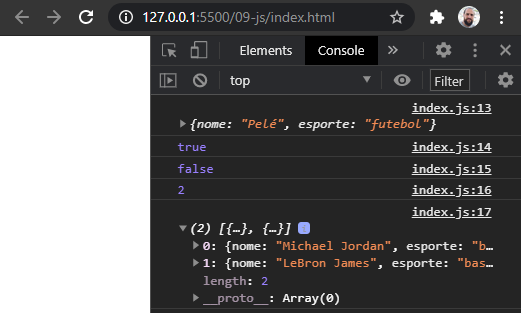

### Transformando um arranjo

A função `map` executa uma função para cada elemento e retorna um arranjo contendo os retornos, com índices equivalentes.

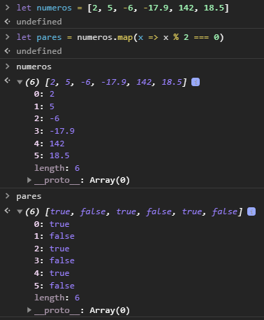

A função `reduce` processa todos os elementos da lista e traz como resultado somente um valor. Isso é muito útil em diversas situações, como calcular a soma e encontrar o maior item, por exemplo. Precisamos informar um identificador para o valor anterior e um para o valor atual.

Vejamos alguns exemplos:

```js
let n = [2, 5, -3, 4];

let soma = n.reduce((ant, atual) => ant + atual);
let max  = n.reduce((ant, atual) => ant > atual ? ant : atual);

console.log(n);
console.log(soma); // 8
console.log(max);  // 5
```

Opcionalmente podemos também receber o índice atual, o arranjo como um todo e um valor inicial para o primeiro indicador, no formato `arranjo.reduce((valorAnterior, valorAtual, indiceAtual, arranjoOrigem) => funcao, valorInicial)`.

Exemplo:

```js
let credito = 100.00;
let compras = [
    {produto: "Playstation 5", preco: 5000.00, qtd: 1},
    {produto: "Calmante", preco: 60.00, qtd: 2, paraPresente: true}
];
let frete = 20.00;
let saldo = compras.reduce((parcial, compra) => 
    parcial - (compra.preco * compra.qtd)
, credito) - frete;

console.log(compras);
console.log(`Crédito: ${credito}`);
console.log(`Itens comprados: ${compras.length}`);
console.log(`Frete: ${frete}`);
console.log(`Saldo: ${saldo}`);
```

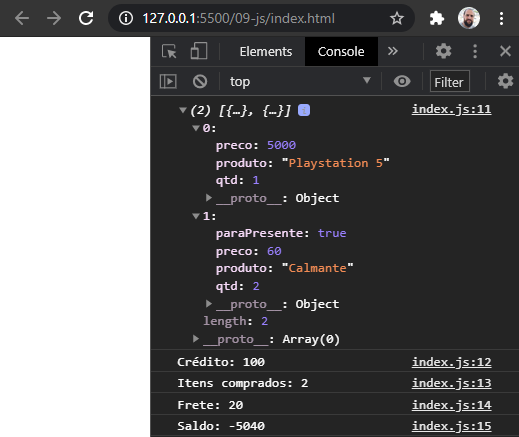

## Métodos

Quando uma função é armazenada como uma propriedade de um objeto a chamamos de _método_. Métodos são elementos fundamentais da programação orientada a objetos.

Podemos declarar métodos de diversas formas diferentes:

```js
let funcaoDeclaradaExternamente = () => { console.log("funcaoDeclaradaExternamente"); };

let objeto = {
    funcaoPreexistente: funcaoDeclaradaExternamente,
    funcaoDeclaradaExternamente,
    funcaoDeclaradaInternamente: function() {
        console.log("funcaoDeclaradaInternamente");
    },
    funcaoDeclaradaInternamenteComAtalho() {
        console.log("funcaoDeclaradaInternamenteComAtalho");
    },
    arrowFunction: () => { console.log("arrowFunction"); },
};

console.dir(objeto);
objeto.funcaoPreexistente();
objeto.funcaoDeclaradaExternamente();
objeto.funcaoDeclaradaInternamente();
objeto.funcaoDeclaradaInternamenteComAtalho();
objeto.arrowFunction();
```

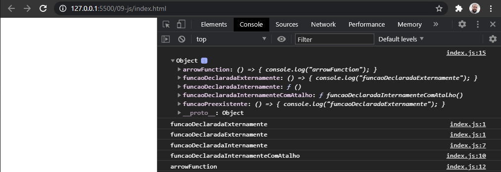

Um cuidado que devemos ter é entender como funciona o acesso aos dados internos do objeto pelos métodos. Podemos ter acesso ao conteúdo interno do objeto chamador usando `this`. No exemplo abaixo, implementamos dois métodos, `dizerOla` usando a declaração de função, e `dizerOlaComBug` usando _arrow functions_. Perceba no segundo método não temos acesso ao objeto chamador porque **_arrow functions_ não possuem `this`**.

```js
let pessoa = {
    nome: "Ermogenes",
    dizerOla: function() {
        return `Olá, meu nome é ${this.nome}!`;
    },
    dizerOlaComBug: () => `Olá, meu nome é ${this.nome}!`,
};

console.log(pessoa.dizerOla());
console.log(pessoa.dizerOlaComBug());
```

