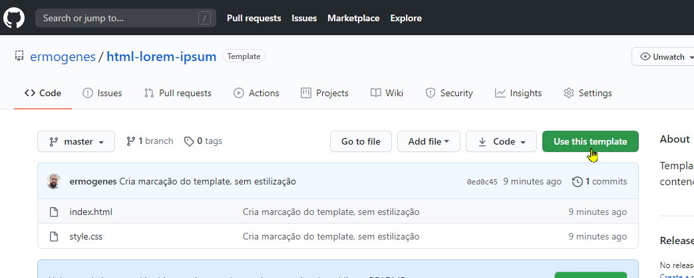
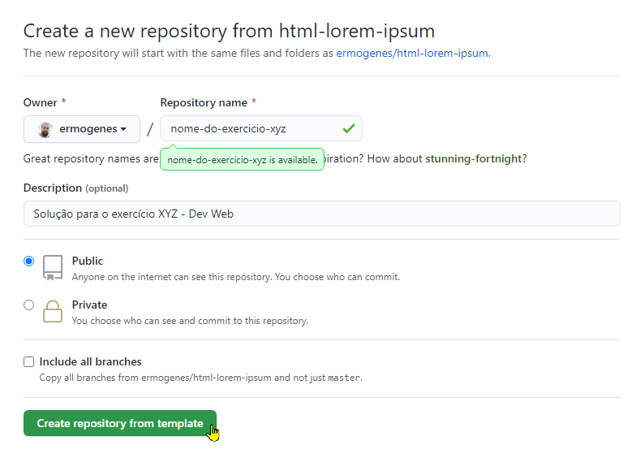
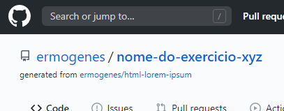
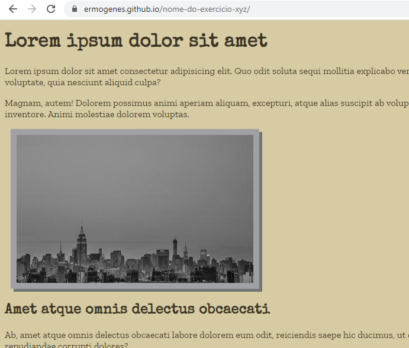

# Usando _templates_ no GitHub

Esse recurso permite que iniciemos um repositório contendo arquivos existentes em um _template_, ou modelo.

Digamos que queremos criar um repositório baseado no _template_ [https://github.com/ermogenes/html-lorem-ipsum](https://github.com/ermogenes/html-lorem-ipsum).

Primeiro, acesse a página do repositório no GitHub. Depois, clique em `Use this template`.

Será aberta uma página normal de criação de repositório, porém ele já iniciará com os arquivos contidos no _template_.

Ao finalizar, seu repositório pode ser usado normalmente. Ele fará uma referência ao _template_ utilizado.

Caso seja necessário você pode configurar seu repositório para utilizar o GitHub Pages, normalmente.

