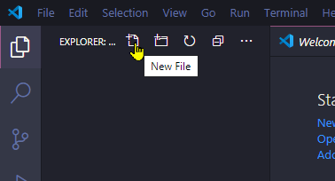
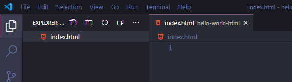
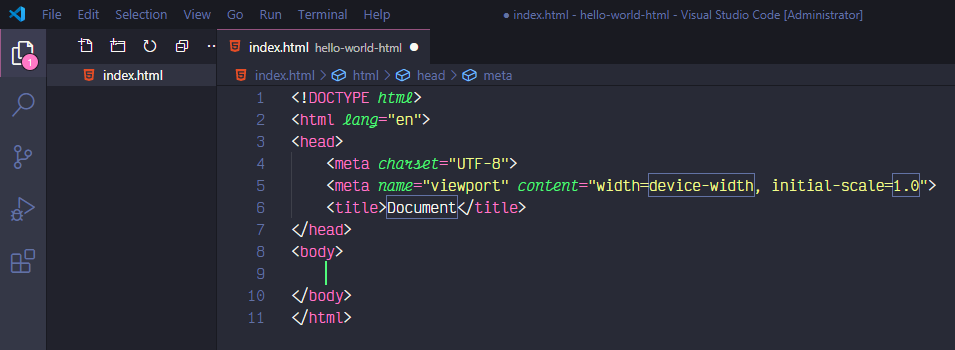
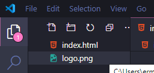
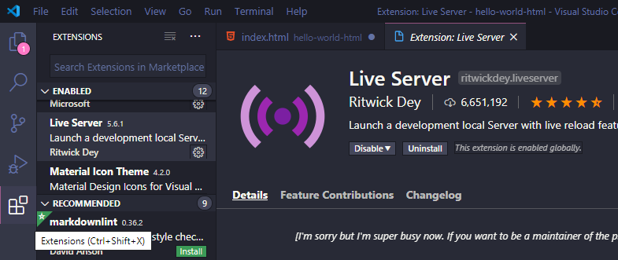
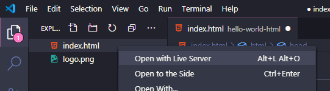
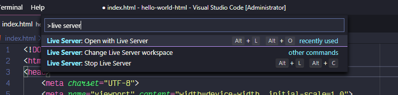
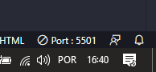
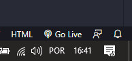
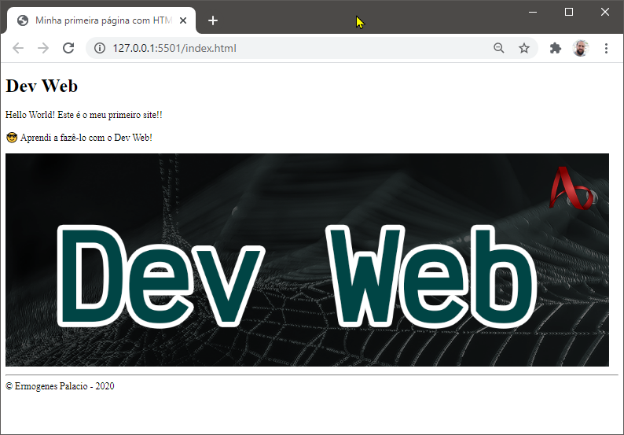

# Meu primeiro _site_

[📽 Veja esta vídeo-aula no Youtube](https://youtu.be/l3ft7U7iZ1s)

Nosso primeiro site utilizará somente HTML puro, e será hospedado no GitHub, utilizando o GitHub Pages.

## Criando o repositório

Faça o seu login e crie um repositório no GitHub:


Preencha os campos solicitados:

- `Repository name`: nome do seu projeto, deve ser único para cada usuário. Seu site será acessado pelo URL `https://<seu nome de usuário>.github.io/<nome do repositório>/`
- `Description`: descrição do projeto, opcional
- `Public`/`Private`: visibilidade do seu repositório, selecione **Public**
- `Initialize this repository with a README`: **desmarque** essa opção para que seja publicado seu site, e não o arquivo README
- `Add .gitignore`: não é necessário adicionar nenhum `.gitignore`
- `Add a license`: não é necessário adicionar nenhuma licença

## Iniciando o código

Crie um clone do seu repositório, usando `git clone`. Acesse a pasta utilizando o VsCode.

Pelo VsCode, crie um arquivo chamado `index.html`. Ele conterá a primeira página do seu site.





Agora precisamos inserir nesse arquivo o texto escrito em HTML necessário para exibir nossa página. Podemos digitar tudo manualmente, mas o VsCode possui integração nativa com o facilitador [Emmet](https://docs.emmet.io/), que agiliza demais o processo.

Podemos escrever somente o caracter `!`...


... e pressionar `Enter` ou `Tab`.



O Emmet integrado do VsCode digita o seguinte conteúdo para nós:

```html
<!DOCTYPE html>
<html lang="en">
<head>
    <meta charset="UTF-8">
    <meta name="viewport" content="width=device-width, initial-scale=1.0">
    <title>Document</title>
</head>
<body>
    
</body>
</html>
```

O VsCode posiciona o cursor facilmente nos espaços mais importantes, com borda azul clara. Pressionando novante `Tab` em sequência, navegamos entre esses itens.

## Criando o conteúdo

Vamos fazer uma página bem simples. Para isso, faremos apenas 3 coisas:

* Configuraremos a língua padrão da página para português;
* Modificaremos o título da página;
* Escreveremos uma mensagem para o usuário;
* Adicionaremos uma imagem.

### Configurando a língua padrão da página para português

Substitua `en` por `pt-BR`.

```html
<html lang="pt-BR">
```

### Modificando o título da página

Alterando o conteúdo de `title`, conseguimos alterar o título da página, exibido pelo navegador na aba que conterá a página.

Antes:

```html
    <title>Document</title>
```

Depois:

```html
    <title>Minha primeira página com HTML</title>
```

### Escrevendo uma mensagem para o usuário

Tudo que escrevermos entre `<body>` e `</body>` será exibido ao usuário _dentro_ da página.

Vamos escrever um cabeçalho:

```html
    <h1>Dev Web</h1>
```

Adicionar um parágrafo:

```html
    <p>Hello World! Este é o meu primeiro site!!</p>
```

Mais um parágrafo (note que _emojis_ funcionam normalmente):

```html
    <p>😎 Aprendi a fazê-lo com o Dev Web!</p>
```

Um separador:

```html
    <hr />
```

E uma linha de texto final, sem parágrafo.

```html
    &copy; Ermogenes Palacio - 2020
```

### Adicionando uma imagem

Podemos colocar imagens em nosso site facilmente. Salve uma imagem dentro pasta do projeto. Ela aparecerá automaticamente no explorador do VsCode:



Depois, crie o código para referenciar a imagem, se assegurando de adicionar um texto alternativo para garantir a acessibilidade:

```html
    
```

## Verificando o código

Você deve ter o seguinte código agora:

```html
<!DOCTYPE html>
<html lang="pt-BR">
<head>
    <meta charset="UTF-8">
    <meta name="viewport" content="width=device-width, initial-scale=1.0">
    <title>Minha primeira página com HTML</title>
</head>
<body>
    <h1>Dev Web</h1>
    <p>Hello World! Este é o meu primeiro site!!</p>
    <p>😎 Aprendi a fazê-lo com o Dev Web!</p>
    
    <hr />
    &copy; Ermogenes Palacio - 2020
</body>
</html>
```

## Abrindo o site no navegador

Seu site ainda está em sua máquina. O navegador pode exibir diretamente um arquivo `.html`. Você pode dar um duplo clique no arquivo e visualizá-lo no seu navegador padrão.

Perceba que o URL utilizado começa com `file://`, o que significa que o recurso está no sistema de arquivos do sistema operacional.

A cada alteração no arquivo, é necessário que você atualize a página no navegador, já que ele não sabe que a página mudou. Isso pode ser automatizado usando a extensão _Live Server_, conforme veremos a seguir.

## Hospedando o site localmente

Queremos que nosso site seja entregue ao navegador por um servidor HTTP. Podemos utilizar qualquer um dos servidores de mercado como o [Apache](https://httpd.apache.org/), o [NGINX](https://www.nginx.com/) ou o [Microsoft IIS](https://www.iis.net/), entre outros. Porém, essas soluções são mais adequadas para produção. Em tempo de desenvolvimento, queremos uma solução mais simples.

A extensão _Live Server_ do VsCode nos permite criar rapidamente um servidor HTTP local e publicar nosso site. Ele ainda monitora as alterações e avisa o navegador para que ele atualize automaticamente.

Instale e ative o _Live Server_:



Agora você pode iniciar o serviço pelo explorador (a), pela opção _Open Live Server_ no menu do VsCode (pressione `CTRL+Shift+P` para abrir o menu) (b) ou diretamente pela barra inferior, na opção `Go Live` (c).







O site será aberto no navegador, através de um URL `http://`. O endereço `127.0.0.1` significa sua máquina local, e `:<numero>` é o número da porta utilizada (pode variar).



## A página criada

Se tudo saiu correto, devemos visualizar:



## Publicando na web com o GitHub Pages

Agora faça um _commit_ no seu código (`git add .` e `git commit -m "Descrição"`) e envie para o GitHub (`git push`).

Agora podemos configurar o GitHub Pages para exibir seu site. Acesse a página do seu repositório e selecione `Settings`.


Selecione a _branch_ `master` como _Source_:


Não escolha um tema. Agora você poderá estilizar como desejar.

Será exibido o URL final onde seu site será criado.


Você pode acessar esse URL em instantes.

## Evoluindo o site

Você sempre pode evoluir seu site e enviar alterações para serem publicadas. Faça as alterações, realize o _commit_ e o _push_, automaticamente através de ferramentas de _Continuos Delivery_  (Entrega Contínua) do GitHub.
