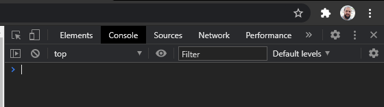
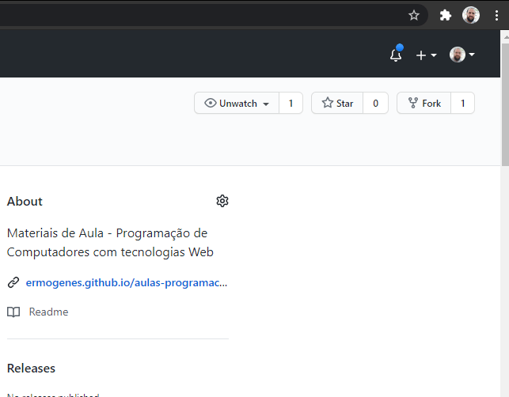
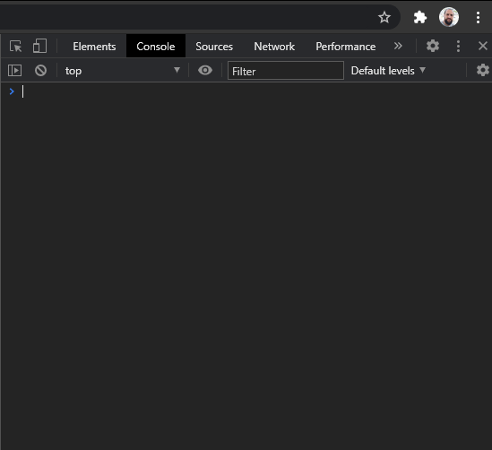

# JavaScript

[📽 Veja esta vídeo-aula no Youtube](#) _Em breve..._

JavaScript é uma linguagem de programação interpretada criada para tornar possível a execução de programas associados à páginas HTML. Esse programas são chamados _scripts_ e seu ambiente de execução é o navegador do usuário. JavaScript não tem nada a ver com Java, além de seu nome, criado se aproveitar do seu sucesso. Hoje em dia, a linguagem segue a especificação [ECMAScript](https://www.ecma-international.org/publications/standards/Ecma-262.htm) (ES), atualmente na versão 11 (ES11 ou ES2020).

Cada navegador possui seu próprio _engine_ (ou máquina virtual), como o V8 do Chrome, o SpiderMonkey do Firefox e o Chakra do Microsoft Edge. Cada uma delas dá suporte a ECMAScript de maneira diferentes, por exemplo, enquanto todas elas dão 100% suporte a ES7 (2016), recursos adicionados posteriomente podem não estar disponíveis em todos eles. _Mais detalhes [aqui](https://caniuse.com/es6) e [aqui](https://kangax.github.io/compat-table/es6/)_.

Os _scripts_ são interpretados pelos _engines_ e executados no ambiente controlado do navegador. Esse ambiente permite certas ações, e bloqueia outras.

**Você pode:**

- Interação com a página no navegador;
- Reagir a ações do usuário, como cliques e teclas;
- Enviar dados pela rede a servidores;
- Armazenar e ler dados no navegador (_cookies_, _local storage_).

**Você não pode:**

- Usar recursos do sistema operacional diretamente, como manipular arquivos e executar programas;
- Interagir com câmeras e microfones sem autorização do usuário;
- Acessar outras abas ou páginas de outras origens;
- Executar _scripts_ se a permissão de JavaScript estiver bloqueada pelo usuário.

Há também outros _engines_ desvinculados de navegadores, que trazem outros tipos de capacidades e limitações. Os mais conhecidos são o Node.js e o Deno. Ambos permitem a execução de programas no _backend_, assim como o C#.

## _Hello world_ interativo (console)

Você pode executar códigos JavaScript de diversas maneiras usando o navegador.

A maneira mais simples é através do console. Como se trata de uma linguagem interpretada, os console é um REPL (_read–eval–print loop_), ou seja, um loop infinito que lê um comando, executa e exibe um resultado. Esse é o mesmo comportamento do terminal do Windows, por exemplo.

Você pode acessar o console do navegador usando as ferramentas do desenvolvedor. Cada navegador possui seu conjunto de ferramentas, e a tecla de atalho mais comum é `F12` (caso não funcione no seu navegador, procure por ferramentas do desenvolvedor no menu). Procure pela aba "Console".



Use o comando `console.log("Hello world")` para exibir a _string_ indicada no console.



- `console.log` exibe o conteúdo solicitado no console.
- `console.clear()` limpa os resultados anteriores.
- `console.dir` exibe a árvore de objetos de uma maneira navegável.
- `document` é o objeto que contém a página atual.



## _Hello world_ em _script_ lado-cliente

Podemos vincultar um _script_ a uma página HTML usando a tag `script`, de duas maneiras:

1. Script interno, diretamente no arquivo `.html`:

```html
...
<script>
  console.log("Hello worl!d");
</script>
...
```

Os scripts serão executados assim que a _tag_ for encontrada.

2. Script externo, em um arquivo `.js` vinculado.

No arquivo `.html`:

```html
...
<script src="meu-script.js"></script>
...
```

No arquivo `meu-script.js`:

```js
console.log("Hello world");
```

Os scripts serão colocados na lista de arquivos para _download_ assim que a _tag_ for encontrada, e executados assim que os scripts forem baixados.
