# _Mobile-first holy grail_

[📽 Veja esta vídeo-aula no Youtube](https://youtu.be/K39Pnhg99Nk)

Um dos mais famosos problemas de Web Design até pouco tempo era a construção do chamado _Holy Grail Layout_, ou o "Leiaute Cálice Sagrado". O termo foi popularizado em 2006 por um artigo muito influente no _site_ [_A List Apart_](https://alistapart.com/article/holygrail/).

Consiste em criar de forma simples e funcional um leiaute com cabeçalho, rodapé (que deve estar sempre no final da página mesmo com pouco conteúdo) e três colunas, sendo uma de conteúdo principal (que deve aparecer _antes_ na marcação para ter mais peso nos mecanismos de busca) e duas de conteúdo adicional como menus de navegação e propagandas (que devem ter a mesma altura do conteúdo, mesmo quando tenha menos conteúdo).

Isso era bastante difícil de se obter antes da especificação **flex**.

Nesse passo-a-passo vamos criá-lo com a mentalidade _mobile-first_, ou seja, primeiro criaremos um _design_ para dispositivos pequenos, depois ajustaremos para dispositivos maiores.

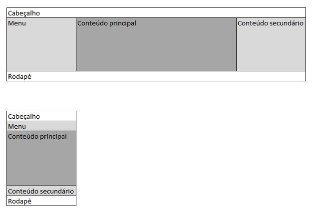

## Marcação

Vamos usar [_tags_ semânticas](leiaute.md#elementos-html-sem%C3%A2nticos) para cada elemento. Nossa estrutura básica será, então:

```html
<body>
    <header>Cabeçalho</header>
    <div class="hg-conteudo">
        <main>Conteúdo principal</main>
        <nav>Menu</nav>
        <aside>Conteúdo secundário</aside>
    </div>
    <footer>Rodapé</footer>
</body>
```

_Algumas áreas estarão em destaque para facilitar o seu entendimento, mas não são necessárias para a solução._

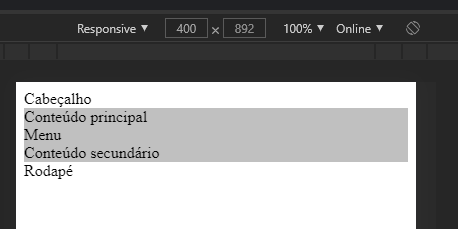

## Estilização _mobile_

Vamos iniciar nossa estilização removendo as margens da página.

```css
body {
    margin: 0;
}
```

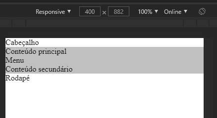

Vamos transformar o `body` em um _flex container_, com o eixo principal em coluna, de forma que sejam empilhados o cabeçalho, o conteúdo e o rodapé. Definiremos que a altura mínima de `body` será 100% da _viewport_ visível, usando `100vh`.

```css
body {
    margin: 0;
    min-height: 100vh;
    display: flex;
    flex-flow: column;
}
```

Agora, podemos forçar o conteúdo a ocupar todo o espaço disponível.

```css
.hg-conteudo {
    flex: 1;
}
```

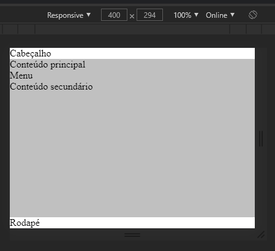

Para nosso _design_ atingir os objetivos para dispositivos _mobile_, só falta trazer o _menu_ visualmente para antes do conteúdo. Fazemos isso tornando nosso conteúdo um novo _container_ vertical e usando a propriedade `order` aplicada no _flex item_ `nav` com o valor `-1`, indicando para ele voltar uma posição na ordem dos itens.

```css
.hg-conteudo {
    flex: 1;
    display: flex;
    flex-flow: column;
}

.hg-conteudo > nav {
    order: -1;
}
```

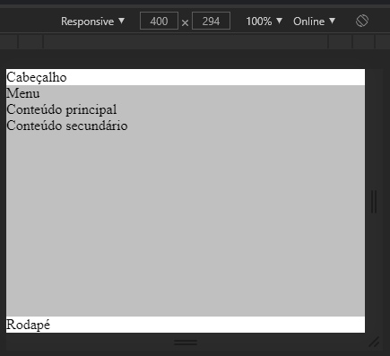

Nosso leiaute já quase está pronto para _mobile_, porém ainda fica bastante inadequado para telas maiores:

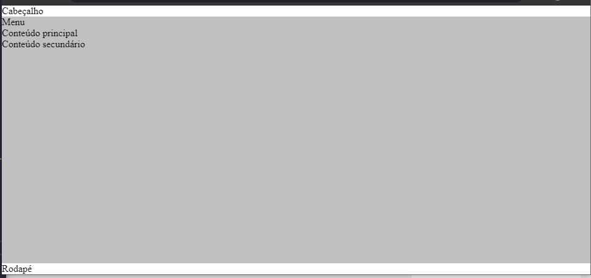

## _Media query_

Vamos criar uma _media query_ para estilizar telas maiores. Digamos que a opção seja por tornar o _design_ do conteúdo horizontal em _viewports_ com pelo menos 768px. Podemos fazer da seguinte forma:

```css
@media (min-width: 768px) {
    .hg-conteudo {
        flex-flow: row;
    }    
}
```

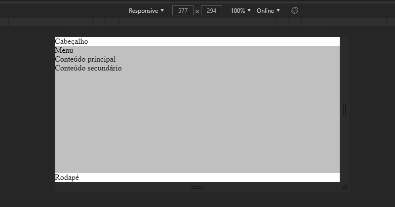

Vamos fazer o conteúdo principal ocupar todo o espaço disponível:

```css
@media (min-width: 768px) {
    /* ... */

    .hg-conteudo > main {
        flex: 1;
    }
}
```

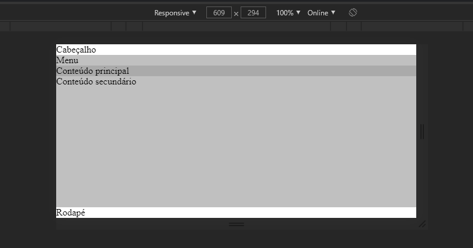

E vamos configurar as barras laterais para ocuparem um tamanho base de 200px, de forma inflexível.

```css
@media (min-width: 768px) {
    /* ... */

    .hg-conteudo > aside,
    .hg-conteudo > nav {
        flex: 0 0 200px;
    }
}
```

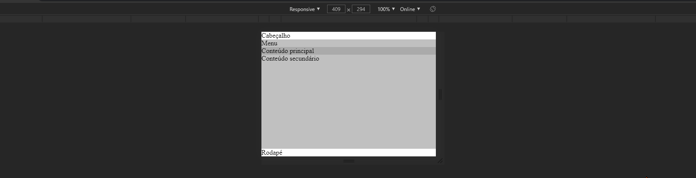

## Ajustes finais

Agora só falta tratar os casos extremos de _viewports_ muito largas. A maneira mais comum é definir um tamanho máximo para o corpo da página (`body`) e centralizá-lo usando a técnica das bordas horizontais automáticas (`auto`).

```css
body {
    margin: 0 auto;
    max-width: 1440px;
    /* ... */
}
```

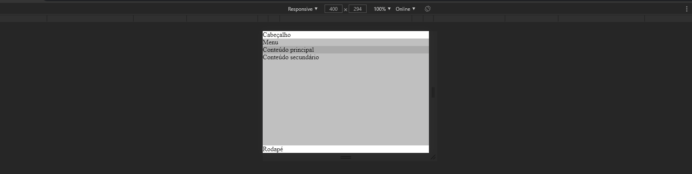

Para finalizar, falta garantir que o counteúdo principal seja flexível em ambas as situações, já que ainda não está em pequenas _viewports_. Podemos somente mover a regra de dentro da _media query_ para fora dela.

```css
.hg-conteudo > main {
    flex: 1;
}
```

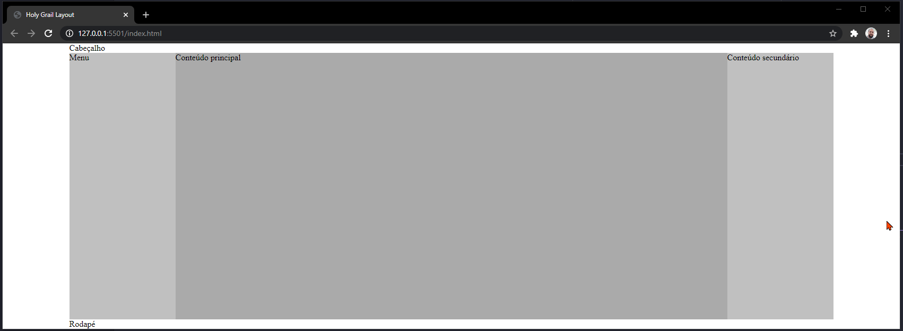

E pronto! 😊

Veja exemplos funcionais [sem conteúdo](https://ermogenes.github.io/holy-grail-layout/) e [com conteúdo](https://ermogenes.github.io/holy-grail-layout/index-conteudo.html).

## Código da solução final

Disponível [aqui](https://github.com/ermogenes/holy-grail-layout/).

### Marcação (`index.html`)

```html
<!DOCTYPE html>
<html lang="pt-BR">
<head>
    <meta charset="UTF-8">
    <meta name="viewport" content="width=device-width, initial-scale=1.0">
    <title>Holy Grail Layout</title>
    <link rel="stylesheet" href="style.css">
</head>
<body>
    <header>Cabeçalho</header>
    <div class="hg-conteudo">
        <main>Conteúdo principal</main>
        <nav>Menu</nav>
        <aside>Conteúdo secundário</aside>
    </div>
    <footer>Rodapé</footer>
</body>
</html>
```

### Estilo (`style.css`)

```css
body {
    margin: 0 auto;
    max-width: 1440px;
    min-height: 100vh;
    display: flex;
    flex-flow: column;
}

.hg-conteudo {
    flex: 1;
    display: flex;
    flex-flow: column;
}

.hg-conteudo > nav {
    order: -1;
}

.hg-conteudo > main {
    flex: 1;
}

@media (min-width: 768px) {
    .hg-conteudo {
        flex-flow: row;
    }

    .hg-conteudo > aside,
    .hg-conteudo > nav {
        flex: 0 0 200px;
    }
}
```
