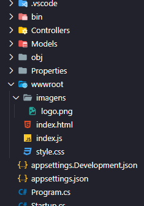
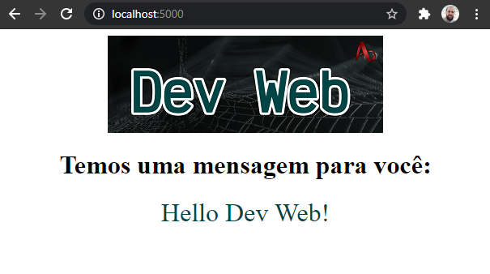
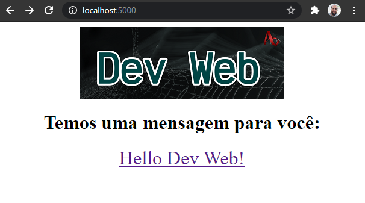

# ASP.NET Core WebApi - Hello World

[📽 Veja esta vídeo-aula no Youtube](#) _Em breve..._

Para criarmos nossa primeira API de _backend_ usaremos o _framework_ ASP.NET Core. Ele usa o conceito orientado a objetos na arquitetura MVC, que se baseia em 3 pilares: _Model_, _View_ e _Controller_, onde:

- _Model_: as classes que representam a estrutura dos dados da aplicação;
- _View_: a interface da aplicação, visível ao usuário;
- _Controller_: a lógica da aplicação, que manipula os _Models_ e repassa os dados para as _Views_.

Vamos usar o _template_ `webapi` para iniciar nosso projeto, e depois personalizá-lo.

## Usando o _template_ inicial

Crie o projeto usando o template `webapi`, assim como você usaria `console`.

```
dotnet new webapi
```

Serão criados vários arquivos, entre eles:

- `Program.cs` - arquivo inicial da aplicação, que iniciará um servidor HTTP para responder às requisições.
- `Startup.cs` - ponto inicial do servidor HTTP, onde podemos configurar suas funcionalidades.

Há também uma API de exemplo, que retorna uma lista aleatória de previsões do tempo _fake_, somente para teste da aplicação. Vamos usá-la para ver se nossa aplicação está rodando.

Execute o projeto normalmente, usando `dotnet run`. A saída deve ser algo do tipo:

```
info: Microsoft.Hosting.Lifetime[0]
      Now listening on: https://localhost:5001
info: Microsoft.Hosting.Lifetime[0]
      Now listening on: http://localhost:5000
info: Microsoft.Hosting.Lifetime[0]
      Application started. Press Ctrl+C to shut down.
info: Microsoft.Hosting.Lifetime[0]
      Hosting environment: Development
info: Microsoft.Hosting.Lifetime[0]
      Content root path: C:\caminho\do\projeto\nomeDoProjeto
```

Atente-se às informações:

- `Now listening on: https://localhost:5001`:  a aplicação está ouvindo a porta `5001`, usando `https`.
- `Now listening on: http://localhost:5000`:  a aplicação está ouvindo a porta `5000`, usando `http`.
- `Application started. Press Ctrl+C to shut down.`: a aplicação vai ficar rodando até que você a interrompa usando `Ctrl+C`.

Vá até o navegador e acesse `https://localhost:5001` e `http://localhost:5000`. Você não achará nenhum conteúdo, já que nada está sendo entregue para a raíz do _site_. Porém, há conteúdo sendo servido pela _controller_ `WeatherForecast`. Ela responde à rota `/WeatherForecast` com um arranjo JSON contendo o seu resultado. Para vê-lo, então, precisamos acessar `https://localhost:5001/WeatherForecast` ou `http://localhost:5000/WeatherForecast`.

Perceba que você não conseguirá acessar nenhum deles, devido à configuração de segurança. Por simplicidade vamos desabilitar o redirecionamento automático para HTTPS, comentando a linha abaixo em `Startup.cs`:

```cs
    // app.UseHttpsRedirection();
```

Pare o servidor e o inicie novamente. Agora você conseguirá acessar a versão sem HTTPS, em `http://localhost:5000/WeatherForecast`, e verá algo como:

```json
[
  {
    "date": "2020-10-27T12:31:50.0427198-03:00",
    "temperatureC": 1,
    "temperatureF": 33,
    "summary": "Freezing"
  },
  {
    "date": "2020-10-28T12:31:50.0427449-03:00",
    "temperatureC": 46,
    "temperatureF": 114,
    "summary": "Scorching"
  },
  {
    "date": "2020-10-29T12:31:50.042746-03:00",
    "temperatureC": 30,
    "temperatureF": 85,
    "summary": "Hot"
  },
  {
    "date": "2020-10-30T12:31:50.0427462-03:00",
    "temperatureC": 24,
    "temperatureF": 75,
    "summary": "Cool"
  },
  {
    "date": "2020-10-31T12:31:50.0427468-03:00",
    "temperatureC": 7,
    "temperatureF": 44,
    "summary": "Bracing"
  }
]
```

Para habilitar HTTPS, precisamos da maiores configurações, o que não é o foco agora.

## Criando uma _controller_ simples

Vamos criar uma _controller_ que responda à rota `/HelloWorld` e nos retorne um objeto JSON `{ mensagem: "Hello Dev Web!" }`.

Primeiro vamos excluir os arquivos do exemplo `WeatherForecast`. Exclua a _model_ `WeatherForecast.cs`, e a _controller_ `Controllers\WeatherForecastController.cs`.

Não vamos criar um _model_, porque nosso resultado é muito simples. Vamos direto para a _controller_. Crie na pasta `Controllers` um arquivo com o nome da rota desejada, mais a palavra `Controller`, e a extensão `.cs`. No caso, utilize `Controllers\HelloWorldController.cs`. Seu conteúdo:

```cs
using System;
using Microsoft.AspNetCore.Mvc;

namespace nomeDoProjeto.Controllers
{
    [ApiController]
    [Route("[controller]")]
    public class HelloWorldController : ControllerBase
    {
        [HttpGet]
        public Object Get()
        {
            return new { mensagem = "Hello Dev Web!" };
        }
    }
}
```

Linha a linha:

- `namespace nomeDoProjeto.Controllers` indica o nome que usaremos para referenciar nossa _controller_.
- `public class HelloWorldController : ControllerBase` cria uma classe chamada `HelloWorldController`, que herda todas as características de `ControllerBase`. Faça isso sempre que sua classe for uma _controller_ de API. Exige referência a `Microsoft.AspNetCore.Mvc`.
- `[ApiController]` marca a classe como uma _controller_ de API, e garante que ela saberá receber e responder requisições HTTP.
- `[Route("[controller]")]` indica a rota a ser respondida, no caso, o nome da _controller_ (`/HelloWorld`).
- `public Object Get()` cria um método como nome `Get`, sem argumentos, que retorna um objeto. Usar a classe `Object` exige referência a `System`.
- `[HttpGet]` indica que o método responderá a chamadas HTTP feitas com o verbo GET, que é o verbo usado em chamadas de navegador usando URL, e também a chamada padrão da Fetch API.
- `new { mensagem = "Hello Dev Web!" }` cria um objeto sem classe definida (ou seja, do tipo `Object`), contento uma única propriedade, `mensagem`, com o valor que queremos retornar.

Ao rodar esse programa, a aplicação passa a escutar `http://localhost:5000/HelloWorld`, e retornar o JSON abaixo:

```json
{
  "mensagem": "Hello Dev Web!"
}
```

Nosso _backend_ está funcional.

## _Frontend_ integrada

Podemos acessar essa API usando Fetch. Para isso, vamos colocar arquivos HTML, CSS e JavaScript em nossa aplicação.

Primeiro, precisamos ativar o recurso que entrega arquivos estáticos. Adicione as linhas em `Startup.cs`, antes de `app.UseRouting()`:

```cs
app.UseDefaultFiles();
app.UseStaticFiles();
```

- `app.UseStaticFiles()` indica que a aplicação deve entregar, além dos _endpoints_, arquivos estáticos. Eles deverão estar em `/wwwroot`.
- `app.UseStaticFiles()` indica que a aplicação deve entregar arquivos padrão (como `index.html`) quando o nome de arquivo não for indicado.

Agora, crie a pasta `/wwwroot`, e nele coloque sua aplicação. Por exemplo:

**Marcação**:

```html
<!DOCTYPE html>
<html lang="pt-BR">
<head>
    <meta charset="UTF-8">
    <meta name="viewport" content="width=device-width, initial-scale=1.0">
    <title>Hello Dev Web</title>
    <link rel="stylesheet" href="style.css">
</head>
<body>
    
    <h1>Temos uma mensagem para você:</h1>
    <div id="mensagem"></div>
    <script src="index.js"></script>
</body>
</html>
```

**Estilização**

```css
body {
  display: flex;
  flex-flow: column;
  justify-content: center;
  align-items: center;
}

body > * {
  flex: 1;
}

#mensagem {
  color: #004545;
  font-size: 2em;
}
```

**Script**:

```js
const iniciar = async () => {
    const mensagem = document.getElementById("mensagem");
    const response = await fetch('/HelloWorld');
    const result = await response.json();
    mensagem.innerHTML = result.mensagem;
};

document.addEventListener('DOMContentLoaded', iniciar);
```

Você terá uma estrutura assim:



Ao acessar, você verá algo do tipo:



## Retornando um objeto complexo

Digamos que gostaríamos de retornar um objeto com uma estrutura mais complexa, por exemplo, uma mensagem um link para o Dev Web.

O ideal é criar uma classe que especifique esse formato explicitamente. Normalmente a chamamos de DTO, ou _Data Transfer Object_. Vamos criar então uma _model_ chamada `HelloWorldModel`, em `/Models`, com essa finalidade.

```cs
namespace testeHWWebapi.Models
{
    public class HelloWorldModel
    {
        public string mensagem { get; set; }
        public string url { get; set; }
    }
}
```

Agora, vamos alterar a `controller` para retornar um objeto desse tipo.

```cs
using Microsoft.AspNetCore.Mvc;
using testeHWWebapi.Models; // referência às models

namespace testeHWWebapi.Controllers
{
    [ApiController]
    [Route("[controller]")]
    public class HelloWorldController : ControllerBase
    {
        [HttpGet]
        public HelloWorldModel Get() // o retorno é uma model
        {
            // Cria uma instância de HelloWorldModel, e a retorna
            var resultado = new HelloWorldModel
            {
                mensagem = "Hello Dev Web!",
                url = "https://github.com/ermogenes/aulas-programacao-web/"
            };
            return resultado;
        }
    }
}
```

O resultado passa a ser:

```json
{
  "mensagem": "Hello Dev Web!",
  "url": "https://github.com/ermogenes/aulas-programacao-web/"
}
```

E podemos alterar o script para considerar o link.

```js
mensagem.innerHTML = `<a href="${result.url}">${result.mensagem}</a>`;
```


