# Leiaute

[📽 Veja esta vídeo-aula no Youtube](https://youtu.be/z92A3u5I09w)

# Flex

Historicamente diversas técnicas foram utilizadas para criação de leiautes em HTML/CSS. Utilizaremos neste curso a técnica de leiaute flexível, através da especificação **flex**.

Nesse método sempre temos os papéis do _flex container_ (recipiente) e dos _flex items_ (itens). Todos os elementos itens devem ser filhos do elemento _container_.

Ao atribuir `display: flex` ao _flex container_ ele se comporta como um elemento em nível de bloco e seus filhos são agora _flex items_. Podemos mudar seu comportamentos alterando propriedades do _container_ e dos itens.

Ex.:

Marcação:
```html
<div class="meu-container">
    <div>Item 1</div>
    <div id="meu-item-especial">Item 2</div>
    <div>Item 3</div>
</div>
```

Estilo:
```css
.meu-container {
    display: flex;
    /* estilização do flex-container */
}

.meu-container > * {
    /* estilização de todos os flex-items */
}

#meu-item-especial {
    /* estilização de um flex-item específico */
}
```

## Comportamento de flex-items

Veja o seguinte exemplo:

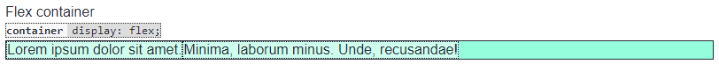

Dois itens foram criados, e posicionados lado-a-lado, com o tamanho definido de acordo com seu conteúdo.

Perceba que ao adicionar mais itens, eles se redimensionam para caber no _container_:

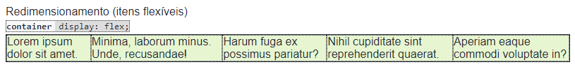

Caso não seja possível, eles vazam:

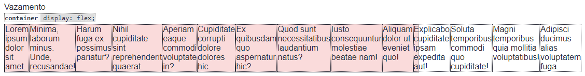

A principal ideia aqui é que os elementos fluem pelo **eixo principal**, no caso o eixo das linhas (`row`).

Podemos controlar o eixo de fluxo através de `flex-flow`, que pode ser `row` (linhas) ou `column` (colunas):

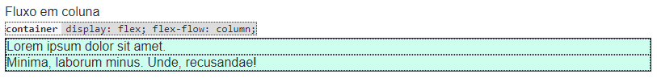

Também podemos usar `flex-flow` para controlar o vazamento. Se indicarmos `wrap` os itens podem quebrar a "linha" (na verdade, o eixo principal).

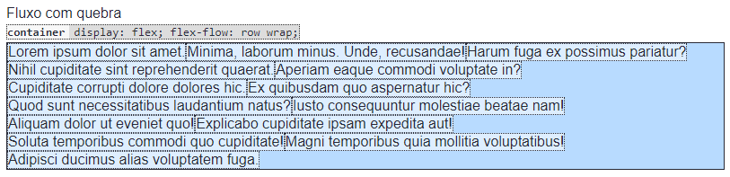

## Alinhamento no eixo principal

Podemos usar o alinhamento (ou justificação) para indicar como os itens se distribuem no espaço vazio em relação ao eixo principal.

Usamos a propriedade do _container_ `justify-content` com os seguintes valores:


Veja estes exemplos:

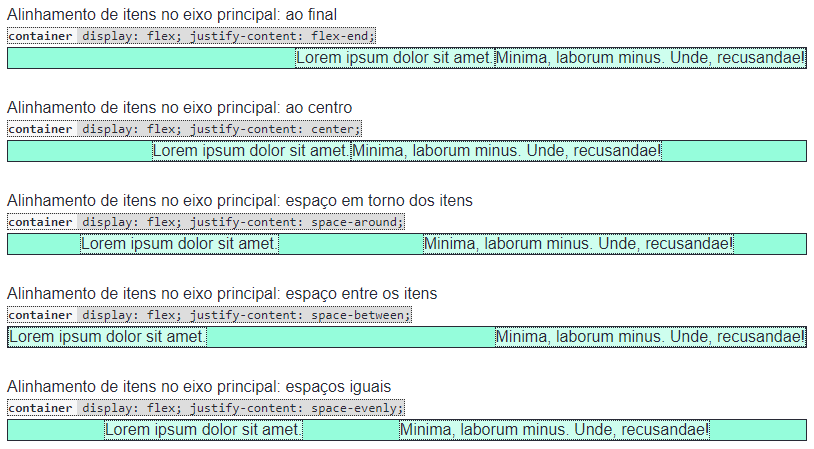

## Alinhamento no eixo transversal

Caso os itens tenham alturas distintas entre si, ou não ocupem toda a altura do _container_, podemos acabar com espaços não ocupados no eixo transversal ao eixo principal. Nesse caso, alinhamos os itens usando a propriedade do _container_ `align-items` com o sseguintes valores:


Veja estes exemplos:

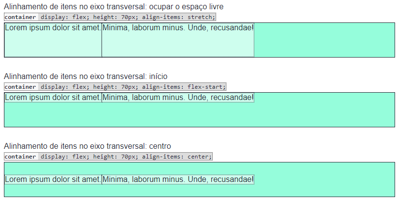

Caso tenhamos quebra no eixo principal podemos controlar o espaço livre entre as "linhas" usando `align-content`:


Veja estes exemplos:

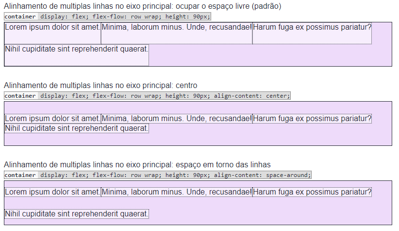

## Propriedades dos `flex-items`

Podemos configurar os itens individualmente, se necessário.

Veja este exemplo:

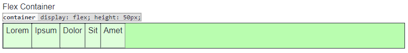

Agora, são configurados no _container_ os alinhamentos em ambos os eixos:

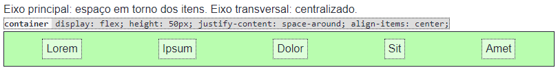

E então, os segundo e quarto itens recebem uma alteração no alinhamento do eixo secundário através da propriedade `align-self` (equivalente a `align-items` mas exclusiva dos itens).

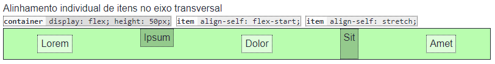

### Controlando o tamanho ocupado pelos itens

Veja o exemplo a seguir:

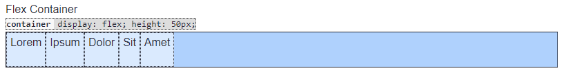

Digamos que queremos ocupar todo o espaço disponível no _container_, em ambos os eixos. A maneira mais fácil de obter esse comportamento é usando a propriedade `flex` dos itens, com o valor `1`.

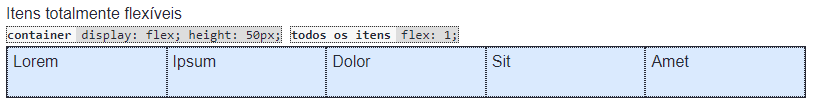

Podemos ajustar a taxa de crescimento proporcionalmente em relação aos demais usando valores maiores em `flex`:

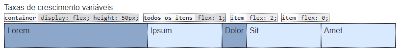

Percebam que `0` fez o terceiro item não crescer de maneira alguma. Dizemos que ele é _inflexível_.

Caso o espaço não seja suficiente, podemos controlar também a taxa de redução dos elementos. Veja o exemplo:

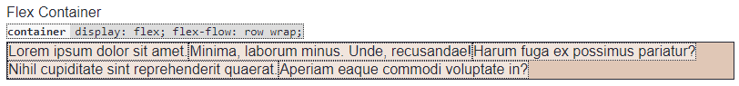

Ao segundo item foi dito para não crescer, mas reduzir se necessário (usando `flex: 0 1;` ou `flex: initial;`):

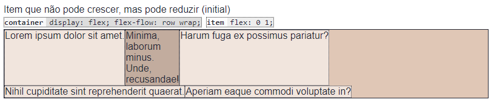

Ao segundo item foi dito crescer e reduzir, conforme necessário (usando `flex: 1 1;` ou `flex: auto;`):

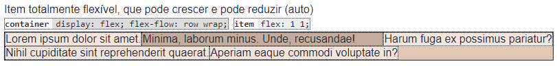

Ao segundo item foi tornado totalmente inflexível, e foi indicada uma medida base (200px) para o eixo principal (usando `flex: 0 0 200px;` ou `flex: none; flex-basis: 200px;`):

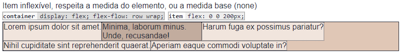

Caso tenhamos quebra em mais de uma "linha", para ocupar todos os espaços em todas as linhas precisamos torná-los totalmente flexíveis e usar uma medida base `auto`, como em  `flex: 1 1 auto;`:

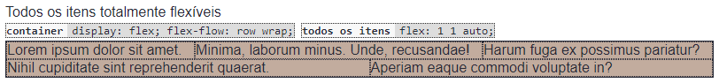

# Elementos HTML semânticos

Ao criar leiautes, era comum na era HTML versão 4 fazer todos os elementos com `div`s e utilizar classes e identificadores com nomes indicando sua função na página.

```html
<div id="cabecalho"></div>
<div id="menu"></div>
<div id="conteudo">
    <div class="post"></div>
    <div class="post"></div>
    <div class="post"></div>
</div>
<div id="rodape"></div>
```

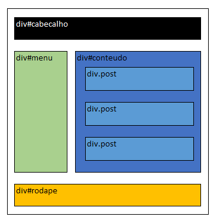

Com o advento do HTML5 foram criadas _tags_ semânticas com o mesmo comportamento de `div` (ou `span`), porém com semânticas comuns à maioria dos _sites_, facilitando assim a sua identificação. **Sempre use _tags_ semânticas quando possível**.

```html
<header></header>
<nav></nav>
<main>
    <article></article>
    <article></article>
    <article></article>
</main>
<footer></footer>
```

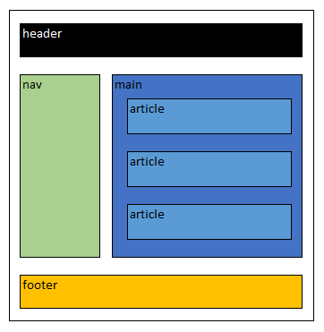

```html
<article>
    <header>
        <h1></h1>
    </header>
    <div>
        <h2></h2>
        <p></p>
        <h2></h2>
        <p></p>
        <p></p>
    </div>
</article>
```

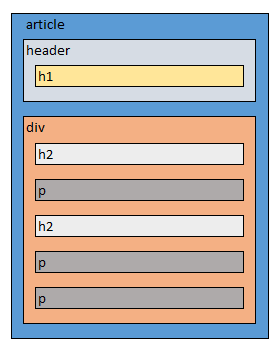

Há por volta de 100 _tags_ semânticas no HTML. As mais comuns:

Em nível de bloco:

- `header` - cabaçalho de um documento ou seção
- `footer` - rodapé de um documento ou seção
- `main` - principal conteúdo do documento
- `section` - seção do documento
- `h1` a `h6` - título de seção
- `article` - conteúdo independente
- `nav` - área de navegação com links
- `aside` - conteúdo periférico, não diretamente relacionado ao principal

Em nível de linha:

- `a` - âncora (link)
- `abbr` - abreviação
- `b` - atenção ao texto (_bring attention_)
- `cite` - citação a trabalho de terceiro (bibliografia, por exemplo)
- `code` - código (como em linhas de programação, por exemplo)
- `del` - texto excluído
- `em` - ênfase
- `i` - expressão idiomática (termos técnicos, por exemplo)
- `ins` - texto incluído
- `kbd` - texto a ser escrito no teclado, teclas de atalho, etc.
- `mark` - texto marcado (com um marca texto, por exemplo)
- `q` - texto de autoria de terceiro
- `s` - texto riscado
- `small` - texto em letras miúdas
- `strong` - texto importante
- `sub` - subscrito
- `sup` - sobrescrito
- `time` - datas e horas
- `u` - texto não-articulado (com erro de grafia, por exemplo)
- `var` - variáve matemática ou de programação

Muitos desses elementos são estilizados na folha de estilos do navegador (_user agent stylesheet_), devendo se tomar cuidado para mantê-los consistentes entre todos os usuários.

<!-- 
# Grid

# Colunas
-->
