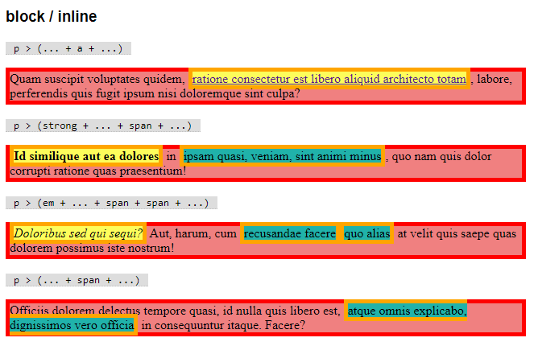
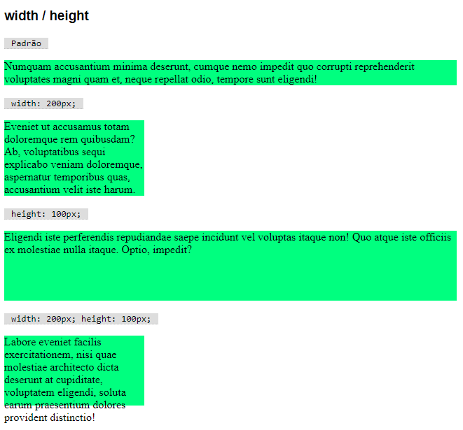
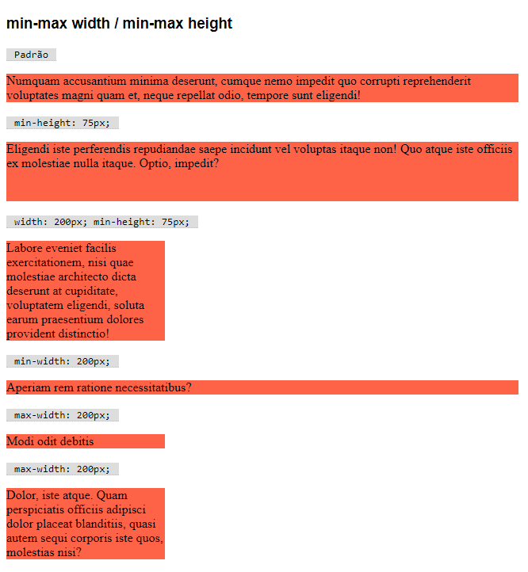
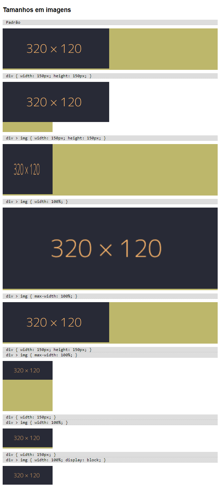

# Leiaute

## Fluxo normal

Cada elemento HTML é desenhado na tela de maneira diferente, de acordo com sua definição. Alguns elementos, como um parágrafo, são chamados de elementos em **nível de bloco**, e tem um comportamento diferente de elementos que fluem como um texto, chamado de elementos em **nível de linha**.

**Elementos em nível de bloco, ou `block`**:
- ocupam a largura total do elemento em que estão contidos
- ocupam a altura necessária para exibir todo o seu conteúdo
- respeitam alterações de tamanho via CSS
- possuem a propriedade `display: block`
- exemplos: `p`, `ol`, `li`, `form`
- _tag_ genérica: `div`

**Elementos em nível de linha, ou `inline`**
- ocupam a largura e a altura necessária para exibir todo o seu conteúdo
- seu texto flue entre linhas, podendo ser quebrado
- possuem a propriedade `display: inline`
- exemplos: `a`, `img`, `strong`, `em`
- _tag_ genérica: `span`



Após o seu posicionamento padrão, baseado no seu conteúdo, são aplicadas as bordas, margens e _paddings_, conforme o _box-model_.

## `div` e `span`

Quando precisamos de uma _tag_ com comportamento em bloco genérica, sem uma semântica específica, utilizamos a _tag_ `div` (divisão). Similarmente, usamos a tag _span_ (intervalo) para obtermos um elemento `inline` genérico.

Exemplo:
```html
<div>
    Este é um elemento genérico de bloco. <span>Este é um elemento genérico em linha</span>
</div>
```

## `display`

Podemos controlar o método de renderização de um elemento através da propriedade `display`.

- `display: block;` torna o elemento em um elemento em nível de bloco
- `display: inline;` torna o elemento em um elemento em nível de linha
- `display: flex;` torna o elemento em um elemento em nível de bloco, porém seu conteúdo respeita o modelo **flex** e não o fluxo normal
- `display: grid;` torna o elemento em um elemento em nível de bloco, porém seu conteúdo respeita o modelo **grid** e não o fluxo normal

Perceba que `flex` e `grid` funcionam de forma diferente, pois eles próprios externamente são blocos, mas internamente são _containers_ para que os elementos filhos se posicionem de maneiras específicas. Veremos esses modelos em breve.

## Tamanho

Os elementos possuem um tamanho intrínseco de acordo com seu conteúdo. Dependendo do seu `display`, podemos definir restrições de tamanho, o que chamamos de tamanho extrínseco:

Elementos `inline` não respeitam restrições de tamanho, sempre vão se adaptar ao tamanho do se elemento-pai e do seu conteúdo. Para elementos `block`:

- `width` - largura do elemento.
- `height` - altura do elemento.



Caso o espaço não seja suficiente para conter o conteúdo do elemento, o conteúdo vaza. Podemos controlar o vazamento usando `overflow`.

Também podemos usar restrições mais brandas:

- `min-width` e `min-height` - tamanhos mínimos.
- `max-width` e `max-height` - tamanhos máximos.

Caso seja definido um tamanho mínimo, o elemento ocupa pelo menos o tamanho definido. Caso seja definido um tamanho máximo, elemento cresce somente até o tamanho definido.



Quando trabalhamos com imagens, os tamanhos vão controlar o seu redimensionamento. Elementos `img` (que são `inline`!) tem como tamanho intrínseco o tamanho da imagem (a não ser que sejam definidos tamanhos na marcação HTML).



Pode ser bem difícil controlar corretamente tamanho de imagens usando esses mecanismos. Por sorte, logo poderemos usar `flex`.

## Vazamento / `overflow`

## Floats

Permitem que elementos sejam circundados por outros elementos.

- `float: left;` - tira o elemento do fluxo normal e o desloca à esquerda, de forma que os próximos elementos circundem o elemento flutuante.
- `float: right;` - tira o elemento do fluxo normal e o desloca à direita, de forma que os próximos elementos circundem o elemento flutuante.


😖 _Dica_: Faça um favor para você mesmo: não tente criar leiautes usando _floats_. Designers mais experientes tentaram por mais de 10 anos até que desistiram. Então se criou a especificação _flex_.

## Posição
    static
    relative
    absolute
    fixed
    sticky
    z-index

## Colunas


## Elementos HTML semânticos


