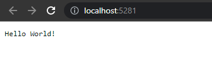
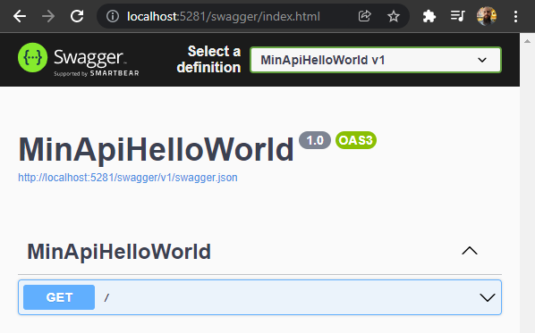
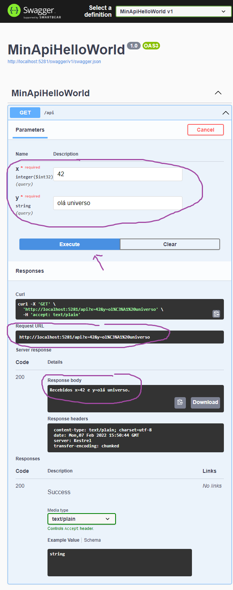
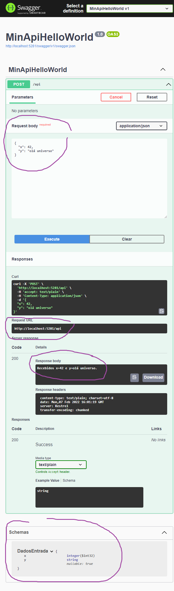
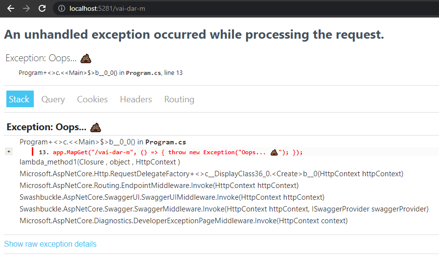
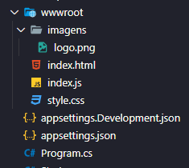
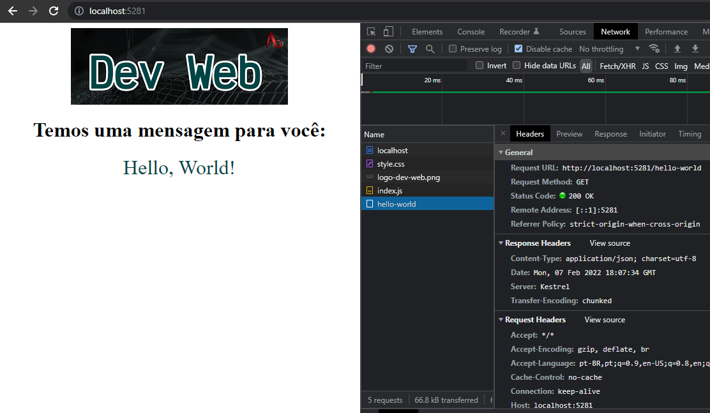
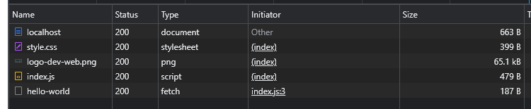

# Backend com Minimal APIs

[📽 Veja esta vídeo-aula no Youtube](https://youtu.be/CoU15wM8Ang)

_Este material uma o método *Minimal API* e só funciona em .NET 6 ou superior. Caso use uma versão anterior, ou queira conhecer o método *MVC*, veja [este material](hw-web-api.md)._

## Criando o projeto usando _template_ `web`

Vamos usar o template `web` para iniciar nosso projeto, e depois personalizá-lo.

```
dotnet new web
```

Serão criados diversos arquivos, entre eles:

- `nome-do-projeto.csproj`: Arquivo base do projeto
- `appsettings.json` e `appsettings.Development.json`: Configurações da aplicação
- `Properties/launchSettings.json`: Configurações do servidor HTTP embutido
- `Program.cs`: Arquivo inicial da aplicação

### Arquivo `.csproj`

Conteúdos:

- `<Project Sdk="Microsoft.NET.Sdk.Web">` indica que é um projeto web. Em aplicações console o SDK usado é diferente (`Microsoft.NET.Sdk`). Isso permitirá que sejam usadas funcionalidades HTTP.
- `<TargetFramework>net6.0</TargetFramework>` indica que a aplicação necessita do _runtime_ do .NET 6 para executar. Veja esta [aula](https://github.com/ermogenes/aulas-programacao-csharp/blob/master/content/templates-net6.md) para mais detalhes. 
- `<Nullable>enable</Nullable>` e `<ImplicitUsings>enable</ImplicitUsings>` ativam duas funcionalidade opcionais do C# em suas versões mais recentes.

### `Program.cs`

Arquivo base da aplicação, no formato do .NET 6. Veja esta [aula](https://github.com/ermogenes/aulas-programacao-csharp/blob/master/content/templates-net6.md) para mais detalhes.

Código gerado:
```cs
var builder = WebApplication.CreateBuilder(args);
var app = builder.Build();

app.MapGet("/", () => "Hello World!");

app.Run();
```

### Executando a aplicação

Faça exatamente como em uma aplicação console:
```
dotnet run
```

Você verá algo do tipo:
```
C:\etec\MinApiHelloWorld>dotnet run
Compilando...
info: Microsoft.Hosting.Lifetime[14]
      Now listening on: https://localhost:7262
info: Microsoft.Hosting.Lifetime[14]
      Now listening on: http://localhost:5281
info: Microsoft.Hosting.Lifetime[0]
      Application started. Press Ctrl+C to shut down.
info: Microsoft.Hosting.Lifetime[0]
      Hosting environment: Development
info: Microsoft.Hosting.Lifetime[0]
      Content root path: C:\ermogenes\code\etec\web\2022\MinApiHelloWorld\
```

- `Now listening on` indica os URLs pelos quais a aplicação responderá.
- `Application started. Press Ctrl+C to shut down.` indica que a aplicação está em execução e pode ser finalizada usando `Ctrl+C`.

Acessando um dos URLs indicados você será redirecionado ao seu navegador padrão.



### Configurando HTTPS

Caso encontre o erro abaixo, você não tem certificado de desenvolvimento:

```
Compilando...
Unhandled exception. System.InvalidOperationException: Unable to configure HTTPS endpoint. No server certificate was specified, and the default developer certificate could not be found or is out of date.
```

Corrija usando `dotnet dev-certs https`.

Mais opções:

- `dotnet dev-certs https --check` verifica seus certificados de desenvolvimento
- `dotnet dev-certs https` cria um certificados de desenvolvimento auto-assinado
- `dotnet dev-certs https --check --trust` verifica seus certificados de desenvolvimento confiáveis
- `dotnet dev-certs https --clean` exclui os certificados de desenvolvimento
- `dotnet dev-certs https --trust` cria um certificados de desenvolvimento auto-assinado e adiciona como confiável

Para forçar o redirecionamento para `https`caso o usuário envie `http`, use:

```cs
app.UseHttpsRedirection();
```

### `WebApplication` e _middlewares_

A variável `app`, do tipo `WebApplication`, representa nossa aplicação. Ela é ativada pelo método `Run()`, quando começa a esperar por requisições HTTP. É criada pelo método `Build()` de um objeto construtor, que recebe a maioria das configurações. Muitas configurações são efetuadas usando o mecanismo de serviços do ASP.NET.

Antes de executar, podemos adicionar funcionalidades ao servidor, chamadas de _middlewares_. Cada requisição é submetida aos _middlewares_ pertinentes para realizar as ações desejadas. Adicionamos novos _middlewares_ para ensinar nossa aplicação a tratar requisições de formas diferentes.

No _template_ padrão é criado um único _middleware_:

```cs
app.MapGet("/", () => "Hello World!");
```

Ela cria uma rota (_endpoint_) que atende à requisições HTTP de verbo GET na URL "/", executando uma função que retorna a _string_ `"Hello World"`.

## _Logging_

Podemos usar `Console.WriteLine` em nossa aplicação web, mas há um mecanismo mais interessante.

Muitas vezes pode ser necessário gerar _logs_ na aplicação de outras maneiras que não no console. Usando o _Logger_, podemos decidir posteriormente a melhor maneira de tratar isso.

Há vários níveis de _log_ que podem ser criados:

- `app.Logger.LogInformation` - Informação
- `app.Logger.LogWarning` - Aviso
- `app.Logger.LogError` - Erro
- `app.Logger.LogCritical` - Erro crítico

Exemplos:
```cs
app.Logger.LogInformation("Aplicação iniciada");
app.Logger.LogWarning("Algo estranho aconteceu. Verifique.");
app.Logger.LogError("Erro na aplicação. Corrija.");
app.Logger.LogCritical("Erro crítico. Corrija agora.");
```

## OpenAPI (Swagger)

Para podermos rapidamente testar nossos _endpoints_, bem como para mantermos uma documentação padronizada para nossa API podemos utilizar o padrão OpenAPI, conhecido como Swagger.

Adicione o pacote:
```
dotnet add package Swashbuckle.AspNetCore
```

Adicione os seguintes serviços na configuração da aplicação:

- `AddSwaggerGen` - gera o arquivo `.jspn` com a documentação da API
- `AddEndpointsApiExplorer` - gera uma página para navegação

Adicione também os _middlewares_:

Exemplo:

```cs
...
builder.Services.AddSwaggerGen();
builder.Services.AddEndpointsApiExplorer();
...
app.UseSwagger();
app.UseSwaggerUI();
...
```

Isso adiciona o atendimento à URL `/swagger`.



## Roteamento

Podemos criar _endpoints_ usando quaisquer métodos HTTP. Os mais comuns:

```cs
app.MapGet("/api", () => "Resposta ao método GET");
app.MapPost("/api", () => "Resposta ao método POST");
app.MapPut("/api", () => "Resposta ao método PUT");
app.MapDelete("/api", () => "Resposta ao método DELETE");
app.MapMethods("/api", new[] { "PATCH" }, () => "Resposta ao método PATCH");
```

Nos exemplos acima, as chamadas atendem a verbos diferentes na mesma URL (`/api`).

### Parâmetros

Podemos receber informações juntamente com a requisição através do uso de parâmetros.

Vamos usar neste curso anotações para indicar a origem dos parâmetros. Para isso, adicione esta referência:

```cs
using Microsoft.AspNetCore.Mvc;
```

Também podemos usar nomes diferentes no parâmetro e na variavel.

Ex.:
```cs
... [From_____(Name = "max-registos")] int maxRegistros ...
```

#### `FromQuery`

Dados contidos como variáveis após o _endpoint_ base.

Por exemplo, fazendo:
```cs
app.MapGet("/api", ([FromQuery] int x, [FromQuery] string y) => {
    return $"Recebidos x={x} e y={y}.";
});
```

Teremos acesso às variáveis `x` e `y` em uma chamada GET a `/api?x=valorX&y=valorY`.



#### `FromRoute`

Dados contidos como variáveis dentro do _endpoint_ base.

Por exemplo, fazendo:
```cs
app.MapGet("/api/{x}/abc/{y}", ([FromRoute] int x, [FromRoute] string y) => {
    return $"Recebidos x={x} e y={y}.";
});
```

Teremos acesso às variáveis `x` e `y` em uma chamada GET a `/api/valorX/abc/valorY`.


#### `FromBody`

Dados contidos no corpo da mensagem, em formato JSON.

Como só pode haver um `FromBody` por _endpoint_, precisamos criar uma classe para receber mais de um.

Por exemplo, fazendo:
```cs
app.MapPost("/api", ([FromBody] DadosEntrada dadosEntrada) => {
    return $"Recebidos x={dadosEntrada.x} e y={dadosEntrada.y}.";
});

...

public class DadosEntrada
{
    public int x { get; set; }
    public string? y { get; set; }
}
```

Teremos acesso às variáveis `x` e `y` em uma chamada GET a `/api` com o corpo:
```json
{
  "x": 42,
  "y": "olá universo"
}
```



#### `FromServices`

Dados injetados no servidor.

Uma aplicação bastante comum é injetar o contexto de banco de dados em todas as rotas, para não ter que criá-las várias vezes.

Por exemplo, fazendo:
```cs
...
builder.Services.AddDbContext<clientesContext>(opt =>
{
    string connectionString = builder.Configuration.GetConnectionString("clientesConnection");
    var serverVersion = ServerVersion.AutoDetect(connectionString);
    opt.UseMySql(connectionString, serverVersion);
});
...
app.MapGet("/api", ([FromServices] clientesContext db) => {
    return db.Cliente.ToList<Cliente>();
});
```

O _endpoint_ terá acesso ao contexto de banco de dados através de um serviço injetado a cada requisição.

### Resultados

Tipos possíveis de retornos:

- `Results.Redirect(url)` redireciona para outra URL.
- `Results.StatusCode(n)` retorna uma resposta vazia, com código `n`.
- `Results.Text(string)` retorna uma _string_, com código 200.
- `Results.Ok(objeto)` retorna um objeto serializado em JSON, com código 200.
- `Results.NotFound()` retorna uma resposta vazia, código 404.
- `Results.BadRequest(objeto)` retorna um objeto serializado em JSON, com código 400.
- `Results.Created(...)` usado para retornar o resultado de uma inclusão REST.

Exemplo:
```cs
app.MapGet("/api/hello-world", () =>
{
    return Results.Ok(new {
        mensagem = "Hello, World!",
        dataHora = DateTime.Now
    });
});
```

## Exceções

Para ter visibilidade dos erros ocorridos na aplicação, podemos usar o _middleware_ `UseDeveloperExceptionPage()` para retornar uma tela com os detalhes da exceção. O ideal é fazer isso somente em ambiente de desenvolvimento, e não em produção.

```cs
if (app.Environment.IsDevelopment())
{
    app.UseDeveloperExceptionPage();
}
```

Para testar, gere uma exceção manualmente:

```cs
app.MapGet("/vai-dar-m", () => { throw new Exception("Oops... 💩"); });
```



## Servindo arquivos estáticos

Podemos adicionar _middlewares_ que entregam arquivos diretamente. Usamos esta funcionalidade para criar um servidor web, onde podemos hospedar nosso _frontend_.

Exemplo:
```cs
...
app.UseDefaultFiles();
app.UseStaticFiles();
...
```

- `UseDefaultFiles()` indica que a aplicação deve entregar arquivos estáticos. Eles deverão estar em `/wwwroot`.
- `UseStaticFiles()` indica que a aplicação deve entregar arquivos com nomes padrão (como `index.html`) quando o nome de arquivo não for indicado.

Por exemplo, caso tenhamos a seguinte estrutura de arquivos:



Serão atendidos os os URLs:

- `/`, com `index.html`.
- `/index.html`, com `index.html`.
- `/style.css`, com `style.css`.
- `/index.js`, com `index.js`.
- `/imagens/logo.png`, com `imagens/logo.png`.

## HelloWorld com _frontend_ e _backend_

_Backend_: `Program.cs`
```cs
var builder = WebApplication.CreateBuilder(args);

builder.Services.AddSwaggerGen();
builder.Services.AddEndpointsApiExplorer();

var app = builder.Build();

app.UseSwagger();
app.UseSwaggerUI();

app.UseDefaultFiles();
app.UseStaticFiles();

app.MapGet("/hello-world", () =>
{
    return Results.Ok(new {
        mensagem = "Hello, World!"
    });
});

app.Run();
```

Marcação: `wwwroot/index.html`
```html
<!DOCTYPE html>
<html lang="pt-BR">
  <head>
    <meta charset="UTF-8" />
    <meta name="viewport" content="width=device-width, initial-scale=1.0" />
    <title>Hello Dev Web</title>
    <link rel="stylesheet" href="style.css" />
  </head>
  <body>
    
    <h1>Temos uma mensagem para você:</h1>
    <div id="mensagem"></div>
    <script src="index.js"></script>
  </body>
</html>
```

Estilização: `wwwroot/style.css`
```css
body {
  display: flex;
  flex-flow: column;
  align-items: center;
}

body > * {
  flex: 1;
}

#mensagem {
  color: #004545;
  font-size: 2em;
}
```

_Script_: `wwwroot/index.js`
```js
document.addEventListener("DOMContentLoaded", async () => {
  const mensagem = document.getElementById("mensagem");
  const response = await fetch("/hello-world");
  const result = await response.json();
  mensagem.innerHTML = result.mensagem;
});
```

Imagem: `wwwroot/imagens/logo.png`


--- 

Resultado:




