# Objetos

O Javascript possui diversos tipos de dados primitivos (dados puros) e um tipo complexo, chamado `Object` (objeto).

Um objeto pode conter diversos valores, e não somente um. É uma estrutura de dados do tipo chave/valor, onde cada propriedade possui um nome (chave) e um valor.

No exemplo abaixo, o objeto possui três propriedades:

Nome da propriedade | Valor
--- | ---
usuario | "pjfry"
senha | "bender"
estaLogado | true

Para implementar esse objeto em JavaScript, precisamos declará-lo:

```js
let usuarioAtual = {
    usuario: "pjfry",
    senha: "bender",
    estaLogado: true,
};
```

- os símbolos `{` e `}` delimitam o objeto.
- dentro declaramoms diversas propriedades separadas por vírgulas, no formato `chave: valor`.
- propriedades podem ser de qualquer tipo, inclusive objetos.

Para acessar os valores, usamos a notação `.`:

```js
console.log(usuarioAtual.usuario); // exibe o nome do usuário no console
```

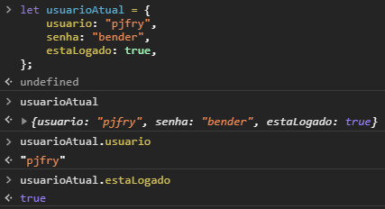

Propriedades podem ser criadas dinamicamente, e também excluídas.

```js
let cidade = {}; // objeto vazio
cidade.nome = "Mongaguá"; // cria uma propriedade no objeto
cidade.estado = { // cria uma propriedade que é outro objeto
    uf: "São Paulo",
    sigla: "SP",
};
delete cidade.estado.sigla; // exclui a propriedade sigla
```


🍌 Declarar um objeto como `const` garante que nenhuma atribuição será aceita para substituir o objeto como um todo, mas ainda permite que você altere suas propriedades, ou mesmo as adicione ou remova!

Ao acessar uma propriedade inexistente o retorno é `undefined`. Porém, se você tentar acessar um propriedade em `undefined` uma exceção é lançada. Para garantir que nenhum erro aconteça, use o operador de encadeamento opcional (_optional chainning_) `?`.

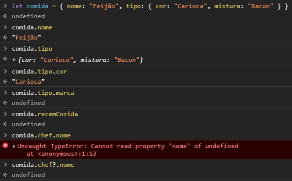

## Atalho para atribuição de propriedades

Uma situação muito comum é atribuir valores à propriedades com os mesmos nome e valor de variáveis já existentes. Por exemplo:

```js
let preco = 125.56;
let quantidade = 2;

let itemComprado = {
    preco: preco,
    quantidade: quantidade,
};
```

Nesse tipo de situação (a chave tem o mesmo nome da variável que contém o valor desejado) podemos pegar um atalho, no seguinte formato:

```js
let preco = 125.56;
let quantidade = 2;

let itemComprado = {
    preco,
    quantidade,
};
```

## Armazenamento por valor e por referência

Tipos primitivos são armazenados por valor. Nessa situação, ao realizar uma cópia, o valor é duplicado de forma independente.

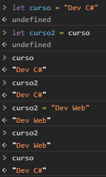

Ok, nada de mais. Porém, observe o que acontece quando fazemos o mesmo tipo de procedimento com objetos:

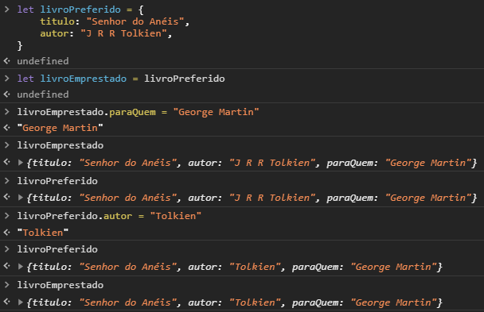

Quando você utiliza um objeto, está na verdade obtendo uma referência ao seu conteúdo na memória. Copiar um objeto copia essa referência, fazendo com que as duas variáveis apontem para o mesmo conteúdo. Ao modificar esse conteúdo, ambas as variáveis serão afetadas.

Quando não houver mais nenhuma referência a um objeto, ele é eliminado da memória pelo coletor de lixo (_garbage collector_) do _engine_.

## Comparação de objetos

Não há diferença entre `==` e `===` quando comparando objetos. A regra para ambos é:

- `true` quando variáveis referenciam o mesmo objeto;
- `false` nos demais casos, mesmo se os conteúdos sejam iguais.

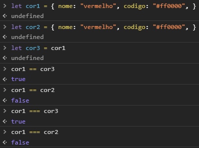

## Conversão de objetos para tipos primitivos

Está fora do nosso escopo entender como o JavaScript faz essas conversões, mas via de regra isso não parece ser uma boa prática na maioria das situações. Evite se possível.

# Arranjos (_são objetos_)

Objetos podem guardar diversos valores em suas propriedades, mas não há uma maneira embutida de tornar esses elementos ordenados. A linguagem disponibiliza para esses casos um _tipo especial de objeto_ onde as suas propriedades possuem números como nome, e são armazenadas internamente de maneira sequencial, sendo assim implementações da estrutura de dados **arranjo** (_array_).

Ao criar objetos com essa característica usamos `[]` em vez de `{}`, e acessamos os valores usando a notação `arranjo[chave]`:

```js
let sabores = ["Baunilha", "Flocos", "Napolitano"];
console.log(sabores[2]); // Napolitano
```

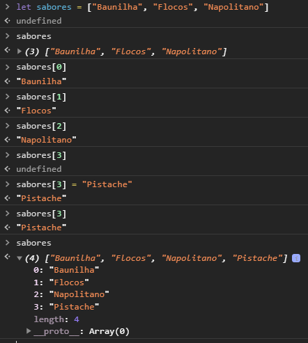

Podemos obter a quantidade de itens em um arranjo usando `.length`, mas atente-se ao fato de que ele retorna o maior índice + 1, e não exatamente a quantidade de itens.

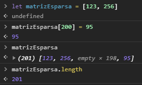

## Arranjos multidimensionais (matrizes)

São implementados criando-se arranjos de arranjos.

```js
let matriz = [
    [0, 2, 3],
    [1, 7, 9],
];
```

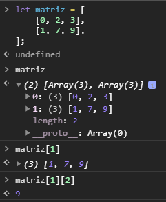

Perceba que matrizes em JavaScript são sempre irregulares.

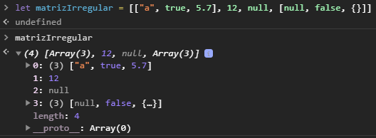

## Iterando arranjos

Podemos iterar usando `for` tradicional, usando os índices:

```js
let brinquedos = ["Bola", "Boneca", "Dominó"];
for (let i = 0; i < brinquedos.length; i++) {
  console.log(brinquedos[i]);
}
```

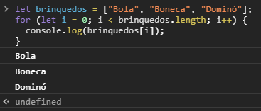

Porém, caso você não precise dos índices para nada, há uma construção mais simples, usando `for`..`of`.

```js
let brinquedos = ["Bola", "Boneca", "Dominó"];
for (let brinquedo of brinquedos) {
  console.log(brinquedo);
}
```

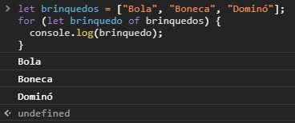

🍌 Não confunda `for`..`of` com `for`..`in`, que não deve ser usada com arranjos.

## Manipulando arranjos

Métodos de manipulação de arranjos:

- `.reverse()` inverte a posição dos elementos do arranjo;
- `string.split(separador)` retorna uma matriz com os elementos entre separador;
- `.join(separador)` retorna uma string com os elementos entre separador.


Os métodos abaixo são bem peculiares:

- `.push(x)` adiciona `x` no final do arranjo;
- `.pop()` retira o último elemento do arranjo;
- `.shift()` retira o primeiro elemento e desloca os demais elementos pra o início;
- `.unshift(x)` adiciona `x` no início do arranjo.

Arranjos são estruturas de dados do tipo _deque_ em JavaScript. Isso significa que podemos tratá-la como pilha ou como fila, de acordo com os métodos utilizados.

Se precisarmos de uma fila, usamos `push` e `shift`.

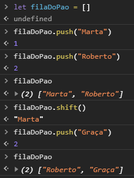

Se precisarmos de uma pilha, usamos `push` e `pop`.

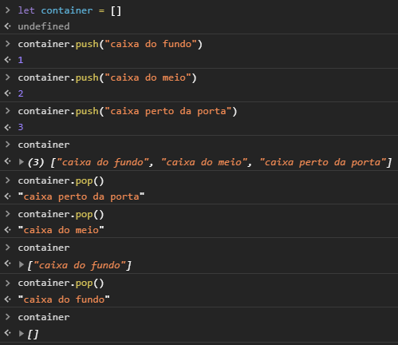

## _Arrays_, _iterables_ e _array-likes_

Há uma distinção muito sutil entre esses três termos em JavaScript.

- _Arrays_ (arranjos) são os objetos indexados que acabamos de estudar.
- _Iterables_ (iteráveis) são objetos que podem ser iterados com `for`..`of` (strings, por exemplo).
- _Array-likes_ (semelhantes-a-arranjos) são objetos que possuem índices e `length`.

Podemos nos deparar com objetos que não são arranjos mas são _iterables_ e/ou _array-likes_. Sempre que isso ocorrer e precisarmos de métodos que só existem em arranjos, podemos usar `Array.from(..)` para convertê-los em arranjos reais.

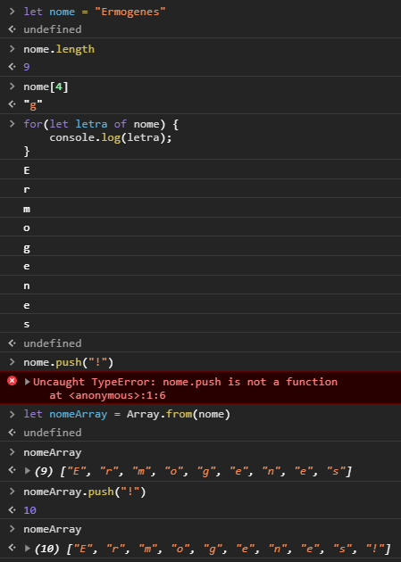

## Desestruturação

Permite realizar a atribuição de elementos de objetos e arranjos em variáveis em lote, de uma maneira simples.

Pense na seguinte situação:

```js
let medalhistas = ["Usain Bolt", "Justin Gatlin", "Andre De Grasse"];
ouro = medalhistas[0];
prata = medalhistas[1];
bronze = medalhistas[2];
let podio = `Os vencedores são ${ouro}, ${prata} e ${bronze}.`;
```

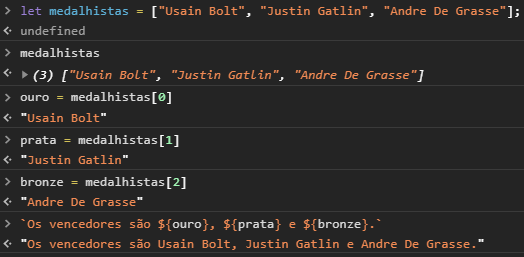

Usando desestruturação, podemos fazer todas as atribuições de uma só vez:

```js
let medalhistas = ["Usain Bolt", "Justin Gatlin", "Andre De Grasse"];
let [ouro, prata, bronze] = medalhistas;
let podio = `Os vencedores são ${ouro}, ${prata} e ${bronze}.`;
```

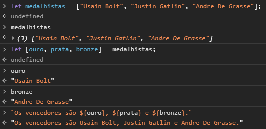

Podemos pular valores, e podemos guardar o resto em uma novo arranjo.

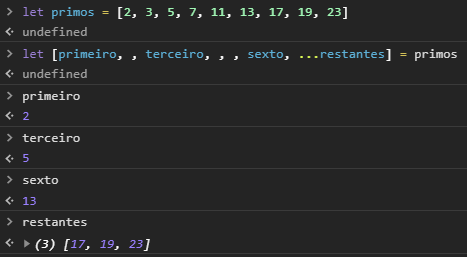

Também podemos desestruturar objetos:

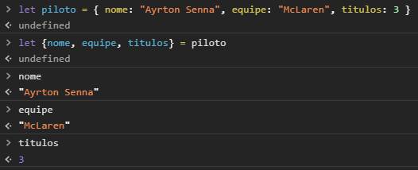

E podemos ignorar itens, criar valores _default_ e renomear variáveis.

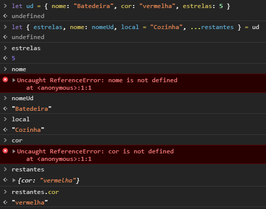
