# Propriedades básicas do CSS

Se necessário, consulte a lista completa no [MDN](https://developer.mozilla.org/en-US/docs/Web/CSS/Reference#Keyword_index).

---

## Tipografia

Propriedades que permitem estilizar elementos textos textuais em sua página.

Boas introduções ao tema podem ser encontradas [nesse artigo](https://rockcontent.com/br/blog/tipografia/) da RockContent, e [nesse artigo](https://neilpatel.com/br/blog/tipografia/#:~:text=Tipografia%20significa%20a%20impress%C3%A3o%20dos,e%20disposi%C3%A7%C3%A3o%20visual%20de%20palavras.) de Neil Patel.

### Tipo

- `font-family` permite alterar a face da fonte a ser exibida (tipo). Recebe uma lista de fontes e utiliza a primeira que estiver disponível. Use somentes fontes que existam no dispositivo do usuário (veja quais fontes são seguras [aqui](https://www.cssfontstack.com/)), ou use uma Web Font (como as fontes do [Google Fonts](#Usando-fontes-do-Google)).
  - `font-family: Arial;` - uso comum, usando a fonte segura Arial.
  - `font-family: 'Victor Mono';` - coloque entre aspas fontes com nome que contenham espaços.
  - `font-family: Helvetica, Arial;` - use mais de uma fonte, para o caso da anterior não estar disponível.
  - `font-family: Arial, sans-serif;` - use um nome genérico como última alternativa:
    - `sans-serif` - qualquer fonte disponível, sem serifa.
    - `serif` - qualquer fonte disponível, com serifa.
    - `monospace` - qualquer fonte disponível, monoespaçada.
    - `cursive` - qualquer fonte disponível, cursiva.
    - `fantasy` - qualquer fonte artística disponível.

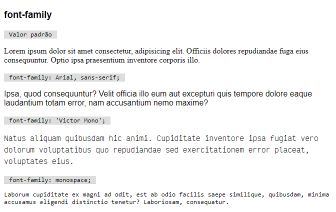

---

### Tamanho

- `font-size` permite alterar o tamanho do tipo a ser aplicado no texto. Pode ser dado em diversas unidades, sendo mais comuns (em 2020) definir o tamanho em pixels (`px`).
    - `font-size: 16px;` - fonte de 16 pixels.
    - `font-size: 16pt;` - fonte de 16 pontos (medida usada em processadores de texto, como o Word, não recomendado na web).
    - `font-size: 1.5em;` - fonte 50% maior que o tamanho herdado.
    - `font-size: 0.5rem;` - fonte 50% menor que o tamanho padrão da página.
    - Outras unidades menos comuns são centímetros (`cm`), milímetros (`mm`), polegadas (`in`), entre muitas outras.

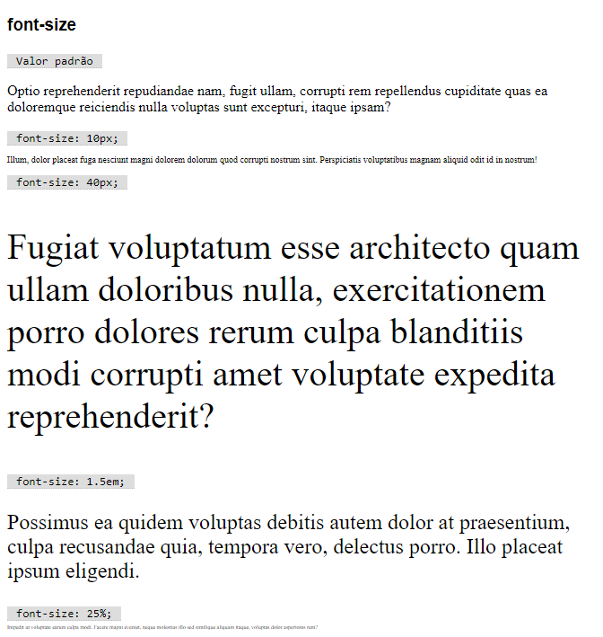

---

### Estilo da fonte

- `font-style` permite alterar o estilo da fonte.
  - `font-style: italic;` - fonte em itálico.
  - `font-style: normal;` - fonte normal.

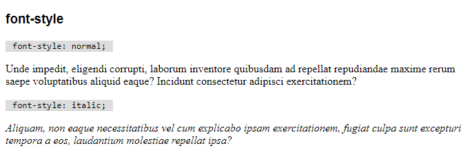

---

### Variante

- `font-variant` permite alterar diversas características das fontes, sendo usado normalmente para colocar o texto em _versalete_ (letras minúsculas com a forma de maiúsculas).
    - `font-variant: small-caps;` - _versalete_.
    - `font-variant: normal;` - normal.

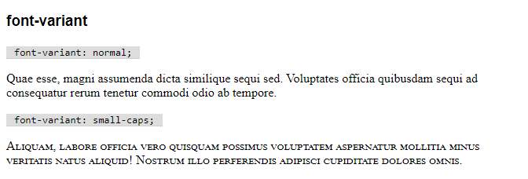

---

### Peso

- `font-weight` permite alterar o peso da fonte. Comumente usado para colocar o texto em negrito. Algumas Web Fonts permitem diversos pesos, numerados entre 100 a 900 (400 = normal, 700 = negrito).
  - `font-weight: normal;` - fonte em peso normal.
  - `font-weight: bold;` - fonte em negrito.
  - `font-weight: 900;` - fonte com peso 900 (o máximo permitido).
  - `font-weight: lighter;` - fonte um peso menor que a herdada (entre 700, 400 ou 100).
  - `font-weight: bolder;` - fonte um peso maior que a herdada (entre 400, 700 ou 900).

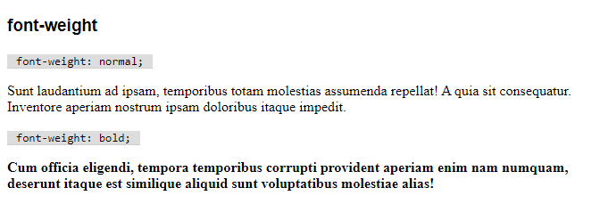

---

### Tamanho da linha

- `line-height` permite alterar a altura da linha de texto.
  - `line-height: normal;` - altura normal.
  - `line-height: 1.5;` - altura 50% maior.
  - `line-height: 25px;` - altura de tamanho fixo em 25px.
  - `line-height: 120%;` - altura 20% maior.

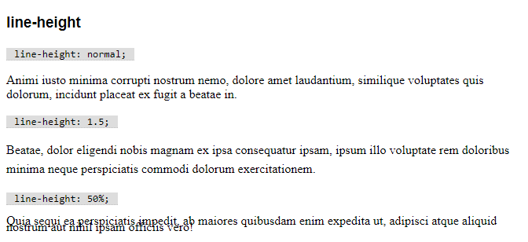

---

### Espaçamento entre letras

- `letter-spacing` altera o espaço entre as letras.
  - `letter-spacing: normal;` - espaçamento padrão.
  - `letter-spacing: 5px;` - afasta 5px adicionais entre cada letra.
  - `letter-spacing: -2px;` - aproxima em 2px cada letra.

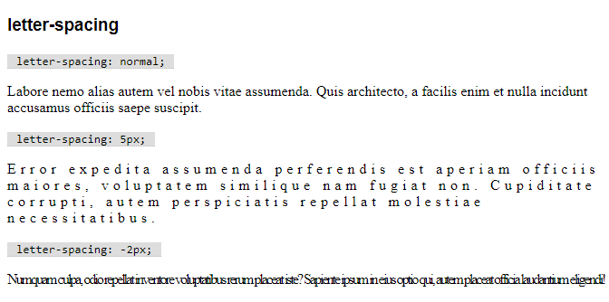

---

### Espaçamento entre palavras

- `word-spacing` altera o espaço entre as palavras.
  - `word-spacing: normal;` - espaçamento padrão.
  - `word-spacing: 5px;` - afasta 5px adicionais entre cada palavra.
  - `word-spacing: -2px;` - aproxima em 2px cada palavra.

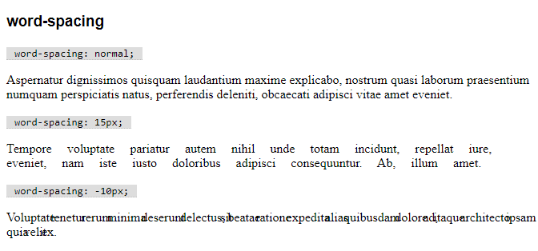

---

### Alinhamento horizontal

- `text-align` configura o alinhamento para um bloco de texto. Não tem efeito para elementos _inline_.
  - `text-align: left;` - alinhado a esquerda.
  - `text-align: right;` - alinhado a direita.
  - `text-align: center;` - centralizado
  - `text-align: justify;` - justificado.

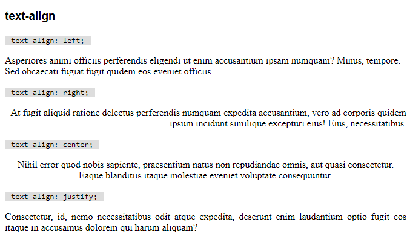

---

### Sublinhado

- `text-decoration` permite alterar o sublinhamento de um texto.
  - `text-decoration: underline;` - texto sublinhado.
  - `text-decoration: none;` - texto não sublinhado.

Apesar de não ser muito comum, você também pode controlar a cor, a posição (em baixo ou em cima), o formato (linha, pontos ou ondas) e a espessura do sublinhado.
  - `text-decoration-color: red;` - sublinhado em vermelho.
  - `text-decoration-line: overline;` - sobrelinhado;
  - `text-decoration-line: line-through;` - riscado;
  - `text-decoration-style: ` - estilo do sublinhado: `solid`, `double`, `dotted`, `dashed`, `wavy`.
  - `text-decoration-thickness: auto;` - espessura padrão.
  - `text-decoration-thickness: 3px;` - espessura de 3px.

Combinando, podemos ter um sublinhado vermelho ondulado usando `text-decoration: red wavy underline;`.

_Observação: um elemento filho não pode retirar o sublinhado herdado, somente alterá-lo._

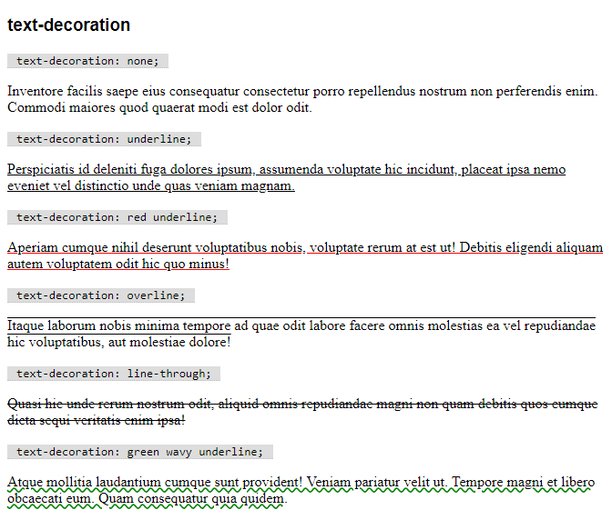

---

### Indentação de parágrafo

- `text-indent` configura o espaço em branco deixado na primeira linha de um parágrafo.
  - `text-indent: 0;` - sem indentação (valor padrão).
  - `text-indent: 20px;` - indentação de 20px.
  - `text-indent: -20px;` - recuo de 20px.

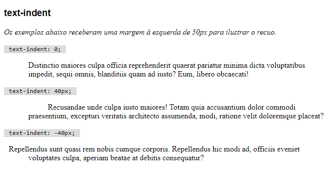

---

### Caixa alta/baixa

- `text-transform` transforma a caixa de um texto.
  - `text-transform: none;` - texto normal, conforme a marcação.
  - `text-transform: capitalize;` - transforma primeira letra de cada palavra em maiúsculas.
  - `text-transform: uppercase;` - transforma em maiúsculas.
  - `text-transform: lowercase;` - transforma em minúsculas.

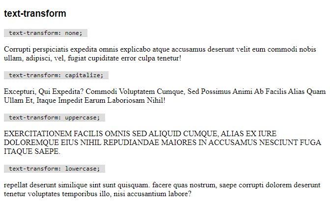

---

### Sombreamento

- `text-shadow` permite adicionar sombreamento a um texto. Um texto pode ter várias sombras (separadas por vírgula), sendo que cada uma é formada por três medidas (deslocamento horizontal, deslocamento vertical e raio de desfoque) e uma cor.
  - `text-shadow: 2px 1px 0 gray;` - sombra 2px abaixo e 1px a direita, sem desfoque, cinza.
  - `text-shadow: -20px -10px 5px green;` - sombra 20px acima e 10px a esquerda, com desfoque de 5px, verde.
  - `text-shadow: 2px 1px 0 gray, -20px -10px 5px green;` - as duas sombras acima simultaneamente.

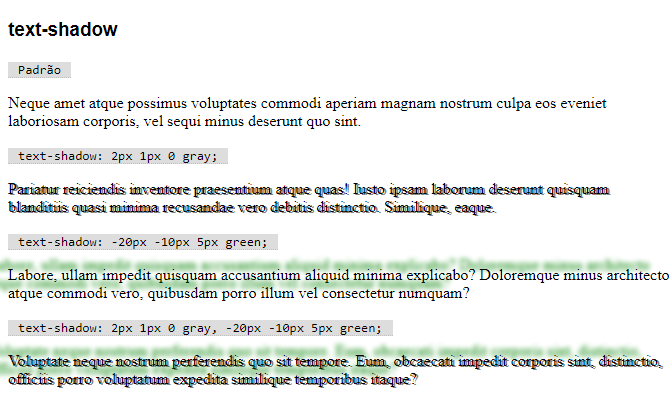

---

## Cores

O CSS permite que se defina uma cor de diversas maneiras diferentes. Todas elas tem o mesmo resultado, e podem ser utilizadas em qualquer propriedade.

Veja detalhes técnicos no [MDN](https://developer.mozilla.org/pt-BR/docs/Web/CSS/color_value).

### Propriedade `color`

- `color` indica a cor principal de um elemento.

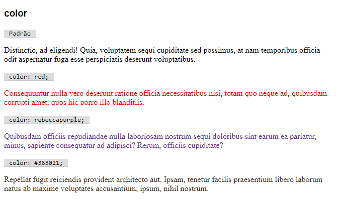

Use qualquer um dos esquemas abaixo para indicar a cor desejada.

### Palavras-chave de cores

Os navegadores entendem 140 palavras chave indicando cores. Essas palavras não são _case sensitive_. Exemplos: `red`, `black`, `silver`, `salmon`.

- Tabela completa em ordem alfabética: https://www.w3.org/wiki/CSS/Properties/color/keywords
- Tabela completa por tom: https://htmlcolorcodes.com/color-names/

💜 Curiosidade: você conhece a [história da menina que virou cor](https://www.codigofonte.com.br/noticias/conheca-a-tocante-historia-de-rebeccapurple-a-menina-que-virou-cor-de-css)?

**Palavras-chave adicionais**:

- `transparent` faz com que a cor não seja visível.
- `currentcolor` representa a cor herdada do elemento.

### Códigos RGB

Uma cor é representada computacionalmente por uma combinação de 3 canais de luz: vermelho (**R**ed), verde (**G**reen) e azul (**B**lue). Temos 256 possibilidades para cada tom (de `0` a `255` em decimal, de `00` a `FF` em hexadecimal), o que nos permite utilizar 256³ cores (16 milhões de cores). Como seria inútil nomear cada uma delas, usamos códigos RGB.

Podemos definir uma cor usando a função CSS `rgb`, que recebe valores decimais para cada um dos canais:

- `rgb(255, 0, 0)` - vermelho
- `rgb(0, 255, 0)` - verde
- `rgb(0, 0, 255)` - azul

Combinando os canais, podemos utilizar qualquer cor.

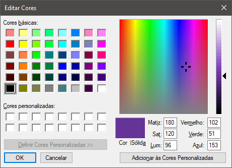

A cor acima, em CSS é `rgb(102, 51, 153)`.

Porém, antes do CSS, as cores eram escritas somente com códigos hexadecimais, e isso perdura até hoje como a maneira mais comum de escrevê-las. O código é formado da seguinte maneira:

- o sinal `#` + 
- dois dígitos hexadecimais para o canal vermelho (R), de `00` a `FF` + 
- dois dígitos hexadecimais para o canal verde (G), de `00` a `FF` + 
- dois dígitos hexadecimais para o canal azul (B), de `00` a `FF`.

Assim:

- `#ff0000` - vermelho
- `#00ff00` - verde
- `#0000ff` - azul

A ausência total de cores forma o preto (`#000000`), e a mistura de todas as cores forma o branco (`#ffffff`).

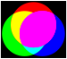

As cores secundárias são formadas misturando os canais dois-a-dois:

- `#ffff00` - vermelho e verde = _yellow_ (amarelo)
- `#ff00ff` - vermelho e azul = _magenta_
- `#00ffff` - verde e azul = _cyan_

Quanto mais alto o valor (mais próximo de `FF`), mais claro é o canal. O oposto também é verdadeiro.

- `#6666ff` - azul claro (luz azul no máximo, e mais luz nos outros canais)
- `#000066` - azul escuro (menos luz azul, e nenhuma luz nos outros canais)

Cinzas podem ser criados em 256 tons, igualando os valores de vermelho, verde e azul.

- `#cccccc` - cinza claro
- `#787878` - cinza médio
- `#333333` - cinza escuro

Algumas ferramentas para criar e compartilhar esquemas de cores na web:

- [Adobe Color](https://color.adobe.com/pt/create/color-wheel)
- [Colour Lovers](https://www.colourlovers.com/)
- [HailPixel](https://color.hailpixel.com/)
- [Cohesive Colors](https://javier.xyz/cohesive-colors/)
- [Coolors](https://coolors.co/)
- [ColorSpace](https://mycolor.space/)
- [Pallete Generator](https://palettegenerator.com/)

### RGBA

Adicionando um quarto valor ao hexadecimal (`00` a `FF`) ou usando a função `rgba` (`0.` a `1.`, ou um `%`), mudamos o canal _alpha_, que nos indica a opacidade do elemento:

- `#0000ff88` ou `rgba(0, 0, 255, 0.5)` - indica um azul 50% transparente.
- `#0000ff00` ou `rgba(0, 0, 255, 0)` - indica um azul 100% transparente.
- `#0000ffff` ou `rgba(0, 0, 255, 1)` - indica um azul 0% transparente (opaco).

---

### Fundos

Podemos preencher o fundo de um elemento usando cores e imagens. Existem diversas propriedades para posicionar corretamente as imagens no espaço ocupado pelo elemento.

- `background-color` indica a cor de fundo do elemento.
  - `background-color: rebeccapurple;` deixa o fundo em um tom púrpura.

Imagens são referenciadas em CSS usando funções:

- `url()` permite buscar uma imagem em uma URL acessível.
- `linear-gradient()` gera uma imagem em gradiente (_dégradé_) linear.
- `radial-gradient()` gera uma imagem em gradiente (_dégradé_) radial.

🦽 _Imagens de fundo são ignoradas por leitores de tela! Evite usá-los como única maneira de entregar informações que são relevantes ao usuário!_

- `background-image` indica uma imagem de fundo para o elemento.
  - `background-image: url(fundo.jpg);` exibe a imagem `fundo.jpg` no fundo do elemento.
  - `background-image: linear-gradient(to right, silver, black);` cria uma imagem em gradiente do cinza cinza até o preto, da esquerda para a direita.
- `background-repeat` controla a repetição da imagem de fundo.
  - `background-repeat: repeat;` - repete a imagem quanta vezes for necessário, lado a lado.
  - `background-repeat: repeat-x;` - repete a imagem somente horizontalmente.
  - `background-repeat: repeat-y;` - repete a imagem somente verticalmente.
  - `background-repeat: space;` - repete quantas vezes for possível, sem cortar a imagem, e adiciona espaços entre elas se necessário.
  - `background-repeat: round;` - repete quantas vezes for possível, sem cortar a imagem, distorcendo se necessário.
  - `background-repeat: no-repeat;` - só exibe a imagem uma vez.
- `background-size` controla o tamanho da imagem.
  - `background-size: auto;` - segue a dimensão intrínseca da imagem.
  - `background-size: contain;` - redimensiona a imagem para o maior tamanho possível sem distorção.
  - `background-size: cover;` - redimensiona a imagem para preencher o elemento sem deixar áreas em branco, mas possivelmente não exibindo a imagem como um todo.
- `background-position` - controla a posição inicial da imagem.
  `background-position: top;`, (ou `left`, `right`, `bottom`) - a imagem inicia na borda indicada.
  `background-position: 10px;` (ou `25%`) - a imagem inicia na posição indicada.
- `background-attachment` - permite controlar a posição da imagem em relação ao navegador, e não ao elemento.
  - `background-attachment: scroll;` - o fundo se desloca juntamente com a rolagem.
  - `background-attachment: fixed;` - o fundo não se desloca juntamente com a rolagem.

#### Gradientes

Referência oficial: https://drafts.csswg.org/css-images-3/#gradients

Você pode criar um gradiente listando um ângulo e uma lista de cores (e suas posições).

O **ângulo** pode ser definido como uma direção ou em graus, em sentido horário, sendo 0° direcionado para cima.

- `to top` - de baixo para cima.
- `to left` - da direita para a esquerda.
- `to bottom` - de cima para baixo.
- `to right` - da esquerda para a direita.
- `45deg` - de sudoeste para nordeste.
- `225deg` - de nordeste para sudoeste (45° + 180°).

A lista de cores com suas posições é definida assim:

- `silver, black` - de cinza a preto.
- `red 0%, blue 100%` - de vermelho a azul.
- `darksalmon 0%, salmon 50%, red 51%, firebrick 71%, crimson 100%` - um gradiente de vários pontos, em tons de vermelho ([veja aqui](https://www.cssmatic.com/gradient-generator#'\-moz\-linear\-gradient\%28top\%2C\%20rgba\%28250\%2C127\%2C114\%2C1\%29\%200\%25\%2C\%20rgba\%28255\%2C160\%2C122\%2C1\%29\%2050\%25\%2C\%20rgba\%28255\%2C0\%2C0\%2C1\%29\%2051\%25\%2C\%20rgba\%28178\%2C34\%2C34\%2C1\%29\%2071\%25\%2C\%20rgba\%28220\%2C20\%2C60\%2C1\%29\%20100\%25\%29\%3B')).

Usamos as duas informações no formato `linear-gradient(angulo, lista-de-cores)`.

Você pode usar um gerador para facilitar a visualização. Um bom exemplo é o contido em [CSSmatic](https://www.cssmatic.com/gradient-generator).

O site [CSSGradient](https://cssgradient.io/) mostra diversas opções para inspiração.

#### Exemplos de fundos

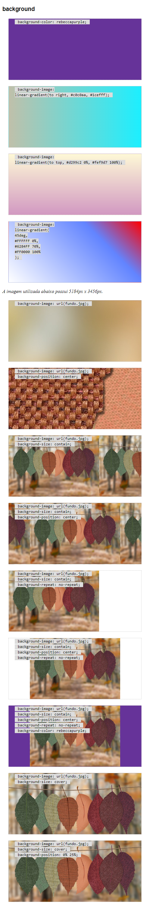

Imagem utilizada nos exemplo acima: [https://www.pexels.com/photo/leaves-hang-on-rope-1389460/](https://www.pexels.com/photo/leaves-hang-on-rope-1389460/)

---

## Bordas

Controla as bordas do elemento.

- `border-width` - largura da borda.
  - `border-width: 1px;` - largura da borda definida em 1px.
- `border-style` - estilo do traço da borda. Algumas opções possíveis são `none`, `dotted`, `dashed`, `solid`, `double`, `groove`, `ridge`, `inset` e `outset`.
  - `border-style: none;` - sem borda.
  - `border-style: solid;` - borda sólida.
  - `border-style: dotted;` - borda pontilhada.
  - `border-style: dashed;` - borda tracejada.
- `border-color` - cor da borda.
- `border-radius` - raio de arredondamento dos cantos da borda.
  - `border-radius: 0;` - sem arredondamento.
  - `border-radius: 5px;` - raio de arredondamento de 5px.
  - `border-radius: 50%;` - raio de arredondamento máximo (vira um círculo ou elipse).

💡 _Use uma imagem quadrada com borda arredondada em 50% para exibí-la em um círculo._

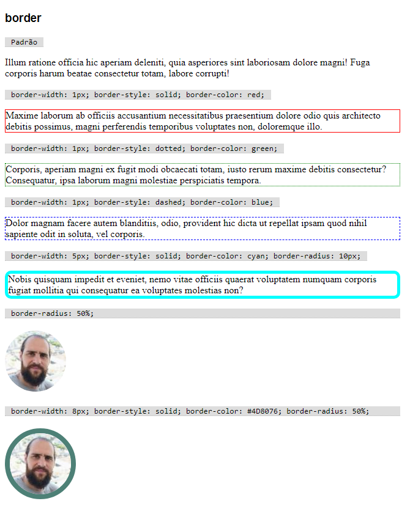

---

## Tamanho

Controla os tamanhos do elemento.

- `width` e `height` - largura e altura do elemento.
- `min-width` e `min-height` - tamanhos mínimos.
- `max-width` e `max-height` - tamanhos máximos.

`padding`
`margin`

`overflow`
`overflow-x`

## Posição

## Listas

`list-style`
`list-style-image`
`list-style-position`
`list-style-type`

## Tabelas

`border-collapse`

---

## Tipos de dados CSS

`inteiro`
`número`
`dimensão`
    `absoluta`
    `relativa`
    `ângulo`
    `tempo`
    `resolução`
`porcentagem`
`cor`
    `hexadecimal`
    `RGBA`
    `identificador`
`imagem`
`posição`
`string`
`função`

---

## Usando fontes do Google

https://fonts.google.com/
