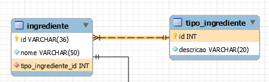
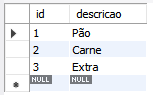
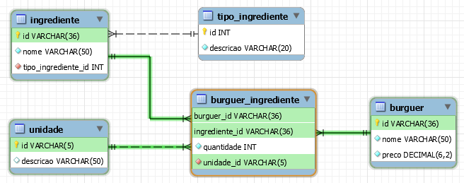
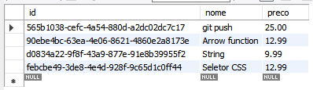
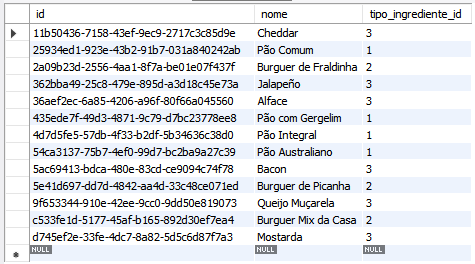
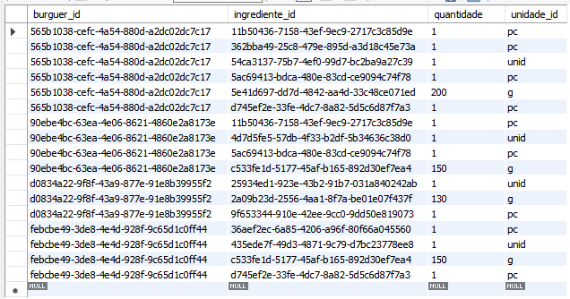
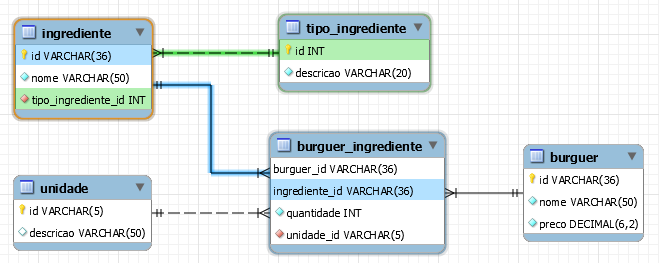

# Relacionamentos com Entity Framework

[📽 Veja esta vídeo-aula no Youtube](https://youtu.be/kC-BWUBh6A4)

Vamos avançar no estudo de Entity Framework (EF) trabalhando agora com múltiplas tabelas relacionadas.

Para os exemplos dessa aula, usaremos o modelo `hamburgueria`, disponível [aqui](https://github.com/ermogenes/hamburgueria-mysql). Crie o seu banco localmente, seguindo as instruções de uso do repositório.


Para esses exemplos adicionamos as seguintes referências:

```cs
using System.Linq;
using Microsoft.EntityFrameworkCore;
```

Para todos os exemplo, o contexto deve estar disponível. Não indicaremos em todos os exemplos por simplicidade.

```cs
using (var db = new hamburgueriaContext())
{
    // o exemplo vai aqui
}
```

## Obtendo múltiplos registros

Fazendo referência direta aos objetos do contexto temos acesso aos dados das tabelas.

Exemplo. Obter todos os burguers:

```cs
var todosOsBurguers = db.Burguer.ToList();
```

O método `ToList` foi adicionado para que a consulta seja _materializada_, ou seja, executada imediatamente, pois o EF só as executa quando necessário, aguardando o máximo possível.

Após a execução, `todosOsBurguers` possui uma lista de objetos do tipo `Burguer`, cada um equivalente a uma linha da tabela. Você pode iterar entre eles com `foreach` (podendo, assim, retirar o `ToList`, já que a consulta é materializada automaticamente.).

```cs
var todosOsBurguers = db.Burguer;
foreach(var burguer in todosOsBurguers) 
{
    string nomeBurguer = burguer.Nome;
    decimal precoBurguer = burguer.Preco;
    Console.WriteLine($"O burguer {nomeBurguer} custa {precoBurguer:C}.");
}
```

Saída:

```
O burguer git push custa R$ 25,00.
O burguer Arrow function custa R$ 12,99.
O burguer String custa R$ 9,99.
O burguer Seletor CSS custa R$ 12,99.
```

## Filtrando a lista com `Where`

Podemos gerar filtros SQL _where_ usando o método `Where`. Ele recebe uma _arrow function_ passando a linha, e espera um _boolean_ indicando se a linha fica ou não no resultado final.

Exemplo. Obter somente os burguers que custam entre 10 e 20 reais:

```cs
var burguersEntre10e20 = db.Burguer.Where(b => b.Preco >= 10 && b.Preco <= 20);
foreach(var burguer in burguersEntre10e20) 
{
    string nomeBurguer = burguer.Nome;
    decimal precoBurguer = burguer.Preco;
    Console.WriteLine($"O burguer {nomeBurguer} custa {precoBurguer:C}.");
}
```

Em `db.Burguer.Where(b => b.Preco >= 10 && b.Preco <= 20)`:
- `b` representa a linha atual a ser testada (pode ser dado qualquer nome);
- `b.Preco >= 10 && b.Preco <= 20` é a condição para a linha constar no resultado.

Saída:

```
O burguer Arrow function custa R$ 12,99.
O burguer Seletor CSS custa R$ 12,99.
```

## Ordenando uma lista

Usamos os métodos `OrderBy` e `OrderByDescending` para ordenar a lista por um campo específico. A palavra `Descending` indica que a ordenação é invertida.

Para adicionar uma ordenação por outro campo em caso de coincidência no primeiro, use `ThenBy` e `ThenByDescending`.

Veja algumas possíveis construções:

```cs
// Ordenado por preço, do menor para o maior
db.Burguer.OrderBy(b => b.Preco)

// Ordenado por preço, do maior para o menor
db.Burguer.OrderByDescending(b => b.Preco)

// Ordenado por preço, do menor para o maior...
// ... e para os preços coincidentes, ordenado por nome, de Z a A
db.Burguer.OrderBy(b => b.Preco).ThenByDescending(b => b.Nome)
```

Exemplo. Ordenar os burguers por preço e depois por nome de Z a A:

```cs
var burguersOrdenados = db.Burguer
    .OrderBy(b => b.Preco)
    .ThenByDescending(b => b.Nome);
foreach(var burguer in burguersOrdenados) 
{
    Console.WriteLine($"O burguer {burguer.Nome} custa {burguer.Preco:C}.");
}
```

Saída: 

```
O burguer String custa R$ 9,99.
O burguer Seletor CSS custa R$ 12,99.
O burguer Arrow function custa R$ 12,99.
O burguer git push custa R$ 25,00.
```

Podemos filtrar e ordenar na mesma consulta.

Exemplo. Burguers que custam menos de 20 reais, os mais baratos primeiro:

```cs
var burguers = db.Burguer
    .Where(b => b.Preco < 20)
    .OrderBy(b => b.Preco);
foreach(var burguer in burguers) 
{
    Console.WriteLine($"O burguer {burguer.Nome} custa {burguer.Preco:C}.");
}
```

Saída: 

```
O burguer String custa R$ 9,99.
O burguer Arrow function custa R$ 12,99.
O burguer Seletor CSS custa R$ 12,99.
```

## Navegando entre tabelas

Ao realizar o _scaffolding_ do banco de dados o EF criou propriedades que permitem navegar nas suas tabelas relacionadas. Por exemplo, dado que eu tenho um ingrediente, esse ingrediente possui um tipo. A descrição desse tipo, porém, está na tabela de tipos de ingredientes.






Vamos tentar obter a descrição usando as propriedades de navegação:

```cs
var ingredientes = db.Ingrediente;
foreach(var ingrediente in ingredientes) 
{
    string nome = ingrediente.Nome;
    string tipo = ingrediente.TipoIngrediente.Descricao;
    Console.WriteLine($"O ingrediente {nome} é do tipo {tipo}.");
}
```

Obtemos o seguinte erro o executar:

```
Unhandled exception. System.NullReferenceException: Object reference not set to an instance of an object.
```

Quando fizemos `ingrediente.TipoIngrediente.Descricao` tentamos navegar da tabela ingrediente para a tabela de tipo de ingrediente, mas os dados não vieram do banco de dados. Para que eles venham, eles precisam ser incluídos na consulta, exatamente como em um _join_ em SQL. Fazemos isso usando o método `Include`.

Exemplo. Todos os ingredientes e seus tipos.

```cs
var ingredientes = db.Ingrediente
    .Include(i => i.TipoIngrediente);
foreach(var ingrediente in ingredientes) 
{
    string nome = ingrediente.Nome;
    string tipo = ingrediente.TipoIngrediente.Descricao;
    Console.WriteLine($"O ingrediente {nome} é do tipo {tipo}.");
}
```

Saída: 

```
O ingrediente Pão Comum é do tipo Pão.
O ingrediente Pão com Gergelim é do tipo Pão.
O ingrediente Pão Integral é do tipo Pão.
O ingrediente Pão Australiano é do tipo Pão.
O ingrediente Burguer de Fraldinha é do tipo Carne.
O ingrediente Burguer de Picanha é do tipo Carne.
O ingrediente Burguer Mix da Casa é do tipo Carne.
O ingrediente Cheddar é do tipo Extra.
O ingrediente Jalapeño é do tipo Extra.
O ingrediente Alface é do tipo Extra.
O ingrediente Bacon é do tipo Extra.
O ingrediente Queijo Muçarela é do tipo Extra.
O ingrediente Mostarda é do tipo Extra.
```

Para filtrar, temos que executar o filtro na tabela adequada, usando as propriedades de navegação.

```cs
var ingredientes = db.Ingrediente
    .Include(i => i.TipoIngrediente)
    .Where(i => i.Nome.Contains("fra") && i.TipoIngrediente.Descricao == "Carne");
```

Com esse filtro, somente teríamos `O ingrediente Burguer de Fraldinha é do tipo Carne.`.

## Múltiplos relacionamentos

Digamos que queiramos exibir os ingredientes dos burguers. Atente à modelagem:









Esta informação está na tabela que vincula ingredientes com burguers. Precisamos consultá-la e incluir as demais tabelas que possuem os dados que nos interessam.

```cs
var ingredientesDosBurguers = db.BurguerIngrediente
    .Include(bi => bi.Burguer)
    .Include(bi => bi.Ingrediente);
foreach(var ingredienteBurguer in ingredientesDosBurguers) 
{
    Burguer burguer = ingredienteBurguer.Burguer;
    Ingrediente ingrediente = ingredienteBurguer.Ingrediente;
    Console.WriteLine($"O burguer {burguer.Nome} leva {ingrediente.Nome}.");
}
```

Saída:

```
O burguer git push leva Cheddar.
O burguer git push leva Jalapeño.
O burguer git push leva Pão Australiano.
O burguer git push leva Bacon.
O burguer git push leva Burguer de Picanha.       
O burguer git push leva Mostarda.
O burguer Arrow function leva Cheddar.
O burguer Arrow function leva Pão Integral.       
O burguer Arrow function leva Bacon.
O burguer Arrow function leva Burguer Mix da Casa.
O burguer String leva Pão Comum.
O burguer String leva Burguer de Fraldinha.
O burguer String leva Queijo Muçarela.
O burguer Seletor CSS leva Alface.
O burguer Seletor CSS leva Pão com Gergelim.
O burguer Seletor CSS leva Burguer Mix da Casa.
O burguer Seletor CSS leva Mostarda.
```

Perceba:

- Todos os `Includes` partem da tabela inicial, `db.BurguerIngrediente`.
- Podemos pegar referências aos objetos como um todo, ao invés de referências diretas aos valores.

Todas as tabelas incluídas podem ser usadas em filtros e ordenação.

Exemplo. Filtro usando `Burguer.Nome` e ordenação usando `Ingrediente.Nome`:

```cs
var ingredientesDosBurguers = db.BurguerIngrediente
    .Include(bi => bi.Burguer)
    .Include(bi => bi.Ingrediente)
    .Where(bi => bi.Burguer.Nome == "git push")
    .OrderBy(bi => bi.Ingrediente.Nome);
foreach(var ingredienteBurguer in ingredientesDosBurguers) 
{
    Burguer burguer = ingredienteBurguer.Burguer;
    Ingrediente ingrediente = ingredienteBurguer.Ingrediente;
    Console.WriteLine($"O burguer {burguer.Nome} leva {ingrediente.Nome}.");
}
```

Saída:

```
O burguer git push leva Bacon.
O burguer git push leva Burguer de Picanha.
O burguer git push leva Cheddar.
O burguer git push leva Jalapeño.
O burguer git push leva Mostarda.
O burguer git push leva Pão Australiano.
```

Caso precisemos de navegações adicionais, podemos incluir quantas tabelas forem necessárias. Digamos que queremos exibir a quantidade de cada ingrediente. O valor numérico está presente na tabela consultada, mas temos que incluir também as unidades.

```cs
var ingredientesDosBurguers = db.BurguerIngrediente
    .Include(bi => bi.Burguer)
    .Include(bi => bi.Ingrediente)
    .Include(bi => bi.Unidade)
    .Where(bi => bi.Burguer.Nome == "git push")
    .OrderBy(bi => bi.Ingrediente.Nome);
foreach(var ingredienteBurguer in ingredientesDosBurguers) 
{
    Burguer burguer = ingredienteBurguer.Burguer;
    Ingrediente ingrediente = ingredienteBurguer.Ingrediente;
    int quantidade = ingredienteBurguer.Quantidade;
    string unidade = ingredienteBurguer.Unidade.Descricao;
    string descricaoIngrediente = $"{quantidade} {unidade} de {ingrediente.Nome}";
    Console.WriteLine($"O burguer {burguer.Nome} leva {descricaoIngrediente}.");
}
```

Saída:

```
O burguer git push leva 1 porção(ões) de Bacon.
O burguer git push leva 200 grama(s) de Burguer de Picanha.
O burguer git push leva 1 porção(ões) de Cheddar.
O burguer git push leva 1 porção(ões) de Jalapeño.
O burguer git push leva 1 porção(ões) de Mostarda.
O burguer git push leva 1 unidade(s) de Pão Australiano.
```

Digamos que precisamos dos dados do tipo de cada ingrediente, por exemplo para exibir ou ordenar por tipo, ou para filtrar exibindo somente os pães, por exemplo. Não podemos incluir os tipos de ingredientes diretamente, pois não há navegação direta, somente via ingredientes.



Para fazer essas inclusões indiretas, usamos `ThenInclude` na tabela intermediária.

Exemplo. Exibir os pães de cada burguer:

```cs
var ingredientesDosBurguers = db.BurguerIngrediente
    .Include(bi => bi.Burguer)
    .Include(bi => bi.Ingrediente)
        .ThenInclude(i => i.TipoIngrediente)
    .Where(bi => bi.Ingrediente.TipoIngrediente.Descricao == "Pão");
foreach(var ingredienteBurguer in ingredientesDosBurguers) 
{
    Burguer burguer = ingredienteBurguer.Burguer;
    Ingrediente ingrediente = ingredienteBurguer.Ingrediente;
    Console.WriteLine($"O burguer {burguer.Nome} leva {ingrediente.Nome}.");
}
```

Saída:

```
O burguer String leva Pão Comum.
O burguer Seletor CSS leva Pão com Gergelim.
O burguer Arrow function leva Pão Integral.
O burguer git push leva Pão Australiano.
```

## Limitando o número de resultados

Para realizar paginação podemos restringir a quantidade de registros retornados usando `Take` e pular uma quantidade específica usando `Skip`.

Exemplo. Todos os ingredientes:

```cs
foreach(var ingrediente in db.Ingrediente) 
{
    Console.WriteLine(ingrediente.Nome);
}
```

Saída:

```
Cheddar
Pão Comum
Burguer de Fraldinha
Jalapeño
Alface
Pão com Gergelim
Pão Integral
Pão Australiano
Bacon
Burguer de Picanha
Queijo Muçarela
Burguer Mix da Casa
Mostarda
```

Exemplo. Os 3 primeiros ingredientes:

```cs
foreach(var ingrediente in db.Ingrediente.Take(3)) 
{
    Console.WriteLine(ingrediente.Nome);
}
```

Saída:

```
Cheddar
Pão Comum
Burguer de Fraldinha
```

Exemplo. Os 3 próximos ingredientes:

```cs
foreach(var ingrediente in db.Ingrediente.Skip(3).Take(3)) 
{
    Console.WriteLine(ingrediente.Nome);
}
```

Saída:

```
Jalapeño
Alface
Pão com Gergelim
```

## Obtendo registros únicos

Enquanto `ToList` nos retorna uma lista com todos os resultados da consulta, mas podemos trazer um registro somente. Isso é especialmente útil para filtrar uma tabela pela sua chave primária.

Método | Somente um resultado | Mais de um | Nenhum
--- | --- | --- | ---
`Single` | Retorna o objeto encontrado | Lança exceção | Lança exceção
`SingleOrDefault` | Retorna o objeto encontrado | Lança exceção | Retorna `null`

Podemos usá-los independentemente, ou de forma semelhante a `Where`, já com o filtro incorporado.

```cs
Burguer barato = db.Burguer.Where(b => b.Preco < 10).SingleOrDefault();
Console.WriteLine(barato != null ? "encontrado" : "não encontrado"); // encontrado

Burguer caro = db.Burguer.SingleOrDefault(b => b.Preco > 200);
Console.WriteLine(caro != null ? "encontrado" : "não encontrado"); // não encontrado
```

## Funções agregadas

As funções a seguir realizam processamentos nas linhas, e retornam valores únicos em vez dos registros.

- `Count` retorna o número de registros encontrados. Pode receber o filtro.
- `Max` retorna o maior valor encontrado na coluna indicada.
- `Min` retorna o menor valor encontrado na coluna indicada.
- `Sum` retorna a soma dos valores encontrados na coluna indicada.
- `Average` retorna a média dos valores encontrados na coluna indicada.

```cs
int qtdBurguers = db.Burguer.Count();
int qtdBurguersAbaixoDe10Reais = db.Burguer.Count(b => b.Preco < 10);
int qtdBurguersAcimaDe10Reais = db.Burguer.Where(b => b.Preco > 10).Count();
decimal menorPreco = db.Burguer.Min(b => b.Preco);
decimal maiorPreco = db.Burguer.Max(b => b.Preco);
decimal precoMedio = db.Burguer.Average(b => b.Preco);
decimal precoUmDeCada = db.Burguer.Sum(b => b.Preco);

Console.WriteLine($"Quantos hamburguers? {qtdBurguers}");
Console.WriteLine($"Abaixo de R$ 10,00: {qtdBurguersAbaixoDe10Reais}");
Console.WriteLine($"Acima de R$ 10,00: {qtdBurguersAcimaDe10Reais}");
Console.WriteLine($"Menor preço: {menorPreco:C}");
Console.WriteLine($"Maior preço: {maiorPreco:C}");
Console.WriteLine($"Preço médio: {precoMedio:C}");
Console.WriteLine($"Quanto custa comprar um de cada: {precoUmDeCada:C}");
```

Saída:

```
Quantos hamburguers? 4
Abaixo de R$ 10,00: 1
Acima de R$ 10,00: 3
Menor preço: R$ 9,99
Maior preço: R$ 25,00
Preço médio: R$ 15,24
Quanto custa comprar um de cada: R$ 60,97
```

Há também métodos que retornam um _boolean_ e podem ser usado para avaliar condições.

- `All` retorna `true` se todos os registros passarem na condição.
- `Any` retorna `true` se o resultado possuir um ou mais registros.

```cs
bool algumBurguerCaro = db.Burguer.Where(b => b.Preco > 20).Any();
bool algumBurguerBarato = db.Burguer.Any(b => b.Preco < 10);
bool todosBuguersAcima15e50 = db.Burguer.All(b => b.Preco > 15.5m);

Burguer meuBurguer = db.Burguer.Single(b => b.Nome == "Arrow function");
bool meuBurguerPossuiCarne = db.BurguerIngrediente
        .Include(bi => bi.Ingrediente)
            .ThenInclude(i => i.TipoIngrediente)
        .Where(bi => bi.Burguer == meuBurguer)
        .Any(bi => bi.Ingrediente.TipoIngrediente.Descricao == "Carne");

Console.WriteLine($"algumBurguerCaro: {algumBurguerCaro}");
Console.WriteLine($"algumBurguerBarato: {algumBurguerBarato}");
Console.WriteLine($"meuBurguerPossuiCarne: {meuBurguerPossuiCarne}");
Console.WriteLine($"todosBuguersAcima15e50: {todosBuguersAcima15e50}");
```

Saída:

```
algumBurguerCaro: True
algumBurguerBarato: True
meuBurguerPossuiCarne: True
todosBuguersAcima15e50: False
```
