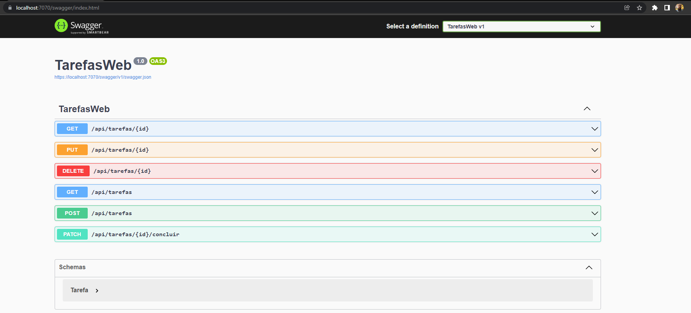

# REST e bancos de dados

Existe um estilo de arquitetura de sistemas criado para utilizar todo o potencial do protocolo HTTP chamado [REST (REpresentational State Transfer)](https://restfulapi.net/). Ele é muito popular hoje em dia e o utilizaremos neste material.

O REST define regras e boas práticas para uso de HTTP em aplicações. 

## Conexão com o banco de dados

Façamos o procedimento padrão para criar a conexão. Usaremos como exemplo o banco [`tarefas`](https://github.com/ermogenes/tarefas-mysql).

Suba o banco. Crie uma aplicação `web`. Adicione os pacotes do EF Core e do Pomelo. Faça o _scaffolding_ da base.

### Injetando o contexto

Começaremos movendo a _string_ de conexão do contexto para `appsettings.json`.

Altere `db/tarefasContext.cs`:
```cs
...
       protected override void OnConfiguring(DbContextOptionsBuilder optionsBuilder)
        {
            // deixe vazio
        }
...
```

Altere `appsettings.json`, adicionando a chave `"ConnectionStrings"`:
```json
{
  "Logging": {
    "LogLevel": {
      "Default": "Information",
      "Microsoft.AspNetCore": "Warning"
    }
  },
  "ConnectionStrings": {
    "tarefasConnection": "server=localhost;port=3306;uid=root;pwd=1234;database=tarefas"
  },
  "AllowedHosts": "*"
}
```

Adicione um `Service` em `app` usando o seguinte comando no `builder`:
```cs
builder.Services.AddDbContext<tarefasContext>(opt =>
{
    string connectionString = builder.Configuration.GetConnectionString("tarefasConnection");
    var serverVersion = ServerVersion.AutoDetect(connectionString);
    opt.UseMySql(connectionString, serverVersion);
});
```

Agora, todas as rotas poderão ter acesso ao contexto usando `[FromServices]`. Exemplo:
```cs
app.MapGet("/api/tarefas", ([FromServices] tarefasContext _db) =>
{
    return Results.Ok(_db.Tarefa.ToList<Tarefa>());
});
```

## Implementando as rotas com REST

Vejamos como usar os verbos, cabeçalhos, status e corpo das mensagens para integrar aplicações.

## GET

Obtém do servidor um recurso único ou uma lista de recursos. Usado para buscar imagens ou arquivos HTML, e também objetos JSON com informações do backend.

Exemplos:
* `GET /Alunos` para buscar uma lista de alunos.
* `GET /Alunos/98765` para buscar um aluno específico.

Resultados comuns:
* `200 OK` indica sucesso, com o resultado no corpo da mensagem (que pode ser vazio no caso da lista).
* `404 NOT FOUND` em caso de não encontrar o recurso (único) solicitado.

Observações:
* Use _query string_ para realizar filtros, ordenação e paginação. Esses parâmetros não são automáticos e devem ser tratados pelo backend um a um. Exemplos:
  * `GET /Alunos?nome=Fabi` para filtrar a lista de alunos pelo nome.
  * `GET /Alunos?ordem=idade` para colocar em ordem de idade.
  * `GET /Alunos?inicio=11&quantidade=10` para colocar acessar a segunda página de 10 itens cada.

### Listagem por Id

Vamos obter uma única tarefa pelo seu `id` (PK) e retorná-la com o código 200. Caso não encontremos, retornaremos 404.

```cs
app.MapGet("/api/tarefas/{id}", ([FromServices] tarefasContext _db,
    [FromRoute] int id
) =>
{
    var tarefa = _db.Tarefa.Find(id);

    if (tarefa == null)
    {
        return Results.NotFound();
    }

    return Results.Ok(tarefa);
});
```

### Listagem de Tarefas

Vamos obter as tarefas e retornar a lista com um código 200.

```cs
app.MapGet("/api/tarefas", ([FromServices] tarefasContext _db) =>
{
    var tarefas = _db.Tarefa.ToList<Tarefa>();
    return Results.Ok(tarefas);
});
```

Como preparação para os próximos passos, vamos separar a preparação da consulta SQL (um `SELECT`) e a execução em si. Salvaremos a consulta em `query`, porque a modificaremos antes de executar de acordo om os parâmetros recebidos.

```cs
app.MapGet("/api/tarefas", ([FromServices] tarefasContext _db,
) =>
{
    var query = _db.Tarefa.AsQueryable<Tarefa>();
    var tarefas = query.ToList<Tarefa>();
    return Results.Ok(tarefas);
});
```

### Filtro por descrição

Passaremos a aceitar o parâmetro `descricao` [1]. Adicionaremos o filtro [2] somente se ele for informado [3].

```cs
app.MapGet("/api/tarefas", ([FromServices] tarefasContext _db,
    [FromQuery] string? descricao                                   // <- 1
) =>
{
    var query = _db.Tarefa.AsQueryable<Tarefa>();

    if (!String.IsNullOrEmpty(descricao))                           // <- 3
    {                                                               // <- 3
        query = query.Where(t => t.Descricao.Contains(descricao));  // <---- 2
    }                                                               // <- 3

    var tarefas = query.ToList<Tarefa>();

    return Results.Ok(tarefas);
});
```

### Filtro: somente pendentes

Adicionamos o parâmetro `somente_pendentes` [4]. Caso ele não seja informado, usaremos `false` como padrão (_não filtrar_) [5]. Faremos o filtro [6] (e uma ordenação pelos mais recentes primeiro) [7] somente se ele foi selecionado [8].

```cs
app.MapGet("/api/tarefas", ([FromServices] tarefasContext _db,
    [FromQuery(Name = "somente_pendentes")] bool? somentePendentes, // <- 4
    [FromQuery] string? descricao
) =>
{
    bool filtrarPendentes = somentePendentes ?? false;              // <- 5

    var query = _db.Tarefa.AsQueryable<Tarefa>();

    if (!String.IsNullOrEmpty(descricao))
    {
        query = query.Where(t => t.Descricao.Contains(descricao));
    }

    if (filtrarPendentes)                                           // <- 8
    {                                                               // <- 8
        query = query.Where(t => !t.Concluida)                      // <---- 6
            .OrderByDescending(t => t.Id);                          // <---- 7
    }                                                               // <- 8

    var tarefas = query.ToList<Tarefa>();

    return Results.Ok(tarefas);
});
```

## POST

Cria um recurso em uma lista de recursos. Os dados a serem cadastrados vão no corpo da requisição.

Exemplo:
* `POST /Alunos` para incluir um novo aluno na lista de alunos. Os dados a serem cadastrados devem ir no corpo da mensagem.

Resultados comuns:
* `200 OK` caso o recurso seja criado e não possua URL próprio.
* `201 CREATED` caso o recurso seja criado e possua URL próprio. Nesse caso, o recurso criado volta no corpo da mensagem, e o seu URL no _header_ `Location`.
* `400 BAD REQUEST` caso a solicitação seja inválida.

### Inclusão de nova Tarefa

Vamos validar o registro informado, ignorando o `id` (que é `AUTO_INCREMENT`). Em caso inválido, retornaremos 400 e uma mensagem de erro. Caso contrário, retornaremos 201 com a URL do recurso criado, e o recurso no corpo da resposta.

```cs
app.MapPost("/api/tarefas", ([FromServices] tarefasContext _db,
    [FromBody] Tarefa novaTarefa
) =>
{
    if (String.IsNullOrEmpty(novaTarefa.Descricao))
    {
        return Results.BadRequest(new { mensagem = "Não é possivel incluir tarefa sem descrição." });
    }

    var tarefa = new Tarefa
    {
        Descricao = novaTarefa.Descricao,
        Concluida = novaTarefa.Concluida,
    };

    _db.Tarefa.Add(tarefa);
    _db.SaveChanges();

    var tarefaUrl = $"/api/tarefas/{tarefa.Id}";

    return Results.Created(tarefaUrl, tarefa);
});
```

## PUT

Substitui (altera) um recurso por inteiro. Deve ser chamado referenciando um recurso existente (como em `GET`) e enviando os novos dados no corpo da mensagem (como em `POST`).

Exemplos:
* `PUT /Alunos/98765` para alterar todos os dados de um aluno específico. Os novos dados a serem gravados devem ir no corpo da mensagem.

Resultados comuns:
* `200 OK` indica sucesso, com o resultado (recurso alterado) no corpo da mensagem.
* `404 NOT FOUND` em caso de não encontrar o recurso solicitado.
* `400 BAD REQUEST` caso a solicitação seja inválida.

### Alteração de Tarefa existente

Verificamos se o `id` solicitado bate com o constante no corpo da mensagem. Caso não bata, retornamos 400. Validamos também a existência da descrição.

Buscamos a tarefa indicada. Caso não exista, 404.

Caso exista, alteramos os dados e retornamos a tarefa alterada com código 200.

```cs
app.MapPut("/api/tarefas/{id}", ([FromServices] tarefasContext _db,
    [FromRoute] int id,
    [FromBody] Tarefa tarefaAlterada
) =>
{
    if (tarefaAlterada.Id != id)
    {
        return Results.BadRequest(new { mensagem = "Id inconsistente." });
    }

    if (String.IsNullOrEmpty(tarefaAlterada.Descricao))
    {
        return Results.BadRequest(new { mensagem = "Não é permitido deixar uma tarefa sem título." });
    }

    var tarefa = _db.Tarefa.Find(id);

    if (tarefa == null)
    {
        return Results.NotFound();
    }

    tarefa.Descricao = tarefaAlterada.Descricao;
    tarefa.Concluida = tarefaAlterada.Concluida;

    _db.SaveChanges();

    return Results.Ok(tarefa);
});
```

## PATCH

Altera/corrige parte de um registro.

Exemplos:
* Não há um consenso sobre a maneira correta de utilizar esse método. De maneira geral, é executado sobre um recurso único (como em `PATCH /Alunos/98765`), porém a maneira que os dados são recebidos e retornados é ajustado caso a caso.

Resultados comuns:
* `200 OK` indica sucesso.
* `404 NOT FOUND` em caso de não encontrar o recurso solicitado.
* `400 BAD REQUEST` caso a solicitação seja inválida.

### Alteração de Tarefa existente para Concluída

Buscamos a tarefa indicada. Caso não exista, 404.

Caso exista e já esteja concluída, retornamos 400.

Caso contrário, mudamos para concluída e retornamos o objeto alterado com código 200.

```cs
app.MapMethods("/api/tarefas/{id}/concluir", new[] { "PATCH" }, ([FromServices] tarefasContext _db,
    [FromRoute] int id
) =>
{
    var tarefa = _db.Tarefa.Find(id);

    if (tarefa == null)
    {
        return Results.NotFound();
    }

    if (tarefa.Concluida)
    {
        return Results.BadRequest(new { mensagem = "Tarefa concluída anteriormente." });
    }

    tarefa.Concluida = true;
    _db.SaveChanges();

    return Results.Ok(tarefa);
});
```

## DELETE

Exclui um recurso.

Exemplos:
* `DELETE /Alunos/98765` para excluir um aluno específico.

Resultados comuns:
* `200 OK` indica sucesso, com o corpo da mensagem vazio.
* `404 NOT FOUND` em caso de não encontrar o recurso solicitado.

### Exclusão de Tarefa

Buscamos a tarefa indicada. Caso não exista, 404. Caso exista a excluímos e retornamos 200.

```cs
app.MapDelete("/api/tarefas/{id}", ([FromServices] tarefasContext _db,
    [FromRoute] int id
) =>
{
    var tarefa = _db.Tarefa.Find(id);

    if (tarefa == null)
    {
        return Results.NotFound();
    }

    _db.Tarefa.Remove(tarefa);
    _db.SaveChanges();

    return Results.Ok();
});
```

---



## Exemplo completo

Veja um exemplo completo [aqui](https://github.com/ermogenes/tarefas-cs-web).

Para reproduzir sem partir do zero, use [esse template](https://github.com/ermogenes/tarefas-cs-web-template).
