# JavaScript - Sintaxe e estruturas básicas

[📽 Veja esta vídeo-aula no Youtube](#) _Em breve..._

A sintaxe da linguagem JavaScript é semelhante em muitos pontos com a da linguagem C#. Este material não é extensivo, então vamos diretamente aos pontos mais importantes.

## Comandos

Cada comando deve ser finalizado com um ponto-e-vírgula (`;`). Ele pode ser omitido em alguns casos, mas não em todos. Na prática, é recomendado o seu uso.

## Comentários

Aceita tanto comentários em linha quanto em bloco.

```js
alert("Bom dia!"); // comentário em linha
/* Comentário
em
bloco */
```

## Variáveis e constantes

Declaramos variáveis usando o comando `let`, e constantes usando `const`.

```js
const mensagem = "Hello world!";
let nome = "Ermogenes";
```

Fazer uma atribuição sem declarar anteriormente não gera um erro, mas deve ser evitado. A variável será criada como se utilizada o modificador legado `var`, não recomendado.

```js
// Práticas não recomendadas:
idade = 25; // atribuir sem declarar
var cidade = "Tokyo"; // usar "var"
```

## Tipagem dinâmica

JavaScript possui tipos de dados mas não possui tipagem forte, ou seja, o tipo de uma variável pode mudar. Tecnicamente, o tipo está vinculado ao dado e não ao espaço de memória.

No exemplo abaixo, as variáveis `n1` e `n2` são criadas com valores numéricos. Quando executada a operação `+`, a soma aritmética é executada. Na sequência, é atribuído a `n2` uma string. A partir desse ponto, `+` passa a executar a concatenação.

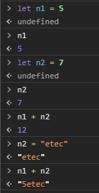

## Tipos de dados

### Númerico (_number_)

Aceita números inteiros e números decimais. Operações aritméticas não geram erros (como em uma divisão por zero, por exemplo), mas o resultado pode ser `Infinity` (infinito) ou `NaN` (_not a number_).

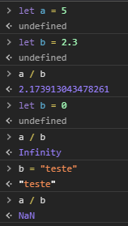

### String

Pode ser delimitado por aspas duplas ou simples.

A interpolação é feita usando o delimitador `` ` `` e as variáveis são escritas entre `${` e `}`. Tais strings são chamadas de _template strings_.

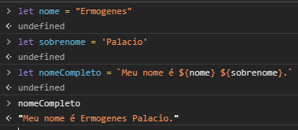

### Boolean

`true` para verdadeiro, `false` para falso.

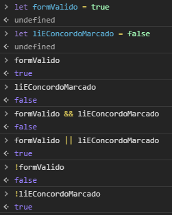


### `undefined` e `null`

Cada um desses valores constitui um tipo por si só.

- `undefined` significa "sem valor definido".
- `null` significa "nada", "vazio" ou "valor desconhecido".

Nunca use `undefined` diretamente. Ele é reservado para variáveis declaradas sem valor inicial.

Quando precisar "apagar" o valor de uma variável, ou indicar que ela possui valor, mas esse valor é vazio ou desconhecido, use "null".

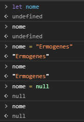

Os dois valores aparecerão com bastante frequência nas próximas aulas.

### Objetos

Objetos possuem um tipo específico para eles. Funções também são consideradas objetos em JavaScript.

Vamos tratar de ambos em uma aula posterior.

## Conversões

### Para string

Um valor é convertido para string automaticamente quando necessário. Podemos fazê-lo manualmente usando `String()`.

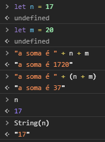

### Para número

Conversões são automáticas em operações aritméticas e expressões. Podemos fazê-lo manualmente usando `Number()`.

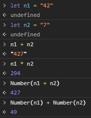

Regras para conversão:

| O valor...  | é convertido para ...                                                                                                                         |
| ----------- | --------------------------------------------------------------------------------------------------------------------------------------------- |
| `undefined` | `NaN`                                                                                                                                         |
| `null`      | `0`                                                                                                                                           |
| `true`      | `1`                                                                                                                                           |
| `false`     | `0`                                                                                                                                           |
| `string`    | São removidos os espaços no início e no final. Caso fique vazio, `0`. Senão, o valor é convertido. Se não for um número, o resultado é `NaN`. |

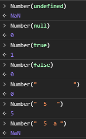

### Para boolean

São feitas automaticamente quando necessário. Podemos fazê-lo manualmente usando `Boolean()`.

Todos os valores "vazios" retornam `false`. Todos os outros valores retornam `true`. Assim:

- `false` -> `0`, `""` (string de tamanho zero), `null`, `undefined` e `NaN`;
- `true` -> `" "` (string contendo somente espaços), `"0"` (string contendo o caractere "zero"), ou qualquer outro valor.

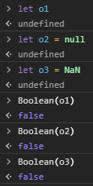
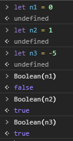
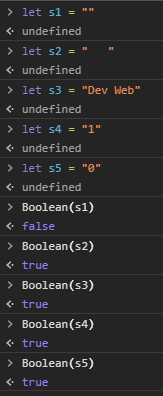

## Operadores

Operadores aritméticos suportados:

- `+` adição;
- `-` subtração;
- `*` multiplicação;
- `/` divisão;
- `%` resto de divisão inteira;
- `**` exponenciação.

Você pode usar o operador de exponenciação para calcular uma raiz, já que , assim  então:

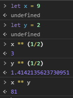

Operadores lógicos:

- `||` operador 'ou';
- `&&` operador 'e';
- `!` operador 'not'.

Operador '??' ou _null coalesce_:

- `a ?? b` retorna `b` se `a` for `null` ou `undefined`, senão retorna `a`.

Usado para retornar o primeiro valor diferente de `null` ou `undefined`.

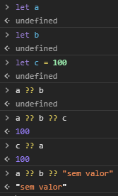

## Atribuição

O sinal `=` executa a atribuição do valor à sua direita na variável à sua esquerda. A diferença em relação ao C# é que ao final ele retorna o valor que foi gravado.

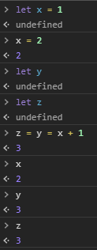

🍌 Muito cuidado, pois usar dessa maneira pode causar _bugs_ difíceis de detectar, em especial quando utilizado em uma comparação!

## Comparações

Compara dois valores e retorna um boolean. Comparações suportadas:

- `>` e `<`: maior ou menor que;
- `>=` e `<=`: maior ou igual a, menor ou igual a;
- `==`: igualdade;
- `!=`: desigualdade;
- `===`: igualdade estrita;
- `!==`: desigualdade estrita.

### Comparações de números

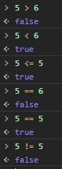

### Comparações de strings

Compara os valores binários, caracter a caracter.

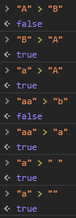

### Comparações de tipos diferentes

Os valores são convertidos primeiro para números, depois comparados. `true` é convertido para `1` e `false` para `0`.

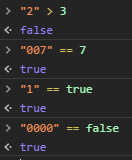

_Percebam que isso pode gerar interpretações incorretas, já que as regras de conversão usando `Boolean()` e nas comparações são diferentes!_

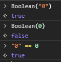

**Situações especiais**:

- `null` e `undefined` são considerados iguais entre si, e diferentes de qualquer outro valor.

Tome muito cuidado ao comparar `null` e `undefined` com qualquer outro valor. Sempre dê preferência a comparações estritas.

### Comparação estrita

Caso os valores sejam de tipos diferentes, os valores são considerados diferentes.

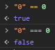

A comparação estrita é sempre preferível em JavaScript.

## Funções de string

- `.length` - tamanho da string;
- `.charAt(n)` - caracter que ocupa a n-ésima posição (começando em 0);
- `.toUpperCase()` - transforma letras em maiúsculas;
- `.toLowerCase()` - transforma letras em minúsculas;
- `.includes(valor)` - retorna `true` se `valor` existe na string;
- `.trim()` - remove espaços no início e no final da string;
- `.repeat(vezes)` - repete a string a quantidade de vezes especificada;
- `.replace(anterior, novo)` e `.replaceAll(anterior, novo)` - substitui a primeira ou todas as ocorrências de `anterior` por `novo`;
- `.slice(inicio, fim)` - retorna uma parte da string, incluindo `inicio` mas incluindo `fim`.

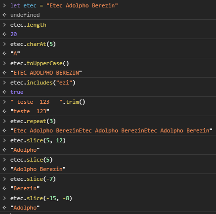

## Funções numéricas

- `.toString(base)` - converte um número para string, na base indicada (ou na base 10);

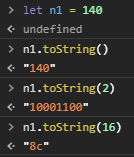

- `Math.PI` - o número π.
- `.toFixed(casasDecimais)` - efetua o arredondamento para um número fixo de casas;
- `Math.round(x)` - efetua o arredondamento de `x` para o inteiro mais próximo;

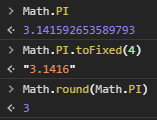

- `parseInt(string)` - retorna um número inteiro contido no início da string;
- `parseFloat(string)` - retorna um número em ponto flutuante contido no início da string;


- `Math.random()` - um número aleatório entre `0` e `1`.

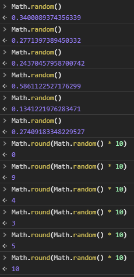

- `Math.sin(x)`, `Math.cos(x)` e `Math.tan(x)` - seno, cosseno e tangente de `x`.
- `Math.sqrt(x)` - raiz quadrada de `x`.
- `Math.pow(x, y)` - `x` a `y`-ésima potência.

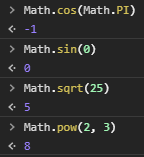

## Decisão

As decisões com `if` e `switch` funcionam como em C#.

```js
if (valorBoolean) {
  // executa se true
} else {
  // executa se false
}
```

```js
switch (valorATestar) {
  case valorA:
    // executa se valorATestar === valorA
    break;
  case valorB:
    // executa se valorATestar === valorB
    break;
  default:
    // executa nos demais casos
    break;
}
```

Assim como em C#, também podemos usar o operador ternário `?`.

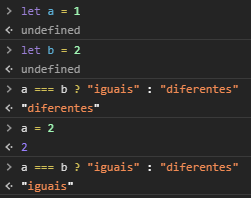

## Laços

Os laços `while` e `do while` funcionam como em C#.

```js
while (valorBoolean) {
  // executa enquanto true
}
```

O laço `for` também, porém a declaração da variável de controle deve ser feita com `let`.

```js
for (let i = 0; i < 3; i++) {
  // ...
}
```

Os comandos `break` e `continue` também funcionam da mesma forma.

## Exceções

O bloco `try`..`catch` também funciona como em C#.

```js
try {
  // ...
} catch (err) {
  // err contém informações sobre o erro
  // ...
  /*
    err.message - mensagem de erro
  */
}
```

Podemos gerar o nosso erro customizado usando `throw`.

```js
throw new Error("mensagem de erro");
```

## Comando simples de interação

### `alert`

O comando `alert` exibe uma caixa de diálogo do sistema para o usuário, e é a maneira mais rápida de exibir uma informação.

```js
alert("Hello world!");
```

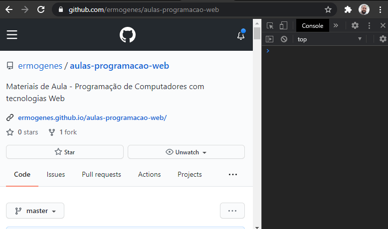

### `confirm`

Retorna `true` ou `false` de acordo com a resposta do usuário.

- "Ok" para `true`;
- "Cancelar" ou `ESC` para `false`.

```js
let resposta = confirm("Confirma a sua ação?");
```

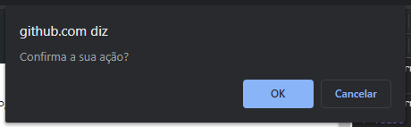

### `prompt`

Exibe uma caixa para o usuário com um campo para digitação, e retorna o valor digitado.

```js
let valorInicial = 0;
let idade = prompt("Qual sua idade?", valorInicial);
```

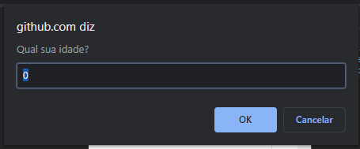
