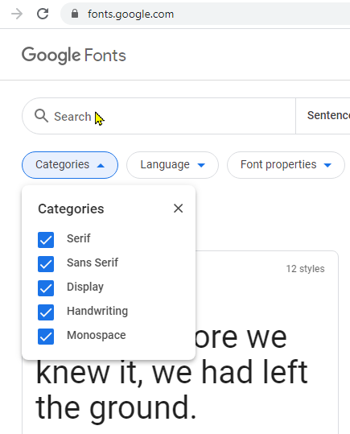
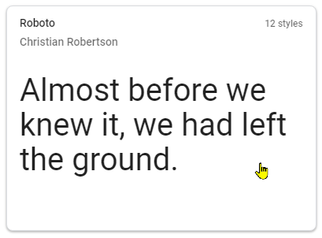
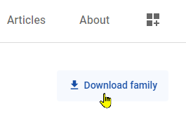
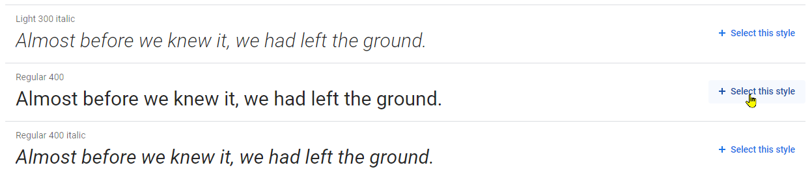
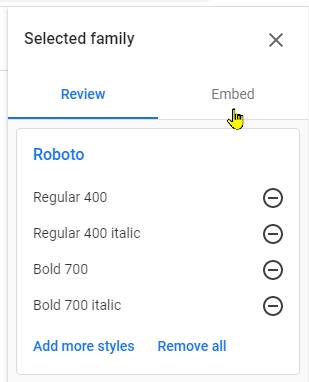
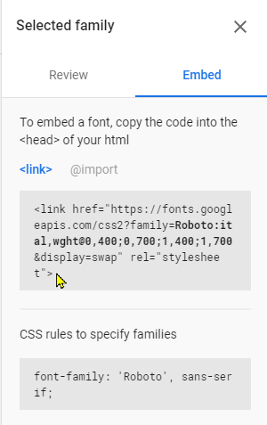
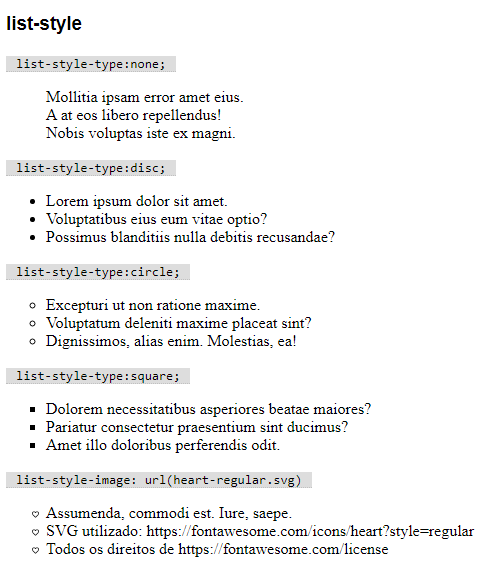

## Tipografia

Propriedades que permitem estilizar elementos textos textuais em sua página.

Boas introduções ao tema podem ser encontradas [nesse artigo](https://rockcontent.com/br/blog/tipografia/) da RockContent, e [nesse artigo](https://neilpatel.com/br/blog/tipografia/#:~:text=Tipografia%20significa%20a%20impress%C3%A3o%20dos,e%20disposi%C3%A7%C3%A3o%20visual%20de%20palavras.) de Neil Patel.

### Tipo

- `font-family` permite alterar a face da fonte a ser exibida (tipo). Recebe uma lista de fontes e utiliza a primeira que estiver disponível. Use somentes fontes que existam no dispositivo do usuário (veja quais fontes são seguras [aqui](https://www.cssfontstack.com/)), ou use uma Web Font (como as fontes do [Google Fonts](#Usando-fontes-do-Google)).
  - `font-family: Arial;` - uso comum, usando a fonte segura Arial.
  - `font-family: 'Victor Mono';` - coloque entre aspas fontes com nome que contenham espaços.
  - `font-family: Helvetica, Arial;` - use mais de uma fonte, para o caso da anterior não estar disponível.
  - `font-family: Arial, sans-serif;` - use um nome genérico como última alternativa:
    - `sans-serif` - qualquer fonte disponível, sem serifa.
    - `serif` - qualquer fonte disponível, com serifa.
    - `monospace` - qualquer fonte disponível, monoespaçada.
    - `cursive` - qualquer fonte disponível, cursiva.
    - `fantasy` - qualquer fonte artística disponível.


---

### Estilo da fonte

- `font-style` permite alterar o estilo da fonte.
  - `font-style: italic;` - fonte em itálico.
  - `font-style: normal;` - fonte normal.


---

### Peso

- `font-weight` permite alterar o peso da fonte. Comumente usado para colocar o texto em negrito. Algumas Web Fonts permitem diversos pesos, numerados entre 100 a 900 (400 = normal, 700 = negrito).
  - `font-weight: normal;` - fonte em peso normal.
  - `font-weight: bold;` - fonte em negrito.
  - `font-weight: 900;` - fonte com peso 900 (o máximo permitido).
  - `font-weight: lighter;` - fonte um peso menor que a herdada (entre 700, 400 ou 100).
  - `font-weight: bolder;` - fonte um peso maior que a herdada (entre 400, 700 ou 900).


---

### Usando fontes do Google

Para utilizar fontes diferentes, use fontes hospedadas no Google Fonts.

Acesse https://fonts.google.com/ e busque por fontes pelo nome ou filtre pelo tipo:

- **Serif**, equivalente à família genérica `serif`
- **Sans Serif**, equivalente à família genérica `sans-serif`
- **Display**, equivalente à família genérica `fantasy`
- **Handwriting**, equivalente à família genérica `cursive`
- **Monospace**, equivalente à família genérica `monospace`



Escolha, por exemplo, a fonte **Roboto**:



_💡 Opcional_: você pode baixar a fonte para instalar localmente (evitando o _download_ durante o desenvolvimento e permitindo o uso fora do navegador) usando o botão _Download family_.



Escolha os estilos que usará em seu site, clicando em _Select this style_.



Nesse exemplo, escolhemos as fontes em peso padrão (400) e negrito (700), estilos normal e itálico.



Clique em _Embed_ para ter acesso ao código necessário.



Você pode copiar o exemplo de uso na propriedade `font-family`:

```css
font-family: 'Roboto', sans-serif;
```

E deve copiar o código a ser embutido em sua página para usar a fonte, Escolha uma das três opções disponíveis.

**Opção 1 - `link`, via HTML**: 

```html
<link href="https://fonts.googleapis.com/css2?family=Roboto:ital,wght@0,400;0,700;1,400;1,700&display=swap" rel="stylesheet">
```

**Opção 2 - `@import`, via CSS**: 

```html
<style>
@import url('https://fonts.googleapis.com/css2?family=Roboto:ital,wght@0,400;0,700;1,400;1,700&display=swap');
</style>
```

A melhor opção, porém, é usar o comando `import` direto em um arquivo CSS externo, e não em uma tag `style` de CSS interno.

---

### Tamanho

- `font-size` permite alterar o tamanho do tipo a ser aplicado no texto. Pode ser dado em diversas unidades, sendo mais comuns (em 2020) definir o tamanho em pixels (`px`).
    - `font-size: 16px;` - fonte de 16 pixels.
    - `font-size: 16pt;` - fonte de 16 pontos (medida usada em processadores de texto, como o Word, não recomendado na web).
    - `font-size: 1.5em;` - fonte 50% maior que o tamanho herdado.
    - `font-size: 0.5rem;` - fonte 50% menor que o tamanho padrão da página.
    - Outras unidades menos comuns são centímetros (`cm`), milímetros (`mm`), polegadas (`in`), entre muitas outras.


---

### Variante

- `font-variant` permite alterar diversas características das fontes, sendo usado normalmente para colocar o texto em _versalete_ (letras minúsculas com a forma de maiúsculas).
    - `font-variant: small-caps;` - _versalete_.
    - `font-variant: normal;` - normal.


---

### Tamanho da linha

- `line-height` permite alterar a altura da linha de texto.
  - `line-height: normal;` - altura normal.
  - `line-height: 1.5;` - altura 50% maior.
  - `line-height: 25px;` - altura de tamanho fixo em 25px.
  - `line-height: 120%;` - altura 20% maior.


---

### Espaçamento entre letras

- `letter-spacing` altera o espaço entre as letras.
  - `letter-spacing: normal;` - espaçamento padrão.
  - `letter-spacing: 5px;` - afasta 5px adicionais entre cada letra.
  - `letter-spacing: -2px;` - aproxima em 2px cada letra.


---

### Espaçamento entre palavras

- `word-spacing` altera o espaço entre as palavras.
  - `word-spacing: normal;` - espaçamento padrão.
  - `word-spacing: 5px;` - afasta 5px adicionais entre cada palavra.
  - `word-spacing: -2px;` - aproxima em 2px cada palavra.


---

### Alinhamento horizontal

- `text-align` configura o alinhamento para um bloco de texto. Não tem efeito para elementos _inline_.
  - `text-align: left;` - alinhado a esquerda.
  - `text-align: right;` - alinhado a direita.
  - `text-align: center;` - centralizado
  - `text-align: justify;` - justificado.


---

### Sublinhado

- `text-decoration` permite alterar o sublinhamento de um texto.
  - `text-decoration: underline;` - texto sublinhado.
  - `text-decoration: none;` - texto não sublinhado.

Apesar de não ser muito comum, você também pode controlar a cor, a posição (em baixo ou em cima), o formato (linha, pontos ou ondas) e a espessura do sublinhado.
  - `text-decoration-color: red;` - sublinhado em vermelho.
  - `text-decoration-line: overline;` - sobrelinhado;
  - `text-decoration-line: line-through;` - riscado;
  - `text-decoration-style: ` - estilo do sublinhado: `solid`, `double`, `dotted`, `dashed`, `wavy`.
  - `text-decoration-thickness: auto;` - espessura padrão.
  - `text-decoration-thickness: 3px;` - espessura de 3px.

Combinando, podemos ter um sublinhado vermelho ondulado usando `text-decoration: red wavy underline;`.

_Observação: um elemento filho não pode retirar o sublinhado herdado, somente alterá-lo._


---

### Indentação de parágrafo

- `text-indent` configura o espaço em branco deixado na primeira linha de um parágrafo.
  - `text-indent: 0;` - sem indentação (valor padrão).
  - `text-indent: 20px;` - indentação de 20px.
  - `text-indent: -20px;` - recuo de 20px.


---

### Caixa alta/baixa

- `text-transform` transforma a caixa de um texto.
  - `text-transform: none;` - texto normal, conforme a marcação.
  - `text-transform: capitalize;` - transforma primeira letra de cada palavra em maiúsculas.
  - `text-transform: uppercase;` - transforma em maiúsculas.
  - `text-transform: lowercase;` - transforma em minúsculas.


---

### Sombreamento

- `text-shadow` permite adicionar sombreamento a um texto. Um texto pode ter várias sombras (separadas por vírgula), sendo que cada uma é formada por três medidas (deslocamento horizontal, deslocamento vertical e raio de desfoque) e uma cor.
  - `text-shadow: 2px 1px 0 gray;` - sombra 2px abaixo e 1px a direita, sem desfoque, cinza.
  - `text-shadow: -20px -10px 5px green;` - sombra 20px acima e 10px a esquerda, com desfoque de 5px, verde.
  - `text-shadow: 2px 1px 0 gray, -20px -10px 5px green;` - as duas sombras acima simultaneamente.


---

### Listas

- `list-style` permite estilizar listas.
  - `list-style-type` - indica o tipo de lista:
    - Ordenadas:
      - `list-style-type: none;`, sem numeração.
      - `list-style-type: decimal;`, numeração decimal.
      - `list-style-type: upper-roman;` / `lower-roman`, numerais romanos em letras maiúsculas / minúsculas.
      - `list-style-type: upper-alpha;` / `lower-alpha`, letras maiúsculas / letras minúsculas.
    - Não-ordenadas:
      - `list-style-type: none;`, sem marcadores.
      - `list-style-type: disc;`, marcadores de disco.
      - `list-style-type: circle;`, marcadores de círculo.
      - `list-style-type: square;`, marcadores de quadrados.
  - `list-style-image` - imagem a ser usada como marcador.

  

---

Se necessário, consulte a lista completa no [MDN](https://developer.mozilla.org/en-US/docs/Web/CSS/Reference#Keyword_index).
