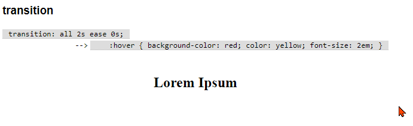
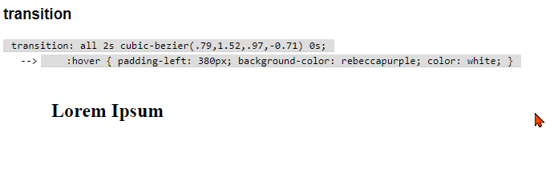
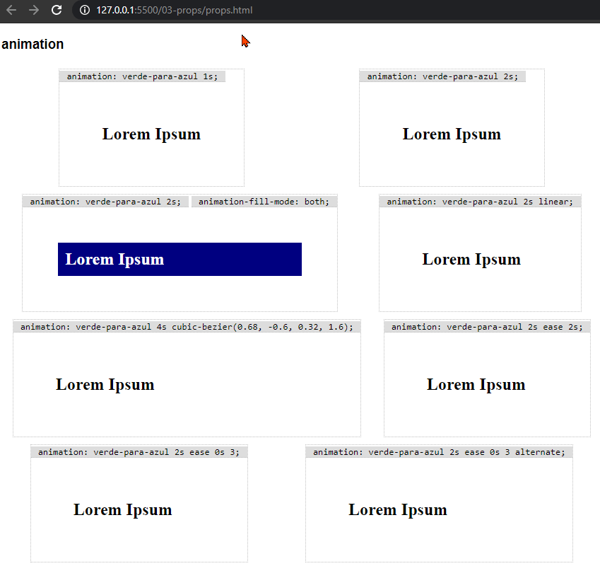
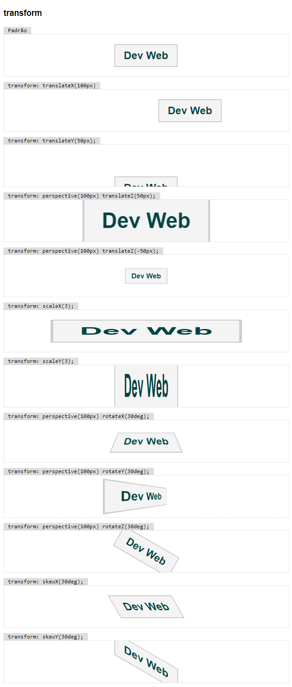
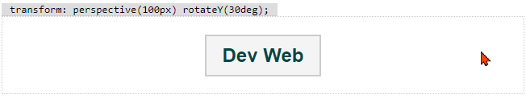

# Transições

Quando uma pripriedade CSS é alterada, o navegador faz a transição do estado anterior para o novo estado. Por exemplo, ao mudar a cor de um elemento de vermelho para azul, o navegador faz a mudança direta de cores, conforme definido.

O CSS permite que você controle a maneira como essa transição será feita usando as **transições**. Elas estão disponíveis somente para [algumas propriedades](https://developer.mozilla.org/en-US/docs/Web/CSS/CSS_animated_properties), não todas.

O navegador calcula os valores intermediários para a(s) propriedade(s).


Propriedades:
  - `transition-property` - quais propriedades serão controladas.
    - `transition-property: none;` - nenhuma propriedade.
    - `transition-property: all;` - todas as propriedades.
    - `transition-property: width, color;` - somente largura e cor.
  - `transition-duration` - duração da transição.
    - `transition-duration: 0s;` - sem transição.
    - `transition-duration: 0.5s` - meio segundo.
    - `transition-duration: 2s;` - dois segundos.
  - `transition-timing-function` - função de transição.
    - `transition-timing-function: ease;` - padrão, começa e termina devagar, com o meio é mais lento.
    - `transition-timing-function: ease-in;` - começo lento.
    - `transition-timing-function: ease-out;` - final lento.
    - `transition-timing-function: linear;` - velocidade constante.
    - `transition-timing-function: steps(3);` - em três passos.
    - `transition-timing-function: cubic-bezier(...);` - permite definir a função matemática de transição.
  - `transition-delay` - atraso para o início da transição.
    - `transition-delay: 0s;` - início imediato.
    - `transition-delay: 3s;` - atraso de 3 segundos.

Você pode usar a propriedade de atalho `transition` passando os 4 valores na sequência.

`ease`



`step`


`cubic-bezier`



Você pode usar geradores como [este](https://cubic-bezier.com/) para criar [transições diversas](https://easings.net/), com a sua assinatura.

# Animações

Você pode criar animações mais complexas usando as propriedades `animation` e `@keyframes`.

Primeiro definimos uma lista de quadros (_frames_) a serem seguidos.

Neste exemplo (chamado `exemplo-1`) temos 2 quadros, um inicial e um final:

```css
@keyframes exemplo-1 {
    from {
        /* regras */
    }
    to {
        /* regras */
    }
}
```

Neste exemplo (`exemplo-2`), 3 quadros em `0%`, `30%` e `100%` do tempo:

```css
@keyframes exemplo-1 {
    0% {
        /* regras */
    }
    30% {
        /* regras */
    }
    100% {
        /* regras */
    }
}
```

Aplicamos uma animação usando `animation-name` e `animation-duration`:

```css
#texto-animado {
    animation-name: exemplo-1;
    animation-duration: 5s;
}
```

Outros ajustes:
- `animation-name` - nome da animação definida em `@keyframes`.
- `animation-duration` - tempo total de transição da animação.
- `animation-delay` - atraso de início da animação.
- `animation-direction` - direção da animação.
  - `animation-direction: normal;` - padrão, do início para o final.
  - `animation-direction: reverse;` - do final para o início.
  - `animation-direction: alternate;` - do início para o final, depois do final para o início.
  - `animation-direction: alternate-reverse;` - como alternate, mas invertido.
- `animation-iteration-count` - quantidade de vezes que será executada.
  - `animation-iteration-count: 2;` - 2 vezes.
  - `animation-iteration-count: infinite;` - infinitas vezes.
- `animation-timing-function` - função de transição, como em `transition-timing-function`.
- `animation-fill-mode` - define o que acontece com o elemento antes e depois da animação.
  - `animation-fill-mode: none;` - nenhum estilo é aplicado.
  - `animation-fill-mode: forwards;` - ao final, mantém o último estilo.
  - `animation-fill-mode: backwards;` - ao final, mantém o primeiro estilo.
  - `animation-fill-mode: both;` - ao final, mantém o primeiro ou o último, de acordo com a direção.

Exemplos usando a animação abaixo:

```css
@keyframes verde-para-azul {
    from {
        background-color: green;
    }
    to {
        background-color:navy;
        color: white;
    }
}
```



# Transformações

Apesar de ser frequentemente utilizado em conjunto com transições e animações, as tranformações são independentes e não relacionadas ao tema.

Podemos realizar as transformações usando as funções a seguir como valores da propriedade `transform`.

- `transform: none;` - padrão, sem transformação.

- `transform: translate(x,y);` - translação em 2D.
- `transform: translate3d(x,y,z);` - translação em 3D.
  - `transform: translateX(x);` - translação no eixo X.
  - `transform: translateY(y);` - translação no eixo Y.
  - `transform: translateZ(z);` - translação no eixo Z.

- `transform: scale(x,y);` - redimensionamento em 2D.
- `transform: scale3d(x,y,z);` - redimensionamento em 3D.
  - `transform: scaleX(x);` - redimensionamento no eixo X.
  - `transform: scaleY(y);` - redimensionamento no eixo Y.
  - `transform: scaleZ(z);` - redimensionamento no eixo Z.

- `transform: rotate(angulo);` - rotação em 2D.
- `transform: rotate3d(x,y,z,angulo);` - rotação em 3D.
  - `transform: rotateX(angulo);` - rotação no eixo X.
  - `transform: rotateY(angulo);` - rotação no eixo Y.
  - `transform: rotateZ(angulo);` - rotação no eixo Z.

- `transform: skew(x-angulo,y-angulo);` - distorção em 2D.
  - `transform: skewX(angulo);` - distorção no eixo X.
  - `transform: skewY(angulo);` - distorção no eixo Y.

Todas as transformações no eixo Z exigem a presença da transformação `perspective`, que deve ter um valor diferente de zero. Como o eixo Z afasta ou aproxima o elemento da tela, precisamos definir a perspectiva, ou seja, a distância inicial a ser considerada. Por exemplo, um elemento com `perspective(200px)` que receba `translateZ(100px)` vai ser exibido maior, pois foi trazido para a frente metade do caminho.

Há uma explicação excelente [aqui](https://www.digitalocean.com/community/tutorials/css-translatez-and-perspective), em inglês.



Combinado com transformações, pode trazer efeitos memoráveis.

Veja esse exemplo:

```css
#texto {
  transition: all 3s ease;
}

#texto:hover {
  transform: perspective(100px) rotateY(30deg);
  box-shadow: 10px 10px 5px 0 black;
}
```

