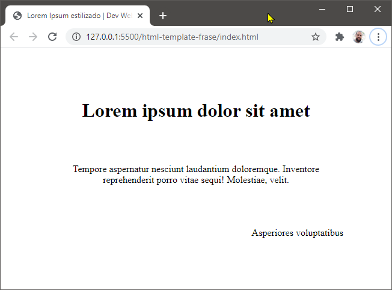
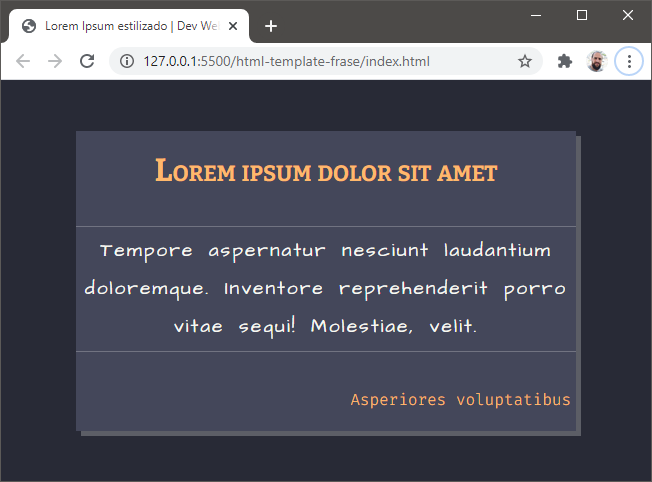
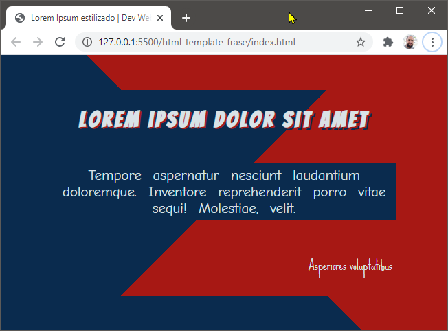
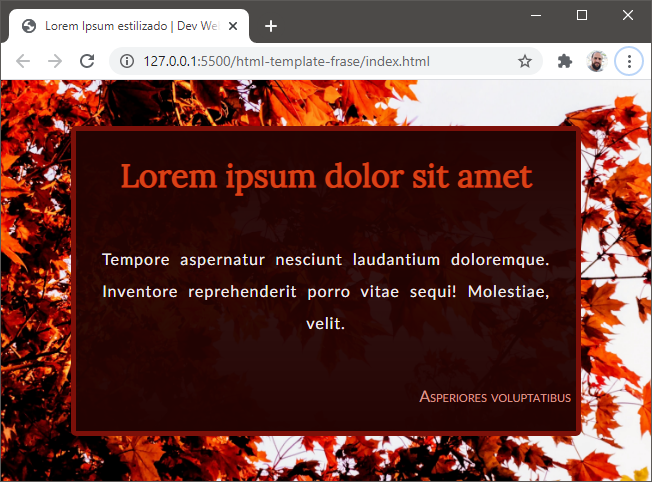

# Exercícios: Cores e fundos

Para cada exercício abaixo crie um repositório com o nome indicado, e publique um _site_ usando o GitHub Pages que atenda ao requisito indicado.

👀 _Atenção:_ Alguns exercícios podem solicitar a criação de um repositório baseado em _template_. Faça [dessa maneira](../content/github-template.md).

O requisito pode ser indicado por uma lista de afazeres, por uma ou mais imagens de referência, ou por ambos.

---

## Exercício `tema-com-css`

Crie e publique uma estilização para [este _template_](https://github.com/ermogenes/html-template-frase).

_Não altere a marcação (`index.html`), somente a estilização externa (`style.css`)._

A estilização deve formar um tema bem definido à sua escolha, desde que fique claro a quem vê que há uma intencionalidade nas decisões estéticas.

_Template_ sem estilização:

Exemplo 1 - Estilização em tema escuro, de utilização genérica:

Exemplo 2 - Estilização com tema baseado em histórias em quadrinhos:

Exemplo 3 - Estilização com tema inspirado em tardes de outono:

---

## 🏁 Orientações para entrega (alunos do curso presencial)
Confira no Teams o link da tarefa equivalente. Lá você postará o link do ~~repositório no GitHub~~ **_site_ publicado**, um para cada exercício.

Repositório de exemplo: Exercício `hello-dev-web` (Marcação HTML)

Exemplo de link a ser postado: [https://ermogenes.github.io/hello-dev-web](https://ermogenes.github.io/hello-dev-web)