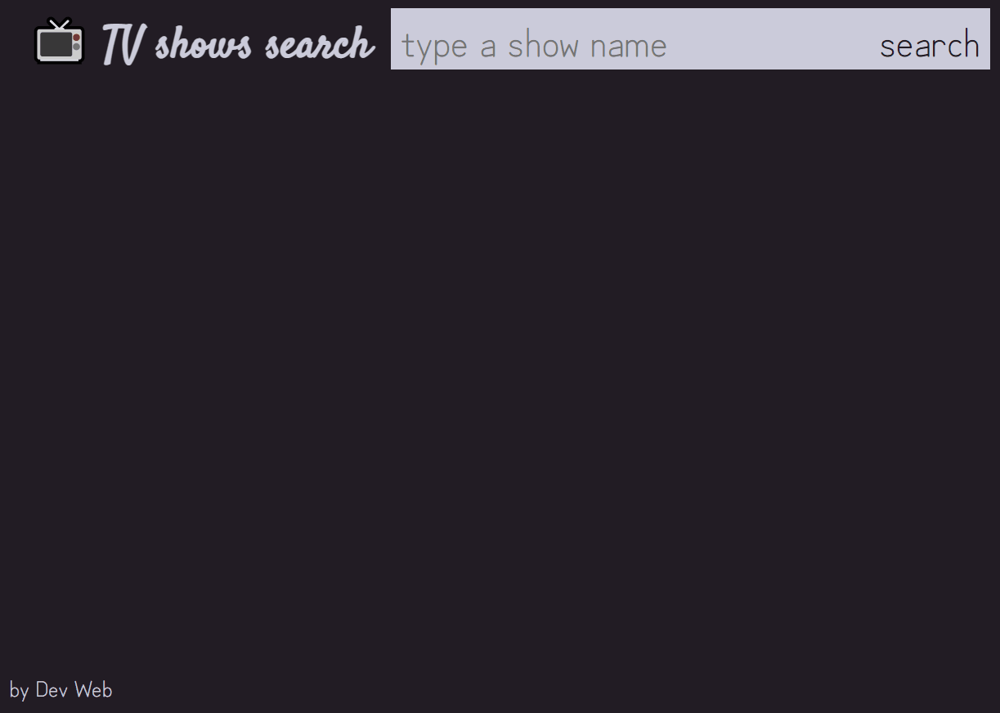

# Exercícios: Fetch API

Para cada exercício abaixo crie um repositório com o nome indicado, e publique um _site_ usando o GitHub Pages que atenda ao requisito indicado.

👀 Atenção: Alguns exercícios podem solicitar a criação de um repositório baseado em template. Faça [dessa maneira](https://github.com/ermogenes/aulas-programacao-web/blob/master/content/github-template.md).

O requisito pode ser indicado por uma lista de afazeres, por uma ou mais imagens de referência, ou por ambos.

---

## Exercício `FraseDoDia`

Ao carregar a página, exiba uma frase do dia (e seu autor) obtida da API pública do [QuoteGarden](https://pprathameshmore.github.io/QuoteGarden/).

_As frases desta API estão em inglês, exiba-as assim mesmo._

- _Endpoint_: [https://quote-garden.herokuapp.com/api/v3/quotes/random](https://quote-garden.herokuapp.com/api/v3/quotes/random)
  - `data[0].quoteText` contém o texto da frase;
  - `data[0].quoteAuthor` contém o autor da frase.

Estilize livremente.

_Não recomendamos o uso de imagens as quais você não tenha direito de uso. Este curso se exime de qualquer responsabilidade referente a danos causados à terceiros em trabalhos criados por alunos_.

---

## Exercício `PesquisaCEP`

Utilize a API pública [Postmon](https://postmon.com.br/) para preencher um formulário com o endereço associado a um CEP digitado pelo usuário.

- _Endpoint_: `https://api.postmon.com.br/v1/cep/CEPDESEJADO`
  - Exemplo com o CEP [11730-000](https://api.postmon.com.br/v1/cep/11730000), que não possui logradouro.
  - Exemplo com o CEP [05001-100](https://api.postmon.com.br/v1/cep/05001100), que possui logradouro.
    - `cidade` contém o nome da cidade;
    - `estado` contém a sigla da UF;
    - `logradouro` contém o nome do logradouro;
    - `bairro` contém o bairro;
    - `complemento` contém informações adicionais.

Libere para digitação somente os campos não preenchidos pela API, e inclua um campo para o número do logradouro.

_Não recomendamos o uso de imagens as quais você não tenha direito de uso. Este curso se exime de qualquer responsabilidade referente a danos causados à terceiros em trabalhos criados por alunos_.

---

## Exercício `Bandas`

Utilize a API pública do [MusicBrainz](https://musicbrainz.org/doc/MusicBrainz_API) para criar uma página com a seguinte funcionalidade:

Crie um campo de busca, no qual o usuário pode digitar o nome de uma banda/artista. Exiba informações sobre a banda encontrada.

- _Endpoint_: `https://musicbrainz.org/ws/2/artist?fmt=json&query=BANDA`
  - Exemplo com a banda [U2](https://musicbrainz.org/ws/2/artist?fmt=json&query=u2)
  - Exemplo com o cantor [Frank Sinatra](https://musicbrainz.org/ws/2/artist?fmt=json&query=frank%20sinatra)
  - Exemplo com a banda brasileira [Barão Vermelho](https://musicbrainz.org/ws/2/artist?fmt=json&query=Bar%C3%A3o%20Vermelho)
  - `count` contém o número de resultados encontrados;
  - `artists` contém uma lista dos resultados. Use `artists[0]` para pegar somente o primeiro, contendo:
    - `name` contém o nome completo do artista;
    - `area.name` contém o local de origem da banda;
    - `["life-span"].ended` contém um _boolean_ indicando se o artista não está mais na ativa;
    - `id` contém o identificador do artista no MusicBrainz.

**Bônus**: Exiba também uma tabela com os trabalhos criados pelo artista.

_Endpoint_: `https://musicbrainz.org/ws/2/release-group?fmt=json&artist=ID-DO-ARTISTA`
  - [Exemplo com Metallica](https://musicbrainz.org/ws/2/release-group?fmt=json&artist=65f4f0c5-ef9e-490c-aee3-909e7ae6b2ab)
  - `["release-groups"]` contém um arranjo com os trabalhos, contendo cada um:
    - `title`, com o título do trabalho;
    - `["first-release-date"]`, com o ano do trabalho.

_Não recomendamos o uso de imagens as quais você não tenha direito de uso. Este curso se exime de qualquer responsabilidade referente a danos causados à terceiros em trabalhos criados por alunos_.

---

## Exercício `Pokedex`

Use a [PokeAPI](https://pokeapi.co/) para exibir a imagem de um _pokémon_ [geração I](https://pt.wikipedia.org/wiki/Lista_de_Pok%C3%A9mon_da_gera%C3%A7%C3%A3o_I), aleatório.

Para isso, sorteie um número entre 1 e 151 e use no _endpoint_ abaixo.

_Endpoint_: `https://pokeapi.co/api/v2/pokemon/NOME-OU-NUMERO-DO-POKEMON`
  - Exemplo para [Pikachu, código 25](https://pokeapi.co/api/v2/pokemon/25)
  - Exemplo para [Magikarp, código 129](https://pokeapi.co/api/v2/pokemon/129)
  - `name` contém o nome original do _pokémon_;
  - `sprites.other["official-artwork"].front_default` contém a URL da imagem a ser exibida.

_Não recomendamos o uso de imagens as quais você não tenha direito de uso. Este curso se exime de qualquer responsabilidade referente a danos causados à terceiros em trabalhos criados por alunos_.

---

## Exercício `TVShowsSearch`

Utilize [este template](https://github.com/ermogenes/tv-shows-search-exercise) e a [API pública](https://www.tvmaze.com/api) do [TV Maze](https://www.tvmaze.com/) para exibir programas de TV com o nome similar ao texto digitado pelo usuário.

- _Endpoint_: `https://api.tvmaze.com/search/shows?q=TERMODESEJADO`
  - Exemplo buscando por [star](https://api.tvmaze.com/search/shows?q=star)
  - Exemplo buscando por [war](https://api.tvmaze.com/search/shows?q=war)
  - O resultado contém um arranjo de programas encontrados:
    - `show.name` contém o nome do programa;
    - `show.image.medium` contém o URL da foto de capa do programa, em qualidade média.

_Você pode alterar a marcação e a estilização à vontade._

_Não recomendamos o uso de imagens as quais você não tenha direito de uso. Este curso se exime de qualquer responsabilidade referente a danos causados à terceiros em trabalhos criados por alunos_.

---

## 🏁 Orientações para entrega (alunos do curso presencial)

Confira no Teams o link da tarefa equivalente. Lá você postará o link do ~~repositório no GitHub~~ **_site_ publicado**, um para cada exercício.

Repositório de exemplo: Exercício `hello-dev-web` (Marcação HTML)

Exemplo de link a ser postado: [https://ermogenes.github.io/hello-dev-web](https://ermogenes.github.io/hello-dev-web)
