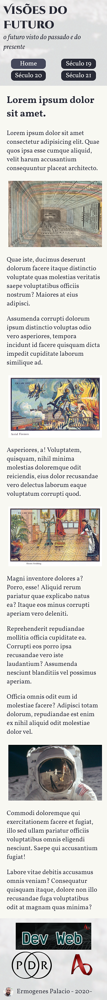

# Exercícios: Leiaute e responsividade

Para cada exercício abaixo crie um repositório com o nome indicado, e publique um _site_ usando o GitHub Pages que atenda ao requisito indicado.

👀 _Atenção:_ Alguns exercícios podem solicitar a criação de um repositório baseado em _template_. Faça [dessa maneira](../content/github-template.md).

O requisito pode ser indicado por uma lista de afazeres, por uma ou mais imagens de referência, ou por ambos.

---

## Exercício `santinho-virtual`

Use [este _template_](https://github.com/ermogenes/santinho-virtual) para criar um _santinho_ virtual para o candidato **fictício** Sr. **José das Couves** às eleições municipais do município **fictício** de **Couvelândia**.

Exemplo de [solução](https://ermogenes.github.io/santinho-virtual-jose-das-couves/):

Você pode alterar a marcação e a estilização à vontade.

_Não recomendamos o uso de imagens as quais você não tenha direito de uso. Este curso se exime de qualquer responsabilidade referente a danos causados à terceiros em trabalhos criados por alunos_.

---

## Exercício `aplicacao-leiaute`

Use [este _template_](https://github.com/ermogenes/holy-grail-layout/) para criar um _site_ responsivo com o tema livre de sua preferência.

Exemplo de [solução](https://ermogenes.github.io/visoes-do-futuro/):

Você pode alterar a marcação e a estilização à vontade.

_Não recomendamos o uso de imagens as quais você não tenha direito de uso. Este curso se exime de qualquer responsabilidade referente a danos causados à terceiros em trabalhos criados por alunos_.

---

## 🏁 Orientações para entrega (alunos do curso presencial)
Confira no Teams o link da tarefa equivalente. Lá você postará o link do ~~repositório no GitHub~~ **_site_ publicado**, um para cada exercício.

Repositório de exemplo: Exercício `hello-dev-web` (Marcação HTML)

Exemplo de link a ser postado: [https://ermogenes.github.io/hello-dev-web](https://ermogenes.github.io/hello-dev-web)