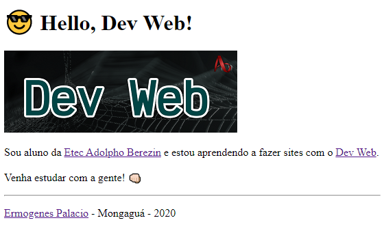
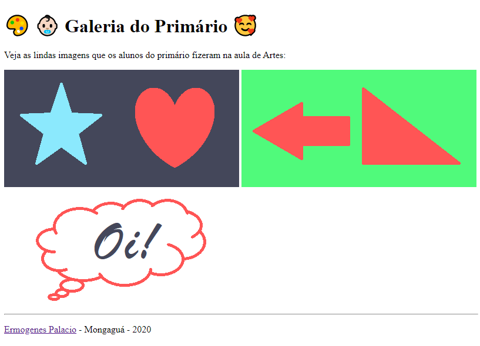
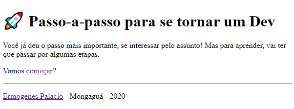
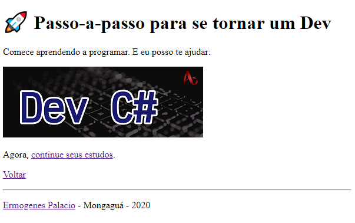
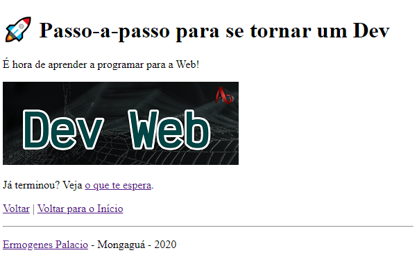
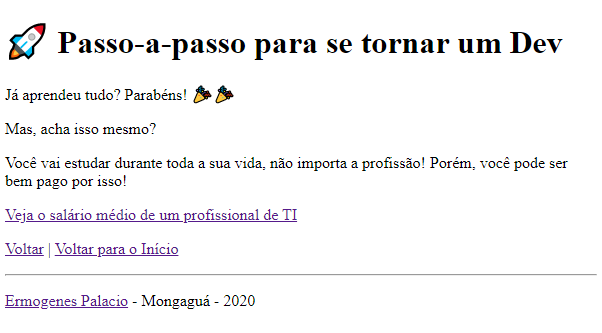

# Exercícios: Marcação HTML

Para cada exercício abaixo crie um repositório com o nome indicado, e publique um _site_ usando o GitHub Pages que atenda ao requisito indicado.

O requisito pode ser indicado por uma lista de afazeres, por uma ou mais imagens de referência, ou por ambos.

---

## Exercício `hello-dev-web`

Faça um _site_ de boas-vindas para os estudantes de tecnologias web.

- Use a imagem do logo usando URL externa: https://raw.githubusercontent.com/ermogenes/aulas-programacao-csharp/master/content/logo-dev-web.png
- Link do Dev Web (na imagem e no texto): https://github.com/ermogenes/aulas-programacao-web
- Link da Etec: http://eteab.com.br/
- No seu nome, use o link do seu perfil no GitHub (ex.: https://github.com/ermogenes)

---

## Exercício `galeria-primario`

Faça um _site_ para exibir obras de arte feitas por alunos do primário.

- Use três (_ou mais_) imagens (`.png` ou `.jpg`) criadas por você no editor de imagens de sua preferência (Paint, Photoshop, Gimp, Krita, etc.), com qualquer desenho simples.
- Tamanho sugerido das imagens: 400px x 200px.

---

## Exercício `etecs-baixada-santista`

Faça um _site_ que exiba uma lista de links para os _sites_ das Etecs da Baixada Santista, em uma estrutura semelhante a:

- Baixada Santista
  - Santos
    - [Etec Aristóteles Ferreira](http://etecaf.com.br/)
    - [Etec Escolástica Rosa](http://www.etecescolasticarosa.com.br/)
  - São Vicente
    - [Etec Ruth Cardoso](http://etecdrc.com.br/)
  - Guarujá
    - [Etec Santos Dumont](http://etecsantosdumont.com.br/)
  - Cubatão
    - [Etec de Cubatão](http://www.etecubatao.com.br/)
  - Praia Grande
    - [Etec de Praia Grande](https://www.etecpg.com.br/)
  - Mongaguá
    - [Etec Adolpho Berezin 😍](http://eteab.com.br/)
  - Itanhaém
    - [Etec de Itanhaém](https://www.etecitanhaem.com.br/)
  - Peruíbe
    - [Etec de Peruíbe](http://etecperuibe.com.br/)

Todos os links devem abrir em novas abas.

---

## Exercício `passo-a-passo`

Faça um _site_ que contenha um passo-a-passo para aprender programação, em várias páginas.

Mapa de navegação (_sitemap_):

* Home-page: `index.html`:

* página `dev-cs.html`:

* página `dev-web.html`:

* página `objetivo.html`:

_Links externos necessários:_

- Dev C#
  - Imagem Dev C#: https://raw.githubusercontent.com/ermogenes/aulas-programacao-web/master/content/logo-dev-cs.png
  - Link ao clicar: https://github.com/ermogenes/aulas-programacao-csharp/
- Dev Web
  - Imagem Dev Web: https://raw.githubusercontent.com/ermogenes/aulas-programacao-csharp/master/content/logo-dev-web.png
  - Link ao clicar: https://github.com/ermogenes/aulas-programacao-web/
- Objetivo
  - Página de salário: https://www.salario.com.br/estatisticas/cargos-e-salarios-de-ti-tecnologia-da-informacao/

---

## Exercício `horario-2i3-2020-2`

Faça um _site_ que exiba o horário do 2I3 no segundo semestre de 2020.

Ele deve conter uma tabela com os seguintes dados:

**Horário** | **SEG** | **TER** | **QUA** | **QUI** | **SEX**
--- | --- | --- | --- | --- | ---
**Bloco I** | OCA2 | RCD1 | SUPBD | PC2 ☕ | GSO2
**Bloco II** | SUPINF | RCD1 | PTCC | PC2 ☕ | PTCC

---

## 🏁 Orientações para entrega (alunos do curso presencial)
Confira no Teams o link da tarefa equivalente. Lá você postará o link do ~~repositório no GitHub~~ **_site_ publicado**, um para cada exercício.

Repositório de exemplo: Exercício `hello-dev-web` (Marcação HTML)

Exemplo de link a ser postado: https://ermogenes.github.io/hello-dev-web