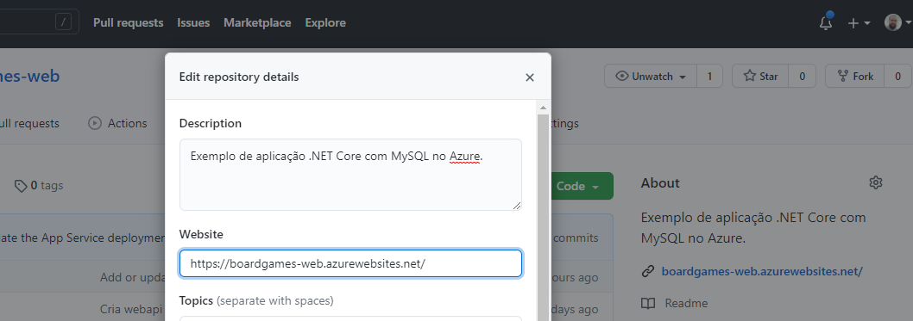

# Exercícios: ASP.NET Web API

Para cada exercício abaixo crie um repositório com o nome indicado contendo um projeto do tipo `webapi` em C#.

---
## Exercício `QuemSouEuAPI`

Faça um _site_ que disponibilize uma API `/QuemSouEu` e devolva um objeto JSON com seu nome, sobrenome e usuário do GitHub. A aplicação deve conter também um _frontend_ que consuma o _endpoint_ criado e o exiba ao usuário.

💪 BÔNUS: Implante sua aplicação no Microsoft Azure.

---
## Exercício `ListaBurguersOnline`

Faça um _site_ que disponibilize uma API `/Burguers` e devolva um objeto JSON com dados dos hamburguers cadastrados em uma base de dados semelhante a [esta](https://github.com/ermogenes/hamburgueria-mysql). A aplicação deve conter também um _frontend_ que consuma o _endpoint_ criado e o exiba ao usuário.

💪 BÔNUS: Implante sua aplicação e seu banco de dados no Microsoft Azure.

---

## 🏁 Orientações para entrega (alunos do curso presencial)

Confira no Teams o link da tarefa equivalente. Lá você postará o link dos repositórios que você criou, um para cada exercício.

**🚩Atenção:** Caso faça o 💪 BÔNUS, indique o endereço de produção na configuração do repositório, de forma que o link esteja disponível para correção.

Exemplo:

**Repositório de exemplo:**
[Board games web (usado em aula)](https://github.com/ermogenes/boardgames-web)

Exemplo de link a ser postado: https://github.com/ermogenes/boardgames-web
