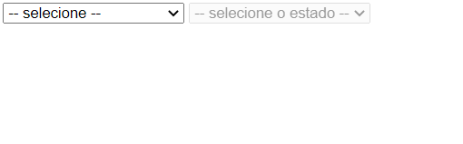

# Exercícios: Objetos, funções e DOM

Para cada exercício abaixo crie um repositório com o nome indicado, e publique um _site_ usando o GitHub Pages que atenda ao requisito indicado.

O requisito pode ser indicado por uma lista de afazeres, por uma ou mais imagens de referência, ou por ambos.

---

## 🤓 Orientação para todos os exercícios

**Veja o enunciado da tarefa no _link_ indicado.**

- Devem ser utilizados **formulários** para interação com o usuário. Para cada exercício deve ser criado um repositório. Não utilize `alert` e nem `prompt`.
- A página precisa conter os elementos necessários para entrada e saída, com estilização básica.
- Escreva seu _script_ em um arquivo externo.

---

## Exercício `MedidasJS`

Reimplementação em JavaScript do exercício `Medidas` da lista "Números e operadores" do Dev C#: [Medidas](https://github.com/ermogenes/aulas-programacao-csharp/blob/master/exercises/numeros-operadores.md#exerc%C3%ADcio-medidas)

_Não recomendamos o uso de imagens as quais você não tenha direito de uso. Este curso se exime de qualquer responsabilidade referente a danos causados à terceiros em trabalhos criados por alunos_.

---

## Exercício `IMCJS`

Reimplementação em JavaScript do exercício `IMC` da lista "Decisão e operações lógicas" do Dev C#: [IMC](https://github.com/ermogenes/aulas-programacao-csharp/blob/master/exercises/decisao-simples.md#exerc%C3%ADcio-imc)

_Não recomendamos o uso de imagens as quais você não tenha direito de uso. Este curso se exime de qualquer responsabilidade referente a danos causados à terceiros em trabalhos criados por alunos_.

---

## Exercício `MDCJS`

Reimplementação em JavaScript do exercício `MDC` da lista "Laços" do Dev C#: [MDC](https://github.com/ermogenes/aulas-programacao-csharp/blob/master/exercises/lacos.md#exerc%C3%ADcio-mdc)

_Não recomendamos o uso de imagens as quais você não tenha direito de uso. Este curso se exime de qualquer responsabilidade referente a danos causados à terceiros em trabalhos criados por alunos_.

---

## Exercício `TrocaImagem`

Faça uma página que contém ao menos uma imagem e um botão. Ao clicar no botão, troque a imagem exibida por outra.

_Não recomendamos o uso de imagens as quais você não tenha direito de uso. Este curso se exime de qualquer responsabilidade referente a danos causados à terceiros em trabalhos criados por alunos_.

---

## Exercício `EstadoCidade`

Faça um formulário contendo um `select` para seleção de estado e um para seleção de cidade.

Estados e cidades, com seus textos e seus `value`s:

- Paraná ("PR")
  - Curitiba (1)
  - Cascavel (2)
  - Maringá (3)
- Santa Catarina ("SC")
  - Florianópolis (4)
  - Blumenau (5)
  - Lages (6)
- Rio Grande do Sul ("RS")
  - Porto Alegre (7)
  - Gramado (8)
  - Caxias do Sul (9)

A cidade deve estar bloqueada (`disabled="disabled"`) até que o estado tenha um valor válido (use o evento `change` para capturar as alterações). Quando o estado estiver selecionado, habilite a seleção das cidades equivalentes.

Quando ambos os valores estiverem selecionados, exiba a cidade e o estado.

_Não recomendamos o uso de imagens as quais você não tenha direito de uso. Este curso se exime de qualquer responsabilidade referente a danos causados à terceiros em trabalhos criados por alunos_.

---

## 🏁 Orientações para entrega (alunos do curso presencial)

Confira no Teams o link da tarefa equivalente. Lá você postará o link do ~~repositório no GitHub~~ **_site_ publicado**, um para cada exercício.

Repositório de exemplo: Exercício `hello-dev-web` (Marcação HTML)

Exemplo de link a ser postado: [https://ermogenes.github.io/hello-dev-web](https://ermogenes.github.io/hello-dev-web)
