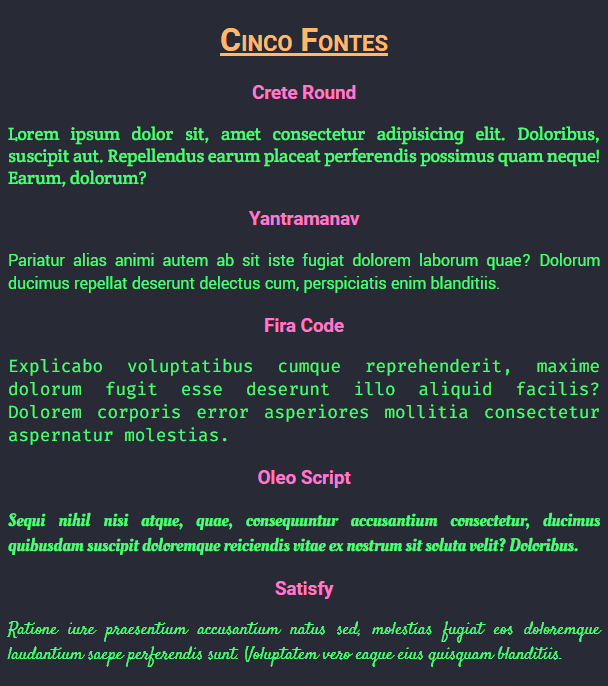

# Exercícios: Tipografia

Para cada exercício abaixo crie um repositório com o nome indicado, e publique um _site_ usando o GitHub Pages que atenda ao requisito indicado.

👀 _Atenção:_ Alguns exercícios podem solicitar a criação de um repositório baseado em _template_. Faça [dessa maneira](../content/github-template.md).

O requisito pode ser indicado por uma lista de afazeres, por uma ou mais imagens de referência, ou por ambos.

---

## Exercício `cinco-fontes`

Faça um _site_ que exiba textos em cinco fontes quaisquer, diferentes, como um catálogo.

Exemplo:

Cada uma delas deve ser de uma categoria:

* Serif / `serif` (com serifa)
* Sans Serif / `sans-serif` (sem serifa)
* Display / `fantasy` (fonte artística)
* Handwritting / `cursive` (cursiva / manuscrita)
* Monospace / `monospace` (monoespaçada)

Utilize web fontes do [Google Fonts](https://fonts.google.com/). Faça a importação das fontes no arquivo `.css`, juntamente com a estilização.

💡 Dica: use classes para diferenciar os elementos que vão utilizar cada fonte!

---

## Exercício `tipografia-lorem-ipsum`

Publique um _site_ com uma estilização de texto, usando [este template](https://github.com/ermogenes/html-lorem-ipsum).

_Não altere a marcação (`index.html`), somente a estilização externa (`style.css`)._

Dois exemplos de resolução:

* [https://diegoneri.github.io/html-lorem-ipsum/](https://diegoneri.github.io/html-lorem-ipsum/)
* [https://ermogenes.github.io/nome-do-exercicio-xyz/](https://ermogenes.github.io/nome-do-exercicio-xyz/)

Para esse exercício não será avaliada a qualidade visual da tipografia, e sim a utilização da técnica.

---

## 🏁 Orientações para entrega (alunos do curso presencial)
Confira no Teams o link da tarefa equivalente. Lá você postará o link do ~~repositório no GitHub~~ **_site_ publicado**, um para cada exercício.

Repositório de exemplo: Exercício `hello-dev-web` (Marcação HTML)

Exemplo de link a ser postado: [https://ermogenes.github.io/hello-dev-web](https://ermogenes.github.io/hello-dev-web)